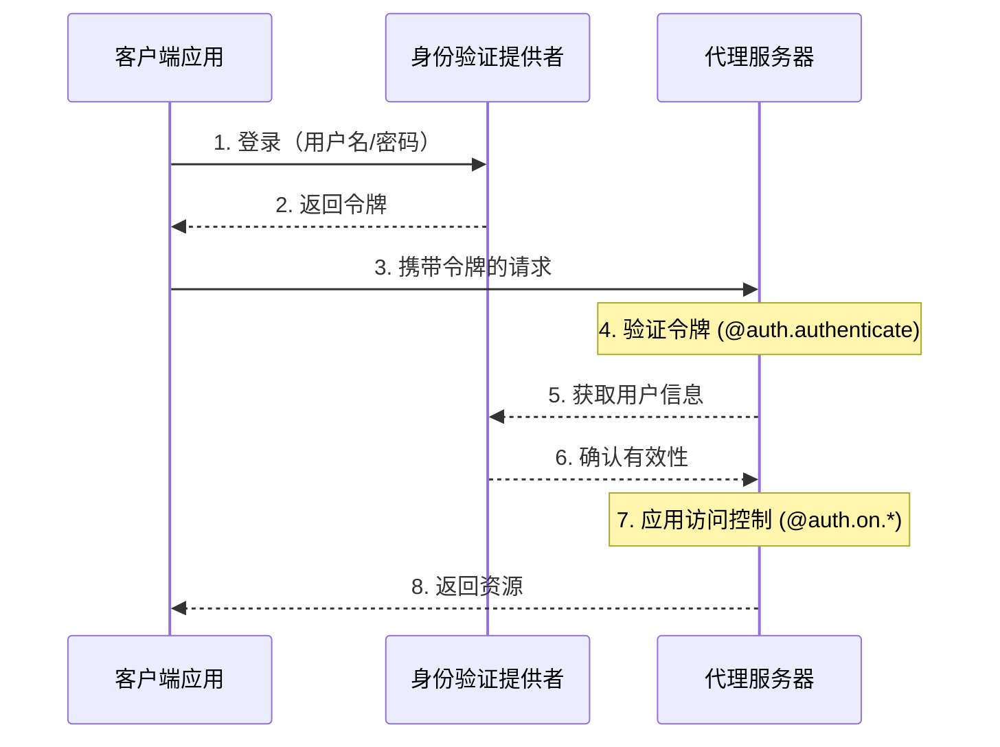
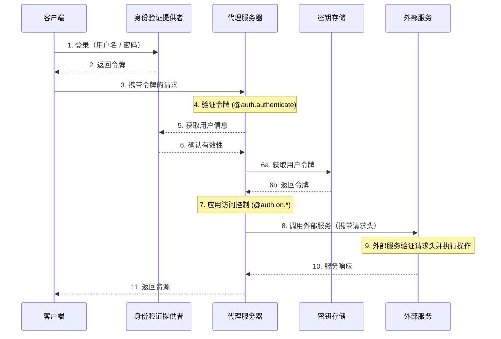

LangSmith 提供了一套灵活的身份验证和授权系统，可以与大多数身份验证方案集成。

## 核心概念

### 身份验证 vs 授权

虽然这两个术语经常互换使用，但它们代表了不同的安全概念：

* [**身份验证**](#身份验证)（"AuthN"）验证 _你是谁_。这作为中间件在每个请求上运行。
* [**授权**](#授权)（"AuthZ"）决定 _你能做什么_。这在每个资源的基础上验证用户的权限和角色。

在 LangSmith 中，身份验证由你的 [`@auth.authenticate`](https://reference.langchain.com/python/langgraph-sdk/auth/Auth/authenticate) 处理程序处理，授权由你的 [`@auth.on`](https://reference.langchain.com/python/langgraph-sdk/auth/Auth/on) 处理程序处理。

## 默认安全模型

LangSmith 提供了不同的安全默认设置：

### LangSmith

* 默认使用 LangSmith API 密钥
* 需要在 `x-api-key` 请求头中包含有效的 API 密钥
* 可以使用你的身份验证处理程序进行自定义

<Note>
**自定义身份验证**
LangSmith 的所有计划都**支持**自定义身份验证。
</Note>

### 自托管

* 无默认身份验证
* 完全灵活，可实施你的安全模型
* 你控制身份验证和授权的所有方面

## 系统架构

典型的身份验证设置涉及三个主要组件：

1. **身份验证提供者**（身份提供者/IdP）
   * 管理用户身份和凭据的专用服务
   * 处理用户注册、登录、密码重置等
   * 在成功验证后颁发令牌（JWT、会话令牌等）
   * 示例：Auth0、Supabase Auth、Okta 或你自己的身份验证服务器
2. **代理服务器**（资源服务器）
   * 你的代理或 LangGraph 应用程序，包含业务逻辑和受保护资源
   * 与身份验证提供者验证令牌
   * 基于用户身份和权限强制执行访问控制
   * 不直接存储用户凭据
3. **客户端应用程序**（前端）
   * Web 应用、移动应用或 API 客户端
   * 收集有时效性的用户凭据并发送给身份验证提供者
   * 从身份验证提供者接收令牌
   * 在向代理服务器发出的请求中包含这些令牌

以下是这些组件通常如何交互：



你在 LangGraph 中的 [`@auth.authenticate`](https://reference.langchain.com/python/langgraph-sdk/auth/Auth/authenticate) 处理程序处理步骤 4-6，而你的 [`@auth.on`](https://reference.langchain.com/python/langgraph-sdk/auth/Auth/on) 处理程序实现步骤 7。

## 身份验证

LangGraph 中的身份验证作为中间件在每个请求上运行。你的 [`@auth.authenticate`](https://reference.langchain.com/python/langgraph-sdk/auth/Auth/authenticate) 处理程序接收请求信息并应：

1. 验证凭据
2. 如果有效，返回包含用户身份和用户信息的 [用户信息](https://reference.langchain.com/python/langgraph-sdk/auth/types/MinimalUserDict)
3. 如果无效，抛出 [HTTP 异常](https://reference.langchain.com/python/langgraph-sdk/auth/exceptions/HTTPException) 或 AssertionError

```python
from langgraph_sdk import Auth

auth = Auth()

@auth.authenticate
async def authenticate(headers: dict) -> Auth.types.MinimalUserDict:
    # 验证凭据（例如，API 密钥、JWT 令牌）
    api_key = headers.get(b"x-api-key")
    if not api_key or not is_valid_key(api_key):
        raise Auth.exceptions.HTTPException(
            status_code=401,
            detail="无效的 API 密钥"
        )

    # 返回用户信息 - 仅 identity 和 is_authenticated 是必需的
    # 添加你授权所需的任何额外字段
    return {
        "identity": "user-123",        # 必需：唯一的用户标识符
        "is_authenticated": True,      # 可选：默认为 True
        "permissions": ["read", "write"], # 可选：用于基于权限的授权
        # 如果你想实现其他授权模式，可以添加更多自定义字段
        "role": "admin",
        "org_id": "org-456"

    }
```

返回的用户信息可通过以下方式获取：

* 通过 [`ctx.user`](https://reference.langchain.com/python/langgraph-sdk/auth/types/AuthContext) 给你的授权处理程序
* 在你的应用程序中通过 `config["configuration"]["langgraph_auth_user"]`

<Accordion title="支持的参数">
  [`@auth.authenticate`](https://reference.langchain.com/python/langgraph-sdk/auth/Auth/authenticate) 处理程序可以通过名称接受以下任何参数：

  * request (Request): 原始的 ASGI 请求对象
  * path (str): 请求路径，例如 `"/threads/abcd-1234-abcd-1234/runs/abcd-1234-abcd-1234/stream"`
  * method (str): HTTP 方法，例如 `"GET"`
  * path_params (dict[str, str]): URL 路径参数，例如 `{"thread_id": "abcd-1234-abcd-1234", "run_id": "abcd-1234-abcd-1234"}`
  * query_params (dict[str, str]): URL 查询参数，例如 `{"stream": "true"}`
  * headers (dict[bytes, bytes]): 请求头
  * authorization (str | None): Authorization 请求头的值（例如 `"Bearer <token>"`）

  在我们的许多教程中，为了简洁起见，我们只展示 "authorization" 参数，但你可以根据需要选择接受更多信息来实现你的自定义身份验证方案。
</Accordion>

### 代理身份验证

自定义身份验证允许委托访问。你在 `@auth.authenticate` 中返回的值会被添加到运行上下文中，为代理提供用户范围的凭据，使其能够代表用户访问资源。



身份验证后，平台会创建一个特殊的配置对象，该对象通过可配置上下文传递给你的图和所有节点。
此对象包含有关当前用户的信息，包括你从 [`@auth.authenticate`](https://reference.langchain.com/python/langgraph-sdk/auth/Auth/authenticate) 处理程序返回的任何自定义字段。

要使代理能够代表用户操作，请使用[自定义身份验证中间件](/langsmith/custom-auth)。这将允许代理代表用户与外部系统（如 MCP 服务器、外部数据库，甚至其他代理）进行交互。

更多信息，请参阅[使用自定义身份验证](/langsmith/custom-auth#enable-agent-authentication)指南。

### 使用 MCP 的代理身份验证

有关如何向 MCP 服务器验证代理身份的信息，请参阅 [MCP 概念指南](/oss/python/langchain/mcp)。

## 授权

身份验证后，LangGraph 会调用你的 [`@auth.on`](https://reference.langchain.com/python/langgraph-sdk/auth/Auth) 处理程序来控制对特定资源（例如，线程、助手、定时任务）的访问。这些处理程序可以：

1. 通过直接修改 `value["metadata"]` 字典来添加要在资源创建期间保存的元数据。有关每种操作 value 可以接受的类型列表，请参阅[支持的操作表](#支持的操作)。
2. 在搜索/列表或读取操作期间，通过返回[过滤器字典](#过滤器操作)来按元数据过滤资源。
3. 如果访问被拒绝，则抛出 HTTP 异常。

如果你只想实现简单的用户范围访问控制，可以为所有资源和操作使用单个 [`@auth.on`](https://reference.langchain.com/python/langgraph-sdk/auth/Auth) 处理程序。如果你想根据资源和操作进行不同的控制，可以使用[资源特定的处理程序](#资源特定的处理程序)。有关支持访问控制的完整资源列表，请参阅[支持的资源](#支持的资源)部分。

```python
@auth.on
async def add_owner(
    ctx: Auth.types.AuthContext,
    value: dict  # 发送到此访问方法的负载
) -> dict:  # 返回一个过滤器字典，限制对资源的访问
    """授权对线程、运行、定时任务和助手的所有访问。

    此处理程序做两件事：
        - 向资源元数据添加一个值（以便与资源一起持久化，以便以后可以过滤）
        - 返回一个过滤器（以限制对现有资源的访问）

    参数：
        ctx: 包含用户信息、权限、路径和
        value: 发送到端点的请求负载。对于创建
              操作，这包含资源参数。对于读取
              操作，这包含正在访问的资源。

    返回：
        一个过滤器字典，LangGraph 用它来限制对资源的访问。
        有关支持的运算符，请参阅[过滤器操作](#过滤器操作)。
    """
    # 创建过滤器，仅限制为此用户的资源
    filters = {"owner": ctx.user.identity}

    # 获取或创建负载中的元数据字典
    # 这是我们存储有关资源的持久信息的地方
    metadata = value.setdefault("metadata", {})

    # 将所有者添加到元数据 - 如果这是创建或更新操作，
    # 此信息将与资源一起保存
    # 这样我们以后可以在读取操作中按它过滤
    metadata.update(filters)

    # 返回过滤器以限制访问
    # 这些过滤器应用于所有操作（创建、读取、更新、搜索等）
    # 以确保用户只能访问自己的资源
    return filters
```

<a id="资源特定的处理程序"></a>
### 资源特定的处理程序

你可以通过将资源名称和操作名称与 [`@auth.on`](https://reference.langchain.com/python/langgraph-sdk/auth/Auth) 装饰器链接在一起来为特定资源和操作注册处理程序。
当发出请求时，将调用与该资源和操作匹配的最具体的处理程序。以下是如何为特定资源和操作注册处理程序的示例。对于以下设置：

1. 经过身份验证的用户能够创建线程、读取线程以及在线程上创建运行
2. 只有具有 "assistants:create" 权限的用户才被允许创建新助手
3. 所有其他端点（例如，删除助手、定时任务、存储）对所有用户禁用。

<Tip>
**支持的处理程序**
有关支持的资源和操作的完整列表，请参阅下面的[支持的资源](#支持的资源)部分。
</Tip>

```python
# 通用 / 全局处理程序捕获未被更具体处理程序处理的调用
@auth.on
async def reject_unhandled_requests(ctx: Auth.types.AuthContext, value: Any) -> False:
    print(f"请求到 {ctx.path} 来自 {ctx.user.identity}")
    raise Auth.exceptions.HTTPException(
        status_code=403,
        detail="禁止访问"
    )

# 匹配 "thread" 资源和所有操作 - 创建、读取、更新、删除、搜索
# 由于这比通用的 @auth.on 处理程序**更具体**，它将优先于
# 通用处理程序，用于 "threads" 资源上的所有操作
@auth.on.threads
async def on_thread(
    ctx: Auth.types.AuthContext,
    value: Auth.types.threads.create.value
):
    # 在正在创建的线程上设置元数据
    # 将确保资源包含一个 "owner" 字段
    # 然后，每当用户尝试访问此线程或线程内的运行时，
    # 我们可以按所有者过滤
    metadata = value.setdefault("metadata", {})
    metadata["owner"] = ctx.user.identity
    return {"owner": ctx.user.identity}


# 线程创建。这将仅匹配线程创建操作
# 由于这比通用的 @auth.on 处理程序和 @auth.on.threads 处理程序都**更具体**，
# 它将优先用于 "threads" 资源上的任何 "create" 操作
@auth.on.threads.create
async def on_thread_create(
    ctx: Auth.types.AuthContext,
    value: Auth.types.threads.create.value
):
    # 如果用户没有写权限，则拒绝
    if "write" not in ctx.permissions:
        raise Auth.exceptions.HTTPException(
            status_code=403,
            detail="用户缺少所需权限。"
        )
    # 在正在创建的线程上设置元数据
    # 将确保资源包含一个 "owner" 字段
    # 然后，每当用户尝试访问此线程或线程内的运行时，
    # 我们可以按所有者过滤
    metadata = value.setdefault("metadata", {})
    metadata["owner"] = ctx.user.identity
    return {"owner": ctx.user.identity}

# 读取线程。由于这也比通用的 @auth.on 处理程序和 @auth.on.threads 处理程序更具体，
# 它将优先用于 "threads" 资源上的任何 "read" 操作
@auth.on.threads.read
async def on_thread_read(
    ctx: Auth.types.AuthContext,
    value: Auth.types.threads.read.value
):
    # 由于我们正在读取（而不是创建）一个线程，
    # 我们不需要设置元数据。我们只需要
    # 返回一个过滤器以确保用户只能看到自己的线程
    return {"owner": ctx.user.identity}

# 运行创建、流式传输、更新等。
# 这优先于通用的 @auth.on 处理程序和 @auth.on.threads 处理程序
@auth.on.threads.create_run
async def on_run_create(
    ctx: Auth.types.AuthContext,
    value: Auth.types.threads.create_run.value
):
    metadata = value.setdefault("metadata", {})
    metadata["owner"] = ctx.user.identity
    # 继承线程的访问控制
    return {"owner": ctx.user.identity}

# 助手创建
@auth.on.assistants.create
async def on_assistant_create(
    ctx: Auth.types.AuthContext,
    value: Auth.types.assistants.create.value
):
    if "assistants:create" not in ctx.permissions:
        raise Auth.exceptions.HTTPException(
            status_code=403,
            detail="用户缺少所需权限。"
        )
```

请注意，在上面的示例中，我们混合使用了全局和资源特定的处理程序。由于每个请求都由最具体的处理程序处理，因此创建 `thread` 的请求将匹配 `on_thread_create` 处理程序，但**不会**匹配 `reject_unhandled_requests` 处理程序。然而，`update` 线程的请求将由全局处理程序处理，因为我们没有针对该资源和操作的更具体的处理程序。

<a id="过滤器操作"></a>
### 过滤器操作

授权处理程序可以返回 `None`、布尔值或过滤器字典。

* `None` 和 `True` 表示"授权访问所有底层资源"
* `False` 表示"拒绝访问所有底层资源（抛出 403 异常）"
* 元数据过滤器字典将限制对资源的访问

过滤器字典是一个键与资源元数据匹配的字典。它支持三种运算符：

* 默认值是精确匹配的简写，或下面的 "$eq"。例如，`{"owner": user_id}` 将仅包含元数据为 `{"owner": user_id}` 的资源
* `$eq`: 精确匹配（例如，`{"owner": {"$eq": user_id}}`）- 这等同于上面的简写 `{"owner": user_id}`
* `$contains`: 列表成员资格（例如，`{"allowed_users": {"$contains": user_id}}`）或列表包含（例如，`{"allowed_users": {"$contains": [user_id_1, user_id_2]}}`）。这里的值必须是列表的一个元素或列表元素的子集。存储资源中的元数据必须是列表/容器类型。

具有多个键的字典被视为使用逻辑 `AND` 过滤器。例如，`{"owner": org_id, "allowed_users": {"$contains": user_id}}` 将仅匹配元数据中 "owner" 为 `org_id` 且 "allowed_users" 列表包含 `user_id` 的资源。
更多信息，请参阅参考 [`Auth`](https://reference.langchain.com/python/langgraph-sdk/auth/Auth)(Auth)。

## 常见访问模式

以下是一些典型的授权模式：

### 单所有者资源

这种常见模式允许你将所有线程、助手、定时任务和运行限定为单个用户。它适用于常见的单用户用例，如常规聊天机器人式应用。

```python
@auth.on
async def owner_only(ctx: Auth.types.AuthContext, value: dict):
    metadata = value.setdefault("metadata", {})
    metadata["owner"] = ctx.user.identity
    return {"owner": ctx.user.identity}
```

### 基于权限的访问

这种模式允许你基于**权限**控制访问。如果你希望某些角色对资源具有更广泛或更受限制的访问权限，这很有用。

```python
# 在你的身份验证处理程序中：
@auth.authenticate
async def authenticate(headers: dict) -> Auth.types.MinimalUserDict:
    ...
    return {
        "identity": "user-123",
        "is_authenticated": True,
        "permissions": ["threads:write", "threads:read"]  # 在身份验证中定义权限
    }

def _default(ctx: Auth.types.AuthContext, value: dict):
    metadata = value.setdefault("metadata", {})
    metadata["owner"] = ctx.user.identity
    return {"owner": ctx.user.identity}

@auth.on.threads.create
async def create_thread(ctx: Auth.types.AuthContext, value: dict):
    if "threads:write" not in ctx.permissions:
        raise Auth.exceptions.HTTPException(
            status_code=403,
            detail="未授权"
        )
    return _default(ctx, value)


@auth.on.threads.read
async def rbac_create(ctx: Auth.types.AuthContext, value: dict):
    if "threads:read" not in ctx.permissions and "threads:write" not in ctx.permissions:
        raise Auth.exceptions.HTTPException(
            status_code=403,
            detail="未授权"
        )
    return _default(ctx, value)
```

## 支持的资源

LangGraph 提供了三个级别的授权处理程序，从最通用到最具体：

1. **全局处理程序** (`@auth.on`): 匹配所有资源和操作
2. **资源处理程序** (例如，`@auth.on.threads`, `@auth.on.assistants`, `@auth.on.crons`): 匹配特定资源的所有操作
3. **操作处理程序** (例如，`@auth.on.threads.create`, `@auth.on.threads.read`): 匹配特定资源上的特定操作

将使用最具体的匹配处理程序。例如，`@auth.on.threads.create` 在线程创建时优先于 `@auth.on.threads`。
如果注册了更具体的处理程序，则更通用的处理程序将不会为该资源和操作调用。

<Tip>
"类型安全"
每个处理程序都有其 `value` 参数的类型提示，位于 `Auth.types.on.<resource>.<action>.value`。例如：

```python
@auth.on.threads.create
async def on_thread_create(
ctx: Auth.types.AuthContext,
value: Auth.types.on.threads.create.value  # 线程创建的特定类型
):
...

@auth.on.threads
async def on_threads(
ctx: Auth.types.AuthContext,
value: Auth.types.on.threads.value  # 所有线程操作的联合类型
):
...

@auth.on
async def on_all(
ctx: Auth.types.AuthContext,
value: dict  # 所有可能操作的联合类型
):
...
```

更具体的处理程序提供更好的类型提示，因为它们处理的操作类型更少。
</Tip>

<a id="支持的操作"></a>
#### 支持的操作和类型

以下是所有支持的操作处理程序：

| 资源 | 处理程序 | 描述 | 值类型 |
|----------|---------|-------------|------------|
| **线程** | `@auth.on.threads.create` | 线程创建 | [`ThreadsCreate`](https://reference.langchain.com/python/langgraph-sdk/auth/types/ThreadsCreate) |
| | `@auth.on.threads.read` | 线程检索 | [`ThreadsRead`](https://reference.langchain.com/python/langgraph-sdk/auth/types/ThreadsRead) |
| | `@auth.on.threads.update` | 线程更新 | [`ThreadsUpdate`](https://reference.langchain.com/python/langgraph-sdk/auth/types/ThreadsUpdate) |
| | `@auth.on.threads.delete` | 线程删除 | [`ThreadsDelete`](https://reference.langchain.com/python/langgraph-sdk/auth/types/ThreadsDelete) |
| | `@auth.on.threads.search` | 列出线程 | [`ThreadsSearch`](https://reference.langchain.com/python/langgraph-sdk/auth/types/ThreadsSearch) |
| | `@auth.on.threads.create_run` | 创建或更新运行 | [`RunsCreate`](https://reference.langchain.com/python/langgraph-sdk/auth/types/RunsCreate) |
| **助手** | `@auth.on.assistants.create` | 助手创建 | [`AssistantsCreate`](https://reference.langchain.com/python/langgraph-sdk/auth/types/AssistantsCreate) |
| | `@auth.on.assistants.read` | 助手检索 | [`AssistantsRead`](https://reference.langchain.com/python/langgraph-sdk/auth/types/AssistantsRead) |
| | `@auth.on.assistants.update` | 助手更新 | [`AssistantsUpdate`](https://reference.langchain.com/python/langgraph-sdk/auth/types/AssistantsUpdate) |
| | `@auth.on.assistants.delete` | 助手删除 | [`AssistantsDelete`](https://reference.langchain.com/python/langgraph-sdk/auth/types/AssistantsDelete) |
| | `@auth.on.assistants.search` | 列出助手 | [`AssistantsSearch`](https://reference.langchain.com/python/langgraph-sdk/auth/types/AssistantsSearch) |
| **定时任务** | `@auth.on.crons.create` | 定时任务创建 | [`CronsCreate`](https://reference.langchain.com/python/langgraph-sdk/auth/types/CronsCreate) |
| | `@auth.on.crons.read` | 定时任务检索 | [`CronsRead`](https://reference.langchain.com/python/langgraph-sdk/auth/types/CronsRead) |
| | `@auth.on.crons.update` | 定时任务更新 | [`CronsUpdate`](https://reference.langchain.com/python/langgraph-sdk/auth/types/CronsUpdate) |
| | `@auth.on.crons.delete` | 定时任务删除 | [`CronsDelete`](https://reference.langchain.com/python/langgraph-sdk/auth/types/CronsDelete) |
| | `@auth.on.crons.search` | 列出定时任务 | [`CronsSearch`](https://reference.langchain.com/python/langgraph-sdk/auth/types/CronsSearch) |

<Note>
"关于运行"

运行在访问控制方面限定在其父线程。这意味着权限通常从线程继承，反映了数据模型的对话性质。所有运行操作（读取、列出）除了创建之外，都由线程的处理程序控制。
有一个特定的 `create_run` 处理程序用于创建新运行，因为它有更多参数，你可以在处理程序中查看。
</Note>

## 后续步骤

有关实现细节：

* 查看关于[设置身份验证](/langsmith/set-up-custom-auth)的入门教程
* 参阅关于实现[自定义身份验证处理程序](/langsmith/custom-auth)的操作指南

---

<div className="source-links">
<Callout icon="edit">
    [Edit this page on GitHub](https://github.com/langchain-ai/docs/edit/main/src/i18n\zh-CN\langsmith\auth.mdx) or [file an issue](https://github.com/langchain-ai/docs/issues/new/choose).
</Callout>
<Callout icon="terminal-2">
    [Connect these docs](/use-these-docs) to Claude, VSCode, and more via MCP for real-time answers.
</Callout>
</div>
