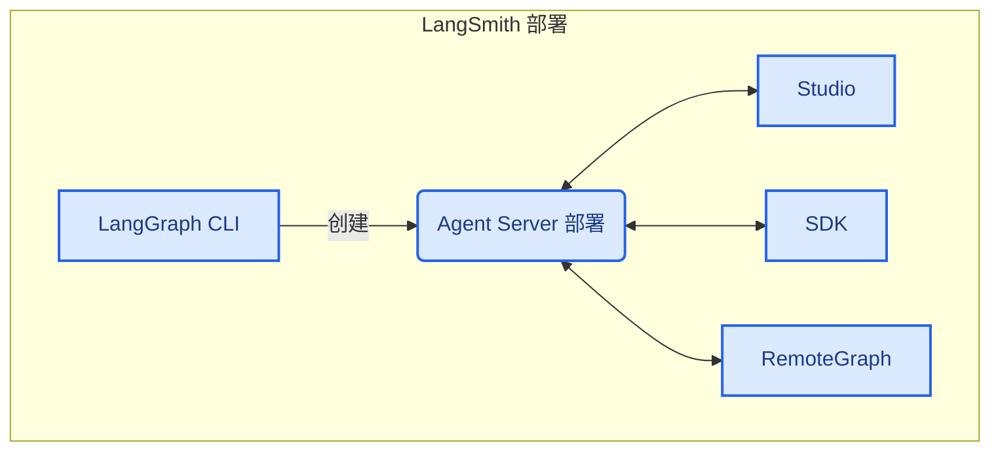

当运行自托管的 [LangSmith 部署](/langsmith/deploy-self-hosted-full-platform) 时，您的安装包含几个关键组件。这些工具和服务共同提供了一个完整的解决方案，用于在您自己的基础设施中构建、部署和管理图（包括智能体应用）：

- [Agent Server](/langsmith/agent-server)：定义了一套规范的 API 和运行时，用于部署图和智能体。它处理执行、状态管理和持久化，让您可以专注于构建逻辑，而无需操心服务器基础设施。
- [LangGraph CLI](/langsmith/cli)：一个命令行界面，用于在本地构建、打包和与图交互，并准备将其部署。
- [Studio](/langsmith/studio)：一个专门用于可视化、交互和调试的集成开发环境。它连接到本地的 Agent Server，用于开发和测试您的图。
- [Python/JS SDK](/langsmith/reference)：Python/JS SDK 提供了一种编程方式，让您的应用程序可以与已部署的图和智能体进行交互。
- [RemoteGraph](/langsmith/use-remote-graph)：允许您像本地运行一样与已部署的图进行交互。
- [控制平面](/langsmith/control-plane)：用于创建、更新和管理 Agent Server 部署的用户界面和 API。
- [数据平面](/langsmith/data-plane)：执行您的图的运行时层，包括 Agent Server、其支持服务（PostgreSQL、Redis 等）以及从控制平面同步状态的监听器。

---

<Callout icon="edit">
    [Edit this page on GitHub](https://github.com/langchain-ai/docs/edit/main/src/i18n\zh-CN\langsmith\components.mdx) or [file an issue](https://github.com/langchain-ai/docs/issues/new/choose).
</Callout>
<Callout icon="terminal-2">
    [Connect these docs](/use-these-docs) to Claude, VSCode, and more via MCP for real-time answers.
</Callout>

