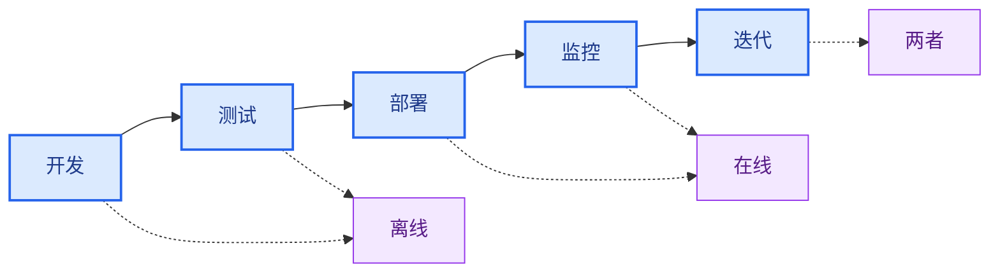

LLM 的输出具有非确定性，这使得响应质量难以评估。评估（evals）是一种分解“好”的标准并加以衡量的方法。LangSmith 评估提供了一个框架，用于在应用程序的整个生命周期中衡量质量，从部署前测试到生产监控。

## 评估内容

在构建评估之前，先确定对您的应用程序而言什么才是重要的。将您的系统分解为关键组件——LLM 调用、检索步骤、工具调用、输出格式化——并为每个组件确定质量标准。

**从手动整理的示例开始。** 为每个关键组件创建 5-10 个“好”的示例。这些示例作为您的基本事实，并指导您使用哪种评估方法。例如：
- **RAG 系统**：良好检索（相关文档）和良好答案（准确、完整）的示例。
- **智能体**：正确选择工具和适当参数格式化或智能体所采取轨迹的示例。
- **聊天机器人**：有帮助、符合品牌、满足用户意图的响应示例。

一旦通过示例定义了“好”，您就可以衡量您的系统产生类似质量输出的频率。

## 离线和在线评估

LangSmith 支持两种类型的评估，它们在您的开发工作流程中服务于不同的目的：

### 离线评估

<Icon icon="flask" iconType="solid" /> 将离线评估用于**部署前测试**：
- **基准测试**：比较多个版本以找到最佳表现者。
- **回归测试**：确保新版本不会降低质量。
- **单元测试**：验证单个组件的正确性。
- **回测**：针对历史数据测试新版本。

离线评估针对[_数据集_](#datasets)中的[_示例_](#examples)：包含定义“好”是什么的参考输出的精选测试用例。

### 在线评估

<Icon icon="radar" iconType="solid" /> 将在线评估用于**生产监控**：
- **实时监控**：持续跟踪实时流量上的质量。
- **异常检测**：标记异常模式或边缘情况。
- **生产反馈**：识别问题以添加到离线数据集中。

在线评估针对来自[追踪](/langsmith/observability-quickstart)的[_运行_](#runs)和[_线程_](#threads)：没有参考输出的真实生产轨迹。

这种目标差异决定了您可以评估的内容：离线评估可以根据预期答案检查正确性，而在线评估则侧重于质量模式、安全性和实际行为。

## 评估生命周期

随着您开发和[部署应用程序](/langsmith/deployment)，您的评估策略从部署前测试演变为生产监控。在开发和测试期间，离线评估根据精选数据集验证功能。部署后，在线评估监控实时流量上的生产行为。随着应用程序的成熟，两种评估类型在迭代反馈循环中协同工作，以持续改进质量。

### 1. 使用离线评估进行开发

在生产部署之前，使用离线评估来验证功能、对不同方法进行基准测试并建立信心。

按照[快速入门](/langsmith/evaluation-quickstart)运行您的第一个离线评估。

### 2. 使用在线评估进行初始部署

部署后，使用在线评估来监控生产质量、检测意外问题并收集实际数据。

了解如何为生产监控[配置在线评估](/langsmith/online-evaluations-llm-as-judge)。

### 3. 持续改进

在迭代反馈循环中同时使用两种评估类型。在线评估发现的问题成为离线测试用例，离线评估验证修复，在线评估确认生产改进。

## 核心评估目标

根据评估是离线还是在线，评估运行在不同的目标上。

### 离线评估的目标

离线评估在数据集和示例上运行。参考输出的存在使得能够比较预期结果和实际结果。

#### 数据集

数据集是用于评估应用程序的_示例集合_。示例是一个测试输入、参考输出对。

#### 示例

每个示例包含：

- **输入**：传递给应用程序的输入变量字典。
- **参考输出**（可选）：参考输出字典。这些不会传递给您的应用程序，仅用于评估器。
- **元数据**（可选）：可用于创建数据集筛选视图的附加信息字典。

了解更多关于[管理数据集](/langsmith/manage-datasets)的信息。

#### 实验

_实验_表示在数据集上评估特定应用程序版本的结果。每个实验捕获数据集中每个示例的输出、评估器分数和执行轨迹。

通常在给定数据集上运行多个实验来测试不同的应用程序配置（例如，不同的提示词或 LLM）。LangSmith 显示与数据集关联的所有实验，并支持[并排比较多个实验](/langsmith/compare-experiment-results)。

学习[如何分析实验结果](/langsmith/analyze-an-experiment)。

### 在线评估的目标

在线评估在生产流量的运行和线程上运行。没有参考输出，评估器专注于实时检测问题、异常和质量下降。

#### 运行

_运行_是来自您[已部署应用程序](/langsmith/deployment)的单个执行轨迹。每个运行包含：
- **输入**：您的应用程序接收到的实际用户输入。
- **输出**：您的应用程序实际返回的内容。
- **中间步骤**：所有子运行（工具调用、LLM 调用等）。
- **元数据**：标签、用户反馈、延迟指标等。

与数据集中的示例不同，运行不包含参考输出。在线评估器必须在不知道“正确”答案应该是什么的情况下评估质量，而是依赖于质量启发式方法、安全检查和无参考评估技术。

了解更多关于[可观测性概念中的运行和轨迹](/langsmith/observability-concepts#runs)。

#### 线程

_线程_是代表多轮对话的相关运行的集合。在线评估器可以在线程级别运行，以评估整个对话而不是单个轮次。这使得能够评估对话级别的属性，如跨轮次的连贯性、主题保持以及整个交互过程中的用户满意度。

## 评估器

_评估器_是给应用程序性能打分的函数。它们为离线和在线评估提供度量层，根据可用数据调整其输入。

使用 LangSmith SDK（[Python](https://docs.smith.langchain.com/reference/python/reference) 和 [TypeScript](https://docs.smith.langchain.com/reference/js)）、通过 [Playground](/langsmith/prompt-engineering-concepts#playground) 或配置[规则](/langsmith/rules)在追踪项目或数据集上自动运行它们来运行评估器。

### 评估器输入

评估器输入根据评估类型而不同：

**离线评估器**接收：
- [示例](#examples)：来自您[数据集](#datasets)的示例，包含输入、参考输出和元数据。
- [运行](/langsmith/observability-concepts#runs)：在示例输入上运行应用程序的实际输出和中间步骤。

**在线评估器**接收：
- [运行](/langsmith/observability-concepts#runs)：包含输入、输出和中间步骤的生产轨迹（无参考输出可用）。

### 评估器输出

评估器返回**反馈**，即评估的分数。反馈是一个字典或字典列表。每个字典包含：

- `key`：指标名称。
- `score` | `value`：指标值（数值指标用 `score`，分类指标用 `value`）。
- `comment`（可选）：对分数的额外推理或解释。

### 评估技术

LangSmith 支持多种评估方法：

- [人工评估](#human)
- [代码评估](#code)
- [LLM 作为裁判](#llm-as-judge)
- [成对评估](#pairwise)

#### 人工评估

_人工评估_涉及手动审查应用程序输出和执行轨迹。这种方法[通常是评估的有效起点](https://hamel.dev/blog/posts/evals/#looking-at-your-traces)。LangSmith 提供了审查应用程序输出和轨迹（所有中间步骤）的工具。

**标注队列**

[标注队列](/langsmith/annotation-queues)简化了对运行的结构化人工反馈收集。它们通过提供有组织的工作流程、规定的评估标准、团队协作功能和进度跟踪，补充了[内联标注](/langsmith/annotate-traces-inline)。

LangSmith 支持两种队列类型：

- **单运行队列**：根据自定义评估标准项一次审查一个运行。适用于问题分类或从生产轨迹构建数据集。
- **成对队列**：并排比较两个运行以判断哪个更好。专为实验之间的快速 A/B 比较而设计。

关键功能包括为每个运行配置多个评审员、启用预留以防止冲突，以及将标注的运行直接导出到数据集以供未来评估。

#### 代码评估

_代码评估器_是确定性的、基于规则的函数。它们适用于检查诸如聊天机器人响应结构不为空、生成的代码能否编译或分类是否完全匹配等情况。

#### LLM 作为裁判

_LLM 作为裁判评估器_使用 LLM 为应用程序输出打分。评分规则和标准通常编码在 LLM 提示词中。这些评估器可以是：

- **无参考**：检查输出是否包含冒犯性内容或符合特定标准。
- **基于参考**：将输出与参考进行比较（例如，检查相对于参考的事实准确性）。

LLM 作为裁判评估器需要仔细审查分数和提示词调优。少样本评估器（在评分器提示词中包含输入、输出和预期分数的示例）通常能提高性能。

了解[如何定义 LLM 作为裁判评估器](/langsmith/llm-as-judge)。

#### 成对评估

_成对评估器_使用启发式方法（例如，哪个响应更长）、LLM（带有成对提示词）或人工评审员来比较两个应用程序版本的输出。

当成对比较两个输出比直接给单个输出打分更容易时，成对评估效果很好。例如，在摘要任务中，选择两个摘要中信息更丰富的一个通常比给单个摘要分配绝对分数更容易。

学习[如何运行成对评估](/langsmith/evaluate-pairwise)。

### 无参考与基于参考的评估器

了解评估器是否需要参考输出对于确定其使用时机至关重要。

**无参考评估器**在不与预期输出比较的情况下评估质量。这些评估器适用于离线和在线评估：
- **安全检查**：毒性检测、PII 检测、内容策略违规
- **格式验证**：JSON 结构、必填字段、模式合规性
- **质量启发式**：响应长度、延迟、特定关键词
- **无参考 LLM 作为裁判**：清晰度、连贯性、帮助性、语气

**基于参考的评估器**需要参考输出，仅适用于离线评估：
- **正确性**：与参考答案的语义相似性
- **事实准确性**：根据基本事实进行事实核查
- **精确匹配**：带有已知标签的分类任务
- **基于参考的 LLM 作为裁判**：将输出质量与参考进行比较

在设计评估策略时，无参考评估器在离线测试和在线监控中提供了一致性，而基于参考的评估器则能在开发期间实现更精确的正确性检查。

## 评估类型

LangSmith 支持各种评估方法，适用于开发和部署的不同阶段。了解何时使用每种类型有助于构建全面的评估策略。

离线和在线评估服务于不同的目的：
- **离线评估类型**在具有参考输出的精选数据集上进行部署前测试
- **在线评估类型**在没有参考输出的实时流量上监控生产行为

了解更多关于[评估类型及其使用时机](/langsmith/evaluation-types)。

## 最佳实践

### 构建数据集

有多种构建数据集的策略：

**手动整理的示例**

这是推荐的起点。创建 10-20 个涵盖常见场景和边缘情况的高质量示例。这些示例定义了您的应用程序“好”的标准。

**历史轨迹**

一旦进入生产环境，将真实轨迹转换为示例。对于高流量应用程序：
- **用户反馈**：将收到负面反馈的运行添加到测试中。
- **启发式方法**：识别有趣的运行（例如，长延迟、错误）。
- **LLM 反馈**：使用 LLM 检测值得注意的对话。

**合成数据**

从现有示例生成额外的示例。最好从几个高质量的手工制作示例作为模板开始。

### 数据集组织

**划分**

划分是数据集的命名子集，用于将示例分成独立的组。常见模式包括：

- **机器学习风格划分**：将示例划分为训练集、验证集和测试集，以避免过拟合（模型在训练数据上表现良好但在未见数据上表现不佳）。
- **基于类别的划分**：当数据集涵盖多个任务类别时，分别评估不同的输入类型。
- **分阶段推出**：将探索性示例隔离，直到您准备好将它们包含在主评估集中。

划分与元数据不同：使用划分进行用于评估的高级组织分组，使用元数据存储每个示例的信息，如标签和来源。

在机器学习中，最佳实践是每个示例恰好属于一个划分。LangSmith 允许示例属于多个划分，这在示例适合多个评估类别时很有用。

学习如何[创建和管理数据集划分](/langsmith/manage-datasets-in-application#create-and-manage-dataset-splits)。

**版本**

当示例更改时，LangSmith 会自动创建数据集[版本](/langsmith/manage-datasets#version-a-dataset)。[标记版本](/langsmith/manage-datasets#tag-a-version)以标记重要里程碑。在 CI 流水线中定位特定版本，以确保数据集更新不会破坏工作流程。

### 人工反馈收集

人工反馈通常提供最有价值的评估，特别是对于主观质量维度。

**标注队列**

[标注队列](/langsmith/annotation-queues)支持结构化的人工反馈收集。标记特定运行以供审查，在简化的界面中收集标注，并将标注的运行转移到数据集以供未来评估。

标注队列通过提供额外功能补充了[内联标注](/langsmith/annotate-traces-inline)：对运行进行分组、指定标准以及配置评审员权限。

### 评估与测试

测试和评估是相似但不同的概念。

**评估根据指标衡量性能。** 指标可以是模糊的或主观的，并且在相对意义上更有用。它们通常比较系统之间的表现。

**测试断言正确性。** 只有通过所有测试的系统才能部署。

评估指标可以转换为测试。例如，回归测试可以断言新版本必须在相关指标上优于基线版本。当系统运行成本高昂时，可以一起运行测试和评估以提高效率。

可以使用标准测试工具（如 [pytest](/langsmith/pytest) 或 [Vitest/Jest](/langsmith/vitest-jest)）编写评估。

## 快速参考：离线与在线评估

下表总结了离线和在线评估之间的主要区别：

| | **离线评估** | **在线评估** |
|---|---|---|
| **运行于** | 数据集（示例） | 追踪项目（运行/线程） |
| **数据访问** | 输入、输出、参考输出 | 仅输入、输出 |
| **使用时机** | 部署前、开发期间 | 生产、部署后 |
| **主要用例** | 基准测试、单元测试、回归测试、回测 | 实时监控、生产反馈、异常检测 |
| **评估时机** | 对精选测试集的批处理 | 对实时流量的实时或近实时处理 |
| **设置位置** | 评估选项卡（SDK、UI、Playground） | [可观测性选项卡](/langsmith/online-evaluations-llm-as-judge)（自动化规则） |
| **数据要求** | 需要数据集整理 | 无需数据集，评估实时轨迹 |

---

<Callout icon="edit">
    [Edit this page on GitHub](https://github.com/langchain-ai/docs/edit/main/src/i18n\zh-CN\langsmith\evaluation-concepts.mdx) or [file an issue](https://github.com/langchain-ai/docs/issues/new/choose).
</Callout>
<Callout icon="terminal-2">
    [Connect these docs](/use-these-docs) to Claude, VSCode, and more via MCP for real-time answers.
</Callout>

