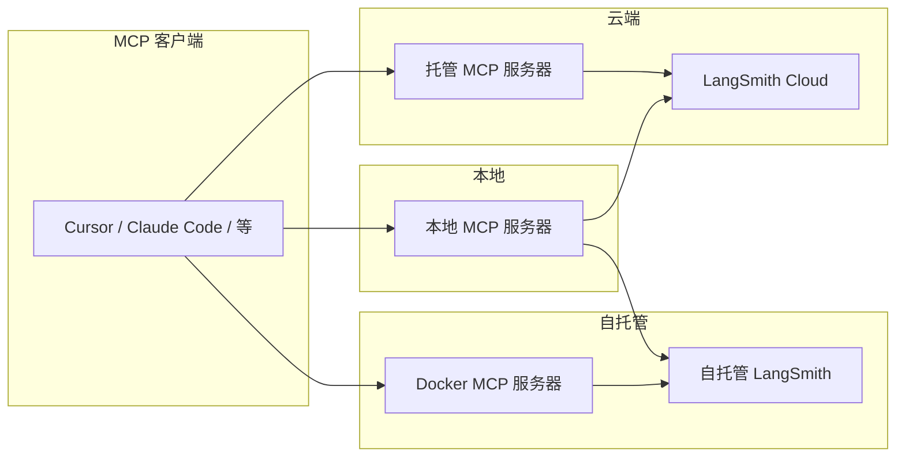

**LangSmith MCP 服务器** 是一个与 [LangSmith](https://smith.langchain.com) 集成的[模型上下文协议](https://modelcontextprotocol.io/introduction)（MCP）服务器。它允许 MCP 兼容的客户端（例如 AI 编程助手）从您的 LangSmith 工作区读取[对话历史](/langsmith/observability-concepts#threads)、[提示词](/langsmith/manage-prompts-programmatically)、[运行记录和追踪](/langsmith/observability-concepts#runs)、[数据集](/langsmith/evaluation-concepts#datasets)、[实验](/langsmith/evaluation-concepts#experiment)以及账单用量。

## 使用示例

- **对话历史**："从项目 'my-chatbot' 的线程 'thread-123' 中获取我的对话历史"
- **提示词管理**："获取所有公开提示词" 或 "拉取 'legal-case-summarizer' 提示词的模板"
- **追踪和运行记录**："从项目 'alpha' 获取最新的 10 个根运行" 或 "通过 UUID 获取某个追踪的所有运行记录"
- **数据集**："列出聊天类型的数据集" 或 "从数据集 'customer-support-qa' 中读取示例"
- **实验**："列出数据集 'my-eval-set' 的实验，包含延迟和成本指标"
- **账单**："获取 2025 年 9 月的账单用量"

<Tip>
**在代码或 Fleet 中使用此服务器**

- 若要在您的 Python 应用程序中连接和使用远程 MCP 服务器（包括此服务器），请参阅 [MCP（模型上下文协议）](/oss/python/langchain/mcp)。
- 若要在 Fleet 中连接和使用此服务器，请参阅 [远程 MCP 服务器](/langsmith/fleet/remote-mcp-servers)。
</Tip>

## 快速开始（托管版）

LangSmith MCP 服务器提供托管版本，可通过 HTTP 访问，您无需自行运行服务器即可连接。

- **URL:** `https://langsmith-mcp-server.onrender.com/mcp`
- **认证:** 在 `LANGSMITH-API-KEY` 请求头中发送您的 [LangSmith API 密钥](/langsmith/create-account-api-key)。

<Note>
托管实例适用于 [LangSmith Cloud](/langsmith/deploy-to-cloud)。对于[自托管 LangSmith](/langsmith/self-hosted) 实例，您需要自行运行服务器并指向您的端点（参见 [Docker 部署](#docker-deployment-http-streamable)）。
</Note>

**示例（Cursor `mcp.json`）：**

```json
{
  "mcpServers": {
    "LangSmith MCP (Hosted)": {
      "url": "https://langsmith-mcp-server.onrender.com/mcp",
      "headers": {
        "LANGSMITH-API-KEY": "lsv2_pt_your_api_key_here"
      }
    }
  }
}
```

可选请求头：`LANGSMITH-WORKSPACE-ID`、`LANGSMITH-ENDPOINT`（与[环境变量](#environment-variables)中的名称相同）。

## 可用工具

该服务器为 LangSmith 公开了以下工具组。

### 对话与线程

| 工具 | 描述 |
|------|-------------|
| `get_thread_history` | 获取对话线程的消息历史。使用基于字符的分页：传递 `page_number`（从 1 开始），并使用返回的 `total_pages` 来请求更多页面。可选参数：`max_chars_per_page`、`preview_chars`。 |

### 提示词管理

| 工具 | 描述 |
|------|-------------|
| `list_prompts` | 列出提示词，支持按可见性（公开/私有）和数量限制进行筛选。 |
| `get_prompt_by_name` | 通过精确名称获取单个提示词（详情和模板）。 |
| `push_prompt` | 仅文档说明：如何创建并将提示词推送到 LangSmith。 |

### 追踪与运行记录

| 工具 | 描述 |
|------|-------------|
| `fetch_runs` | 从一个或多个项目中获取运行记录（追踪、工具、链等）。支持筛选器（`run_type`、`error`、`is_root`）、FQL（`filter`、`trace_filter`、`tree_filter`）和排序。当设置了 `trace_id` 时，结果采用基于字符的分页；否则返回一批记录，最多 `limit` 条。始终传递 `limit` 和 `page_number`。 |
| `list_projects` | 列出项目，支持按名称、数据集和详细级别进行筛选。 |

### 数据集与示例

| 工具 | 描述 |
|------|-------------|
| `list_datasets` | 列出数据集，支持按 ID、类型、名称或元数据进行筛选。 |
| `list_examples` | 通过数据集 ID/名称或示例 ID 列出数据集中的示例；支持筛选器、元数据、数据拆分和可选的 `as_of` 版本。 |
| `read_dataset` | 通过 ID 或名称读取一个数据集。 |
| `read_example` | 通过 ID 读取一个示例，支持可选的 `as_of` 版本。 |
| `create_dataset` | 仅文档说明：如何创建数据集。 |
| `update_examples` | 仅文档说明：如何更新数据集示例。 |

### 实验与评估

| 工具 | 描述 |
|------|-------------|
| `list_experiments` | 列出数据集的实验（参考）项目。需要 `reference_dataset_id` 或 `reference_dataset_name`。返回指标（延迟、成本、反馈）。 |
| `run_experiment` | 仅文档说明：如何运行实验和评估。 |

### 账单

| 工具 | 描述 |
|------|-------------|
| `get_billing_usage` | 获取组织在指定日期范围内的账单用量（例如追踪次数）。支持可选的工作区筛选。 |

### 分页（基于字符）

返回大量数据的工具使用**基于字符预算的分页**，以确保响应保持在大小限制内：

- **使用场景：** `get_thread_history` 和 `fetch_runs`（当设置了 `trace_id` 时）。
- **参数：** 每次请求发送 `page_number`（从 1 开始）。可选参数：`max_chars_per_page`（默认 25000，最大 30000）、`preview_chars`（用“... (+N chars)”截断长字符串）。
- **响应：** 包含 `page_number`、`total_pages` 和页面负载。通过使用 `page_number = 2`、`3` 等再次调用，直到 `total_pages`，来请求更多页面。
- **优势：** 页面按字符数而非项目数构建；无需游标或服务器端状态——只需页码。

## 安装（本地运行）

如果您希望本地运行服务器（或使用自托管的 LangSmith 端点），请安装它并配置您的 MCP 客户端。

### 先决条件

1. 安装 [uv](https://github.com/astral-sh/uv)（Python 包安装器）：
   ```bash
   curl -LsSf https://astral.sh/uv/install.sh | sh
   ```

2. 安装包：
   ```bash
   uv run pip install --upgrade langsmith-mcp-server
   ```

### MCP 客户端配置

将服务器添加到您的 MCP 客户端配置中。使用 `which uvx` 的路径作为 `command` 的值。

**PyPI / uvx：**

```json
{
  "mcpServers": {
    "LangSmith API MCP Server": {
      "command": "/path/to/uvx",
      "args": ["langsmith-mcp-server"],
      "env": {
        "LANGSMITH_API_KEY": "your_langsmith_api_key",
        "LANGSMITH_WORKSPACE_ID": "your_workspace_id",
        "LANGSMITH_ENDPOINT": "https://api.smith.langchain.com"
      }
    }
  }
}
```

**从源代码运行**（首先克隆 [langsmith-mcp-server](https://github.com/langchain-ai/langsmith-mcp-server)）：

```json
{
  "mcpServers": {
    "LangSmith API MCP Server": {
      "command": "/path/to/uv",
      "args": [
        "--directory",
        "/path/to/langsmith-mcp-server",
        "run",
        "langsmith_mcp_server/server.py"
      ],
      "env": {
        "LANGSMITH_API_KEY": "your_langsmith_api_key",
        "LANGSMITH_WORKSPACE_ID": "your_workspace_id",
        "LANGSMITH_ENDPOINT": "https://api.smith.langchain.com"
      }
    }
  }
}
```

将 `/path/to/uv`、`/path/to/uvx` 和 `/path/to/langsmith-mcp-server` 替换为您的实际路径。

## Docker 部署（HTTP 流式传输）

您可以使用 Docker 将服务器作为 HTTP 服务运行，以便客户端通过 HTTP 流式传输协议连接。

1. 构建并运行：
   ```bash
   docker build -t langsmith-mcp-server .
   docker run -p 8000:8000 langsmith-mcp-server
   ```
   使用 [langsmith-mcp-server](https://github.com/langchain-ai/langsmith-mcp-server) 仓库中的 Dockerfile 和上下文。

2. 将您的 MCP 客户端连接到 `http://localhost:8000/mcp`，并附带 `LANGSMITH-API-KEY` 请求头（以及可选的 `LANGSMITH-WORKSPACE-ID`、`LANGSMITH-ENDPOINT`）。

3. 健康检查（无需认证）：
   ```bash
   curl http://localhost:8000/health
   ```

有关 Docker 和 HTTP 流式传输的完整详细信息，请参阅 [LangSmith MCP 服务器仓库](https://github.com/langchain-ai/langsmith-mcp-server)。

## 部署概览

使用**托管** MCP 服务器连接到 [LangSmith Cloud](/langsmith/cloud)（smith.langchain.com 或 eu.smith.langchain.com）。**本地**运行服务器（[安装（本地运行）](#installation-run-locally)）以连接到 Cloud 或[自托管 LangSmith](/langsmith/self-hosted)（通过 `LANGSMITH_ENDPOINT`）。如果您使用自托管 LangSmith，您也可以选择在您的 VPC 中通过 [Docker 镜像](#docker-deployment-http-streamable)运行服务器，以便它能访问您的自托管实例。



## 环境变量

| 变量 | 是否必需 | 描述 |
|----------|----------|-------------|
| `LANGSMITH_API_KEY` | 是 | 用于认证的 [LangSmith API 密钥](/langsmith/create-account-api-key)。 |
| `LANGSMITH_WORKSPACE_ID` | 否 | 当您的 API 密钥可访问多个工作区时，指定工作区 ID。 |
| `LANGSMITH_ENDPOINT` | 否 | API 端点 URL（用于[自托管](/langsmith/self-hosted)或自定义区域）。默认值：`https://api.smith.langchain.com`。 |

对于**托管**服务器，使用与**请求头**相同的名称：`LANGSMITH-API-KEY`、`LANGSMITH-WORKSPACE-ID`、`LANGSMITH-ENDPOINT`。

## TypeScript 实现

官方 Python 服务器有一个社区维护的 TypeScript/Node.js 移植版本。运行方式：`LANGSMITH_API_KEY=your-key npx langsmith-mcp-server`。

源代码和包：[GitHub](https://github.com/amitrechavia/langsmith-mcp-server-js) · [npm](https://www.npmjs.com/package/langsmith-mcp-server)。由 [amitrechavia](https://github.com/amitrechavia) 维护。

---

<div className="source-links">
<Callout icon="edit">
    [Edit this page on GitHub](https://github.com/langchain-ai/docs/edit/main/src/i18n\zh-CN\langsmith\langsmith-mcp-server.mdx) or [file an issue](https://github.com/langchain-ai/docs/issues/new/choose).
</Callout>
<Callout icon="terminal-2">
    [Connect these docs](/use-these-docs) to Claude, VSCode, and more via MCP for real-time answers.
</Callout>
</div>
