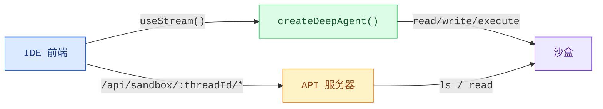
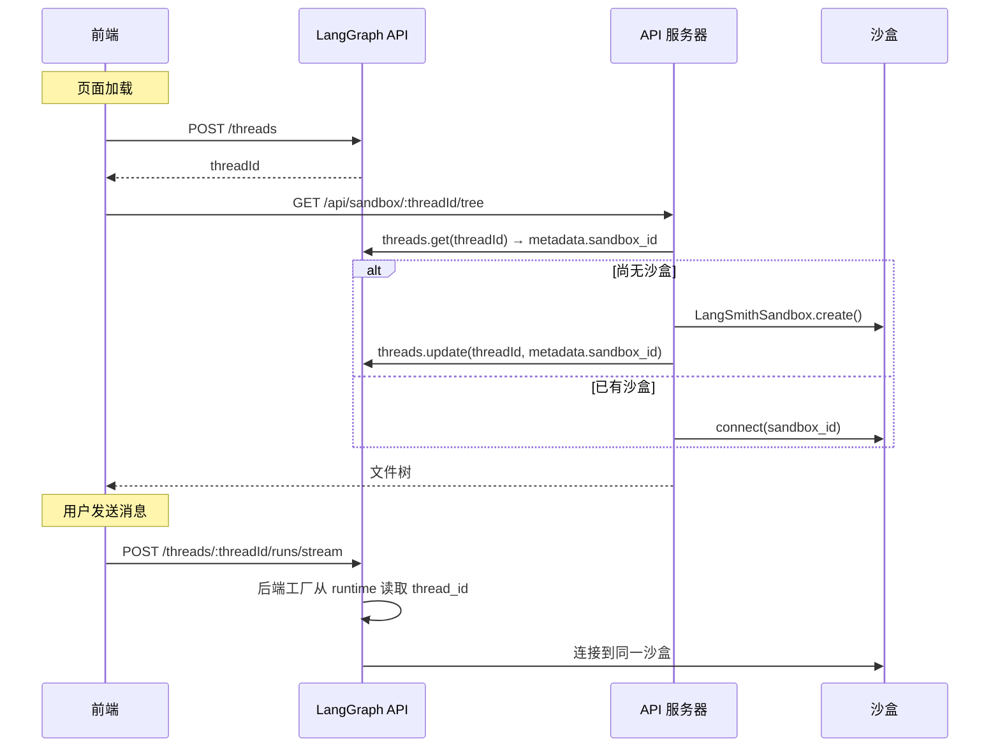

编码智能体需要的不仅仅是一个聊天窗口。它们需要一个文件浏览器、代码查看器、差异面板，一个 IDE 体验。这种模式将一个深度智能体连接到一个[沙盒](/oss/javascript/deepagents/sandboxes)，使其能够在隔离环境中读取、写入和执行代码，然后通过自定义 API 服务器暴露沙盒文件系统，以便前端在智能体工作时实时显示文件。

import { PatternEmbed } from "/snippets/pattern-embed.jsx";

<PatternEmbed pattern="deep-agent-ide" minHeight={700} />

## 架构

沙盒模式包含三层：

1.  **带有沙盒后端的深度智能体：** 智能体从沙盒自动获取文件系统工具（`read_file`、`write_file`、`edit_file`、`execute`）


2.  **自定义 API 服务器：** 一个通过 `langgraph.json` 的 `http.app` 字段暴露的 Hono 应用，提供前端可以调用的文件浏览端点


3.  **IDE 前端：** 一个三面板布局（文件树、代码/差异查看器、聊天），在智能体进行更改时实时同步文件



## 沙盒生命周期

在深入代码之前，了解沙盒的作用域策略很重要。作用域策略决定了谁共享一个沙盒、沙盒的存活时间以及运行时如何解析它。

### 线程作用域的沙盒（推荐）

每个 LangGraph 线程都有自己的沙盒。沙盒 ID 存储在线程的元数据中，并通过后端工厂的 `runtime.configurable.thread_id` 解析。这是大多数应用程序的推荐方法：

- 对话是隔离的 — 一个线程中的文件更改不会影响另一个线程
- 沙盒状态在页面重新加载时保持不变（相同线程 = 相同沙盒）
- 清理很简单：当线程被删除时，其沙盒也可以被删除



### 智能体作用域的沙盒

同一助手下的所有线程共享一个沙盒。适用于希望更改在不同对话间持续的持久化项目环境：


```ts
const sandboxBackendFactory = async (runtime: BackendRuntime) => {
  const assistantId = runtime.configurable?.assistant_id;
  return getOrCreateSandboxForAssistant(assistantId);
};
```


### 用户作用域的沙盒

每个用户在所有线程中拥有自己的沙盒。需要自定义身份验证和用户识别：


```ts
const sandboxBackendFactory = async (runtime: BackendRuntime) => {
  const userId = runtime.configurable?.user_id;
  return getOrCreateSandboxForUser(userId);
};
```


### 会话作用域的沙盒（客户端）

对于没有 LangGraph 线程的简单应用，前端可以生成一个会话 ID 并直接传递。这种方法不会在浏览器会话间持久化，最适合演示或原型设计：


```ts
const sessionId = crypto.randomUUID();
fetch(`/api/sandbox/tree?sessionId=${sessionId}`);
```


本指南的其余部分使用**线程作用域的沙盒**作为主要示例。

## 设置智能体

### 选择沙盒提供商


Deep Agents 支持多个沙盒提供商。任何实现 `SandboxBackendProtocol` 的提供商都可以使用：

```ts
import { createDeepAgent, LangSmithSandbox } from "deepagents";

const sandbox = await LangSmithSandbox.create();

export const agent = createDeepAgent({
  model: "anthropic:claude-sonnet-4-5",
  backend: sandbox,
  systemPrompt: "You are an expert developer working on a project in /app.",
});
```


智能体会自动获取文件系统工具（`read_file`、`write_file`、`edit_file`、`ls`、`glob`、`grep`）和一个用于运行 shell 命令的 `execute` 工具。无需工具配置。

### 为线程作用域的沙盒使用后端工厂

不要在模块级别创建沙盒（这将在所有线程间共享并可能过期），而是使用一个**后端工厂**，在运行时按线程解析沙盒。工厂接收一个 `BackendRuntime` 对象，其中包含来自当前 LangGraph 运行的 `configurable.thread_id`：

```ts
import { createDeepAgent, LangSmithSandbox, type BackendRuntime } from "deepagents";

async function getOrCreateSandboxForThread(threadId: string): Promise<LangSmithSandbox> {
  // 检查线程元数据中是否已有 sandbox_id
  const client = new Client({ apiUrl: "http://localhost:2024" });
  const thread = await client.threads.get(threadId);
  const sandboxId = thread.metadata?.sandbox_id;

  if (sandboxId) {
    // 重新连接到现有沙盒
    return new LangSmithSandbox({
      sandbox: await new SandboxClient().getSandbox(sandboxId),
    });
  }

  // 创建新沙盒并将 ID 存储在线程元数据中
  const sandbox = await LangSmithSandbox.create({ templateName: "my-template" });
  await seedSandbox(sandbox);
  await client.threads.update(threadId, { metadata: { sandbox_id: sandbox.id } });
  return sandbox;
}

const sandboxBackendFactory = async (runtime: BackendRuntime) => {
  const threadId = runtime.configurable?.thread_id;
  if (!threadId) throw new Error("No thread_id — agent must run on a thread");
  return getOrCreateSandboxForThread(threadId);
};

export const agent = createDeepAgent({
  model: "anthropic:claude-sonnet-4-5",
  backend: sandboxBackendFactory,
  systemPrompt: "You are an expert developer working on a project in /app.",
});
```


### 初始化沙盒

在智能体运行之前，使用 `uploadFiles` 将项目文件填充到沙盒中：

<Info>
  对于 **LangSmith** 沙盒，容器镜像和资源限制来自[沙盒模板](/langsmith/sandbox-templates)。在创建沙盒时传递 `templateName`（参见上面的 `getOrCreateSandboxForThread`）。`uploadFiles` 在运行时在该镜像之上初始化或更新项目文件。
</Info>

```ts
const SEED_FILES: Record<string, string> = {
  "package.json": JSON.stringify({ name: "my-app", version: "1.0.0" }, null, 2),
  "src/index.js": 'console.log("Hello");',
};

const encoder = new TextEncoder();
await sandbox.uploadFiles(
  Object.entries(SEED_FILES).map(([path, content]) => [`/app/${path}`, encoder.encode(content)]),
);
```

<Tip>
  上传 `package.json` 后，运行 `sandbox.execute("cd /app && npm install")`，以便在智能体开始之前安装依赖项。
</Tip>

## 添加文件浏览 API

智能体可以读取和写入文件，但前端也需要直接访问来浏览沙盒文件系统。添加一个自定义的 [Hono](https://hono.dev) API 服务器，并通过 `langgraph.json` 中的 `http.app` 字段暴露它。


### 创建 API 服务器

沙盒 API 端点使用线程 ID 作为 URL 路径参数。这确保前端始终访问当前对话的正确沙盒，使用与智能体后端工厂相同的 `getOrCreateSandboxForThread` 函数：

```ts
// src/api/app.ts
import { Hono } from "hono";
import { getOrCreateSandboxForThread } from "./utils.js";

export const app = new Hono();

app.get("/api/sandbox/:threadId/tree", async (c) => {
  const threadId = c.req.param("threadId");
  const rootPath = c.req.query("filePath") || "/app";

  const sandbox = await getOrCreateSandboxForThread(threadId);
  const result = await sandbox.execute(
    `find '${rootPath}' -printf '%y\\t%s\\t%p\\n' 2>/dev/null | sort -t$'\\t' -k3`,
  );

  const entries = result.output
    .trim()
    .split("\n")
    .filter(Boolean)
    .map((line) => {
      const [typeChar, sizeStr, fullPath] = line.split("\t");
      return {
        name: fullPath.split("/").pop(),
        type: typeChar === "d" ? "directory" : "file",
        path: fullPath,
        size: parseInt(sizeStr, 10) || 0,
      };
    });

  return c.json({ path: rootPath, entries, sandboxId: sandbox.id });
});

app.get("/api/sandbox/:threadId/file", async (c) => {
  const threadId = c.req.param("threadId");
  const filePath = c.req.query("filePath");
  if (!filePath) return c.json({ error: "filePath is required" }, 400);

  const sandbox = await getOrCreateSandboxForThread(threadId);
  const results = await sandbox.downloadFiles([filePath]);
  const file = results[0];
  if (file.error) return c.json({ error: file.error }, 404);

  const content = new TextDecoder().decode(file.content!);
  return c.json({ path: filePath, content });
});
```


<Note>
  智能体的后端工厂和 API 服务器都调用相同的 `getOrCreateSandboxForThread` 函数。这确保它们对于给定线程始终解析到相同的沙盒。线程元数据中的沙盒 ID 是单一事实来源 — 无需内存缓存。
</Note>

### 配置 `langgraph.json`

注册智能体图和 API 服务器。`http.app` 字段告诉 LangGraph 平台在默认路由旁边提供你的自定义路由：

```json
{
  "node_version": "22",
  "graphs": {
    "coding_agent": "./src/agents/my-agent.ts:agent"
  },
  "env": ".env",
  "http": {
    "app": "./src/api/app.ts:app"
  }
}
```


:::python

```json
{
  "graphs": {
    "coding_agent": "./src/agents/my_agent.py:agent"
  },
  "env": ".env",
  "http": {
    "app": "./src/api/server.py:app"
  }
}
```

::>

你的自定义路由可在与 LangGraph API 相同的主机上使用。对于使用 `langgraph dev` 的本地开发，地址是 `http://localhost:2024`。

<Note>
  在 `http.app` 中定义的自定义路由优先于默认的 LangGraph 路由。这意味着如果需要，你可以覆盖内置端点，但注意不要意外覆盖像 `/threads` 或 `/runs` 这样的路由。
</Note>

## 构建前端

前端有三个面板：文件树侧边栏、代码/差异查看器和聊天面板。它使用 `useStream` 进行智能体对话，并使用自定义 API 端点进行文件浏览。

### 线程创建

页面加载时创建一个 LangGraph 线程，并将其 ID 持久化在 `sessionStorage` 中，以便页面重新加载时重新连接到同一个沙盒：

```tsx
const THREAD_KEY = "sandbox-thread-id";

function IDEPreview() {
  const [threadId, setThreadId] = useState<string | null>(
    () => sessionStorage.getItem(THREAD_KEY),
  );

  const updateThreadId = useCallback((id: string | null) => {
    setThreadId(id);
    if (id) sessionStorage.setItem(THREAD_KEY, id);
    else sessionStorage.removeItem(THREAD_KEY);
  }, []);

  const stream = useStream<typeof myAgent>({
    apiUrl: AGENT_URL,
    assistantId: "coding_agent",
    threadId,
    onThreadId: updateThreadId,
  });

  // 首次挂载时创建线程
  useEffect(() => {
    if (threadId) return;
    stream.client.threads.create().then((t) => updateThreadId(t.thread_id));
  }, [stream.client, threadId, updateThreadId]);

  // 将 threadId 传递给沙盒文件钩子
  const { tree, files } = useSandboxFiles(threadId);
  // ...
}
```

“新建线程”按钮清除存储的 ID，以便下次挂载时创建一个新线程（和新沙盒）：

```tsx
function handleNewThread() {
  stream.switchThread(null);
  updateThreadId(null);
}
```

### 文件状态管理

跟踪沙盒文件系统的两个快照：原始状态（智能体运行前）和当前状态（实时更新）。线程 ID 包含在 API URL 中，以确保请求始终命中正确的沙盒：

```ts
const AGENT_URL = "http://localhost:2024";

async function fetchTree(threadId: string): Promise<FileEntry[]> {
  const res = await fetch(
    `${AGENT_URL}/api/sandbox/${encodeURIComponent(threadId)}/tree?filePath=/app`,
  );
  const data = await res.json();
  return data.entries.filter((e: FileEntry) => !e.path.includes("node_modules"));
}

async function fetchFile(threadId: string, path: string): Promise<string | null> {
  const res = await fetch(
    `${AGENT_URL}/api/sandbox/${encodeURIComponent(threadId)}/file?filePath=${encodeURIComponent(path)}`,
  );
  const data = await res.json();
  return data.content ?? null;
}
```

### 实时文件同步

IDE 体验的关键是在**智能体工作时**更新文件，而不是在它完成后。监视流消息中来自文件修改工具的 `ToolMessage` 实例。当 `write_file` 或 `edit_file` 工具调用完成时，刷新该特定文件。当 `execute` 完成时，刷新所有文件（因为 shell 命令可能修改任何文件）：

<CodeGroup>
```tsx React
import { useStream } from "@langchain/react";
import { ToolMessage, AIMessage } from "langchain";

const FILE_MUTATING_TOOLS = new Set(["write_file", "edit_file", "execute"]);

export function IDEPreview() {
  const stream = useStream<typeof myAgent>({
    apiUrl: AGENT_URL,
    assistantId: "coding_agent",
  });

  const processedIds = useRef(new Set<string>());

  useEffect(() => {
    // 从 AI 消息构建文件修改工具调用的映射
    const toolCallMap = new Map();
    for (const msg of stream.messages) {
      if (!AIMessage.isInstance(msg)) continue;
      for (const tc of msg.tool_calls ?? []) {
        if (tc.id && FILE_MUTATING_TOOLS.has(tc.name)) {
          toolCallMap.set(tc.id, { name: tc.name, args: tc.args });
        }
      }
    }

    // 当出现文件修改工具的 ToolMessage 时，刷新
    for (const msg of stream.messages) {
      if (!ToolMessage.isInstance(msg)) continue;
      const id = msg.id ?? msg.tool_call_id;
      if (!id || processedIds.current.has(id)) continue;

      const call = toolCallMap.get(msg.tool_call_id);
      if (!call) continue;
      processedIds.current.add(id);

      if (call.name === "write_file" || call.name === "edit_file") {
        refreshSingleFile(call.args.path);
      } else if (call.name === "execute") {
        refreshAllFiles();
      }
    }
  }, [stream.messages]);
}
```

```vue Vue
<script setup lang="ts">
import { useStream } from "@langchain/vue";
import { ToolMessage, AIMessage } from "langchain";
import { watch } from "vue";

const FILE_MUTATING_TOOLS = new Set(["write_file", "edit_file", "execute"]);
const processedIds = new Set<string>();

const stream = useStream<typeof myAgent>({
  apiUrl: AGENT_URL,
  assistantId: "coding_agent",
});

watch(
  () => stream.messages.value,
  (messages) => {
    const toolCallMap = new Map();
    for (const msg of messages) {
      if (AIMessage.isInstance(msg)) {
        for (const tc of msg.tool_calls ?? []) {
          if (tc.id && FILE_MUTATING_TOOLS.has(tc.name)) {
            toolCallMap.set(tc.id, { name: tc.name, args: tc.args });
          }
        }
      }
    }

    for (const msg of messages) {
      if (!ToolMessage.isInstance(msg)) continue;
      const id = msg.id ?? msg.tool_call_id;
      if (!id || processedIds.has(id)) continue;

      const call = toolCallMap.get(msg.tool_call_id);
      if (!call) continue;
      processedIds.add(id);

      if (call.name === "write_file" || call.name === "edit_file") {
        refreshSingleFile(call.args.path);
      } else if (call.name === "execute") {
        refreshAllFiles();
      }
    }
  },
  { deep: true },
);
</script>
````

```svelte Svelte
<script lang="ts">
  import { useStream } from "@langchain/svelte";
  import { ToolMessage, AIMessage } from "langchain";

  const FILE_MUTATING_TOOLS = new Set(["write_file", "edit_file", "execute"]);
  const processedIds = new Set<string>();

  const { messages, submit } = useStream<typeof myAgent>({
    apiUrl: AGENT_URL,
    assistantId: "coding_agent",
  });

  $effect(() => {
    const msgs = $messages;
    const toolCallMap = new Map();
    for (const msg of msgs) {
      if (AIMessage.isInstance(msg)) {
        for (const tc of msg.tool_calls ?? []) {
          if (tc.id && FILE_MUTATING_TOOLS.has(tc.name)) {
            toolCallMap.set(tc.id, { name: tc.name, args: tc.args });
          }
        }
      }
    }

    for (const msg of msgs) {
      if (!ToolMessage.isInstance(msg)) continue;
      const id = msg.id ?? msg.tool_call_id;
      if (!id || processedIds.has(id)) continue;

      const call = toolCallMap.get(msg.tool_call_id);
      if (!call) continue;
      processedIds.add(id);

      if (call.name === "write_file" || call.name === "edit_file") {
        refreshSingleFile(call.args.path);
      } else if (call.name === "execute") {
        refreshAllFiles();
      }
    }
  });
</script>
```

```ts Angular
import { Component, effect } from "@angular/core";
import { useStream } from "@langchain/angular";
import { ToolMessage, AIMessage } from "langchain";

const FILE_MUTATING_TOOLS = new Set(["write_file", "edit_file", "execute"]);

@Component({
  selector: "app-ide-preview",
  template: `<!-- ... -->`,
})
export class IdePreviewComponent {
  stream = useStream<typeof myAgent>({
    apiUrl: AGENT_URL,
    assistantId: "coding_agent",
  });

  private processedIds = new Set<string>();

  constructor() {
    effect(() => {
      const messages = this.stream.messages();
      const toolCallMap = new Map();
      for (const msg of messages) {
        if (AIMessage.isInstance(msg)) {
          for (const tc of (msg as AIMessage).tool_calls ?? []) {
            if (tc.id && FILE_MUTATING_TOOLS.has(tc.name)) {
              toolCallMap.set(tc.id, { name: tc.name, args: tc.args });
            }
          }
        }
      }

      for (const msg of messages) {
        if (!ToolMessage.isInstance(msg)) continue;
        const id = (msg as ToolMessage).id ?? (msg as ToolMessage).tool_call_id;
        if (!id || this.processedIds.has(id)) continue;

        const call = toolCallMap.get((msg as ToolMessage).tool_call_id);
        if (!call) continue;
        this.processedIds.add(id);

        if (call.name === "write_file" || call.name === "edit_file") {
          this.refreshSingleFile(call.args.path);
        } else if (call.name === "execute") {
          this.refreshAllFiles();
        }
      }
    });
  }
}
```

</CodeGroup>

### 检测更改的文件

在每次智能体运行之前，对当前文件内容进行快照。文件刷新后，与快照进行比较以识别哪些文件发生了更改：

```ts
function detectChanges(current: FileSnapshot, original: FileSnapshot): Set<string> {
  const changed = new Set<string>();
  for (const [path, content] of Object.entries(current)) {
    if (original[path] !== content) changed.add(path);
  }
  for (const path of Object.keys(original)) {
    if (!(path in current)) changed.add(path);
  }
  return changed;
}
```

当用户选择一个已更改的文件时，默认显示差异视图，以便他们立即看到智能体修改的内容。

### 显示差异

使用适合框架的差异库来渲染统一差异：

| 框架    | 库                                                                         | 组件                                                           |
| ------- | -------------------------------------------------------------------------- | ------------------------------------------------------------- |
| React   | [`@pierre/diffs`](https://diffs.com)                                       | 使用 `parseDiffFromFile` 的 `<FileDiff>`                      |
| Vue     | [`@git-diff-view/vue`](https://github.com/MrWangJustToDo/git-diff-view)    | 使用来自 `@git-diff-view/file` 的 `generateDiffFile` 的 `<DiffView>` |
| Svelte  | [`@git-diff-view/svelte`](https://github.com/MrWangJustToDo/git-diff-view) | 使用来自 `@git-diff-view/file` 的 `generateDiffFile` 的 `<DiffView>` |
| Angular | [`ngx-diff`](https://github.com/rars/ngx-diff)                             | 带有 `[before]` 和 `[after]` 的 `<ngx-unified-diff>`          |

使用 `@pierre/diffs`（React）的示例：

```tsx
import { FileDiff } from "@pierre/diffs/react";
import { parseDiffFromFile } from "@pierre/diffs";

function DiffPanel({ original, current, fileName }) {
  const diff = parseDiffFromFile(
    { name: fileName, contents: original },
    { name: fileName, contents: current },
  );

  return (
    <FileDiff
      fileDiff={diff}
      options={{ theme: "github-dark", diffStyle: "unified", diffIndicators: "bars" }}
    />
  );
}
```

### 已更改文件摘要

显示所有已修改文件的摘要，包含行级别的添加/删除计数。这为用户提供了智能体影响的快速概览 — 类似于 `git status`：

```tsx
function ChangedFilesSummary({ changedFiles, files, originalFiles, onSelect }) {
  const stats = [...changedFiles].map((path) => {
    const oldLines = (originalFiles[path] ?? "").split("\n");
    const newLines = (files[path] ?? "").split("\n");
    // 通过比较行来计算添加/删除
    return { path, additions, deletions };
  });

  return (
    <div>
      <h3>{stats.length} 个文件已更改</h3>
      {stats.map((file) => (
        <button key={file.path} onClick={() => onSelect(file.path)}>
          {file.path}
          <span className="text-green-400">+{file.additions}</span>
          <span className="text-red-400">-{file.deletions}</span>
        </button>
      ))}
    </div>
  );
}
```

## 三面板布局

IDE 布局将三个面板并排排列：

| 面板         | 宽度           | 用途                                         |
| ------------ | -------------- | ------------------------------------------- |
| 文件树       | 固定（208px）  | 浏览沙盒文件，查看更改指示器                 |
| 代码 / 差异  | 灵活           | 查看文件内容或统一差异                       |
| 聊天         | 固定（320px）  | 与智能体交互                                 |

```tsx
<div className="flex h-screen">
  <div className="w-52 shrink-0">
    <FileTree />
    <ChangedFilesSummary />
  </div>

  <CodePanel /* flex-1 */ />

  <div className="w-80 shrink-0">
    <ChatPanel />
  </div>
</div>
```

文件树显示 VS Code 风格的图标（使用 [`@iconify-json/vscode-icons`](https://www.npmjs.com/package/@iconify-json/vscode-icons)），并在已修改的文件上显示琥珀色圆点。选择已修改的文件会自动切换到差异标签页。

## 使用场景

沙盒适用于以下情况：

- **编码智能体**：创建、修改和运行代码的智能体需要一个超越聊水的可视化界面
- **代码审查工作流**：智能体建议更改，用户在接受前审查差异
- **教程或学习应用**：AI 助手逐步帮助用户构建项目，在上下文中显示更改
- **原型设计工具**：用户用自然语言描述功能，并实时观看智能体实现它们

## 最佳实践

- **在生产应用中使用线程作用域的沙盒**。将沙盒 ID 存储在线程元数据中，并通过后端工厂的 `runtime.configurable.thread_id` 解析。这避免了模块级别的状态，并保持每个对话的沙盒隔离。
- **在智能体后端工厂和 API 服务器之间共享 `getOrCreateSandboxForThread`**。两者都应以相同的方式解析沙盒 — 通过线程元数据 — 这样就有了单一事实来源，无需内存缓存。
- **将 `threadId` 持久化在 `sessionStorage` 中**，以便页面重新加载时重新连接到同一线程和沙盒，而不是创建新的。
- **在每个相关的工具调用时同步文件**，而不仅仅是在运行完成时。这使 IDE 感觉是实时的。监视 `write_file`、`edit_file` 和 `execute` 工具消息并立即刷新。
- **对于已更改的文件，默认显示差异视图**。当用户点击智能体修改的文件时，首先显示差异 — 这是他们关心的内容。
- **为只读操作显示简洁的工具结果**。不要在聊天中转储 `read_file` 的完整输出，而是显示像 `Read router.js L1-42` 这样的一行摘要。为修改工具保留完整的输出显示。
- **用真实项目初始化沙盒**。从空沙盒开始会让人感到困惑。上传一个可工作的启动项目，以便用户（和智能体）立即获得上下文。
- **从文件树中过滤掉 `node_modules`**。没有人想浏览成千上万的依赖文件。获取树时过滤掉它们。

---

<div className="source-links">
<Callout icon="edit">
    [Edit this page on GitHub](https://github.com/langchain-ai/docs/edit/main/src/i18n\zh-CN\oss\deepagents\frontend\sandbox.mdx) or [file an issue](https://github.com/langchain-ai/docs/issues/new/choose).
</Callout>
<Callout icon="terminal-2">
    [Connect these docs](/use-these-docs) to Claude, VSCode, and more via MCP for real-time answers.
</Callout>
</div>
