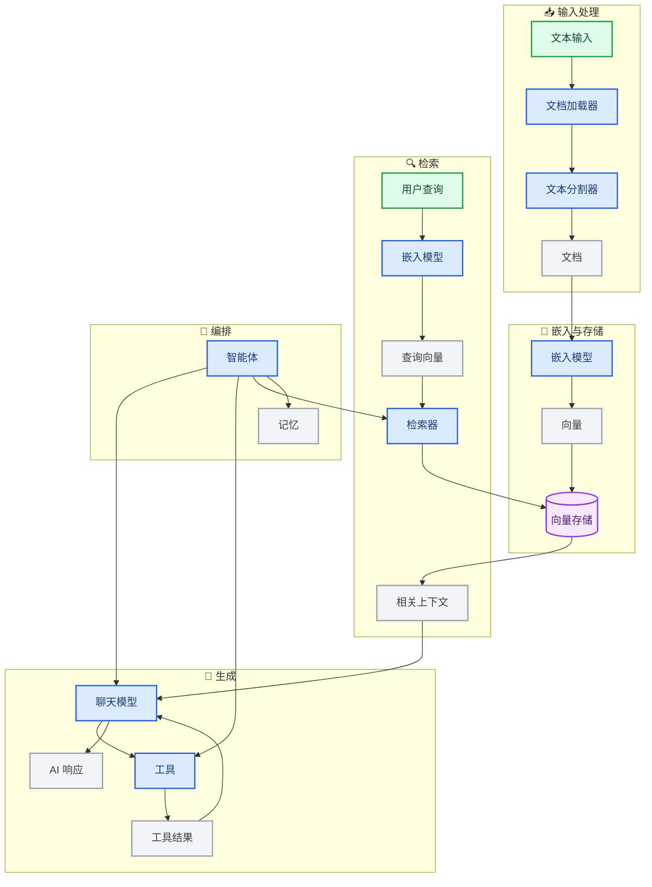
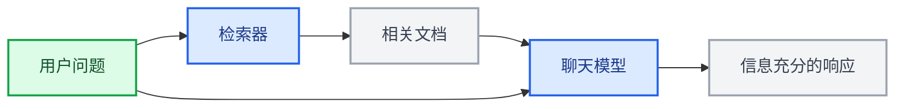
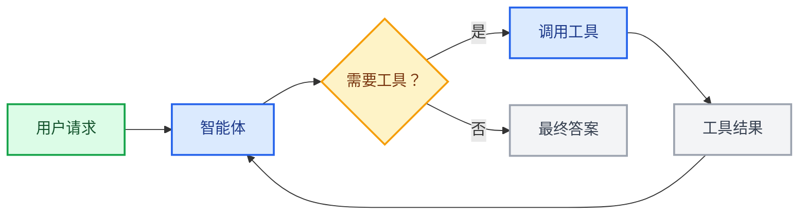
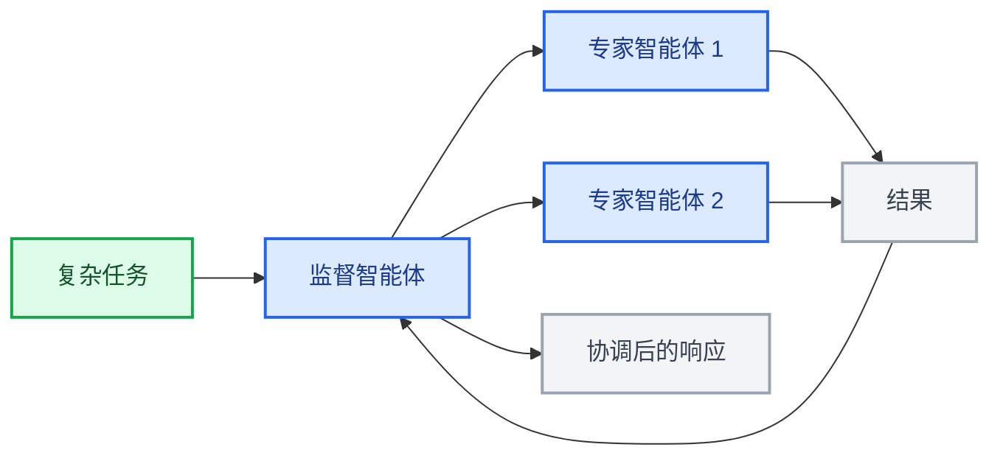

LangChain 的强大之处在于其组件如何协同工作，以构建复杂的 AI 应用。本页通过图表展示了不同组件之间的关系。

## 核心组件生态系统

下图展示了 LangChain 的主要组件如何连接以形成完整的 AI 应用：

### 组件如何连接

每个组件层都构建在前一层之上：

1.  **输入处理** – 将原始数据转换为结构化文档
2.  **嵌入与存储** – 将文本转换为可搜索的向量表示
3.  **检索** – 根据用户查询查找相关信息
4.  **生成** – 使用 AI 模型创建响应，可选择使用工具
5.  **编排** – 通过智能体和记忆系统协调所有组件

## 组件类别

LangChain 将组件组织为以下几个主要类别：

| 类别 | 目的 | 关键组件 | 使用场景 |
|----------|---------|---------------|-----------|
| **[模型](/oss/javascript/langchain/models)** | AI 推理与生成 | 聊天模型、LLMs、嵌入模型 | 文本生成、推理、语义理解 |
| **[工具](/oss/javascript/langchain/tools)** | 外部能力 | API、数据库等 | 网络搜索、数据访问、计算 |
| **[智能体](/oss/javascript/langchain/agents)** | 编排与推理 | ReAct 智能体、工具调用智能体 | 非确定性工作流、决策制定 |
| **[记忆](/oss/javascript/langchain/short-term-memory)** | 上下文保持 | 消息历史、自定义状态 | 对话、有状态的交互 |
| **[检索器](/oss/javascript/integrations/retrievers)** | 信息访问 | 向量检索器、网络检索器 | RAG、知识库搜索 |
| **[文档处理](/oss/javascript/integrations/document_loaders)** | 数据摄取 | 加载器、分割器、转换器 | PDF 处理、网络爬取 |
| **[向量存储](/oss/javascript/integrations/vectorstores)** | 语义搜索 | Chroma、Pinecone、FAISS | 相似性搜索、嵌入存储 |

## 常见模式

### RAG（检索增强生成）

### 带工具的智能体

### 多智能体系统

## 了解更多

-   [创建智能体](/oss/javascript/langchain/agents)
-   [使用工具](/oss/javascript/langchain/tools)
-   [浏览集成](/oss/javascript/integrations/providers/overview)

---

<Callout icon="edit">
    [Edit this page on GitHub](https://github.com/langchain-ai/docs/edit/main/src/i18n\zh-CN\oss\langchain\component-architecture.mdx) or [file an issue](https://github.com/langchain-ai/docs/issues/new/choose).
</Callout>
<Callout icon="terminal-2">
    [Connect these docs](/use-these-docs) to Claude, VSCode, and more via MCP for real-time answers.
</Callout>

