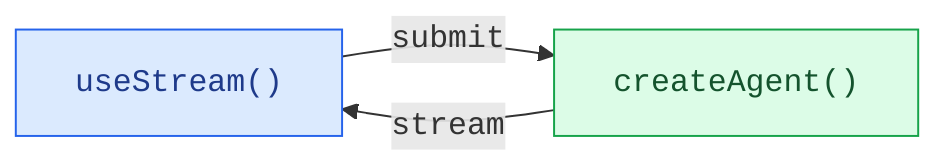

为通过 `createAgent` 创建的智能体构建丰富、交互式的前端。这些模式涵盖了从基础消息渲染到高级工作流（如人工介入审批和时间旅行调试）的所有内容。

## 架构

每个模式都遵循相同的架构：一个 `createAgent` 后端通过 `useStream` 钩子将状态流式传输到前端。



在后端，`createAgent` 生成一个已编译的 LangGraph 图，该图暴露了一个流式 API。在前端，`useStream` 钩子连接到该 API，并提供响应式状态——消息、工具调用、中断、历史记录等——你可以使用任何框架来渲染这些状态。

<CodeGroup>


```ts agent.ts
import { createAgent } from "langchain";
import { MemorySaver } from "@langchain/langgraph";

const agent = createAgent({
  model: "openai:gpt-5.4",
  tools: [getWeather, searchWeb],
  checkpointer: new MemorySaver(),
});
```

```tsx Chat.tsx
import { useStream } from "@langchain/react";
import type { agent } from "./agent";

function Chat() {
  const stream = useStream<typeof agent>({
    apiUrl: "http://localhost:2024",
    assistantId: "agent",
  });

  return (
    <div>
      {stream.messages.map((msg) => (
        <Message key={msg.id} message={msg} />
      ))}
    </div>
  );
}
```


</CodeGroup>

`useStream` 可用于 React、Vue、Svelte 和 Angular：

```ts
import { useStream } from "@langchain/react";   // React
import { useStream } from "@langchain/vue";      // Vue
import { useStream } from "@langchain/svelte";   // Svelte
import { useStream } from "@langchain/angular";  // Angular
```

## 模式

### 渲染消息和输出

<CardGroup cols={3}>
  <Card title="Markdown 消息" icon="markdown" href="/oss/javascript/langchain/frontend/markdown-messages">
    解析并渲染流式传输的 Markdown，提供正确的格式和代码高亮。
  </Card>
  <Card title="结构化输出" icon="layout-grid" href="/oss/javascript/langchain/frontend/structured-output">
    将类型化的智能体响应渲染为自定义 UI 组件，而非纯文本。
  </Card>
  <Card title="推理令牌" icon="brain" href="/oss/javascript/langchain/frontend/reasoning-tokens">
    在可折叠的区块中展示模型的思考过程。
  </Card>
  <Card title="生成式 UI" icon="wand" href="/oss/javascript/langchain/frontend/generative-ui">
    使用 json-render 根据自然语言提示渲染 AI 生成的用户界面。
  </Card>
</CardGroup>

### 展示智能体操作

<CardGroup cols={3}>
  <Card title="工具调用" icon="tool" href="/oss/javascript/langchain/frontend/tool-calling">
    将工具调用显示为丰富、类型安全的 UI 卡片，并带有加载和错误状态。
  </Card>
  <Card title="人工介入" icon="user-check" href="/oss/javascript/langchain/frontend/human-in-the-loop">
    暂停智能体以进行人工审核，并提供批准、拒绝和编辑工作流。
  </Card>
</CardGroup>

### 管理对话

<CardGroup cols={3}>
  <Card title="分支对话" icon="git-branch" href="/oss/javascript/langchain/frontend/branching-chat">
    编辑消息、重新生成响应以及导航对话分支。
  </Card>
  <Card title="消息队列" icon="list-check" href="/oss/javascript/langchain/frontend/message-queues">
    在智能体顺序处理消息的同时，对多条消息进行排队。
  </Card>
</CardGroup>

### 高级流式传输

<CardGroup cols={3}>
  <Card title="加入和重新加入流" icon="plug-connected" href="/oss/javascript/langchain/frontend/join-rejoin">
    断开并重新连接到正在运行的智能体流，而不会丢失进度。
  </Card>
  <Card title="时间旅行" icon="clock" href="/oss/javascript/langchain/frontend/time-travel">
    检查、导航并从对话历史中的任何检查点恢复。
  </Card>
</CardGroup>

## 集成

`useStream` 是 UI 无关的。可将其用于任何组件库或生成式 UI 框架。

<CardGroup cols={3}>
  <Card title="AI Elements" icon="package" href="/oss/javascript/langchain/frontend/integrations/ai-elements">
    用于 AI 聊天的可组合 shadcn/ui 组件：`Conversation`、`Message`、`Tool`、`Reasoning`。
  </Card>
  <Card title="assistant-ui" icon="package" href="/oss/javascript/langchain/frontend/integrations/assistant-ui">
    无头 React 框架，内置线程管理、分支和附件支持。
  </Card>
  <Card title="OpenUI" icon="package" href="/oss/javascript/langchain/frontend/integrations/openui">
    使用 openui-lang 组件 DSL 构建数据丰富报告和仪表板的生成式 UI 库。
  </Card>
</CardGroup>

---

<div className="source-links">
<Callout icon="edit">
    [Edit this page on GitHub](https://github.com/langchain-ai/docs/edit/main/src/i18n\zh-CN\oss\langchain\frontend\overview.mdx) or [file an issue](https://github.com/langchain-ai/docs/issues/new/choose).
</Callout>
<Callout icon="terminal-2">
    [Connect these docs](/use-these-docs) to Claude, VSCode, and more via MCP for real-time answers.
</Callout>
</div>
