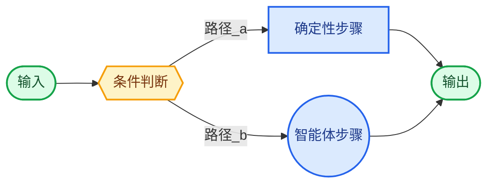
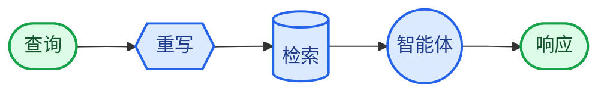

在**自定义工作流**架构中，你可以使用 [LangGraph](/oss/javascript/langgraph/overview) 定义自己的定制化执行流程。你可以完全控制图结构——包括顺序步骤、条件分支、循环和并行执行。



## 主要特点

* 完全控制图结构
* 混合确定性逻辑与智能体行为
* 支持顺序步骤、条件分支、循环和并行执行
* 可将其他模式作为节点嵌入工作流中

## 使用场景

当标准模式（子智能体、技能等）不符合你的需求时，当你需要混合确定性逻辑与智能体行为时，或者你的用例需要复杂路由或多阶段处理时，请使用自定义工作流。

工作流中的每个节点可以是一个简单函数、一个LLM调用，或是一个完整的带有[工具](/oss/javascript/langchain/tools)的[智能体](/oss/javascript/langchain/agents)。你也可以在自定义工作流中组合其他架构——例如，将多智能体系统作为单个节点嵌入。

有关自定义工作流的完整示例，请参阅下面的教程。

<Card
    title="教程：构建具有路由功能的多源知识库"
    icon="book"
    href="/oss/javascript/langchain/multi-agent/router-knowledge-base"
    arrow cta="了解更多"
>
    [路由模式](/oss/javascript/langchain/multi-agent/router)是自定义工作流的一个示例。本教程将逐步指导你构建一个并行查询GitHub、Notion和Slack，然后综合结果的路由器。
</Card>

## 基础实现

核心思路是，你可以在任何LangGraph节点中直接调用LangChain智能体，从而将自定义工作流的灵活性与预构建智能体的便利性结合起来：


```typescript
import { z } from "zod";
import { createAgent } from "langchain";
import { StateGraph, START, END, StateSchema, MessagesValue } from "@langchain/langgraph";

const agent = createAgent({ model: "openai:gpt-4o", tools: [...] });

const AgentState = new StateSchema({
  messages: MessagesValue,
  query: z.string(),
});

const agentNode: GraphNode<typeof AgentState> = (state) => {
  // 一个调用LangChain智能体的LangGraph节点
  const result = await agent.invoke({
    messages: [{ role: "user", content: state.query }]
  });
  return { answer: result.messages.at(-1)?.content };
}

// 构建一个简单的工作流
const workflow = new StateGraph(State)
  .addNode("agent", agentNode)
  .addEdge(START, "agent")
  .addEdge("agent", END)
  .compile();
```


## 示例：RAG管道

一个常见的用例是将[检索](/oss/javascript/langchain/retrieval)与智能体结合。这个示例构建了一个WNBA数据助手，它可以从知识库中检索信息，并能获取实时新闻。

<Accordion title="自定义RAG工作流">

该工作流展示了三种类型的节点：

- **模型节点**（重写）：使用[结构化输出](/oss/javascript/langchain/structured-output)重写用户查询以优化检索。
- **确定性节点**（检索）：执行向量相似性搜索——不涉及LLM。
- **智能体节点**（智能体）：基于检索到的上下文进行推理，并能通过工具获取额外信息。



<Tip>
你可以使用LangGraph状态在工作流步骤之间传递信息。这允许工作流的每个部分读取和更新结构化字段，从而轻松地在节点之间共享数据和上下文。
</Tip>


```typescript
import { StateGraph, Annotation, START, END } from "@langchain/langgraph";
import { createAgent, tool } from "langchain";
import { ChatOpenAI, OpenAIEmbeddings } from "@langchain/openai";
import { MemoryVectorStore } from "@langchain/classic/vectorstores/memory";
import * as z from "zod";

const State = Annotation.Root({
  question: Annotation<string>(),
  rewrittenQuery: Annotation<string>(),
  documents: Annotation<string[]>(),
  answer: Annotation<string>(),
});

// 包含阵容、比赛结果和球员数据的WNBA知识库
const embeddings = new OpenAIEmbeddings();
const vectorStore = await MemoryVectorStore.fromTexts(
  [
    // 阵容
    "New York Liberty 2024 roster: Breanna Stewart, Sabrina Ionescu, Jonquel Jones, Courtney Vandersloot.",
    "Las Vegas Aces 2024 roster: A'ja Wilson, Kelsey Plum, Jackie Young, Chelsea Gray.",
    "Indiana Fever 2024 roster: Caitlin Clark, Aliyah Boston, Kelsey Mitchell, NaLyssa Smith.",
    // 比赛结果
    "2024 WNBA Finals: New York Liberty defeated Minnesota Lynx 3-2 to win the championship.",
    "June 15, 2024: Indiana Fever 85, Chicago Sky 79. Caitlin Clark had 23 points and 8 assists.",
    "August 20, 2024: Las Vegas Aces 92, Phoenix Mercury 84. A'ja Wilson scored 35 points.",
    // 球员数据
    "A'ja Wilson 2024 season stats: 26.9 PPG, 11.9 RPG, 2.6 BPG. Won MVP award.",
    "Caitlin Clark 2024 rookie stats: 19.2 PPG, 8.4 APG, 5.7 RPG. Won Rookie of the Year.",
    "Breanna Stewart 2024 stats: 20.4 PPG, 8.5 RPG, 3.5 APG.",
  ],
  [{}, {}, {}, {}, {}, {}, {}, {}, {}],
  embeddings
);
const retriever = vectorStore.asRetriever({ k: 5 });

const getLatestNews = tool(
  async ({ query }) => {
    // 你的新闻API在这里
    return "Latest: The WNBA announced expanded playoff format for 2025...";
  },
  {
    name: "get_latest_news",
    description: "获取最新的WNBA新闻和更新",
    schema: z.object({ query: z.string() }),
  }
);

const agent = createAgent({
  model: "openai:gpt-4.1",
  tools: [getLatestNews],
});

const model = new ChatOpenAI({ model: "gpt-4.1" });

const RewrittenQuery = z.object({ query: z.string() });

async function rewriteQuery(state: typeof State.State) {
  const systemPrompt = `重写此查询以检索相关的WNBA信息。
知识库包含：球队阵容、带比分的比赛结果和球员统计数据（PPG、RPG、APG）。
重点关注提到的具体球员姓名、球队名称或统计类别。`;
  const response = await model.withStructuredOutput(RewrittenQuery).invoke([
    { role: "system", content: systemPrompt },
    { role: "user", content: state.question },
  ]);
  return { rewrittenQuery: response.query };
}

async function retrieve(state: typeof State.State) {
  const docs = await retriever.invoke(state.rewrittenQuery);
  return { documents: docs.map((doc) => doc.pageContent) };
}

async function callAgent(state: typeof State.State) {
  const context = state.documents.join("\n\n");
  const prompt = `Context:\n${context}\n\nQuestion: ${state.question}`;
  const response = await agent.invoke({
    messages: [{ role: "user", content: prompt }],
  });
  return { answer: response.messages.at(-1)?.contentBlocks };
}

const workflow = new StateGraph(State)
  .addNode("rewrite", rewriteQuery)
  .addNode("retrieve", retrieve)
  .addNode("agent", callAgent)
  .addEdge(START, "rewrite")
  .addEdge("rewrite", "retrieve")
  .addEdge("retrieve", "agent")
  .addEdge("agent", END)
  .compile();

const result = await workflow.invoke({
  question: "Who won the 2024 WNBA Championship?",
});
console.log(result.answer);
```


</Accordion>

---

<div className="source-links">
<Callout icon="edit">
    [Edit this page on GitHub](https://github.com/langchain-ai/docs/edit/main/src/i18n\zh-CN\oss\langchain\multi-agent\custom-workflow.mdx) or [file an issue](https://github.com/langchain-ai/docs/issues/new/choose).
</Callout>
<Callout icon="terminal-2">
    [Connect these docs](/use-these-docs) to Claude, VSCode, and more via MCP for real-time answers.
</Callout>
</div>
