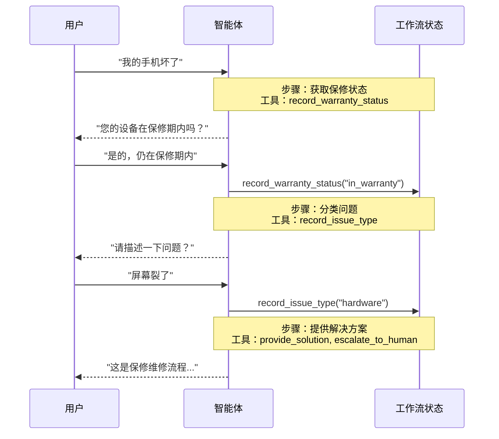

在**交接模式**架构中，行为会根据状态动态变化。其核心机制是：[工具](/oss/javascript/langchain/tools)更新一个跨轮次持久化的状态变量（例如 `current_step` 或 `active_agent`），系统读取此变量以调整行为——要么应用不同的配置（系统提示词、工具），要么路由到不同的[智能体](/oss/javascript/langchain/agents)。此模式既支持不同智能体之间的交接，也支持单个智能体内部的动态配置变更。

<Tip>
**交接模式**一词由 [OpenAI](https://openai.github.io/openai-agents-python/handoffs/) 提出，用于描述使用工具调用（例如 `transfer_to_sales_agent`）在智能体或状态之间转移控制权。
</Tip>



## 核心特性

* 状态驱动行为：行为基于状态变量（例如 `current_step` 或 `active_agent`）变化
* 基于工具的转移：工具更新状态变量以在不同状态间移动
* 直接用户交互：每个状态的配置直接处理用户消息
* 持久化状态：状态在对话轮次间持续存在

## 适用场景

当您需要强制执行顺序约束（仅在满足前提条件后解锁功能）、智能体需要在不同状态下直接与用户对话，或者您正在构建多阶段对话流程时，请使用交接模式。此模式对于需要按特定顺序收集信息的客户支持场景尤其有价值——例如，在处理退款前先收集保修ID。

## 基础实现

核心机制是一个返回 [`Command`](/oss/javascript/langgraph/graph-api#command) 来更新状态的[工具](/oss/javascript/langchain/tools)，从而触发向新步骤或智能体的转移：


```typescript
import { tool, ToolMessage, type ToolRuntime } from "langchain";
import { Command } from "@langchain/langgraph";
import { z } from "zod";

const transferToSpecialist = tool(
  async (_, config: ToolRuntime<typeof StateSchema>) => {
    return new Command({
      update: {
        messages: [
          new ToolMessage({  // [!code highlight]
            content: "已转移到专家",
            tool_call_id: config.toolCallId  // [!code highlight]
          })
        ],
        currentStep: "specialist"  // 触发行为变更
      }
    });
  },
  {
    name: "transfer_to_specialist",
    description: "转移到专家智能体。",
    schema: z.object({})
  }
);
```


<Note>
**为什么包含 `ToolMessage`？** 当LLM调用工具时，它期望得到响应。带有匹配 `tool_call_id` 的 `ToolMessage` 完成了这个请求-响应循环——没有它，对话历史将变得格式错误。每当您的交接工具更新消息时，这都是必需的。
</Note>

完整实现请参见下面的教程。

<Card
    title="教程：使用交接模式构建客户支持"
    icon="users"
    href="/oss/javascript/langchain/multi-agent/handoffs-customer-support"
    arrow cta="了解更多"
>
    学习如何使用交接模式构建客户支持智能体，其中单个智能体在不同配置之间转换。
</Card>

## 实现方法

有两种实现交接的方式：**[带中间件的单智能体](#带中间件的单智能体)**（一个具有动态配置的智能体）或**[多智能体子图](#多智能体子图)**（作为图节点的不同智能体）。

### 带中间件的单智能体

单个智能体根据状态改变其行为。中间件拦截每个模型调用，并动态调整系统提示词和可用工具。工具更新状态变量以触发转移：


```typescript
import { tool, ToolMessage, type ToolRuntime } from "langchain";
import { Command } from "@langchain/langgraph";
import { z } from "zod";

const recordWarrantyStatus = tool(
  async ({ status }, config: ToolRuntime<typeof StateSchema>) => {
    return new Command({
      update: {
        messages: [
          new ToolMessage({
            content: `保修状态已记录：${status}`,
            tool_call_id: config.toolCallId,
          }),
        ],
        warrantyStatus: status,
        currentStep: "specialist", // 更新状态以触发转移
      },
    });
  },
  {
    name: "record_warranty_status",
    description: "记录保修状态并转移到下一步。",
    schema: z.object({
      status: z.string(),
    }),
  }
);
```


<Accordion title="完整示例：使用中间件的客户支持">


```typescript
import {
  createAgent,
  createMiddleware,
  tool,
  ToolMessage,
  type ToolRuntime,
} from "langchain";
import { Command, MemorySaver, StateSchema } from "@langchain/langgraph";
import { z } from "zod";

// 1. 定义带有 currentStep 跟踪器的状态
const SupportState = new StateSchema({ // [!code highlight]
  currentStep: z.string().default("triage"), // [!code highlight]
  warrantyStatus: z.string().optional(),
});

// 2. 工具通过 Command 更新 currentStep
const recordWarrantyStatus = tool(
  async ({ status }, config: ToolRuntime<typeof SupportState.State>) => {
    return new Command({ // [!code highlight]
      update: { // [!code highlight]
        messages: [ // [!code highlight]
          new ToolMessage({
            content: `保修状态已记录：${status}`,
            tool_call_id: config.toolCallId,
          }),
        ],
        warrantyStatus: status,
        // 转移到下一步
        currentStep: "specialist", // [!code highlight]
      },
    });
  },
  {
    name: "record_warranty_status",
    description: "记录保修状态并转移",
    schema: z.object({ status: z.string() }),
  }
);

// 3. 中间件根据 currentStep 应用动态配置
const applyStepConfig = createMiddleware({
  name: "applyStepConfig",
  stateSchema: SupportState, // [!code highlight]
  wrapModelCall: async (request, handler) => {
    const step = request.state.currentStep || "triage"; // [!code highlight]

    // 将步骤映射到其配置
    const configs = {
      triage: {
        prompt: "收集保修信息...",
        tools: [recordWarrantyStatus],
      },
      specialist: {
        prompt: `根据保修状态提供解决方案：${request.state.warrantyStatus}`,
        tools: [provideSolution, escalate],
      },
    };

    const config = configs[step as keyof typeof configs];
    return handler({
      ...request,
      systemPrompt: config.prompt,
      tools: config.tools,
    });
  },
});

// 4. 创建带有中间件的智能体
const agent = createAgent({
  model,
  tools: [recordWarrantyStatus, provideSolution, escalate],
  middleware: [applyStepConfig], // [!code highlight]
  checkpointer: new MemorySaver(), // 跨轮次持久化状态  // [!code highlight]
});
```


</Accordion>

### 多智能体子图

多个不同的智能体作为单独的节点存在于图中。交接工具使用 `Command.PARENT` 指定接下来要执行的节点，从而在智能体节点之间导航。

<Warning>
子图交接需要仔细的**[上下文工程](/oss/javascript/langchain/context-engineering)**。与单智能体中间件（消息历史自然流动）不同，您必须明确决定哪些消息在智能体之间传递。如果处理不当，智能体将收到格式错误的对话历史或臃肿的上下文。请参见下面的[上下文工程](#上下文工程)。
</Warning>


```typescript
import {
  tool,
  ToolMessage,
  AIMessage,
  type ToolRuntime,
} from "langchain";
import { Command, StateSchema, MessagesValue } from "@langchain/langgraph";

const CustomState = new StateSchema({
  messages: MessagesValue,
});

const transferToSales = tool(
  async (_, runtime: ToolRuntime<typeof CustomState.State>) => {
    const lastAiMessage = runtime.state.messages // [!code highlight]
      .reverse() // [!code highlight]
      .find(AIMessage.isInstance); // [!code highlight]

    const transferMessage = new ToolMessage({ // [!code highlight]
      content: "已转移到销售智能体", // [!code highlight]
      tool_call_id: runtime.toolCallId, // [!code highlight]
    }); // [!code highlight]
    return new Command({
      goto: "sales_agent",
      update: {
        activeAgent: "sales_agent",
        messages: [lastAiMessage, transferMessage].filter(Boolean), // [!code highlight]
      },
      graph: Command.PARENT,
    });
  },
  {
    name: "transfer_to_sales",
    description: "转移到销售智能体。",
    schema: z.object({}),
  }
);
```


<Accordion title="完整示例：带交接的销售与支持">

此示例展示了一个包含独立销售和支持智能体的多智能体系统。每个智能体都是一个独立的图节点，交接工具允许智能体将会话转移给对方。


```typescript
import {
  StateGraph,
  START,
  END,
  StateSchema,
  MessagesValue,
  Command,
  ConditionalEdgeRouter,
  GraphNode,
} from "@langchain/langgraph";
import { createAgent, AIMessage, ToolMessage } from "langchain";
import { tool, ToolRuntime } from "@langchain/core/tools";
import { z } from "zod/v4";

// 1. 定义带有 activeAgent 跟踪器的状态
const MultiAgentState = new StateSchema({
  messages: MessagesValue,
  activeAgent: z.string().optional(),
});

// 2. 创建交接工具
const transferToSales = tool(
  async (_, runtime: ToolRuntime<typeof MultiAgentState.State>) => {
    const lastAiMessage = [...runtime.state.messages] // [!code highlight]
      .reverse() // [!code highlight]
      .find(AIMessage.isInstance); // [!code highlight]
    const transferMessage = new ToolMessage({ // [!code highlight]
      content: "从支持智能体转移到销售智能体", // [!code highlight]
      tool_call_id: runtime.toolCallId, // [!code highlight]
    }); // [!code highlight]
    return new Command({
      goto: "sales_agent",
      update: {
        activeAgent: "sales_agent",
        messages: [lastAiMessage, transferMessage].filter(Boolean), // [!code highlight]
      },
      graph: Command.PARENT,
    });
  },
  {
    name: "transfer_to_sales",
    description: "转移到销售智能体。",
    schema: z.object({}),
  }
);

const transferToSupport = tool(
  async (_, runtime: ToolRuntime<typeof MultiAgentState.State>) => {
    const lastAiMessage = [...runtime.state.messages] // [!code highlight]
      .reverse() // [!code highlight]
      .find(AIMessage.isInstance); // [!code highlight]
    const transferMessage = new ToolMessage({ // [!code highlight]
      content: "从销售智能体转移到支持智能体", // [!code highlight]
      tool_call_id: runtime.toolCallId, // [!code highlight]
    }); // [!code highlight]
    return new Command({
      goto: "support_agent",
      update: {
        activeAgent: "support_agent",
        messages: [lastAiMessage, transferMessage].filter(Boolean), // [!code highlight]
      },
      graph: Command.PARENT,
    });
  },
  {
    name: "transfer_to_support",
    description: "转移到支持智能体。",
    schema: z.object({}),
  }
);

// 3. 创建带有交接工具的智能体
const salesAgent = createAgent({
  model: "anthropic:claude-sonnet-4-20250514",
  tools: [transferToSupport],
  systemPrompt:
    "您是销售智能体。帮助处理销售咨询。如果被问及技术问题或支持，请转移到支持智能体。",
});

const supportAgent = createAgent({
  model: "anthropic:claude-sonnet-4-20250514",
  tools: [transferToSales],
  systemPrompt:
    "您是支持智能体。帮助处理技术问题。如果被问及定价或购买，请转移到销售智能体。",
});

// 4. 创建调用智能体的智能体节点
const callSalesAgent: GraphNode<typeof MultiAgentState.State> = async (state) => {
  const response = await salesAgent.invoke(state);
  return response;
};

const callSupportAgent: GraphNode<typeof MultiAgentState.State> = async (state) => {
  const response = await supportAgent.invoke(state);
  return response;
};

// 5. 创建检查是否应该结束或继续的路由器
const routeAfterAgent: ConditionalEdgeRouter<
  typeof MultiAgentState.State,
  "sales_agent" | "support_agent"
> = (state) => {
  const messages = state.messages ?? [];

  // 检查最后一条消息 - 如果是没有工具调用的 AIMessage，则完成
  if (messages.length > 0) {
    const lastMsg = messages[messages.length - 1];
    if (lastMsg instanceof AIMessage && !lastMsg.tool_calls?.length) { // [!code highlight]
      return END; // [!code highlight]
    } // [!code highlight]
  }

  // 否则路由到活跃智能体
  const active = state.activeAgent ?? "sales_agent";
  return active as "sales_agent" | "support_agent";
};

const routeInitial: ConditionalEdgeRouter<
  typeof MultiAgentState.State,
  "sales_agent" | "support_agent"
> = (state) => {
  // 根据状态路由到活跃智能体，默认为销售智能体
  return (state.activeAgent ?? "sales_agent") as
    | "sales_agent"
    | "support_agent";
};

// 6. 构建图
const builder = new StateGraph(MultiAgentState)
  .addNode("sales_agent", callSalesAgent)
  .addNode("support_agent", callSupportAgent);
  // 基于初始 activeAgent 进行条件路由开始
  .addConditionalEdges(START, routeInitial, [
    "sales_agent",
    "support_agent",
  ])
  // 在每个智能体之后，检查是否应该结束或路由到另一个智能体
  .addConditionalEdges("sales_agent", routeAfterAgent, [
    "sales_agent",
    "support_agent",
    END,
  ]);
  builder.addConditionalEdges("support_agent", routeAfterAgent, [
    "sales_agent",
    "support_agent",
    END,
  ]);

const graph = builder.compile();
const result = await graph.invoke({
  messages: [
    {
      role: "user",
      content: "你好，我的账户登录遇到问题。你能帮忙吗？",
    },
  ],
});

for (const msg of result.messages) {
  console.log(msg.content);
}
```


</Accordion>

<Tip>
对于大多数交接用例，请使用**带中间件的单智能体**——它更简单。仅当您需要定制的智能体实现（例如，节点本身是一个包含反思或检索步骤的复杂图）时，才使用**多智能体子图**。
</Tip>

#### 上下文工程

使用子图交接时，您可以精确控制哪些消息在智能体之间流动。这种精确性对于维护有效的对话历史和避免可能混淆下游智能体的上下文膨胀至关重要。有关此主题的更多信息，请参见[上下文工程](/oss/javascript/langchain/context-engineering)。

**交接期间处理上下文**

在智能体之间交接时，您需要确保对话历史保持有效。LLM期望工具调用与其响应配对，因此当使用 `Command.PARENT` 将控制权移交给另一个智能体时，必须同时包含：

1. **包含工具调用的 `AIMessage`**（触发交接的消息）
2. **确认交接的 `ToolMessage`**（对该工具调用的人工响应）

没有这种配对，接收智能体将看到不完整的对话，并可能产生错误或意外行为。

下面的示例假设只调用了交接工具（没有并行工具调用）：


```typescript
const transferToSales = tool(
  async (_, runtime: ToolRuntime<typeof MultiAgentState.State>) => {
    // 获取触发此交接的 AI 消息
    const lastAiMessage = runtime.state.messages.at(-1);

    // 创建人工工具响应以完成配对
    const transferMessage = new ToolMessage({
      content: "已转移到销售智能体",
      tool_call_id: runtime.toolCallId,
    });

    return new Command({
      goto: "sales_agent",
      update: {
        activeAgent: "sales_agent",
        // 仅传递这两条消息，而不是完整的子智能体历史
        messages: [lastAiMessage, transferMessage],
      },
      graph: Command.PARENT,
    });
  },
  {
    name: "transfer_to_sales",
    description: "转移到销售智能体。",
    schema: z.object({}),
  }
);
```


<Note>
**为什么不传递所有子智能体消息？** 虽然您可以在交接中包含完整的子智能体对话，但这通常会产生问题。接收智能体可能会因不相关的内部推理而困惑，并且令牌成本会不必要地增加。通过仅传递交接配对，您可以将父图的上下文集中在高级协调上。如果接收智能体需要额外的上下文，请考虑在 ToolMessage 内容中总结子智能体的工作，而不是传递原始消息历史。
</Note>

**将控制权返回给用户**

当将控制权返回给用户（结束智能体的轮次）时，请确保最后一条消息是 `AIMessage`。这可以维护有效的对话历史，并向用户界面发出智能体已完成其工作的信号。

## 实现注意事项

在设计多智能体系统时，请考虑：

* **上下文过滤策略**：每个智能体将接收完整的对话历史、过滤部分还是摘要？根据其角色，不同的智能体可能需要不同的上下文。
* **工具语义**：明确交接工具是仅更新路由状态，还是也执行副作用。例如，`transfer_to_sales()` 是否也应该创建支持工单，或者这应该是一个单独的操作？
* **令牌效率**：平衡上下文完整性与令牌成本。随着对话变长，摘要和选择性上下文传递变得更加重要。

---

<div className="source-links">
<Callout icon="edit">
    [Edit this page on GitHub](https://github.com/langchain-ai/docs/edit/main/src/i18n\zh-CN\oss\langchain\multi-agent\handoffs.mdx) or [file an issue](https://github.com/langchain-ai/docs/issues/new/choose).
</Callout>
<Callout icon="terminal-2">
    [Connect these docs](/use-these-docs) to Claude, VSCode, and more via MCP for real-time answers.
</Callout>
</div>
