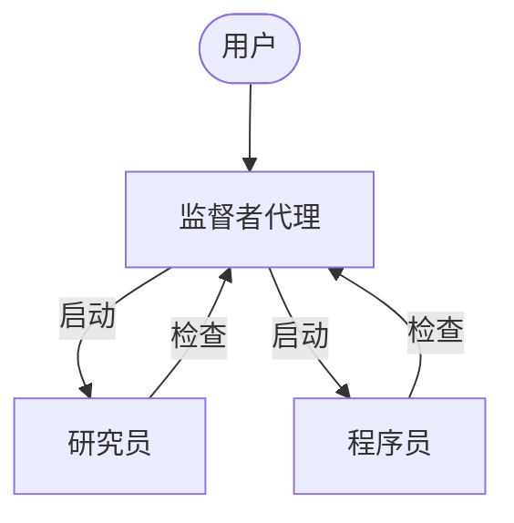
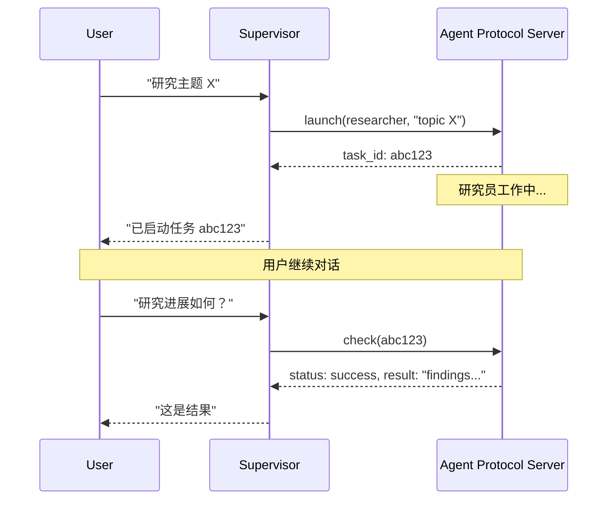

异步子代理允许监督者代理启动后台任务并立即返回，这样监督者可以在子代理并发工作的同时继续与用户交互。监督者可以随时检查进度、发送后续指令或取消任务。

此功能基于[子代理](/oss/python/deepagents/subagents)构建，后者是同步运行的，会阻塞监督者直到任务完成。当任务需要长时间运行、可并行化或需要中途调整时，请使用异步子代理。

<Warning>
异步子代理是面向 `deepagents` 0.5.0 的预览功能。您可以通过安装预发布版本立即试用。预览功能正在积极开发中，不建议在生产环境中使用。

对于 Python，使用 `--pre` 或 `--allow-prereleases` 安装 `0.5.0a1` 预发布版本。


</Warning>



<Note>
异步子代理可与任何实现 [Agent Protocol](https://github.com/langchain-ai/agent-protocol) 的服务器通信。您可以使用 [LangSmith Deployments](/langsmith/deployment)，或自托管任何兼容 Agent Protocol 的服务器。每个子代理独立于监督者运行，监督者通过 SDK 控制它们进行启动、检查、更新和取消操作。
</Note>

## 何时使用异步子代理

| 维度               | 同步子代理                                                  | 异步子代理                                                   |
|--------------------|-------------------------------------------------------------|-------------------------------------------------------------|
| **执行模型**       | 监督者阻塞直到子代理完成                                    | 立即返回任务 ID；监督者继续运行                              |
| **并发性**         | 并行但阻塞                                                  | 并行且非阻塞                                                |
| **任务中途更新**   | 不可能                                                      | 通过 `update_async_task` 发送后续指令                    |
| **取消功能**       | 不可能                                                      | 通过 `cancel_async_task` 取消运行中的任务               |
| **状态保持**       | 无状态——调用之间没有持久状态                                | 有状态——在自己的线程上跨交互保持状态                        |
| **最适合**         | 代理应在继续前等待结果的任务                                | 长时间运行、复杂的任务，在聊天中交互式管理                   |

## 配置异步子代理

将异步子代理定义为 [`AsyncSubAgent`](https://reference.langchain.com/python/deepagents/middleware/async_subagents/AsyncSubAgent) 规范列表，每个规范指向一个 Agent Protocol 服务器：

```python
from deepagents import AsyncSubAgent, create_deep_agent

async_subagents = [
    AsyncSubAgent(
        name="researcher",
        description="用于信息收集和综合的研究代理",
        graph_id="researcher",
        # 无 url → ASGI 传输（在同一部署中共置）
    ),
    AsyncSubAgent(
        name="coder",
        description="用于代码生成和审查的编程代理",
        graph_id="coder",
        # url="https://coder-deployment.langsmith.dev"  # 可选：用于远程的 HTTP 传输
    ),
]

agent = create_deep_agent(
    model="claude-sonnet-4-6",
    subagents=async_subagents,
)
```

| 字段 | 类型 | 描述 |
|-------|------|-------------|
| `name` | `str` | 必需。唯一标识符。监督者在启动任务时使用此名称。 |
| `description` | `str` | 必需。此子代理的功能。监督者使用此描述来决定委托给哪个代理。 |
| `graph_id` | `str` | 必需。Agent Protocol 服务器上的图 ID（或助手 ID）。对于基于 LangGraph 的部署，必须与 `langgraph.json` 中注册的图匹配。 |
| `url` | `str` | 可选。省略时使用 ASGI 传输（进程内）。设置时使用 HTTP 传输连接到远程 Agent Protocol 服务器。 |
| `headers` | `dict[str, str]` | 可选。发送到远程服务器的额外请求头。用于自托管 Agent Protocol 服务器的自定义身份验证。 |


对于基于 LangGraph 的部署，在共置设置中，将所有图注册到同一个 `langgraph.json`：

```json
{
  "graphs": {
    "supervisor": "./src/supervisor.py:graph",
    "researcher": "./src/researcher.py:graph",
    "coder": "./src/coder.py:graph"
  }
}
```

## 使用异步子代理工具

[`AsyncSubAgentMiddleware`](https://reference.langchain.com/python/deepagents/middleware/async_subagents/AsyncSubAgentMiddleware) 为监督者提供五个工具：

| 工具 | 用途 | 返回内容 |
|------|---------|---------|
| `start_async_task` | 启动新的后台任务 | 任务 ID（立即返回） |
| `check_async_task` | 获取任务的当前状态和结果 | 状态 + 结果（如果完成） |
| `update_async_task` | 向运行中的任务发送新指令 | 确认 + 更新后的状态 |
| `cancel_async_task` | 停止运行中的任务 | 确认 |
| `list_async_tasks` | 列出所有跟踪的任务及其实时状态 | 所有任务的摘要 |

监督者的 LLM 像调用其他工具一样调用这些工具。中间件自动处理线程创建、运行管理和状态持久化。

### 理解生命周期

典型的交互遵循以下顺序：



- **启动** 在服务器上创建一个新线程，以任务描述作为输入启动运行，并将线程 ID 作为任务 ID 返回。监督者将此 ID 报告给用户，并且不会轮询完成状态。
- **检查** 获取当前运行状态。如果运行成功，则检索线程状态以提取子代理的最终输出。如果仍在运行，则向用户报告该状态。
- **更新** 在同一线程上使用中断多任务策略创建新运行。先前的运行被中断，子代理重新启动，使用完整的对话历史加上新指令。任务 ID 保持不变。
- **取消** 在服务器上调用 `runs.cancel()` 并将任务标记为 `"cancelled"`。
- **列出** 遍历所有跟踪的任务。对于非终止状态的任务，它并行从服务器获取实时状态。终止状态（`success`、`error`、`cancelled`）从缓存中返回。

## 理解状态管理

任务元数据存储在监督者图上的专用状态通道（`async_tasks`）中，与消息历史记录分开。这至关重要，因为深度代理在上下文窗口填满时会[压缩其消息历史记录](/oss/python/deepagents/customization#summarization)——如果任务 ID 仅存在于工具消息中，它们将在压缩过程中丢失。专用通道确保监督者始终可以通过 `list_async_tasks` 回忆起其任务，即使在多次摘要轮次之后。

每个跟踪的任务记录任务 ID、代理名称、线程 ID、运行 ID、状态和时间戳（`created_at`、`last_checked_at`、`last_updated_at`）。


## 选择传输方式

### ASGI 传输（共置）

当子代理规范省略 `url` 字段时，LangGraph SDK 使用 ASGI 传输——SDK 调用通过进程内函数调用路由，而不是 HTTP。对于基于 LangGraph 的部署，这要求两个图都注册在同一个 `langgraph.json` 中。

ASGI 传输消除了网络延迟，并且不需要额外的身份验证配置。子代理仍然作为具有自己状态的独立线程运行。这是推荐的默认设置。

### HTTP 传输（远程）

添加 `url` 字段以切换到 HTTP 传输，其中 SDK 调用通过网络发送到远程 Agent Protocol 服务器：

```python
AsyncSubAgent(
    name="researcher",
    description="研究代理",
    graph_id="researcher",
    url="https://my-research-deployment.langsmith.dev",
)
```


对于 LangGraph 部署，身份验证由 LangGraph SDK 使用环境变量中的 `LANGSMITH_API_KEY`（或 `LANGGRAPH_API_KEY`）处理。自托管的 Agent Protocol 服务器可能使用不同的身份验证机制。

当子代理需要独立扩展、不同的资源配置或由不同团队维护时，请使用 HTTP 传输。

## 选择部署拓扑

### 单一部署

单一部署意味着所有代理都使用 ASGI 传输共置在同一服务器上。对于基于 LangGraph 的部署，将所有图注册到一个 `langgraph.json` 中。这是推荐的起点——一个服务器管理，代理之间零网络延迟。

### 拆分部署

监督者在一个服务器上，子代理通过 HTTP 传输在另一个服务器上。当子代理需要不同的计算配置或独立扩展时使用。

### 混合部署

在拆分部署中，监督者在一个服务器上，子代理通过 HTTP 传输在另一个服务器上。当子代理需要不同的计算配置或独立扩展时使用。

### 混合部署

在混合部署中，一些子代理通过 ASGI 共置，其他通过 HTTP 远程：

```python
async_subagents = [
    AsyncSubAgent(
        name="researcher",
        description="研究代理",
        graph_id="researcher",
        # 无 url → ASGI（共置）
    ),
    AsyncSubAgent(
        name="coder",
        description="编程代理",
        graph_id="coder",
        url="https://coder-deployment.langsmith.dev",
        # 有 url → HTTP（远程）
    ),
]
```


## 最佳实践

### 为本地开发调整工作池大小

在使用 `langgraph dev` 本地运行时，增加工作池以适应并发的子代理运行。每个活动运行占用一个工作槽。具有 3 个并发子代理任务的监督者需要 4 个槽（1 个监督者 + 3 个子代理）。配置不足会导致启动排队。

```bash
langgraph dev --n-jobs-per-worker 10
```

### 编写清晰的子代理描述

监督者使用描述来决定启动哪个子代理。要具体且以行动为导向：

```python
# 良好
AsyncSubAgent(
    name="researcher",
    description="使用网络搜索进行深入研究。适用于需要多次搜索和综合的问题。",
    graph_id="researcher",
)

# 不佳
AsyncSubAgent(
    name="helper",
    description="帮助处理事务",
    graph_id="helper",
)
```


### 使用线程 ID 进行追踪

在使用基于 LangGraph 的部署时，每个异步子代理运行都是标准的 LangGraph 运行，在 LangSmith 中完全可见。监督者的追踪显示 `launch`、`check`、`update`、`cancel` 和 `list` 的工具调用。每个子代理运行作为单独的追踪出现，通过线程 ID 链接。使用线程 ID（任务 ID）将监督者编排追踪与子代理执行追踪关联起来。

## 故障排除

### 监督者在启动后立即轮询

**问题**：监督者在启动后立即循环调用 `check`，将异步执行变为阻塞。

**解决方案**：中间件注入系统提示规则以防止这种情况。如果轮询持续存在，请在监督者的系统提示中强化此行为：

```python
agent = create_deep_agent(
    model="claude-sonnet-4-6",
    system_prompt="""...您的指令...

    启动异步子代理后，始终将控制权返回给用户。
    切勿在启动后立即调用 check_async_task。""",
    subagents=async_subagents,
)
```


### 监督者报告过时状态

**问题**：监督者引用对话历史中较早的任务状态，而不是进行新的 `check` 调用。

**解决方案**：中间件提示指示模型“对话历史中的任务状态总是过时的”。如果仍然发生，请添加显式指令，要求在报告状态之前始终调用 `check` 或 `list`。

### 任务 ID 查找失败

**问题**：监督者截断或重新格式化任务 ID，导致 `check` 或 `cancel` 失败。

**解决方案**：中间件提示指示模型始终使用完整的任务 ID。如果截断持续存在，这通常是模型特定的问题——尝试不同的模型或在系统提示中添加“始终显示完整的 task_id，切勿截断或缩写”。

### 子代理启动排队而不是运行

**问题**：启动子代理挂起或需要很长时间才能开始。

**解决方案**：工作池可能已耗尽。使用 `--n-jobs-per-worker` 增加池大小。请参阅[为本地开发调整工作池大小](#size-the-worker-pool)。

## 参考实现

[async-deep-agents](https://github.com/langchain-ai/async-deep-agents) 仓库包含 Python 和 TypeScript 的工作示例，可部署到 LangSmith Deployments。它演示了具有研究员和程序员子代理作为后台任务运行的监督者。

---

<div className="source-links">
<Callout icon="edit">
    [Edit this page on GitHub](https://github.com/langchain-ai/docs/edit/main/src/i18n\zh-CN\oss\deepagents\async-subagents.mdx) or [file an issue](https://github.com/langchain-ai/docs/issues/new/choose).
</Callout>
<Callout icon="terminal-2">
    [Connect these docs](/use-these-docs) to Claude, VSCode, and more via MCP for real-time answers.
</Callout>
</div>
