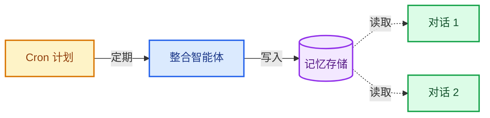
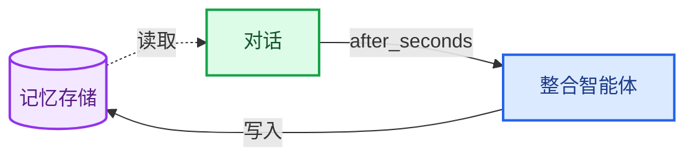

记忆功能让你的智能体能够在多次对话中学习与改进。Deep Agents 将记忆作为一等公民，提供基于文件系统的记忆机制：智能体以文件形式读写记忆，你可以通过[后端](/oss/python/deepagents/backends)控制这些文件的存储位置。

<Note>
本页介绍的是**长期记忆**：跨对话持久保存的记忆。关于短期记忆（单次会话内的对话历史和临时文件），请参阅[上下文工程](/oss/python/deepagents/context-engineering)指南。短期记忆作为智能体[状态](/oss/python/langgraph/graph-api#state)的一部分自动管理。
</Note>

## 记忆工作原理

1. **为智能体指定记忆文件路径**：创建智能体时，通过 `memory=` 参数传递文件路径。[后端](/oss/python/deepagents/backends)控制这些文件的存储位置和访问权限。
2. **智能体在启动时加载记忆**：每次对话开始时，智能体将记忆文件内容读入系统提示词。
3. **智能体在对话过程中更新记忆**：当智能体学习到新信息时，会使用内置的 `edit_file` 工具更新记忆文件。更改会被持久化，并在下次对话中可用。

两种最常见的模式是[智能体作用域记忆](#智能体作用域记忆)（所有用户共享）和[用户作用域记忆](#用户作用域记忆)（按用户隔离）。

## 智能体作用域记忆

为智能体提供一个共享的记忆文件，所有用户都可以读取和写入。随着智能体在每次对话中积累知识，它会随时间不断改进。当拥有写入权限时，它还可以学习和更新[技能](/oss/python/deepagents/skills)。参见[技能作为程序性记忆](#技能作为程序性记忆)。

关键在于后端命名空间：将其设置为 `(assistant_id,)` 意味着该智能体的每次对话都读写同一个记忆文件。

```python
from deepagents import create_deep_agent
from deepagents.backends import CompositeBackend, StateBackend, StoreBackend
from langgraph.config import get_config

agent = create_deep_agent(
    memory=["/memories/AGENTS.md"],
    backend=CompositeBackend(
        default=StateBackend(),
        routes={
            "/memories/": StoreBackend(
                namespace=lambda ctx: (
                    get_config()["metadata"]["assistant_id"],
                ),
            ),
        },
    ),
)
```


## 用户作用域记忆

为每个用户提供其专属的记忆文件。智能体可以记住每位用户的偏好、上下文和历史记录，而核心智能体指令保持不变。如果存储在用户作用域的后端中，用户还可以拥有专属的[技能](/oss/python/deepagents/skills)。

命名空间使用 `(user_id,)`，因此每个用户都获得一个隔离的记忆文件副本。用户 A 的偏好永远不会泄露到用户 B 的对话中。

```python
from deepagents import create_deep_agent
from deepagents.backends import CompositeBackend, StateBackend, StoreBackend

agent = create_deep_agent(
    memory=["/memories/preferences.md"],
    backend=CompositeBackend(
        default=StateBackend(),
        routes={
            "/memories/": StoreBackend(
                namespace=lambda ctx: (ctx.runtime.context.user_id,),
            ),
        },
    ),
)
```


## 高级用法

以上部分涵盖了基础知识：配置记忆路径、选择作用域，然后让智能体处理其余部分。本节介绍更高级的模式。

| 维度 | 它回答的问题 | 选项 |
|---|---|---|
| **持续时间** | 记忆持续多久？ | [短期](/oss/python/deepagents/context-engineering)（单次对话）或[长期](#快速开始)（跨对话） |
| **信息类型** | 存储什么类型的信息？ | [情景记忆](#情景记忆)（过往经历）、[程序性记忆](#技能作为程序性记忆)（指令和技能）或[语义记忆](/oss/python/concepts/memory#语义记忆)（事实） |
| **作用域** | 谁可以查看和修改？ | [用户](#用户作用域记忆)、[智能体](#智能体作用域记忆)或[组织](#组织级记忆) |
| **更新策略** | 记忆何时写入？ | 对话期间（默认）或[对话之间](#后台整合) |
| **检索方式** | 记忆如何读取？ | 加载到提示词中（默认）或按需检索（例如，[技能](#技能作为程序性记忆)） |
| **智能体权限** | 智能体可以写入记忆吗？ | [读写](#只读与可写记忆)（默认）或[只读](#只读与可写记忆)（用于共享策略） |

### 情景记忆

情景记忆存储过去经历的记录：发生了什么、顺序如何以及结果是什么。与语义记忆（存储在 `AGENTS.md` 等文件中的事实和偏好）不同，情景记忆保留了完整的对话上下文，使智能体能够回忆*如何*解决问题，而不仅仅是*从中学到了什么*。

Deep Agents 通过[检查点](/oss/python/langgraph/persistence#检查点)免费获得情景记忆：每次对话都作为检查点线程持久保存。为了使过去的对话可搜索，可以将线程搜索包装在一个工具中。`user_id` 从运行时上下文中获取，而不是作为参数传递：

```python
from langgraph_sdk import get_client
from langchain.tools import tool
from langgraph.config import get_config

client = get_client(url="<DEPLOYMENT_URL>")


@tool
async def search_past_conversations(query: str) -> str:
    """搜索过去的对话以获取相关上下文。"""
    config = get_config()
    user_id = config["metadata"]["user_id"]
    threads = await client.threads.search(
        metadata={"user_id": user_id},
        limit=5,
    )
    results = []
    for thread in threads:
        history = await client.threads.get_history(thread_id=thread["thread_id"])
        results.append(history)
    return str(results)
```


你可以通过调整元数据过滤器来按用户或组织限定线程搜索范围：

```python
# 搜索特定用户的对话
threads = await client.threads.search(
    metadata={"user_id": user_id},
    limit=5,
)

# 搜索整个组织的对话
threads = await client.threads.search(
    metadata={"org_id": org_id},
    limit=5,
)
```


这对于执行复杂、多步骤任务的智能体非常有用。例如，一个编码智能体可以回顾过去的调试会话，直接跳转到可能的根本原因。

### 技能作为程序性记忆

[技能](/oss/python/deepagents/skills)是[程序性记忆](/oss/python/concepts/memory#程序性记忆)的一种形式：可重用的指令，告诉智能体*如何*执行任务。与语义记忆（事实）或情景记忆（经历）不同，程序性记忆编码了智能体可以按需应用的逐步能力。

技能可以是：
- **只读**（开发者定义）：开发者编写技能，智能体使用它们但不能修改。这是最常见的模式。
- **读写**（智能体学习）：智能体根据经验创建和更新技能。当智能体拥有记忆的写入权限时，它也可以写入其技能目录。使用[策略钩子](/oss/python/deepagents/backends#添加策略钩子)来控制哪些路径可写。

技能通常是**智能体作用域**的（所有用户共享），但如果存储在用户命名空间的后端中，也可以是用户作用域的。

在 Deep Agents 中，通过 `skills=` 参数传递技能。技能是按需加载的，而不是注入到每个提示词中，从而在需要能力之前保持上下文简洁：

```python
from deepagents import create_deep_agent

agent = create_deep_agent(
    memory=["/memories/AGENTS.md"],
    skills=["/skills/"],
    # ...后端配置
)
```


有关定义、组织和使用技能的完整指南，请参阅[技能](/oss/python/deepagents/skills)文档。

### 组织级记忆

组织级记忆遵循与用户作用域记忆相同的模式，但使用共享命名空间而不是每个用户的命名空间。将其用于应适用于所有用户和智能体的策略或知识。

组织记忆通常是**只读**的，以防止通过共享状态进行提示词注入。有关详细信息，请参阅[只读与可写记忆](#只读与可写记忆)。

```python
from deepagents import create_deep_agent
from deepagents.backends import CompositeBackend, StateBackend, StoreBackend

agent = create_deep_agent(
    memory=[
        "/memories/preferences.md",
        "/policies/compliance.md",
    ],
    backend=CompositeBackend(
        default=StateBackend(),
        routes={
            "/memories/": StoreBackend(
                namespace=lambda ctx: (ctx.runtime.context.user_id,),
            ),
            "/policies/": StoreBackend(
                namespace=lambda ctx: (),
            ),
        },
    ),
)
```


从你的应用程序代码填充组织记忆：

```python
from langgraph_sdk import get_client
from deepagents.backends.utils import create_file_data

client = get_client(url="<DEPLOYMENT_URL>")

await client.store.put_item(
    (),
    "/compliance.md",
    create_file_data("""## 合规政策
- 绝不披露内部定价
- 财务建议必须包含免责声明
"""),
)
```


使用[策略钩子](/oss/python/deepagents/backends#添加策略钩子)来强制执行组织级记忆为只读。

### 后台整合

默认情况下，智能体在对话期间写入记忆（热路径）。另一种方法是在**对话之间**作为后台任务处理记忆，有时称为**休眠时间计算**。一个独立的深度智能体审查最近的对话，提取关键事实，并将其与现有记忆合并。

| 方法 | 优点 | 缺点 |
|---|---|---|
| **热路径**（对话期间） | 记忆立即可用，对用户透明 | 增加延迟，智能体必须多任务处理 |
| **后台**（对话之间） | 无用户侧延迟，可以跨多个对话综合 | 记忆直到下次对话才可用，需要第二个智能体 |

对于大多数应用，热路径已足够。当你需要减少延迟或提高跨多次对话的记忆质量时，可以添加后台整合。

所有三种方法都部署一个**整合智能体**与你的主智能体一起运行：一个深度智能体，读取对话历史，提取关键事实，并将其合并到记忆存储中。

| 触发器 | 何时运行 | 最适合 |
|---|---|---|
| **[Cron](#cron)** | 固定计划（例如，每6小时） | 跨多次对话批处理，综合趋势 |
| **[计划运行](#计划运行)** | 在同一线程上延迟后运行 | 客户端控制整合触发时间的简单设置 |

所有三种方法都使用相同的整合智能体和部署配置。定义一次，然后选择触发器。

#### 整合智能体

整合智能体读取最近的对话历史，并将关键事实合并到记忆存储中。在 `langgraph.json` 中将其与你的主智能体一起注册：

```python consolidation_agent.py
from datetime import datetime, timedelta, timezone

from deepagents import create_deep_agent
from langchain.tools import tool
from langgraph.config import get_config
from langgraph_sdk import get_client

sdk_client = get_client(url="<DEPLOYMENT_URL>")


@tool
async def search_recent_conversations(query: str) -> str:
    """搜索该用户最近6小时内更新的对话。"""
    config = get_config()
    user_id = config["configurable"]["langgraph_auth_user_id"]

    since = datetime.now(timezone.utc) - timedelta(hours=6)
    threads = await sdk_client.threads.search(
        metadata={"user_id": user_id},
        updated_after=since.isoformat(),
        limit=20,
    )
    conversations = []
    for thread in threads:
        history = await sdk_client.threads.get_history(
            thread_id=thread["thread_id"]
        )
        conversations.append(history["values"]["messages"])
    return str(conversations)


agent = create_deep_agent(
    model="claude-sonnet-4-6",
    system_prompt="""审查最近的对话并更新用户的记忆文件。
合并新事实，删除过时信息，并保持简洁。""",
    tools=[search_recent_conversations],
)
```


```json langgraph.json
{
  "dependencies": ["."],
  "graphs": {
    "agent": "./agent.py:agent",
    "consolidation_agent": "./consolidation_agent.py:agent"
  },
  "env": ".env"
}
```


#### Cron

一个[cron 任务](/langsmith/cron-jobs)按固定计划运行整合智能体。智能体搜索所有最近的对话，并将其综合到记忆中。



使用 cron 任务调度整合智能体：

```python
from langgraph_sdk import get_client

client = get_client(url="<DEPLOYMENT_URL>")

cron_job = await client.crons.create(
    assistant_id="consolidation_agent",
    schedule="0 */6 * * *",
    input={"messages": [{"role": "user", "content": "整合最近的记忆。"}]},
)
```


<Note>
所有 cron 计划都基于 **UTC** 时间解释。有关管理和删除 cron 任务的详细信息，请参阅[cron 任务](/langsmith/cron-jobs)。
</Note>

#### 计划运行

使用 `after_seconds` 参数在每次对话后调度运行。这是活动驱动的：只有当用户活跃时才会触发整合。传递相同的 `thread_id`，以便整合智能体可以访问对话上下文。



延迟为对话完成提供了时间（用户可能会发送后续消息），因此整合智能体可以看到完整的交流。

如果用户在延迟期间发送了另一条消息，新运行的 `multitask_strategy` 控制待处理的整合运行会发生什么。在新运行上使用 `rollback` 删除过时的整合运行，然后在下次响应后调度一个新的整合运行：

```python
from langgraph_sdk import get_client

client = get_client(url="<DEPLOYMENT_URL>")

# 在对话后30分钟调度整合
await client.runs.create(
    thread_id=thread["thread_id"],
    assistant_id="consolidation_agent",
    input={"messages": [{"role": "user", "content": "整合最近的记忆。"}]},
    after_seconds=1800,
)

# 如果用户发送另一条消息，在新运行上使用 rollback
# 在开始前删除待处理的整合运行
await client.runs.stream(
    thread_id=thread["thread_id"],
    assistant_id="agent",
    input={"messages": [{"role": "user", "content": new_message}]},
    multitask_strategy="rollback",
)
```


有关 `multitask_strategy` 如何控制同一线程上并发运行的行为的详细信息，请参阅[双重发送](/langsmith/double-texting)。

有关部署具有后台进程的智能体的更多信息，请参阅[投入生产](/oss/python/deepagents/going-to-production)。

### 只读与可写记忆

默认情况下，智能体可以读取和写入记忆文件。对于共享状态，如组织策略或合规规则，你可能希望将记忆设置为**只读**，以便智能体可以引用但不能修改它。这可以防止通过共享记忆进行提示词注入，并确保只有你的应用程序代码控制文件内容。

| 权限 | 使用场景 | 工作原理 |
|---|---|---|
| **读写**（默认） | 用户偏好、智能体自我改进、学习的[技能](/oss/python/deepagents/skills) | 智能体通过 `edit_file` 工具更新文件 |
| **只读** | 组织策略、合规规则、共享知识库、开发者定义的[技能](/oss/python/deepagents/skills) | 通过应用程序代码或[存储 API](/langsmith/custom-store) 填充。使用[策略钩子](/oss/python/deepagents/backends#添加策略钩子)阻止智能体写入。 |

**安全考虑：** 如果一个用户可以写入另一个用户读取的记忆，恶意用户可能会向共享状态注入指令。为了缓解这种情况：

- **默认使用用户作用域** `(user_id)`，除非有特定原因需要共享
- 对共享策略使用**只读记忆**（通过应用程序代码填充，而不是智能体）
- 在智能体写入敏感路径之前添加**人在回路**验证。使用[中断](/oss/python/langgraph/capabilities/human-in-the-loop)要求人工批准对敏感路径的写入。

要强制执行只读记忆，请在后端使用[策略钩子](/oss/python/deepagents/backends#添加策略钩子)来拒绝对特定路径的写入操作。

### 并发写入

多个线程可以并行写入记忆，但对**同一文件**的并发写入可能导致最后写入胜出的冲突。对于用户作用域记忆，这种情况很少见，因为用户通常一次只有一个活跃对话。对于智能体作用域或组织作用域记忆，可以考虑使用[后台整合](#后台整合)来序列化写入，或者将记忆结构化为每个主题的单独文件以减少争用。

实际上，如果由于冲突导致写入失败，LLM 通常足够智能，能够重试或优雅地恢复，因此单次丢失的写入并不致命。

### 同一部署中的多个智能体

要在共享部署中为每个智能体提供其专属的记忆，请将 `assistant_id` 添加到命名空间：

```python
StoreBackend(
    namespace=lambda ctx: (
        get_config()["metadata"]["assistant_id"],
        ctx.runtime.context.user_id,
    ),
)
```


如果只需要按智能体隔离而不需要按用户限定作用域，可以单独使用 `(assistant_id,)`。

<Tip>
使用 [LangSmith 追踪](/langsmith/tracing)来审计智能体写入记忆的内容。每次文件写入都会在追踪中显示为工具调用。
</Tip>

---

<div className="source-links">
<Callout icon="edit">
    [Edit this page on GitHub](https://github.com/langchain-ai/docs/edit/main/src/i18n\zh-CN\oss\deepagents\memory.mdx) or [file an issue](https://github.com/langchain-ai/docs/issues/new/choose).
</Callout>
<Callout icon="terminal-2">
    [Connect these docs](/use-these-docs) to Claude, VSCode, and more via MCP for real-time answers.
</Callout>
</div>
