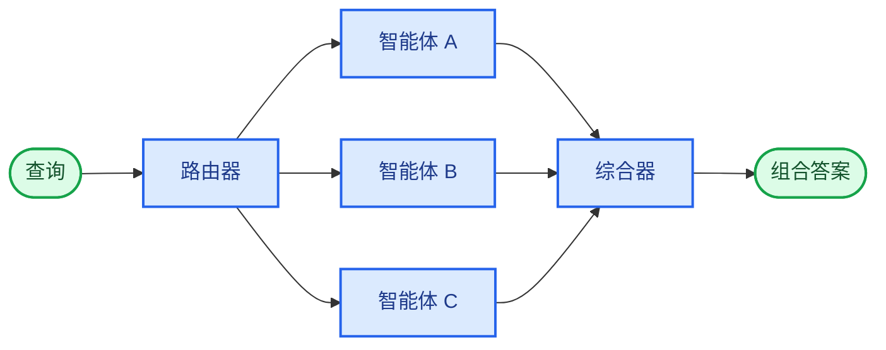

在**路由器**架构中，路由步骤会对输入进行分类，并将其引导至专门的[智能体](/oss/python/langchain/agents)。当您拥有不同的**垂直领域**（各自需要专属智能体的独立知识领域）时，这非常有用。



## 主要特性

* 路由器对查询进行分解
* 零个或多个专门智能体被并行调用
* 结果被综合成一个连贯的响应

## 何时使用

当您拥有不同的垂直领域（各自需要专属智能体的独立知识领域）、需要并行查询多个来源，并希望将结果综合成组合响应时，请使用路由器模式。

## 基本实现

路由器对查询进行分类并将其引导至适当的智能体。使用 [`Command`](/oss/python/langgraph/graph-api#command) 进行单智能体路由，或使用 [`Send`](/oss/python/langgraph/graph-api#send) 进行并行扇出到多个智能体。

<Tabs>
<Tab title="单智能体">

使用 `Command` 路由到单个专门智能体：

```python
from langgraph.types import Command

def classify_query(query: str) -> str:
    """使用 LLM 对查询进行分类并确定合适的智能体。"""
    # 分类逻辑在此处
    ...

def route_query(state: State) -> Command:
    """根据查询分类路由到相应的智能体。"""
    active_agent = classify_query(state["query"])

    # 路由到选定的智能体
    return Command(goto=active_agent)
```


</Tab>
<Tab title="多智能体（并行）">

使用 `Send` 并行扇出到多个专门智能体：

```python
from typing import TypedDict
from langgraph.types import Send

class ClassificationResult(TypedDict):
    query: str
    agent: str

def classify_query(query: str) -> list[ClassificationResult]:
    """使用 LLM 对查询进行分类并确定要调用哪些智能体。"""
    # 分类逻辑在此处
    ...

def route_query(state: State):
    """根据查询分类路由到相关智能体。"""
    classifications = classify_query(state["query"])

    # 并行扇出到选定的智能体
    return [
        Send(c["agent"], {"query": c["query"]})
        for c in classifications
    ]
```


</Tab>
</Tabs>

完整实现请参见以下教程。

<Card title="教程：使用路由构建多源知识库" icon="book" href="/oss/python/langchain/multi-agent/router-knowledge-base">
构建一个路由器，并行查询 GitHub、Notion 和 Slack，然后将结果综合成一个连贯的答案。涵盖状态定义、专门智能体、使用 `Send` 的并行执行以及结果综合。
</Card>

## 无状态 vs. 有状态

两种方法：
* [**无状态路由器**](#stateless) 独立处理每个请求
* [**有状态路由器**](#stateful) 跨请求维护对话历史

## 无状态

每个请求独立路由——调用之间没有记忆。对于多轮对话，请参见[有状态路由器](#stateful)。

<Tip>
**路由器 vs. 子智能体**：两种模式都可以将工作分派给多个智能体，但它们在路由决策的制定方式上有所不同：

- **路由器**：一个专用的路由步骤（通常是单个 LLM 调用或基于规则的逻辑），对输入进行分类并分派给智能体。路由器本身通常不维护对话历史记录或执行多轮编排——它是一个预处理步骤。
- **子智能体**：一个主监督智能体在持续对话中动态决定调用哪些[子智能体](/oss/python/langchain/multi-agent/subagents)。主智能体维护上下文，可以跨轮次调用多个子智能体，并编排复杂的多步骤工作流。

当您有清晰的输入类别并希望进行确定性或轻量级分类时，请使用**路由器**。当您需要灵活、对话感知的编排，其中 LLM 根据不断变化的上下文决定下一步操作时，请使用**监督器**。
</Tip>

## 有状态

对于多轮对话，您需要在调用之间维护上下文。

### 工具包装器

最简单的方法：将无状态路由器包装为对话智能体可以调用的工具。对话智能体处理记忆和上下文；路由器保持无状态。这避免了跨多个并行智能体管理对话历史的复杂性。

```python
@tool
def search_docs(query: str) -> str:
    """跨多个文档源进行搜索。"""
    result = workflow.invoke({"query": query})  # [!code highlight]
    return result["final_answer"]

# 对话智能体将路由器作为工具使用
conversational_agent = create_agent(
    model,
    tools=[search_docs],
    prompt="你是一个乐于助人的助手。使用 search_docs 来回答问题。"
)
```


### 完全持久化

如果您需要路由器本身维护状态，请使用[持久化](/oss/python/langchain/short-term-memory)来存储消息历史记录。当路由到智能体时，从状态中获取先前的消息，并有选择地将它们包含在智能体的上下文中——这是[上下文工程](/oss/python/langchain/context-engineering)的一个杠杆。

<Warning>
**有状态路由器需要自定义历史管理。** 如果路由器在轮次之间切换智能体，当智能体具有不同的语气或提示时，对话对最终用户来说可能感觉不流畅。使用并行调用时，您需要在路由器级别维护历史记录（输入和综合输出），并在路由逻辑中利用此历史记录。请考虑使用[交接模式](/oss/python/langchain/multi-agent/handoffs)或[子智能体模式](/oss/python/langchain/multi-agent/subagents)替代——两者都为多轮对话提供了更清晰的语义。
</Warning>

---

<div className="source-links">
<Callout icon="edit">
    [Edit this page on GitHub](https://github.com/langchain-ai/docs/edit/main/src/i18n\zh-CN\oss\langchain\multi-agent\router.mdx) or [file an issue](https://github.com/langchain-ai/docs/issues/new/choose).
</Callout>
<Callout icon="terminal-2">
    [Connect these docs](/use-these-docs) to Claude, VSCode, and more via MCP for real-time answers.
</Callout>
</div>
