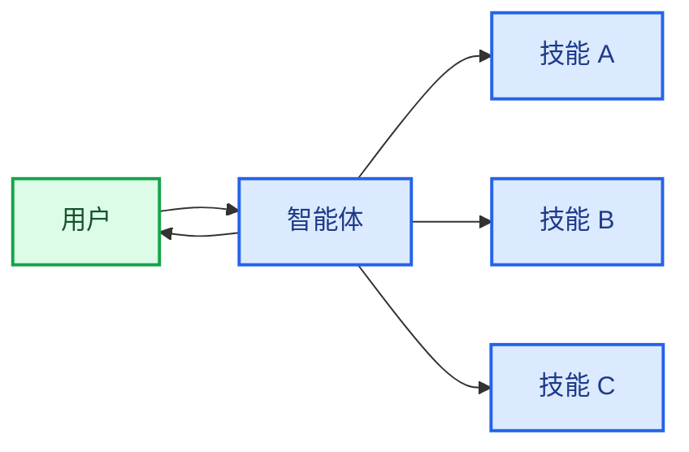

在**技能**架构中，专业能力被打包为可调用的“技能”，用于增强[智能体](/oss/python/langchain/agents)的行为。技能主要是由提示驱动的专业化能力，智能体可以按需调用。
关于内置技能支持，请参阅[深度智能体](/oss/python/deepagents/skills)。

<Tip>
这种模式在概念上与[智能体技能](https://agentskills.io/)和[llms.txt](https://llmstxt.org/)（由Jeremy Howard提出）相同，后者使用工具调用来实现文档的渐进式披露。技能模式将渐进式披露应用于专业提示和领域知识，而不仅仅是文档页面。

对于可立即使用、能提升智能体在LangChain生态系统任务中表现的技能，请参阅[LangChain技能](https://github.com/langchain-ai/langchain-skills)仓库。
</Tip>



## 主要特性

* 提示驱动的专业化：技能主要由专业提示定义
* 渐进式披露：技能根据上下文或用户需求变得可用
* 团队分布式开发：不同团队可以独立开发和维护技能
* 轻量级组合：技能比完整的子智能体更简单
* 引用感知：技能可以引用脚本、模板和其他资源

## 适用场景

当您希望一个[智能体](/oss/python/langchain/agents)具备多种可能的专业化能力、不需要在技能之间强制执行特定约束，或者不同团队需要独立开发能力时，请使用技能模式。常见示例包括编码助手（针对不同语言或任务的技能）、知识库（针对不同领域的技能）和创意助手（针对不同格式的技能）。

## 基础实现

```python
from langchain.tools import tool
from langchain.agents import create_agent

@tool
def load_skill(skill_name: str) -> str:
    """加载专业化的技能提示。

    可用技能：
    - write_sql: SQL查询编写专家
    - review_legal_doc: 法律文档审阅者

    返回技能的提示和上下文。
    """
    # 从文件/数据库加载技能内容
    ...

agent = create_agent(
    model="gpt-4.1",
    tools=[load_skill],
    system_prompt=(
        "你是一个乐于助人的助手。"
        "你可以使用两种技能："
        "write_sql和review_legal_doc。"
        "使用load_skill来访问它们。"
    ),
)
```


完整实现请参阅下面的教程。

<Card
    title="教程：构建具备按需技能的SQL助手"
    icon="wand"
    href="/oss/python/langchain/multi-agent/skills-sql-assistant"
    arrow cta="了解更多"
>
    学习如何实现具有渐进式披露功能的技能，使智能体能够按需加载专业提示和模式，而不是预先加载所有内容。
</Card>

## 扩展模式

编写自定义实现时，可以通过以下几种方式扩展基础技能模式：

- **动态工具注册**：将渐进式披露与状态管理相结合，在技能加载时注册新的[工具](/oss/python/langchain/tools)。例如，加载"database_admin"技能既可以添加专业化的上下文，也可以注册数据库特定的工具（备份、恢复、迁移）。这使用了在多智能体模式中通用的工具和状态机制——工具通过更新状态来动态改变智能体的能力。

- **分层技能**：技能可以以树状结构定义其他技能，创建嵌套的专业化能力。例如，加载"data_science"技能可能会提供"pandas_expert"、"visualization"和"statistical_analysis"等子技能。每个子技能可以根据需要独立加载，允许对领域知识进行细粒度的渐进式披露。这种分层方法通过将能力组织成逻辑分组，有助于管理大型知识库，这些分组可以按需发现和加载。

- **引用感知**：虽然每个技能只有一个提示，但这个提示可以引用其他资源的位置，并提供智能体何时应使用这些资源的信息。当这些资源变得相关时，智能体将知道这些文件存在，并根据需要将它们读入内存以完成任务。这也遵循渐进式披露模式，并限制了上下文窗口中的信息量。

---

<div className="source-links">
<Callout icon="edit">
    [Edit this page on GitHub](https://github.com/langchain-ai/docs/edit/main/src/i18n\zh-CN\oss\langchain\multi-agent\skills.mdx) or [file an issue](https://github.com/langchain-ai/docs/issues/new/choose).
</Callout>
<Callout icon="terminal-2">
    [Connect these docs](/use-these-docs) to Claude, VSCode, and more via MCP for real-time answers.
</Callout>
</div>
