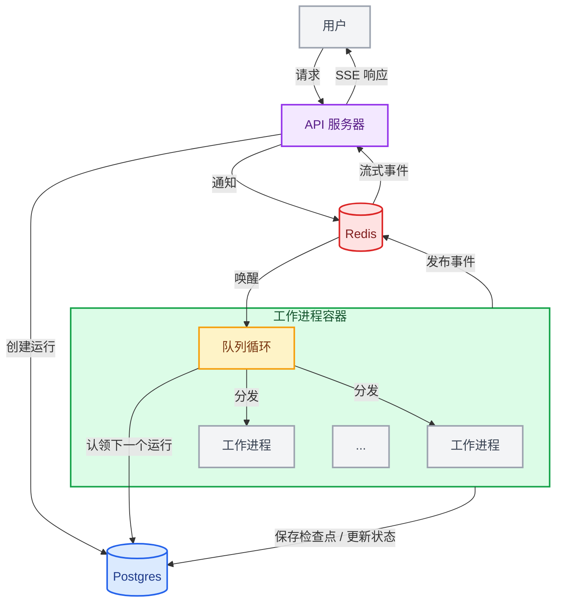

LangSmith 部署的**代理服务器**提供了一个用于创建和管理基于代理的应用程序的 API。它建立在[助手](/langsmith/assistants)的概念之上，助手是为特定任务配置的代理，并内置了[持久化](/oss/langgraph/persistence#memory-store)和[**任务队列**](#task-queue)。这个多功能的 API 支持广泛的代理应用用例，从后台处理到实时交互。

使用代理服务器来创建和管理：

<CardGroup cols={4}>
  <Card title="助手" icon="robot" href="/langsmith/assistants" />
  <Card title="线程" icon="messages" href="/langsmith/use-threads" />
  <Card title="运行" icon="player-play" href="/langsmith/runs" />
  <Card title="定时任务" icon="clock" href="/langsmith/cron-jobs" />
</CardGroup>

<Tip>
**API 参考**  
有关 API 端点和数据模型的详细信息，请参阅[代理服务器 API 参考](/langsmith/server-api-ref)。
</Tip>

## 应用程序结构

要部署一个代理服务器应用程序，你需要指定要部署的图，以及任何相关的配置设置，例如依赖项和环境变量。

阅读[应用程序结构](/langsmith/application-structure)指南，了解如何为部署构建你的 LangGraph 应用程序。

<Note>
[LangSmith 云服务](/langsmith/cloud)会为你管理数据库。如果你在[自己的基础设施](/langsmith/self-hosted)上部署，则需要自行设置。
</Note>

## 部署的组成部分

当你部署代理服务器时，你正在部署一个或多个[图](#graphs)、一个用于[持久化](/oss/langgraph/persistence)的数据库和一个[任务队列](#task-queue)。

### 图

当你使用代理服务器部署一个图时，你正在部署一个[助手](/langsmith/assistants)的“蓝图”。

一个图最常实现一个[代理](/oss/langgraph/workflows-agents)，但并非必须如此。例如，一个图可以实现一个仅支持来回对话的简单聊天机器人，而无需影响任何应用程序控制流。实际上，随着应用程序变得更加复杂，一个图通常会实现更复杂的流程，可能使用[多个代理](/oss/langchain/multi-agent)协同工作。

图不一定需要用 LangGraph 编写。你也可以使用 LangGraph 功能 API 部署使用其他框架（如 Strands 或 Google ADK）构建的代理。详情请参阅[部署其他框架](/langsmith/deploy-other-frameworks)。

#### 图的加载与编译

图的编译方式和时机取决于你在[应用程序结构](/langsmith/application-structure)中如何注册它：

1.  **已编译图**（推荐）：导出一个已编译的 `CompiledGraph` 实例。服务器在容器启动时加载一次，并为每次运行重复使用它——没有每次请求的编译开销。
2.  **工厂函数**：导出一个代理工厂函数，服务器在每次需要图时调用它。仅当你需要每次运行都自定义图时才使用此方法（例如，根据助手配置选择不同的模型或工具）。保持工厂函数轻量级，因为它们会在每次调用时运行。

<Tip>
除非你特别需要每次运行的自定义，否则请使用已编译的图。工厂函数会在每次调用时增加开销；已编译的图则不会。
</Tip>

在这两种情况下，服务器都会在运行时自动注入为该部署配置的检查点和内存存储。**不要在图的代码中配置这些**，因为服务器需要为其他操作管理它们。

### 持久化

代理服务器持久化三种类型的数据，默认都基于 [PostgreSQL](https://www.postgresql.org/)：

-   **核心资源数据**：助手、线程、运行和定时任务。始终存储在 PostgreSQL 中。
-   **检查点（短期记忆）**：每个步骤写入的图执行状态快照。它们使运行具有持久性：如果工作进程被中断，运行可以从最后一个检查点恢复，而不是从头开始。持久性模式控制检查点频率——`async`（默认）在每个步骤后写入；`exit` 仅存储最终状态。LangSmith 默认将其存储在 PostgreSQL 中；但你可以切换到 [MongoDB](https://www.mongodb.com/) 或自定义实现。详情请参阅[配置检查点后端](/langsmith/configure-checkpointer)。
-   **存储（长期记忆）**：跨线程持久化的记忆，使代理能够在不同对话之间保留信息。默认存储在 PostgreSQL 中，但可以替换为自定义实现。详情请参阅[添加自定义存储](/langsmith/custom-store)。

### 任务队列

当客户端创建一个运行时，API 服务器会将其加入队列，然后一个队列工作进程会拾取它并执行。工作进程也可以被通知取消正在进行的运行，并发布输出事件，这些事件通过 `/stream` 连接实时转发给客户端。

[Redis](https://redis.io/) 处理 API 服务器和队列工作进程之间的信号、取消和流式发布/订阅。它只存储临时数据——没有用户或运行数据持久保存在 Redis 中。运行数据本身始终从 PostgreSQL 读取和写入。

有关如何设置和管理这些组件的更多信息，请查看[托管选项](/langsmith/platform-setup)指南。

## 运行时架构

### 部署模式

代理服务器支持三种运行时配置：

-   **单主机**：API 服务器直接管理任务队列，没有单独的队列工作进程。这是自托管部署的默认设置，适用于开发和低流量用例。
-   **分离的 API 和队列**：专用的队列工作进程在与 API 服务器分离的主机上处理运行执行。对于自托管部署，通过在配置中设置 `queue.enabled: true` 来启用此模式。每个层级独立扩展——API 服务器根据请求量扩展，队列工作进程根据待处理运行数量扩展。
-   **分布式运行时**：API 和队列进程再次分开运行，但分布式运行时不是使用单个队列进程同时处理图的编排和执行，而是使用一个进程进行编排，另一个进程进行执行。将此用于具有高并发需求的大规模部署。

下面描述的容器架构和运行生命周期适用于单主机和分离的 API 与队列配置。

### 容器架构

典型的部署由两种长期运行的容器组成，两者都从同一个 Docker 镜像构建（一个基础镜像，上面安装了你的项目代码）：

-   **API 服务器** 处理客户端请求（创建运行、读取线程状态、流式传输结果），但本身不执行代理代码。
-   **队列工作进程** 是执行引擎。它们监听持久任务队列，执行你的图代码，并写入检查点。

容器是**无状态**但持久的。任何时候至少必须有 1 个队列工作进程监听任务队列，以确保没有运行被孤立。容器在其生命周期内可以服务许多次运行。

API 服务器和队列工作进程是独立的容器池，并且[独立扩展](/langsmith/data-plane#autoscaling)。

### 运行执行生命周期

当你调用一个运行时，请求会流经几个组件：

1.  客户端向 API 服务器发送请求，API 服务器在持久任务队列中创建一个待处理的运行。
2.  一个队列工作进程拾取该运行，获取其租约，加载相应的图，并开始执行。队列确保在任一时刻，最多只能有一个运行针对给定线程执行。
3.  随着图的执行，工作进程将检查点写入持久层（频率取决于[持久性模式](/oss/langgraph/durable-execution#durability-modes)），并通过配置的发布/订阅提供程序广播流式事件。
4.  如果客户端打开了 `/stream` 连接，API 服务器会订阅发布/订阅频道，并通过服务器发送事件实时将事件转发给客户端。
5.  当执行完成时，工作进程更新运行状态并释放其槽位，以供下一个运行使用。

每个工作进程最多同时处理 [`N_JOBS_PER_WORKER`](/langsmith/env-var#n_jobs_per_worker) 个运行（默认值：10），因此单个工作进程容器可以并行服务许多运行。有关调优指导，请参阅[为扩展配置代理服务器](/langsmith/agent-server-scale)。

## 了解更多

-   [应用程序结构](/langsmith/application-structure)指南解释了如何为部署构建你的应用程序。
-   [API 参考](https://docs.langchain.com/langsmith/server-api-ref)提供了有关 API 端点和数据模型的详细信息。