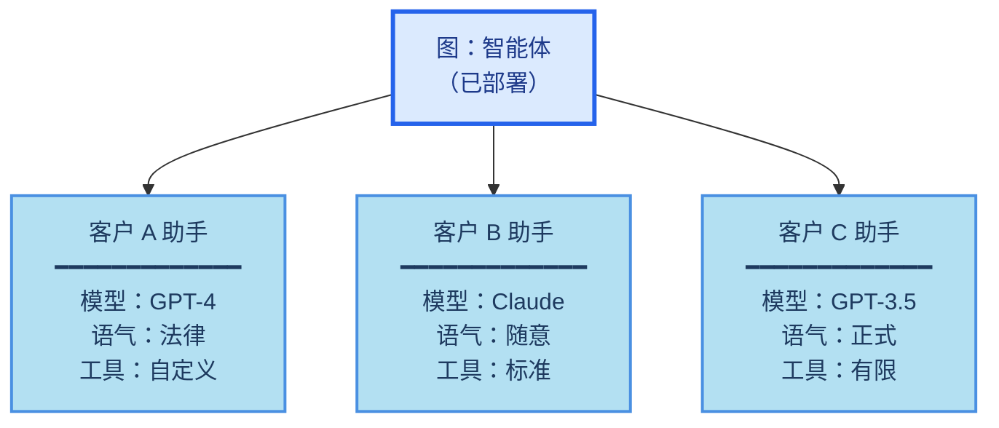
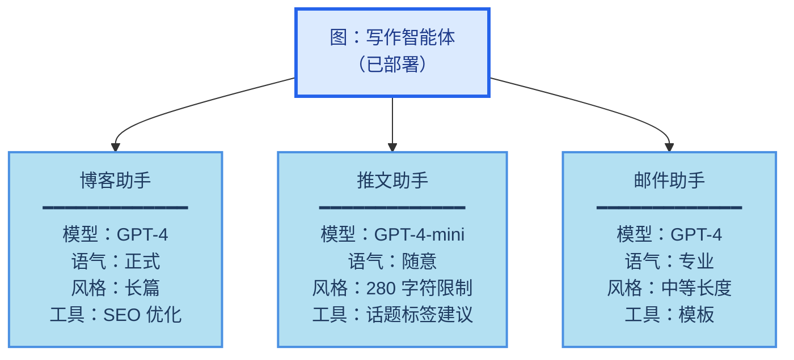

**助手**是 [Agent Server](/langsmith/agent-server) 中的一个概念，它允许你将配置（例如提示词、LLM 选择、工具）与图的核心逻辑分开管理。这使你能够创建同一图架构的多个专门化版本，在运行时具有不同的行为。通过配置的变体（而非图结构的更改），每个助手都针对不同的[使用场景](#何时使用助手)进行了优化。

例如，想象一个基于通用图架构构建的通用写作智能体。虽然结构保持不变，但不同的写作风格（如博客文章和推文）需要量身定制的配置以优化性能。为了支持这些变体，你可以创建多个助手（例如，一个用于博客，另一个用于推文），它们共享底层图，但在模型选择和系统提示词上有所不同。


Agent Server API 提供了多个端点用于创建和管理助手及其版本。更多详情请参阅 [API 参考](/langsmith/server-api-ref)。

<Info>
助手是 [LangSmith 部署](/langsmith/deployment) 中的一个概念。它们在开源的 LangGraph 库中不可用。
</Info>

## 默认助手

当你使用 LangSmith 部署部署一个图时，[Agent Server](/langsmith/agent-server) 会自动创建一个与该图默认配置绑定的**默认助手**。然后，你可以为同一个图创建额外的助手，每个助手都有自己的配置。

如果你的部署在 [`langgraph.json`](/langsmith/application-structure#configuration-file) 中定义了多个图，每个图都会获得自己的默认助手：

```json
{
    "graphs": {
        "graph_id_1": "path_to_graph_id_1",  // 为 graph_id_1 创建的默认助手
        "graph_id_2": "path_to_graph_id_2"   // 为 graph_id_2 创建的默认助手
    }
}
```

助手有几个关键特性：

- **[通过 API 和 UI 管理](/langsmith/configuration-cloud)**：使用 Agent Server/LangGraph SDK 或 [LangSmith UI](https://smith.langchain.com) 创建、列出、更新、版本控制以及获取助手。
- **一个图，多个助手**：单个部署的图可以支持多个助手，每个助手具有不同的配置（例如提示词、模型、工具）。
- **[版本化](#版本控制) 的配置**：每个助手通过版本控制维护自己的配置历史。编辑助手会创建一个新版本，你可以提升或回滚到任何版本。
- **[配置](#配置) 更新无需更改图**：通过助手配置更新提示词、模型选择和其他设置，从而实现快速迭代，而无需修改或重新部署图代码。

<Note>
调用助手时，你可以在 [`langgraph.json`](/langsmith/agent-server-api/thread-runs/create-background-run#body-assistant-id-one-of-0) 中指定以下之一：

- **图 ID**（`langgraph.json` 中的键，例如 `"agent"`）：使用该图的默认助手。
- **助手 ID**（UUID）：使用特定的助手配置。

这种灵活性使你能够快速使用默认设置进行测试，或精确控制使用哪个配置。
</Note>

## 配置

助手建立在 LangGraph 开源的[配置](/oss/langgraph/graph-api#runtime-context)概念之上。

虽然配置在开源的 LangGraph 库中可用，但助手仅存在于 [LangSmith 部署](/langsmith/deployments) 中，因为它们与你的部署图紧密耦合。部署后，[Agent Server](/langsmith/agent-server) 将使用图的默认配置设置自动为每个图创建一个默认助手。

实际上，助手只是具有特定配置的图的一个*实例*。因此，多个助手可以引用同一个图，但可以包含不同的配置（例如提示词、模型、工具）。LangSmith 部署 API 提供了多个端点用于创建和管理助手。有关如何创建助手的更多详情，请参阅 [API 参考](/langsmith/server-api-ref) 和 [此操作指南](/langsmith/configuration-cloud)。

### 使用场景

当你需要部署具有不同配置的同一图架构时，助手是理想的选择。常见的使用场景包括：

- **用户级个性化**
  - 为每个用户自定义模型选择、系统提示词或工具可用性。
  - 存储用户偏好并自动应用于每次交互。
  - 允许用户在不同的 AI 个性或专业水平之间进行选择。

- **客户或组织特定配置**
  - 为不同的客户或组织维护单独的配置。
  - 为每个客户端自定义行为，而无需部署单独的基础设施。
  - 将配置更改隔离到特定客户。



- **环境特定配置**
  - 为开发、预发布和生产环境使用不同的模型或设置。
  - 在提升到生产环境之前在预发布环境中测试配置更改。
  - 在非生产环境中使用较小的模型以降低成本。

- **A/B 测试和实验**
  - 比较不同的提示词、模型或参数设置。
  - 将配置更改逐步推送给一部分用户。
  - 测量不同配置变体之间的性能差异。

- **专门的任务变体**
  - 创建通用智能体的领域特定版本。
  - 针对不同的语言、地区或行业优化配置。
  - 保持一致的图逻辑，同时改变执行细节。



## 助手如何与部署协同工作

当你使用 LangSmith 部署部署一个图时，[Agent Server](/langsmith/agent-server) 会自动创建一个与该图默认配置绑定的**默认助手**。然后，你可以为同一个图创建额外的助手，每个助手都有自己的配置。

如果你的部署在 [`langgraph.json`](/langsmith/application-structure#configuration-file) 中定义了多个图，每个图都会获得自己的默认助手：

```json
{
    "graphs": {
        "graph_id_1": "path_to_graph_id_1",  // 为 graph_id_1 创建的默认助手
        "graph_id_2": "path_to_graph_id_2"   // 为 graph_id_2 创建的默认助手
    }
}
```

也就是说，可以有多个默认助手——你的部署中定义的每个图都有一个。

助手有几个关键特性：

- **[通过 API 和 UI 管理](/langsmith/configuration-cloud)**：使用 Agent Server/LangGraph SDK 或 [LangSmith UI](https://smith.langchain.com) 创建、列出、更新、版本控制以及获取助手。
- **一个图，多个助手**：单个部署的图可以支持多个助手，每个助手具有不同的配置（例如提示词、模型、工具）。
- **[版本化](#版本控制) 的配置**：每个助手通过版本控制维护自己的配置历史。编辑助手会创建一个新版本，你可以提升或回滚到任何版本。
- **[配置](#配置) 更新无需更改图**：通过助手配置更新提示词、模型选择和其他设置，从而实现快速迭代，而无需修改或重新部署图代码。

<Note>
调用助手时，你可以在 [`langgraph.json`](/langsmith/application-structure#configuration-file) 中指定以下之一：
- **图 ID**（例如 `"agent"`）：使用该图的默认助手
- **助手 ID**（UUID）：使用特定的助手配置

这种灵活性使你能够快速使用默认设置进行测试，或精确控制使用哪个配置。
</Note>

### 配置

助手建立在 LangGraph 开源的[配置](/oss/langgraph/graph-api#runtime-context)概念之上。

虽然配置在开源的 LangGraph 库中可用，但助手仅存在于 [LangSmith 部署](/langsmith/deployment) 中，因为它们与你的部署图紧密耦合。部署后，[Agent Server](/langsmith/agent-server) 将使用图的默认配置设置自动为每个图创建一个默认助手。

实际上，助手只是具有特定配置的图的一个*实例*。因此，多个助手可以引用同一个图，但可以包含不同的配置（例如提示词、模型、工具）。LangSmith 部署 API 提供了多个端点用于创建和管理助手。有关如何创建助手的更多详情，请参阅 [API 参考](/langsmith/server-api-ref) 和 [此操作指南](/langsmith/configuration-cloud)。

### 版本控制

助手支持版本控制以跟踪随时间的变化。创建助手后，后续的编辑将自动创建新版本。

- 每次更新都会创建助手的新版本。
- 你可以将任何版本提升为活动版本。
- 回滚到先前版本只需将其设置为活动版本即可。
- 所有版本都保留以供参考和回滚。

<Warning>
更新助手时，必须提供完整的配置负载。更新端点会从头创建新版本，不会与先前版本合并。请确保包含要保留的所有配置字段。
</Warning>

有关如何管理助手版本的更多详情，请参阅 [管理助手指南](/langsmith/configuration-cloud#create-a-new-version-for-your-assistant)。