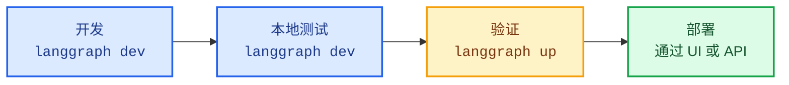

本指南介绍如何在本地开发和测试 [Agent Server](/langsmith/agent-server) 应用。[LangGraph CLI](/langsmith/cli) 提供了两个用于本地开发的命令，分别针对工作流的不同阶段进行了优化：

- [`langgraph dev`](#langgraph-dev)：用于快速迭代的轻量级开发服务器。
- [`langgraph up`](#langgraph-up)：用于验证的生产级测试环境。

| 特性 | `langgraph dev` | `langgraph up` |
|---------|----------------|----------------|
| **需要 Docker** | 否 | 是 |
| **安装方式** | `pip install langgraph-cli[inmem]` | `pip install langgraph-cli` |
| **主要用例** | 快速开发与测试 | 生产级验证 |
| **状态持久化** | 内存中并序列化到本地目录 | PostgreSQL |
| **热重载** | 是（默认） | 可选（`--watch` 标志） |
| **默认端口** | `2024` | `8123` |
| **资源占用** | 轻量级 | 较重（为服务器、PostgreSQL 和 Redis 构建并运行独立的 Docker 容器） |
| **IDE 调试** | 内置 [DAP](https://microsoft.github.io/debug-adapter-protocol/) 支持 | 常规容器调试 |
| **自定义认证** | 是 | 是（需要许可证密钥） |

<Tip>
有关完整的参考详情，请参阅 [LangGraph CLI 参考](/langsmith/cli) 页面。
</Tip>

## 开发流程

以下是构建应用时的典型工作流：



| 阶段 | 工具 | 目的 |
|-------|------|---------|
| **本地开发与测试** | [`langgraph dev`](/langsmith/cli#dev) | 编写并迭代你的图，支持热重载 |
| **验证** | [`langgraph up`](/langsmith/cli#up) | 使用完整技术栈测试生产级行为 |
| **部署** | [`langgraph deploy`](/langsmith/cli#deploy) | 自信地部署到生产环境 |

### 推荐工作流

1. **日常开发**：使用 `langgraph dev` 进行快速迭代。
1. **定期验证**：使用 `langgraph up` 测试重大变更。
1. **部署前检查**：运行 `langgraph up --recreate` 进行全新构建。
1. **部署**：通过 [LangSmith UI](/langsmith/deployment-quickstart) 或 [控制平面 API](/langsmith/api-ref-control-plane) 推送到生产环境。

## `langgraph dev`

[`langgraph dev`](/langsmith/cli#dev) 命令在你的环境中直接运行一个轻量级服务器，专为活跃开发期间的速度和便利性而设计。主要特性包括：

- **无需 Docker**：直接在您的环境中运行。
- **热重载**：代码更改时自动重新加载。
- **快速启动**：几秒内准备就绪。
- **内置 [调试适配器协议](https://microsoft.github.io/debug-adapter-protocol/) 支持**：将 IDE 调试器附加到服务器，进行行级断点和调试。
- **本地存储**：状态持久化到本地目录。

<Note>
`dev` 服务器使用与生产环境相同的集成测试套件进行测试，以确保其在开发期间的行为一致，同时占用最少的资源。
</Note>

<Accordion title="开始使用 langgraph dev">

开始之前，请确保您拥有：
- [LangSmith](https://smith.langchain.com/settings) 的 API 密钥（免费注册）。
- Python 的 [uv](https://docs.astral.sh/uv/getting-started/installation/) 或 TypeScript 的 [npx](https://docs.npmjs.com/cli/commands/npx)。

<Steps>
<Step title="创建 LangGraph 应用">

从 [`new-langgraph-project-python` 模板](https://github.com/langchain-ai/new-langgraph-project) 或 [`new-langgraph-project-js` 模板](https://github.com/langchain-ai/new-langgraphjs-project) 创建一个新应用。此模板演示了一个单节点应用，您可以用自己的逻辑进行扩展。

<Tabs>
    <Tab title="Python 服务器">
    ```shell
    uvx --from langgraph-cli@latest langgraph new path/to/your/app --template new-langgraph-project-python
    ```
    </Tab>
    <Tab title="Node 服务器">
    ```shell
    npx @langchain/langgraph-cli new path/to/your/app --template new-langgraph-project-js
    ```
    </Tab>
</Tabs>

<Tip>
**其他模板**<br></br>
如果您使用 [`langgraph new`](/langsmith/cli) 而不指定模板，将会看到一个交互式菜单，允许您从可用模板列表中选择。
</Tip>

</Step>
<Step title="安装依赖项">

<Tabs>
    <Tab title="Python 服务器">
    ```shell
    cd path/to/your/app
    uv sync --dev -U
    ```
    </Tab>
    <Tab title="Node 服务器">
    ```shell
    cd path/to/your/app
    yarn install
    ```
    </Tab>
</Tabs>

</Step>
<Step title="启动 Agent Server">

<Tabs>
    <Tab title="Python 服务器">
    ```shell
    uv run langgraph dev
    ```
    </Tab>
    <Tab title="Node 服务器">
    ```shell
    npx @langchain/langgraph-cli dev
    ```
    </Tab>
</Tabs>

示例输出：

```
>    准备就绪！
>
>    - API: [http://localhost:2024](http://localhost:2024/)
>
>    - 文档: http://localhost:2024/docs
>
>    - Studio Web UI: https://smith.langchain.com/studio/?baseUrl=http://127.0.0.1:2024
```

</Step>
<Step title="测试 API">

<Tabs>
    <Tab title="Python SDK (异步)">
    1. 安装 LangGraph Python SDK：
      ```shell
      pip install langgraph-sdk
      ```
    2. 向助手发送消息（无线程运行）：
      ```python
      from langgraph_sdk import get_client
      import asyncio

      client = get_client(url="http://localhost:2024")

      async def main():
          async for chunk in client.runs.stream(
              None,  # 无线程运行
              "agent", # 助手名称。在 langgraph.json 中定义。
              input={
              "messages": [{
                  "role": "human",
                  "content": "什么是 LangGraph？",
                  }],
              },
          ):
              print(f"接收到类型为 {chunk.event} 的新事件...")
              print(chunk.data)
              print("\n\n")

      asyncio.run(main())
      ```
    </Tab>
    <Tab title="Python SDK (同步)">
    1. 安装 LangGraph Python SDK：
      ```shell
      pip install langgraph-sdk
      ```
    2. 向助手发送消息（无线程运行）：
      ```python
      from langgraph_sdk import get_sync_client

      client = get_sync_client(url="http://localhost:2024")

      for chunk in client.runs.stream(
          None,  # 无线程运行
          "agent", # 助手名称。在 langgraph.json 中定义。
          input={
              "messages": [{
                  "role": "human",
                  "content": "什么是 LangGraph？",
              }],
          },
          stream_mode="messages-tuple",
      ):
          print(f"接收到类型为 {chunk.event} 的新事件...")
          print(chunk.data)
          print("\n\n")
      ```
    </Tab>
    <Tab title="Javascript SDK">
    1. 安装 LangGraph JS SDK：
      ```shell
      npm install @langchain/langgraph-sdk
      ```
    2. 向助手发送消息（无线程运行）：
      ```js
      const { Client } = await import("@langchain/langgraph-sdk");

      // 仅在调用 langgraph dev 时更改了默认端口时才需要设置 apiUrl
      const client = new Client({ apiUrl: "http://localhost:2024"});

      const streamResponse = client.runs.stream(
          null, // 无线程运行
          "agent", // 助手 ID
          {
              input: {
                  "messages": [
                      { "role": "user", "content": "什么是 LangGraph？"}
                  ]
              },
              streamMode: "messages-tuple",
          }
      );

      for await (const chunk of streamResponse) {
          console.log(`接收到类型为 ${chunk.event} 的新事件...`);
          console.log(JSON.stringify(chunk.data));
          console.log("\n\n");
      }
      ```
    </Tab>
    <Tab title="Rest API">
    ```bash
    curl -s --request POST \
        --url "http://localhost:2024/runs/stream" \
        --header 'Content-Type: application/json' \
        --data "{
            \"assistant_id\": \"agent\",
            \"input\": {
                \"messages\": [
                    {
                        \"role\": \"human\",
                        \"content\": \"什么是 LangGraph？\"
                    }
                ]
            },
            \"stream_mode\": \"messages-tuple\"
        }"
    ```
    </Tab>
</Tabs>

</Step>
</Steps>

</Accordion>

### 使用场景

将 `langgraph dev` 作为主要开发工具，用于：

- **日常功能开发**：更改代码后服务器自动重新加载。无需重建容器即可立即测试——非常适合快速迭代周期。
- **快速原型设计和实验**：几秒钟内启动服务器测试想法，无需 Docker 设置开销。
- **没有 Docker 的环境**：在 CI/CD 流水线或轻量级 VM 中，Docker 不可用时：
    ```bash
    langgraph dev --no-browser
    ```

- **调试器附加**：使用 `--debug-port` 附加 IDE 调试器，在开发期间进行逐步调试。

## `langgraph up`

[`langgraph up`](/langsmith/cli#up) 命令编排一个完整的基于 Docker 的技术栈，该技术栈镜像了生产基础设施，有助于在生产前发现部署问题。主要特性包括：

- **验证构建和依赖项**：测试您的构建过程和依赖项。
- **隔离的网络**：真实的容器网络。
- **生产验证**：验证部署就绪状态。

<Accordion title="开始使用 langgraph up">

```bash
# 确保 Docker 正在运行
docker ps

# 启动生产级技术栈
langgraph up
```

您的服务器将在 `http://localhost:8123` 启动，并具有完整的持久化存储。

</Accordion>

### 使用场景

使用 `langgraph up` 进行验证和生产就绪测试：

- **部署前验证**：在部署到生产环境之前，可以使用全新构建进行最终检查，以确保所有依赖项都正确指定。

    ```bash
    langgraph up --recreate
    ```
    这可以捕获与容器中依赖项解析相关的任何问题以及其他构建过程问题。

- **主要功能验证**：在实现重大更改后，定期使用完整生产技术栈进行测试，以确保一切在容器化环境中正常工作。
- **Docker 故障排除**：在调试容器特定问题、网络问题或仅在生产环境中出现的环境变量配置时使用。

## 部署前检查清单

在部署应用之前，使用 `langgraph up` 验证以下事项：

- 所有[依赖项](/langsmith/setup-app-requirements-txt)在容器中正确安装。
- 应用启动无错误。
- 图成功执行。
- 所有[环境变量](/langsmith/env-var)正常工作。
- [认证/授权](/langsmith/cli#adding-custom-authentication)按预期工作。

## 依赖项配置

`langgraph dev` 和 `langgraph up` 都从应用的[配置文件中](/langsmith/application-structure#configuration-file)读取[依赖项](/langsmith/application-structure#dependencies)，但它们在以下不同环境中运行：

- **`langgraph dev`** 直接在您的本地环境（Python 或 Node.js）中运行您的代码，无需 Docker。
- **`langgraph up`** 构建一个 Docker 容器，并在该隔离容器内运行您的代码。

正确配置依赖项可确保两个命令都能正常工作，并且您在本地测试的内容与部署到生产环境的内容相匹配。

### `langgraph.json` 文件

`dependencies` 字段告诉 [CLI](/langsmith/cli) **在哪里**找到您的应用代码。`dependencies` 字段可以指向：
- **包含包配置的目录**（包含 `pyproject.toml`、`setup.py`、`requirements.txt` 或 `package.json`）
- **特定子目录**：`"dependencies": ["./my_agent"]`
- **特定包**：`"dependencies": ["my-package==1.0.0"]`（Python）或 `"dependencies": ["my-package@1.0.0"]`（JavaScript）

<Tabs>
<Tab title="Python">
```json
{
  "dependencies": ["."],
  "graphs": {
    "my_agent": "./my_agent/agent.py:graph"
  },
  "env": "./.env"
}
```
</Tab>
<Tab title="JavaScript">
```json
{
  "dependencies": ["."],
  "graphs": {
    "my_agent": "./my_agent/agent.js:graph"
  },
  "env": "./.env"
}
```
</Tab>
</Tabs>

### 包依赖文件

这些文件定义了您的应用**需要**哪些包：

<Tabs>
<Tab title="Python">
**pyproject.toml 示例：**
```toml
[project]
name = "my-agent"
version = "0.1.0"
dependencies = [
    "langchain-openai",
    "langchain-anthropic",
    "langgraph",
]
```

**requirements.txt 示例：**
```
langchain-openai
langchain-anthropic
langgraph
```
</Tab>
<Tab title="JavaScript">
**package.json 示例：**
```json
{
  "name": "my-agent",
  "version": "1.0.0",
  "dependencies": {
    "@langchain/openai": "^0.3.0",
    "@langchain/anthropic": "^0.3.0",
    "@langchain/langgraph": "^0.2.0"
  }
}
```
</Tab>
</Tabs>

### 依赖项解析过程

当您运行 [`langgraph up`](/langsmith/cli#up) 时，CLI 会按照以下步骤安装应用的依赖项：

1. [`langgraph.json`](/langsmith/application-structure#configuration-file) 告诉 CLI **在哪里**查找应用代码。`dependencies: ["."]` 字段指向当前目录。
1. **查找包配置**：CLI 在该目录中查找包配置文件（[`pyproject.toml`](/langsmith/setup-pyproject)、[`requirements.txt`](/langsmith/setup-app-requirements-txt) 或 [`package.json`](/langsmith/setup-javascript)）。
1. **读取依赖项列表**：CLI 从配置文件中读取包列表。
1. **安装包**：CLI 使用适合您语言的包管理器（Python 用 `uv` 或 `pip`，JavaScript 用 `npm`）安装所有包。

这种双文件方法分离了关注点：`langgraph.json` 处理应用结构和位置，而包配置文件处理语言特定的包依赖项。

有关安装程序的更多信息，请参阅 [CLI 配置文件](/langsmith/cli#configuration-file)。

### 故障排除

如果遇到依赖项安装问题，请尝试切换到 `pip`：

```json
{
  "dependencies": ["."],
  "pip_installer": "pip"
}
```

然后重新构建：
```bash
langgraph up --recreate
```

## 调试本地 Docker 设置

即使 `langgraph up` 在您的本地机器上失败，生产部署也可能成功。这是因为生产环境使用托管基础设施，而 `langgraph up` 在您的计算机上本地运行完整技术栈。

以下是常见的本地环境问题，这些问题不会影响生产环境。

### Docker 配置问题

`langgraph up` 需要本地 Docker：

```bash
# 检查 Docker 是否正在运行
docker ps
```

[云部署](/langsmith/cloud) 不使用您的本地 Docker。

**解决方案**：安装 Docker，或使用 `langgraph dev` 进行本地测试。

### 端口冲突

`langgraph up` 使用端口 `8123`、`5432` 和 `6379`，这些端口可能已被占用：

```bash
# 检查冲突
lsof -i :8123  # API 服务器
lsof -i :5432  # PostgreSQL
lsof -i :6379  # Redis
```

**解决方案**：停止冲突的服务或使用 [`--port`](/langsmith/cli#dev) 标志。

### 资源限制

`langgraph up` 需要更多 RAM 和磁盘空间用于：

- PostgreSQL 容器
- Redis 容器
- API 服务器容器

**解决方案**：释放资源或使用 `langgraph dev`。

### 网络配置

VPN 连接、防火墙规则或公司代理设置可能会影响本地 Docker 网络。

**解决方案**：使用 `langgraph dev` 进行测试，或临时禁用 VPN/防火墙以隔离问题。

## 后续步骤

现在您已经在本地运行了一个 LangGraph 应用，可以准备部署它了：

**为 LangSmith 选择托管选项：**
- [**云**](/langsmith/cloud)：设置最快，完全托管（推荐）。
- [**混合**](/langsmith/hybrid)：<Tooltip tip="您的 Agent Server 和代理执行时的运行时环境。">数据平面</Tooltip>在您的云中，<Tooltip tip="用于管理部署的 LangSmith UI 和 API。">控制平面</Tooltip>由 LangChain 管理。
- [**自托管**](/langsmith/self-hosted)：在您的基础设施中完全控制。

更多详情，请参阅 [平台设置比较](/langsmith/platform-setup)。

**然后部署您的应用：**
- [部署到云快速入门](/langsmith/deployment-quickstart)：快速设置指南。
- [完整的云设置指南](/langsmith/deploy-to-cloud)：全面的部署文档。

**探索功能：**
- **[Studio](/langsmith/studio)**：使用 Studio UI 可视化、交互和调试您的应用。尝试 [Studio 快速入门](/langsmith/quick-start-studio)。
- **API 参考**：[LangSmith 部署 API](https://langchain-ai.github.io/langgraph/cloud/reference/api/api_ref/)、[Python SDK](/langsmith/langgraph-python-sdk)、[JS/TS SDK](/langsmith/langgraph-js-ts-sdk)

## 相关资源

- [CLI 参考](/langsmith/cli)：所有 CLI 命令的详细文档
- [应用结构](/langsmith/application-structure)：如何构建您的 LangGraph 应用
- [故障排除](/langsmith/troubleshooting-studio)：常见问题及解决方案
- [使用 pyproject.toml 设置](/langsmith/setup-pyproject)：配置 Python 依赖项
- [使用 requirements.txt 设置](/langsmith/setup-app-requirements-txt)：替代依赖项配置