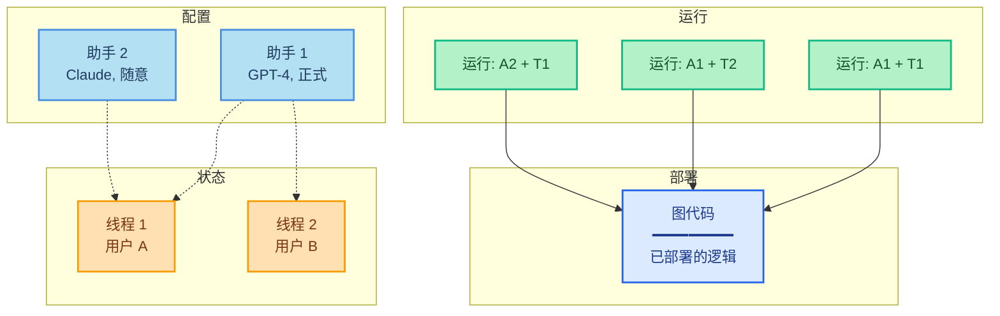

**运行**（run）是对[助手](/langsmith/assistants)的一次调用。执行运行时，您需要指定使用哪个助手——可以通过默认助手的图ID，或通过特定配置的助手ID来指定。

此图展示了**运行**如何将助手与线程结合以执行图：

- **图**（蓝色）：包含您智能体逻辑的已部署代码
- **助手**（浅蓝色）：配置选项（模型、提示词、工具）
- **线程**（橙色）：用于存储对话历史的状态容器
- **运行**（绿色）：将助手与线程配对执行

**组合示例：**
- **运行: A1 + T1**：将助手1的配置应用于用户A的对话
- **运行: A1 + T2**：同一助手服务用户B（不同对话）
- **运行: A2 + T1**：将不同助手应用于用户A的对话（配置切换）

执行运行时：

- 每个运行可以有自己的输入、配置覆盖和元数据。
- 运行可以是无状态的（无线程）或有状态的（在[线程](/langsmith/use-threads)上执行以实现对话持久化）。
- 多个运行可以使用相同的助手配置。
- 助手的配置会影响底层图的执行方式。

Agent Server API 提供了多个用于创建和管理运行的端点。更多详细信息，请参阅 [API 参考](/langsmith/server-api-ref)。

## 本节内容

<CardGroup cols={2}>
  <Card title="启动后台运行" icon="player-play" href="/langsmith/background-run">
    异步运行您的智能体并轮询结果。
  </Card>
  <Card title="在同一线程上运行多个智能体" icon="messages" href="/langsmith/same-thread">
    在共享线程上使用多个助手以结合智能体能力。
  </Card>
  <Card title="无状态运行" icon="player-skip-forward" href="/langsmith/stateless-runs">
    当不需要对话历史时，执行不持久化状态的运行。
  </Card>
  <Card title="取消运行" icon="player-stop" href="/langsmith/cancel-run">
    通过 API 取消单个运行或多个运行。
  </Card>
</CardGroup>