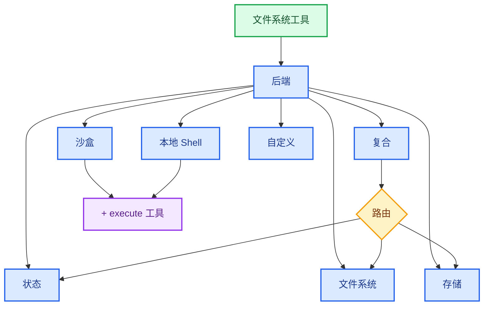

import BackendStatePy from '/snippets/backend-state-py.mdx';
import BackendStateJs from '/snippets/backend-state-js.mdx';
import BackendFilesystemPy from '/snippets/backend-filesystem-py.mdx';
import BackendFilesystemJs from '/snippets/backend-filesystem-js.mdx';
import BackendLocalShellPy from '/snippets/backend-local-shell-py.mdx';
import BackendLocalShellJs from '/snippets/backend-local-shell-js.mdx';
import BackendStorePy from '/snippets/backend-store-py.mdx';
import BackendStoreJs from '/snippets/backend-store-js.mdx';
import BackendCompositePy from '/snippets/backend-composite-py.mdx';
import BackendCompositeJs from '/snippets/backend-composite-js.mdx';

Deep Agents 通过 `ls`、`read_file`、`write_file`、`edit_file`、`glob` 和 `grep` 等工具向智能体暴露一个文件系统接口。这些工具通过可插拔的后端进行操作。`read_file` 工具在所有后端中均原生支持图像文件（`.png`、`.jpg`、`.jpeg`、`.gif`、`.webp`），并将其作为多模态内容块返回。

沙盒和 @[`LocalShellBackend`] 还提供了一个 `execute` 工具。



本页解释了如何[选择后端](#specify-a-backend)、[将不同路径路由到不同后端](#route-to-different-backends)、[实现您自己的虚拟文件系统](#use-a-virtual-filesystem)（例如 S3 或 Postgres）、[添加策略钩子](#add-policy-hooks)以及[遵守 `BackendProtocol`](#protocol-reference)。

## 快速开始

以下是几个预构建的文件系统后端，您可以快速与您的深度智能体一起使用：

| 内置后端 | 描述 |
|---|---|
| [默认](#statebackend-ephemeral) | `agent = create_deep_agent()` <br></br> 状态中的临时存储。智能体的默认文件系统后端存储在 `langgraph` 状态中。请注意，此文件系统仅在*单个线程内*持久化。 |
| [本地文件系统持久化](#filesystembackend-local-disk) | `agent = create_deep_agent(backend=FilesystemBackend(root_dir="/Users/nh/Desktop/"))` <br></br>这使深度智能体能够访问您本地机器的文件系统。您可以指定智能体有权访问的根目录。请注意，任何提供的 `root_dir` 必须是绝对路径。 |
| [持久化存储（LangGraph 存储）](#storebackend-langgraph-store) | `agent = create_deep_agent(backend=lambda rt: StoreBackend(rt))` <br></br>这使智能体能够访问*跨线程持久化*的长期存储。这对于存储长期记忆或适用于智能体多次执行的指令非常有用。 |
| [沙盒](/oss/deepagents/sandboxes) | `agent = create_deep_agent(backend=sandbox)` <br></br>在隔离环境中执行代码。沙盒提供文件系统工具以及用于运行 shell 命令的 `execute` 工具。可选择 Modal、Daytona、Deno 或本地 VFS。 |
| [本地 Shell](#localshellbackend-local-shell) | `agent = create_deep_agent(backend=LocalShellBackend(root_dir=".", env={"PATH": "/usr/bin:/bin"}))` <br></br>直接在主机上进行文件系统和 shell 执行。无隔离——仅在受控的开发环境中使用。请参阅下面的[安全注意事项](#localshellbackend-local-shell)。 |
| [复合](#compositebackend-router) | 默认临时存储，`/memories/` 持久化。复合后端具有最大的灵活性。您可以指定文件系统中的不同路由指向不同的后端。请参阅下面的复合路由示例，这是一个可直接粘贴的示例。 |


## 内置后端

### StateBackend（临时存储）

:::python
<BackendStatePy />
:::

:::js
<BackendStateJs />
:::

**工作原理：**
- 通过 @[`StateBackend`] 将文件存储在 LangGraph 智能体状态中，用于当前线程。
- 通过检查点在同一个线程的多次智能体轮次中持久化。

**最适合：**
- 作为智能体编写中间结果的暂存区。
- 自动驱逐大型工具输出，智能体可以随后分片读回。

请注意，此后端在监督智能体和子智能体之间共享，子智能体写入的任何文件在子智能体执行完成后仍将保留在 LangGraph 智能体状态中。这些文件将继续对监督智能体和其他子智能体可用。

### FilesystemBackend（本地磁盘）

@[`FilesystemBackend`] 在可配置的根目录下读取和写入真实文件。

<Warning>
此后端授予智能体直接的文件系统读写访问权限。
请谨慎使用，并仅在适当的环境中使用。

**适用场景：**
- 本地开发 CLI（编码助手、开发工具）
- CI/CD 流水线（请参阅下面的安全注意事项）

**不适用场景：**
- Web 服务器或 HTTP API - 请改用 `StateBackend`、`StoreBackend` 或[沙盒后端](/oss/deepagents/sandboxes)

**安全风险：**
- 智能体可以读取任何可访问的文件，包括机密信息（API 密钥、凭据、`.env` 文件）
- 结合网络工具，机密信息可能通过 SSRF 攻击被窃取
- 文件修改是永久且不可逆的

**推荐的安全措施：**
1. 启用[人在回路（HITL）中间件](/oss/deepagents/human-in-the-loop)以审查敏感操作。
2. 将机密信息排除在可访问的文件系统路径之外（尤其是在 CI/CD 中）。
3. 对于需要文件系统交互的生产环境，使用[沙盒后端](/oss/deepagents/sandboxes)。
4. **始终**将 `virtual_mode=True` 与 `root_dir` 一起使用，以启用基于路径的访问限制（阻止 `..`、`~` 以及根目录外的绝对路径）。
   请注意，默认设置（`virtual_mode=False`）即使设置了 `root_dir` 也不提供任何安全性。
</Warning>

:::python
<BackendFilesystemPy />
:::

:::js
<BackendFilesystemJs />
:::

**工作原理：**
- 在可配置的 `root_dir` 下读取/写入真实文件。
- 您可以选择设置 `virtual_mode=True` 以在 `root_dir` 下进行沙盒化和路径规范化。
- 使用安全的路径解析，尽可能防止不安全的符号链接遍历，可以使用 ripgrep 进行快速的 `grep`。

**最适合：**
- 您机器上的本地项目
- CI 沙盒
- 挂载的持久化卷

### LocalShellBackend（本地 Shell）

<Warning>
此后端授予智能体直接的文件系统读写访问权限**以及**在您主机上无限制的 shell 执行权限。
请极其谨慎地使用，并仅在适当的环境中使用。

**适用场景：**
- 本地开发 CLI（编码助手、开发工具）
- 您信任智能体代码的个人开发环境
- 具有适当机密管理的 CI/CD 流水线

**不适用场景：**
- 生产环境（例如 Web 服务器、API、多租户系统）
- 处理不受信任的用户输入或执行不受信任的代码

**安全风险：**
- 智能体可以使用您用户的权限执行**任意 shell 命令**
- 智能体可以读取任何可访问的文件，包括机密信息（API 密钥、凭据、`.env` 文件）
- 机密信息可能被暴露
- 文件修改和命令执行是**永久且不可逆的**
- 命令直接在您的主机系统上运行
- 命令可以消耗无限的 CPU、内存、磁盘

**推荐的安全措施：**
1. 启用[人在回路（HITL）中间件](/oss/deepagents/human-in-the-loop)以在执行前审查和批准操作。**强烈推荐**。
2. 仅在专用的开发环境中运行。切勿在共享或生产系统上使用。
3. 对于需要 shell 执行的生产环境，使用[沙盒后端](/oss/deepagents/sandboxes)。

**注意：** 启用 shell 访问后，`virtual_mode=True` 不提供任何安全性，因为命令可以访问系统上的任何路径。
</Warning>

:::python
<BackendLocalShellPy />
:::

:::js
<BackendLocalShellJs />
:::

**工作原理：**
- 扩展了 `FilesystemBackend`，增加了用于在主机上运行 shell 命令的 `execute` 工具。
- 命令使用 `subprocess.run(shell=True)` 直接在您的机器上运行，无沙盒化。
- 支持 `timeout`（默认 120 秒）、`max_output_bytes`（默认 100,000）、`env` 和 `inherit_env` 用于环境变量。
- Shell 命令使用 `root_dir` 作为工作目录，但可以访问系统上的任何路径。

**最适合：**
- 本地编码助手和开发工具
- 在您信任智能体时进行快速开发迭代

### StoreBackend（LangGraph 存储）

:::python
<BackendStorePy />
:::

:::js
<BackendStoreJs />
:::

<Tip>
    `namespace` 参数控制数据隔离。对于多用户部署，始终设置一个[命名空间工厂](/oss/deepagents/backends#namespace-factories)以按用户或租户隔离数据。
</Tip>

**工作原理：**
- @[`StoreBackend`] 将文件存储在运行时提供的 LangGraph @[`BaseStore`] 中，实现跨线程的持久化存储。

**最适合：**
- 当您已经运行配置了 LangGraph 存储时（例如，Redis、Postgres 或 @[`BaseStore`] 背后的云实现）。
- 当您通过 [LangSmith 部署](/langsmith/deployment) 部署您的智能体时（会自动为您的智能体配置存储）。

#### 命名空间工厂

命名空间工厂控制 `StoreBackend` 读取和写入数据的位置。它接收一个 `BackendContext` 并返回一个用作存储命名空间的字符串元组。使用命名空间工厂来隔离用户、租户或助手之间的数据。

```python
NamespaceFactory = Callable[[BackendContext], tuple[str, ...]]
```

`BackendContext` 提供：
- `ctx.runtime.context` — 通过 LangGraph 的[上下文模式](https://langchain-ai.github.io/langgraph/concepts/runtime/)传递的用户提供的上下文（例如，`user_id`）
- `ctx.state` — 当前智能体状态

对于 `assistant_id` 和 `thread_id`，请在工厂内部使用 `langgraph.config.get_config()` — 这些在 LangGraph 配置元数据中可用，但不在上下文模式中。

**常见的命名空间模式：**

:::python
```python
from langgraph.config import get_config
from deepagents.backends import StoreBackend

# 按用户：每个用户获得自己隔离的存储
backend = lambda rt: StoreBackend(
    rt,
    namespace=lambda ctx: (ctx.runtime.context.user_id,),
)

# 按助手：同一助手的所有用户共享存储
backend = lambda rt: StoreBackend(
    rt,
    namespace=lambda ctx: (
        get_config()["metadata"]["assistant_id"],
    ),
)

# 按线程：存储范围限定为单个对话
backend = lambda rt: StoreBackend(
    rt,
    namespace=lambda ctx: (
        get_config()["configurable"]["thread_id"],
    ),
)
```
:::

:::js
```typescript
import { getConfig } from "@langchain/langgraph";
import { StoreBackend } from "deepagents";

// 按用户：每个用户获得自己隔离的存储
const backend = (rt) => new StoreBackend(rt, {
  namespace: (ctx) => [ctx.runtime.context.userId],
});

// 按助手：同一助手的所有用户共享存储
const backend = (rt) => new StoreBackend(rt, {
  namespace: (ctx) => {
    const config = getConfig();
    return [config.metadata.assistantId];
  },
});

// 按线程：存储范围限定为单个对话
const backend = (rt) => new StoreBackend(rt, {
  namespace: (ctx) => {
    const config = getConfig();
    return [config.configurable.threadId];
  },
});
```
:::

您可以组合多个组件来创建更具体的范围 — 例如，`(user_id, thread_id)` 用于按用户按对话隔离，或者附加后缀如 `"filesystem"` 以在相同范围使用多个存储命名空间时进行区分。

命名空间组件只能包含字母数字字符、连字符、下划线、点、`@`、`+`、冒号和波浪号。通配符（`*`、`?`）会被拒绝以防止 glob 注入。

:::python
<Warning>
    `namespace` 参数在 v0.5.0 中将成为**必需项**。对于新代码，请始终显式设置它。
</Warning>
:::
:::js
<Warning>
    `namespace` 参数在 v1.9.0 中将成为**必需项**。对于新代码，请始终显式设置它。
</Warning>
:::

<Note>
    当未提供命名空间工厂时，遗留的默认值使用 LangGraph 配置元数据中的 `assistant_id`。这意味着同一[助手](/langsmith/assistants)的所有用户共享相同的存储。对于多用户[投入生产](/oss/deepagents/going-to-production)，请始终提供命名空间工厂。
</Note>

### CompositeBackend（路由器）

:::python
<BackendCompositePy />
:::

:::js
<BackendCompositeJs />
:::

**工作原理：**
- @[`CompositeBackend`] 根据路径前缀将文件操作路由到不同的后端。
- 在列表和搜索结果中保留原始路径前缀。

**最适合：**
- 当您希望为智能体同时提供临时和跨线程存储时，`CompositeBackend` 允许您同时提供 `StateBackend` 和 `StoreBackend`
- 当您有多个信息源希望作为单个文件系统的一部分提供给智能体时。
    - 例如，您在一个 Store 的 `/memories/` 下存储了长期记忆，并且还有一个自定义后端，在 `/docs/` 下可访问文档。

## 指定后端

- 将后端传递给 `create_deep_agent(backend=...)`。文件系统中间件将其用于所有工具。
- 您可以传递：
    - 一个实现 `BackendProtocol` 的实例（例如，`FilesystemBackend(root_dir=".")`），或者
    - 一个工厂函数 `BackendFactory = Callable[[ToolRuntime], BackendProtocol]`（适用于需要运行时的后端，如 `StateBackend` 或 `StoreBackend`）。
- 如果省略，默认为 `lambda rt: StateBackend(rt)`。

## 路由到不同后端

将命名空间的部分路由到不同的后端。通常用于持久化 `/memories/*` 并保持其他所有内容为临时存储。

:::python
```python
from deepagents import create_deep_agent
from deepagents.backends import CompositeBackend, StateBackend, FilesystemBackend

composite_backend = lambda rt: CompositeBackend(
    default=StateBackend(rt),
    routes={
        "/memories/": FilesystemBackend(root_dir="/deepagents/myagent", virtual_mode=True),
    },
)

agent = create_deep_agent(backend=composite_backend)
```
:::

:::js
```typescript
import { createDeepAgent, CompositeBackend, FilesystemBackend, StateBackend } from "deepagents";

const compositeBackend = (rt) => new CompositeBackend(
  new StateBackend(rt),
  {
    "/memories/": new FilesystemBackend({ rootDir: "/deepagents/myagent", virtualMode: true }),
  },
);

const agent = createDeepAgent({ backend: compositeBackend });
```
:::

行为：
- `/workspace/plan.md` → `StateBackend`（临时存储）
- `/memories/agent.md` → `FilesystemBackend` 下的 `/deepagents/myagent`
- `ls`、`glob`、`grep` 聚合结果并显示原始路径前缀。

注意：
- 更长的前缀优先（例如，路由 `"/memories/projects/"` 可以覆盖 `"/memories/"`）。
- 对于 StoreBackend 路由，请确保智能体运行时提供了存储（`runtime.store`）。

## 使用虚拟文件系统

构建自定义后端，将远程或数据库文件系统（例如 S3 或 Postgres）投影到工具命名空间中。

设计指南：

- 路径是绝对的（`/x/y.txt`）。决定如何将它们映射到您的存储键/行。
- 高效实现 `ls_info` 和 `glob_info`（在可用时使用服务器端列表，否则使用本地过滤器）。
- 对于缺失文件或无效正则表达式模式，返回用户可读的错误字符串。
- 对于外部持久化，在结果中设置 `files_update=None`；只有状态后端应返回 `files_update` 字典。

S3 风格示例：

:::python
```python
from deepagents.backends.protocol import BackendProtocol, WriteResult, EditResult
from deepagents.backends.utils import FileInfo, GrepMatch

class S3Backend(BackendProtocol):
    def __init__(self, bucket: str, prefix: str = ""):
        self.bucket = bucket
        self.prefix = prefix.rstrip("/")

    def _key(self, path: str) -> str:
        return f"{self.prefix}{path}"

    def ls_info(self, path: str) -> list[FileInfo]:
        # 列出 _key(path) 下的对象；构建 FileInfo 条目（path, size, modified_at）
        ...

    def read(self, file_path: str, offset: int = 0, limit: int = 2000) -> str:
        # 获取对象；返回带行号的内容或错误字符串
        ...

    def grep_raw(self, pattern: str, path: str | None = None, glob: str | None = None) -> list[GrepMatch] | str:
        # 可选地服务器端过滤；否则列出并扫描内容
        ...

    def glob_info(self, pattern: str, path: str = "/") -> list[FileInfo]:
        # 在键之间应用相对于路径的 glob
        ...

    def write(self, file_path: str, content: str) -> WriteResult:
        # 强制执行仅创建语义；返回 WriteResult(path=file_path, files_update=None)
        ...

    def edit(self, file_path: str, old_string: str, new_string: str, replace_all: bool = False) -> EditResult:
        # 读取 → 替换（根据唯一性与 replace_all 进行）→ 写入 → 返回出现次数
        ...
```
:::

Postgres 风格示例：

- 表 `files(path text primary key, content text, created_at timestamptz, modified_at timestamptz)`
- 将工具操作映射到 SQL：
  - `ls_info` 使用 `WHERE path LIKE $1 || '%'`
  - `glob_info` 在 SQL 中过滤或获取后在 Python 中应用 glob
  - `grep_raw` 可以通过扩展名或最后修改时间获取候选行，然后扫描行

## 添加策略钩子

通过子类化或包装后端来强制执行企业规则。

阻止在选定前缀下写入/编辑（子类化）：

:::python
```python
from deepagents.backends.filesystem import FilesystemBackend
from deepagents.backends.protocol import WriteResult, EditResult

class GuardedBackend(FilesystemBackend):
    def __init__(self, *, deny_prefixes: list[str], **kwargs):
        super().__init__(**kwargs)
        self.deny_prefixes = [p if p.endswith("/") else p + "/" for p in deny_prefixes]

    def write(self, file_path: str, content: str) -> WriteResult:
        if any(file_path.startswith(p) for p in self.deny_prefixes):
            return WriteResult(error=f"不允许在 {file_path} 下写入")
        return super().write(file_path, content)

    def edit(self, file_path: str, old_string: str, new_string: str, replace_all: bool = False) -> EditResult:
        if any(file_path.startswith(p) for p in self.deny_prefixes):
            return EditResult(error=f"不允许在 {file_path} 下编辑")
        return super().edit(file_path, old_string, new_string, replace_all)
```
:::

通用包装器（适用于任何后端）：

:::python
```python
from deepagents.backends.protocol import BackendProtocol, WriteResult, EditResult
from deepagents.backends.utils import FileInfo, GrepMatch

class PolicyWrapper(BackendProtocol):
    def __init__(self, inner: BackendProtocol, deny_prefixes: list[str] | None = None):
        self.inner = inner
        self.deny_prefixes = [p if p.endswith("/") else p + "/" for p in (deny_prefixes or [])]

    def _deny(self, path: str) -> bool:
        return any(path.startswith(p) for p in self.deny_prefixes)

    def ls_info(self, path: str) -> list[FileInfo]:
        return self.inner.ls_info(path)
    def read(self, file_path: str, offset: int = 0, limit: int = 2000) -> str:
        return self.inner.read(file_path, offset=offset, limit=limit)
    def grep_raw(self, pattern: str, path: str | None = None, glob: str | None = None) -> list[GrepMatch] | str:
        return self.inner.grep_raw(pattern, path, glob)
    def glob_info(self, pattern: str, path: str = "/") -> list[FileInfo]:
        return self.inner.glob_info(pattern, path)
    def write(self, file_path: str, content: str) -> WriteResult:
        if self._deny(file_path):
            return WriteResult(error=f"不允许在 {file_path} 下写入")
        return self.inner.write(file_path, content)
    def edit(self, file_path: str, old_string: str, new_string: str, replace_all: bool = False) -> EditResult:
        if self._deny(file_path):
            return EditResult(error=f"不允许在 {file_path} 下编辑")
        return self.inner.edit(file_path, old_string, new_string, replace_all)
```
:::

## 协议参考

后端必须实现 @[`BackendProtocol`]。

必需的端点：
- `ls_info(path: str) -> list[FileInfo]`
  - 返回至少包含 `path` 的条目。在可用时包含 `is_dir`、`size`、`modified_at`。按 `path` 排序以获得确定性输出。
- `read(file_path: str, offset: int = 0, limit: int = 2000) -> str`
  - 返回带行号的内容。文件缺失时，返回 `"Error: File '/x' not found"`。
- `grep_raw(pattern: str, path: Optional[str] = None, glob: Optional[str] = None) -> list[GrepMatch] | str`
  - 返回结构化匹配项。对于无效的正则表达式，返回类似 `"Invalid regex pattern: ..."` 的字符串（不要引发异常）。
- `glob_info(pattern: str, path: str = "/") -> list[FileInfo]`
  - 返回匹配的文件作为 `FileInfo` 条目（如果没有则返回空列表）。
- `write(file_path: str, content: str) -> WriteResult`
  - 仅创建。冲突时，返回 `WriteResult(error=...)`。成功时，设置 `path`，对于状态后端设置 `files_update={...}`；外部后端应使用 `files_update=None`。
- `edit(file_path: str, old_string: str, new_string: str, replace_all: bool = False) -> EditResult`
  - 除非 `replace_all=True`，否则强制执行 `old_string` 的唯一性。如果未找到，返回错误。成功时包含 `occurrences`。

支持的类型：
- `WriteResult(error, path, files_update)`
- `EditResult(error, path, files_update, occurrences)`
- `FileInfo` 包含字段：`path`（必需），可选地 `is_dir`、`size`、`modified_at`。
- `GrepMatch` 包含字段：`path`、`line`、`text`。