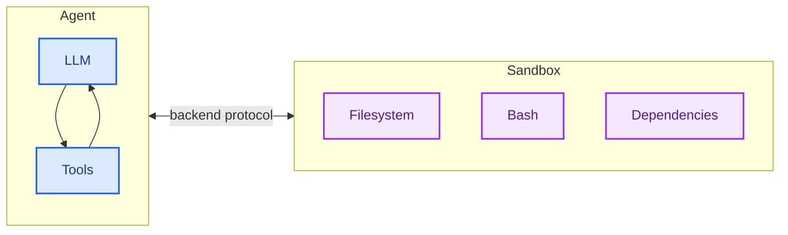
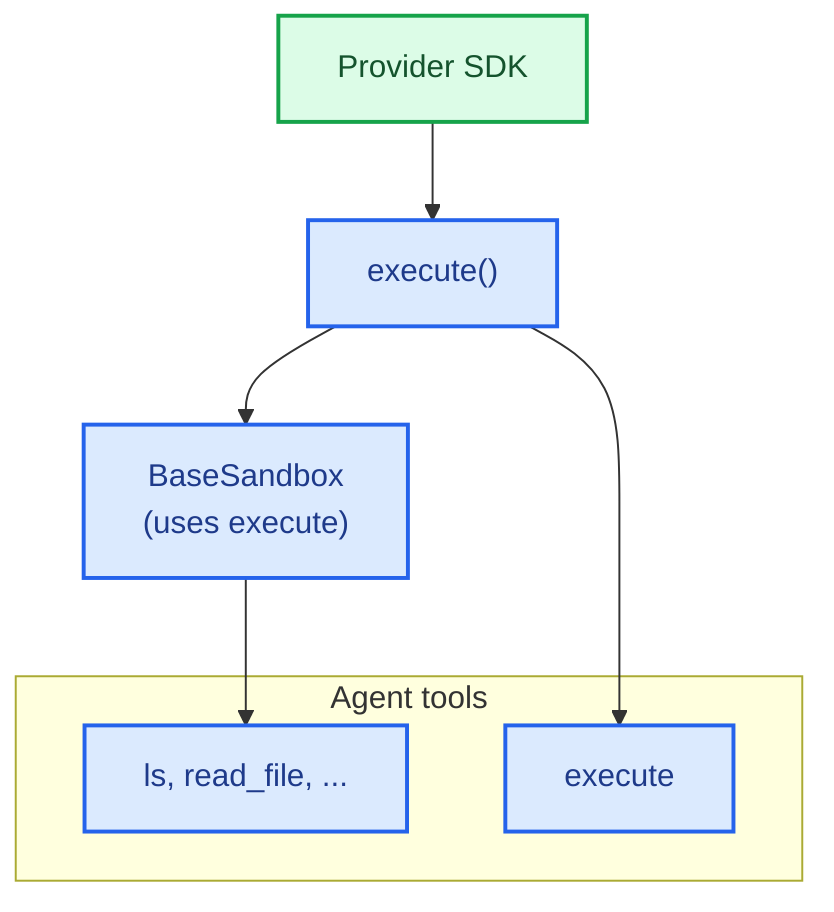
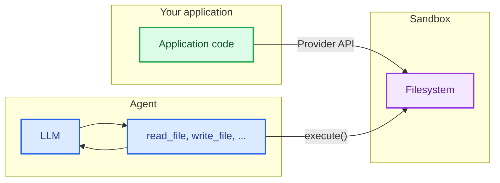

import SandboxBasicPy from '/snippets/deepagents-sandbox-basic-py.mdx';
import SandboxBasicJs from '/snippets/deepagents-sandbox-basic-js.mdx';

智能体会生成代码、与文件系统交互并运行 shell 命令。由于我们无法预测智能体可能执行的操作，因此将其环境隔离起来至关重要，以防止其访问凭据、文件或网络。沙盒通过在智能体的执行环境与您的主机系统之间建立边界来提供这种隔离。

在 Deep Agents 中，**沙盒是定义智能体运行环境的[后端](/oss/deepagents/backends)**。与其他仅暴露文件操作的后端（State、Filesystem、Store）不同，沙盒后端还为智能体提供了一个用于运行 shell 命令的 `execute` 工具。当您配置沙盒后端时，智能体将获得：

- 所有标准文件系统工具（`ls`、`read_file`、`write_file`、`edit_file`、`glob`、`grep`）
- 用于在沙盒中运行任意 shell 命令的 `execute` 工具
- 保护您主机系统的安全边界



## 为什么使用沙盒？

沙盒用于安全目的。
它们允许智能体执行任意代码、访问文件和使用网络，而不会危及您的凭据、本地文件或主机系统。
当智能体自主运行时，这种隔离至关重要。

沙盒特别适用于：

- 编码智能体：自主运行的智能体可以使用 shell、git、克隆仓库（许多提供商提供原生 git API，例如 [Daytona 的 git 操作](https://www.daytona.io/docs/en/git-operations/)），并运行 Docker-in-Docker 用于构建和测试流水线
- 数据分析智能体——在安全、隔离的环境中加载文件、安装数据分析库（pandas、numpy 等）、运行统计计算并创建 PowerPoint 演示文稿等输出

<Tip>
    **使用 Deep Agents CLI 吗？** CLI 通过 `--sandbox` 标志提供内置的沙盒支持。有关 CLI 特定的设置、标志（`--sandbox-id`、`--sandbox-setup`）和示例，请参阅[使用远程沙盒](/oss/deepagents/cli/overview#use-remote-sandboxes)。
</Tip>

## 可用提供商

有关提供商特定的设置、身份验证和生命周期详细信息，请参阅提供商集成页面：

:::js

<CardGroup cols={2}>
    <Card title="Modal" icon="/images/providers/modal-icon.svg" href="/oss/integrations/providers/modal">
        ML/AI 工作负载，GPU 访问，Python。
    </Card>
    <Card title="Daytona" icon="/images/providers/daytona-icon.svg" href="/oss/integrations/providers/daytona">
        TypeScript/Python 开发，快速冷启动。
    </Card>
    <Card title="Deno" icon="/images/providers/deno-icon.svg" href="/oss/integrations/providers/deno">
        Deno/JavaScript 工作负载，微虚拟机。
    </Card>
    <Card title="Node VFS" icon="/images/providers/nodejs-icon.svg" href="/oss/integrations/providers/node-vfs">
        本地开发、测试，无需云服务。
    </Card>
</CardGroup>
:::

:::python
<CardGroup cols={2}>
    <Card title="AgentCore" icon="/images/providers/agentcore-icon.svg" href="/oss/integrations/providers/aws#sandboxes">
        AWS 微虚拟机隔离，代码解释器，Python。
    </Card>
    <Card title="Modal" icon="/images/providers/modal-icon.svg" href="/oss/integrations/providers/modal">
        ML/AI 工作负载，GPU 访问。
    </Card>
    <Card title="Daytona" icon="/images/providers/daytona-icon.svg" href="/oss/integrations/providers/daytona">
        TypeScript/Python 开发，快速冷启动。
    </Card>
    <Card title="Runloop" href="/oss/integrations/providers/runloop">
        用于隔离代码执行的临时开发环境。
    </Card>
</CardGroup>
:::

如果您提供沙盒平台并希望贡献集成，请参阅[贡献沙盒集成](/oss/contributing/integrations-langchain)。

## 基本用法

这些示例假设您已使用提供商的 SDK 创建了沙盒/开发环境，并已设置好凭据。有关注册、身份验证和提供商特定的生命周期详细信息，请参阅[可用提供商](#available-providers)。

:::js
<SandboxBasicJs />
:::

:::python
<SandboxBasicPy />
:::

## 生命周期和作用域

沙盒会消耗资源并产生费用，直到被关闭。如何管理其生命周期取决于您的应用程序。

选择沙盒生命周期如何映射到您的应用程序资源。有关此决策的更多信息，请参阅[投入生产](/oss/deepagents/going-to-production#sandboxes)。

### 线程作用域（默认）

每个对话都有自己的沙盒。沙盒在第一次运行时创建，并在同一线程的后续消息中重复使用。当线程被清理（或沙盒 TTL 过期）时，沙盒将被销毁。这是大多数智能体的正确默认设置。

示例：一个数据分析机器人，每个对话都从一个干净的环境开始。

### 助手作用域

给定[助手](/langsmith/assistants)的所有线程共享一个沙盒。沙盒 ID 存储在助手的配置中，因此每次对话都会返回到相同的环境。文件、已安装的包和克隆的仓库在对话之间持久存在。当智能体需要维护一个长期运行的工作空间时使用此模式。

示例：一个编码助手，在对话之间维护一个克隆的仓库和已安装的依赖项。

<Warning>
    助手作用域的沙盒会随着时间的推移积累文件、已安装的包和其他沙盒内部状态。请配置沙盒提供商的 TTL，定期使用快照重置，或实现清理逻辑，以防止沙盒的磁盘和内存无限增长。线程作用域的沙盒通过每次对话都重新开始来避免此问题。
</Warning>

### 基本生命周期

:::js

```typescript
// 创建并初始化
const sandbox = await ModalSandbox.create(options);

// 使用沙盒（直接或通过智能体）
const result = await sandbox.execute("echo hello");

// 完成后清理
await sandbox.close();
```
:::

:::python

<Tabs>
  <Tab title="AgentCore">

```python
from bedrock_agentcore.tools.code_interpreter_client import CodeInterpreter

from langchain_agentcore_codeinterpreter import AgentCoreSandbox

interpreter = CodeInterpreter(region="us-west-2")
interpreter.start()

backend = AgentCoreSandbox(interpreter=interpreter)

result = backend.execute("echo hello")
# ... 使用沙盒
interpreter.stop()
```

  </Tab>
  <Tab title="Modal">

```python
import modal

from langchain_modal import ModalSandbox

app = modal.App.lookup("your-app")
modal_sandbox = modal.Sandbox.create(app=app)
backend = ModalSandbox(sandbox=modal_sandbox)

result = backend.execute("echo hello")
# ... 使用沙盒
modal_sandbox.terminate()
```

  </Tab>
  <Tab title="Runloop">

```python
from runloop_api_client import RunloopSDK

from langchain_runloop import RunloopSandbox

client = RunloopSDK(bearer_token="...")
devbox = client.devbox.create()
backend = RunloopSandbox(devbox=devbox)

result = backend.execute("echo hello")
# ... 使用沙盒
devbox.shutdown()
```

  </Tab>
  <Tab title="Daytona">

```python
from daytona import Daytona

from langchain_daytona import DaytonaSandbox

sandbox = Daytona().create()
backend = DaytonaSandbox(sandbox=sandbox)

result = backend.execute("echo hello")
# ... 使用沙盒
sandbox.stop()
```

  </Tab>
</Tabs>
:::

### 每次对话的生命周期

在聊天应用程序中，对话通常由 `thread_id` 表示。
通常，每个 `thread_id` 应使用自己唯一的沙盒。

将沙盒 ID 和 `thread_id` 之间的映射存储在您的应用程序中，或者如果沙盒提供商允许，将其附加到沙盒的元数据中。

<Tip>
**聊天应用程序的 TTL。** 当用户可能在空闲时间后重新参与时，您通常不知道他们是否会返回或何时返回。在沙盒上配置生存时间（TTL）——例如，存档 TTL 或删除 TTL——以便提供商自动清理空闲的沙盒。许多沙盒提供商支持此功能。
</Tip>

:::python

以下示例展示了使用 Daytona 的获取或创建模式。
对于其他提供商，请查阅沙盒提供商 API 以获取等效的标签、元数据和 TTL 选项：

```python
import uuid

from daytona import CreateSandboxFromSnapshotParams, Daytona
from deepagents import create_deep_agent
from langchain_daytona import DaytonaSandbox

client = Daytona()
thread_id = str(uuid.uuid4())

# 按 thread_id 获取或创建沙盒
try:
    sandbox = client.find_one(labels={"thread_id": thread_id})
except Exception:
    params = CreateSandboxFromSnapshotParams(
        labels={"thread_id": thread_id},
        # 添加 TTL 以便在空闲时清理沙盒
        auto_delete_interval=3600,
    )
    sandbox = client.create(params)

backend = DaytonaSandbox(sandbox=sandbox)
agent = create_deep_agent(
    backend=backend,
    system_prompt="You are a coding assistant with sandbox access. You can create and run code in the sandbox.",
)

try:
    result = agent.invoke(
        {
            "messages": [
                {
                    "role": "user",
                    "content": "Create a hello world Python script and run it",
                }
            ]
        },
        config={
            "configurable": {
                "thread_id": thread_id,
            }
        },
    )
    print(result["messages"][-1].content)
except Exception:
    # 可选：在发生异常时主动删除沙盒
    client.delete(sandbox)
    raise
```

:::

:::js

```typescript
import "dotenv/config";
import { randomUUID } from "node:crypto";
import { Daytona } from "@daytonaio/sdk";
import type { CreateSandboxFromSnapshotParams } from "@daytonaio/sdk";
import { DaytonaSandbox } from "@langchain/daytona";
import { createDeepAgent } from "deepagents";

const client = new Daytona();
const threadId = randomUUID();

// 按 thread_id 获取或创建沙盒
let sandbox;
try {
    sandbox = await client.findOne({ labels: { thread_id: threadId } });
} catch {
    const params: CreateSandboxFromSnapshotParams = {
        labels: { thread_id: threadId },
        // 添加 TTL 以便在空闲时清理沙盒（分钟）
        autoDeleteInterval: 3600,
    };
sandbox = await client.create(params);
}

const backend = await DaytonaSandbox.fromId(sandbox.id);
const agent = createDeepAgent({
    backend,
    systemPrompt:
        "You are a coding assistant with sandbox access. You can create and run code in the sandbox.",
});

try {
    const result = await agent.invoke(
        {
            messages: [
                {
                role: "user",
                content: "Create a hello world Python script and run it",
                },
            ],
        },
        {
            configurable: {
                thread_id: threadId,
            },
        },
    );
    const lastMessage = result.messages[result.messages.length - 1];
    console.log(
        typeof lastMessage.content === "string"
        ? lastMessage.content
        : String(lastMessage.content),
    );
} catch (err) {
    // 可选：在发生异常时主动删除沙盒
    await client.delete(sandbox);
    throw err;
}
```

:::

## 集成模式

根据智能体运行的位置，有两种将智能体与沙盒集成的架构模式。

### 智能体在沙盒内模式

智能体在沙盒内运行，您通过网络与其通信。您构建一个预装了智能体框架的 Docker 或虚拟机镜像，在沙盒内运行它，并从外部连接以发送消息。

优点：

- ✅ 与本地开发环境高度相似。
- ✅ 智能体与环境紧密耦合。

权衡：

- 🔴 API 密钥必须存在于沙盒内（安全风险）。
- 🔴 更新需要重新构建镜像。
- 🔴 需要用于通信的基础设施（WebSocket 或 HTTP 层）。

要在沙盒内运行智能体，请构建一个镜像并在其上安装 deepagents。

```dockerfile
FROM python:3.11
RUN pip install deepagents-cli
```

然后在沙盒内运行智能体。
要使用沙盒内的智能体，您必须添加额外的基础设施来处理您的应用程序与沙盒内智能体之间的通信。

### 沙盒作为工具模式

智能体在您的机器或服务器上运行。当需要执行代码时，它调用沙盒工具（如 `execute`、`read_file` 或 `write_file`），这些工具调用提供商的 API 在远程沙盒中运行操作。

优点：

- ✅ 无需重新构建镜像即可即时更新智能体代码。
- ✅ 智能体状态与执行之间更清晰的分离。
    - API 密钥保留在沙盒外部。
    - 沙盒故障不会丢失智能体状态。
    - 可以选择在多个沙盒中并行运行任务。
- ✅ 仅按执行时间付费。

权衡：

- 🔴 每次执行调用都有网络延迟。

示例：

:::python

```python
from daytona import Daytona
from deepagents import create_deep_agent
from dotenv import load_dotenv
from langchain_daytona import DaytonaSandbox


load_dotenv()

# 也可以使用 AgentCore、E2B、Runloop、Modal 实现
sandbox = Daytona().create()
backend = DaytonaSandbox(sandbox=sandbox)

agent = create_deep_agent(
    backend=backend,
    system_prompt="You are a coding assistant with sandbox access. You can create and run code in the sandbox.",
)

try:
    result = agent.invoke(
        {
            "messages": [
                {
                    "role": "user",
                    "content": "Create a hello world Python script and run it",
                }
            ]
        }
    )
    print(result["messages"][-1].content)
except Exception:
    # 可选：在发生异常时主动删除沙盒
    sandbox.stop()
    raise
```

:::

:::js

```typescript
import "dotenv/config";
import { DaytonaSandbox } from "@langchain/daytona";
import { createDeepAgent } from "deepagents";

// 也可以使用 E2B、Runloop、Modal 实现
const sandbox = await DaytonaSandbox.create();

const agent = createDeepAgent({
  backend: sandbox,
  systemPrompt:
    "You are a coding assistant with sandbox access. You can create and run code in the sandbox.",
});

try {
  const result = await agent.invoke({
    messages: [
      {
        role: "user",
        content: "Create a hello world Python script and run it",
      },
    ],
  });
  const lastMessage = result.messages[result.messages.length - 1];
  console.log(
    typeof lastMessage.content === "string"
      ? lastMessage.content
      : String(lastMessage.content),
  );
} finally {
  // 可选：当智能体完成时主动删除沙盒
  await sandbox.close();
  throw err;
}
```

:::

本文档中的示例使用沙盒作为工具模式。
当您的提供商的 SDK 处理通信层并且您希望生产环境镜像本地开发时，请选择智能体在沙盒内模式。
当您需要快速迭代智能体逻辑、将 API 密钥保留在沙盒外部或偏好更清晰的关注点分离时，请选择沙盒作为工具模式。

## 可用提供商

有关提供商特定的设置、身份验证和生命周期详细信息，请参阅提供商集成页面：

:::js

<CardGroup cols={2}>
    <Card title="Modal" icon="/images/providers/modal-icon.svg" href="/oss/integrations/providers/modal">
        ML/AI 工作负载，GPU 访问，Python。
    </Card>
    <Card title="Daytona" icon="/images/providers/daytona-icon.svg" href="/oss/integrations/providers/daytona">
        TypeScript/Python 开发，快速冷启动。
    </Card>
    <Card title="Deno" icon="/images/providers/deno-icon.svg" href="/oss/integrations/providers/deno">
        Deno/JavaScript 工作负载，微虚拟机。
    </Card>
    <Card title="Node VFS" icon="/images/providers/nodejs-icon.svg" href="/oss/integrations/providers/node-vfs">
        本地开发、测试，无需云服务。
    </Card>
</CardGroup>
:::

:::python
<CardGroup cols={2}>
    <Card title="AgentCore" icon="/images/providers/agentcore-icon.svg" href="/oss/integrations/sandboxes/aws">
        AWS 微虚拟机隔离，代码解释器，Python。
    </Card>
    <Card title="Modal" icon="/images/providers/modal-icon.svg" href="/oss/integrations/sandboxes/modal">
        ML/AI 工作负载，GPU 访问。
    </Card>
    <Card title="Daytona" icon="/images/providers/daytona-icon.svg" href="/oss/integrations/sandboxes/daytona">
        TypeScript/Python 开发，快速冷启动。
    </Card>
    <Card title="Runloop" href="/oss/integrations/sandboxes/runloop">
        用于隔离代码执行的临时开发环境。
    </Card>
</CardGroup>
:::

如果您提供沙盒平台并希望贡献集成，请参阅[贡献沙盒集成](/oss/contributing/integrations-langchain)。

## 沙盒如何工作

### 隔离边界

所有沙盒提供商都保护您的主机系统免受智能体的文件系统和 shell 操作的影响。智能体无法读取您的本地文件、访问您机器上的环境变量或干扰其他进程。然而，仅凭沙盒**无法**防范：

- **上下文注入**：控制智能体部分输入的攻击者可以指示其在沙盒内运行任意命令。沙盒是隔离的，但智能体在其中拥有完全控制权。
- **网络数据外泄**：除非网络访问被阻止，否则上下文注入的智能体可以通过 HTTP 或 DNS 将数据从沙盒中发送出去。一些提供商支持阻止网络访问（例如，Modal 上的 `blockNetwork: true`）。

有关如何处理机密和缓解这些风险的信息，请参阅[安全注意事项](#security-considerations)。

### `execute` 方法

沙盒后端具有简单的架构：提供商必须实现的唯一方法是 `execute()`，它运行 shell 命令并返回其输出。所有其他文件系统操作（`read`、`write`、`edit`、`ls`、`glob`、`grep`）都由 @[`BaseSandbox`] 基类在 `execute()` 之上构建，该基类通过 `execute()` 在沙盒内构造脚本并运行它们。



这种设计意味着：
- **添加新提供商很简单。** 实现 `execute()`——基类处理其他所有事情。
- **`execute` 工具是有条件可用的。** 在每次模型调用时，框架会检查后端是否实现了 @[`SandboxBackendProtocol`]。如果没有，该工具将被过滤掉，智能体永远不会看到它。

当智能体调用 `execute` 工具时，它提供一个 `command` 字符串，并返回合并的 stdout/stderr、退出代码，以及如果输出过大时的截断通知。

您也可以在应用程序代码中直接调用后端的 `execute()` 方法。

:::python
<Tabs>
  <Tab title="AgentCore">

    <CodeGroup>
    ```bash pip
    pip install langchain-agentcore-codeinterpreter
    ```

    ```bash uv
    uv add langchain-agentcore-codeinterpreter
    ```
    </CodeGroup>

    ```python
    from bedrock_agentcore.tools.code_interpreter_client import CodeInterpreter

    from langchain_agentcore_codeinterpreter import AgentCoreSandbox

    interpreter = CodeInterpreter(region="us-west-2")
    interpreter.start()

    backend = AgentCoreSandbox(interpreter=interpreter)

    try:
        result = backend.execute("python3 --version")
        print(result.output)
    finally:
        interpreter.stop()
    ```

  </Tab>
  <Tab title="Modal">

```python
import modal

from langchain_modal import ModalSandbox

app = modal.App.lookup("your-app")
modal_sandbox = modal.Sandbox.create(app=app)
backend = ModalSandbox(sandbox=modal_sandbox)

result = backend.execute("python --version")
print(result.output)
```

  </Tab>
  <Tab title="Runloop">

<CodeGroup>
```bash pip
pip install langchain-runloop
```

```bash uv
uv add langchain-runloop
```
</CodeGroup>

```python
from runloop_api_client import RunloopSDK

from langchain_runloop import RunloopSandbox

api_key = "..."
client = RunloopSDK(bearer_token=api_key)

devbox = client.devbox.create()
backend = RunloopSandbox(devbox=devbox)

try:
    result = backend.execute("python --version")
    print(result.output)
finally:
    devbox.shutdown()
```

  </Tab>
  <Tab title="Daytona">

<CodeGroup>
```bash pip
pip install langchain-daytona
```

```bash uv
uv add langchain-daytona
```
</CodeGroup>

```python
from daytona import Daytona

from langchain_daytona import DaytonaSandbox

sandbox = Daytona().create()
backend = DaytonaSandbox(sandbox=sandbox)

result = backend.execute("python --version")
print(result.output)
```

  </Tab>
</Tabs>
:::

例如：

```
4
[Command succeeded with exit code 0]
```

```
bash: foobar: command not found
[Command failed with exit code 127]
```

如果命令产生非常大的输出，结果会自动保存到文件中，并指示智能体使用 `read_file` 来增量访问它。这可以防止上下文窗口溢出。

### 文件访问的两个层面

文件进出沙盒有两种不同的方式，了解何时使用每种方式很重要：

**智能体文件系统工具**：`read_file`、`write_file`、`edit_file`、`ls`、`glob`、`grep` 和 `execute` 是 LLM 在执行期间调用的工具。这些工具通过沙盒内的 `execute()` 进行。智能体使用它们来读取代码、写入文件和运行命令作为其任务的一部分。

**文件传输 API**：您的应用程序代码调用的 `uploadFiles()` 和 `downloadFiles()` 方法。这些方法使用提供商的原生文件传输 API（而非 shell 命令），旨在在您的主机环境和沙盒之间移动文件。使用这些方法来：
- **在智能体运行之前**，用源代码、配置或数据**初始化沙盒**
- **在智能体完成后**，**检索工件**（生成的代码、构建输出、报告）
- **预填充**智能体将需要的**依赖项**



:::js
## 处理文件

### 初始化沙盒

在智能体运行之前，使用 `uploadFiles()` 来填充沙盒。文件内容以 `Uint8Array` 形式提供：

```typescript
const encoder = new TextEncoder();
const responses = await sandbox.uploadFiles([
  ["src/index.js", encoder.encode("console.log('Hello')")],
  ["package.json", encoder.encode('{"name": "my-app"}')],
]);

// 每个响应指示成功或失败
for (const res of responses) {
  if (res.error) {
    console.error(`Failed to upload ${res.path}: ${res.error}`);
  }
}
```

### 检索工件

在智能体完成后，使用 `downloadFiles()` 从沙盒中检索文件：

```typescript
const results = await sandbox.downloadFiles(["src/index.js", "output.txt"]);

const decoder = new TextDecoder();
for (const result of results) {
  if (result.content) {
    console.log(`${result.path}: ${decoder.decode(result.content)}`);
  } else {
    console.error(`Failed to download ${result.path}: ${result.error}`);
  }
}
```

<Note>
在沙盒内部，智能体使用自己的文件系统工具（`read_file`、`write_file`），而不是 `uploadFiles` 或 `downloadFiles`。这些方法供您的应用程序代码在您的主机和沙盒之间的边界上移动文件。
</Note>
:::

:::python
## 处理文件

deepagents 沙盒后端支持文件传输 API，用于在您的应用程序和沙盒之间移动文件。

### 初始化沙盒

在智能体运行之前，使用 `upload_files()` 来填充沙盒。路径必须是绝对路径，内容为 `bytes`：

<Tabs>
  <Tab title="AgentCore">

    <CodeGroup>
    ```bash pip
    pip install langchain-agentcore-codeinterpreter
    ```

    ```bash uv
    uv add langchain-agentcore-codeinterpreter
    ```
    </CodeGroup>

    ```python
    from bedrock_agentcore.tools.code_interpreter_client import CodeInterpreter

    from langchain_agentcore_codeinterpreter import AgentCoreSandbox

    interpreter = CodeInterpreter(region="us-west-2")
    interpreter.start()

    backend = AgentCoreSandbox(interpreter=interpreter)

    backend.upload_files(
        [
            ("hello.py", b"print('Hello')\n"),
            ("data.csv", b"name,value\na,1\nb,2\n"),
        ]
    )
    ```

  </Tab>
  <Tab title="Modal">

```python
import modal

from langchain_modal import ModalSandbox

app = modal.App.lookup("your-app")
modal_sandbox = modal.Sandbox.create(app=app)
backend = ModalSandbox(sandbox=modal_sandbox)

backend.upload_files(
    [
        ("/src/index.py", b"print('Hello')\n"),
        ("/pyproject.toml", b"[project]\nname = 'my-app'\n"),
    ]
)
```

  </Tab>
  <Tab title="Runloop">

<CodeGroup>
```bash pip
pip install langchain-runloop
```

```bash uv
uv add langchain-runloop
```
</CodeGroup>

```python
from runloop_api_client import RunloopSDK

from langchain_runloop import RunloopSandbox

api_key = "..."
client = RunloopSDK(bearer_token=api_key)

devbox = client.devbox.create()
backend = RunloopSandbox(devbox=devbox)

backend.upload_files(
    [
        ("/src/index.py", b"print('Hello')\n"),
        ("/pyproject.toml", b"[project]\nname = 'my-app'\n"),
    ]
)
```

  </Tab>
  <Tab title="Daytona">

<CodeGroup>
```bash pip
pip install langchain-daytona
```

```bash uv
uv add langchain-daytona
```
</CodeGroup>

```python
from daytona import Daytona

from langchain_daytona import DaytonaSandbox

sandbox = Daytona().create()
backend = DaytonaSandbox(sandbox=sandbox)

backend.upload_files(
    [
        ("/src/index.py", b"print('Hello')\n"),
        ("/pyproject.toml", b"[project]\nname = 'my-app'\n"),
    ]
)
```

  </Tab>
</Tabs>

### 检索工件

在智能体完成后，使用 `download_files()` 从沙盒中检索文件：

<Tabs>
  <Tab title="AgentCore">

    <CodeGroup>
    ```bash pip
    pip install langchain-agentcore-codeinterpreter
    ```

    ```bash uv
    uv add langchain-agentcore-codeinterpreter
    ```
    </CodeGroup>

    ```python
    from bedrock_agentcore.tools.code_interpreter_client import CodeInterpreter

    from langchain_agentcore_codeinterpreter import AgentCoreSandbox

    interpreter = CodeInterpreter(region="us-west-2")
    interpreter.start()

    backend = AgentCoreSandbox(interpreter=interpreter)

    results = backend.download_files(["hello.py"])
    for result in results:
        if result.content is not None:
            print(f"{result.path}: {result.content.decode()}")
        else:
            print(f"Failed to download {result.path}: {result.error}")

    interpreter.stop()
    ```

  </Tab>
  <Tab title="Modal">

```python
import modal

from langchain_modal import ModalSandbox

app = modal.App.lookup("your-app")
modal_sandbox = modal.Sandbox.create(app=app)
backend = ModalSandbox(sandbox=modal_sandbox)

results = backend.download_files(["/src/index.py", "/output.txt"])
for result in results:
    if result.content is not None:
        print(f"{result.path}: {result.content.decode()}")
    else:
        print(f"Failed to download {result.path}: {result.error}")
```

  </Tab>
  <Tab title="Runloop">

<CodeGroup>
```bash pip
pip install langchain-runloop
```

```bash uv
uv add langchain-runloop
```
</CodeGroup>

```python
from runloop_api_client import RunloopSDK

from langchain_runloop import RunloopSandbox

api_key = "..."
client = RunloopSDK(bearer_token=api_key)

devbox = client.devbox.create()
backend = RunloopSandbox(devbox=devbox)

results = backend.download_files(["/src/index.py", "/output.txt"])
for result in results:
    if result.content is not None:
        print(f"{result.path}: {result.content.decode()}")
    else:
        print(f"Failed to download {result.path}: {result.error}")
```

  </Tab>
  <Tab title="Daytona">

<CodeGroup>
```bash pip
pip install langchain-daytona
```

```bash uv
uv add langchain-daytona
```
</CodeGroup>

```python
from daytona import Daytona

from langchain_daytona import DaytonaSandbox

sandbox = Daytona().create()
backend = DaytonaSandbox(sandbox=sandbox)

results = backend.download_files(["/src/index.py", "/output.txt"])
for result in results:
    if result.content is not None:
        print(f"{result.path}: {result.content.decode()}")
    else:
        print(f"Failed to download {result.path}: {result.error}")
```

  </Tab>
</Tabs>

<Note>
在沙盒内部，智能体使用文件系统工具（`read_file`、`write_file`）。`upload_files` 和 `download_files` 方法供您的应用程序代码在您的主机和沙盒之间的边界上移动文件。
</Note>
:::

## 安全注意事项

沙盒将代码执行与您的主机系统隔离，但它们无法防范**上下文注入**。控制智能体部分输入的攻击者可以指示其从沙盒内读取文件、运行命令或外泄数据。这使得沙盒内的凭据尤其危险。

<Warning>
**切勿将机密信息放入沙盒。** 通过环境变量、挂载的文件或 `secrets` 选项注入沙盒的 API 密钥、令牌、数据库凭据和其他机密信息，可能被上下文注入的智能体读取和外泄。这甚至适用于短期或作用域受限的凭据——如果智能体可以访问它们，攻击者也可以。
</Warning>

### 安全处理机密信息

如果您的智能体需要调用经过身份验证的 API 或访问受保护的资源，您有两个选择：

1. **将机密信息保留在沙盒外部的工具中。** 定义在您的主机环境（而非沙盒内部）中运行的工具，并在那里处理身份验证。智能体按名称调用这些工具，但永远不会看到凭据。这是推荐的方法。

2. **使用注入凭据的网络代理。** 一些沙盒提供商支持代理，这些代理拦截来自沙盒的传出 HTTP 请求，并在转发之前附加凭据（例如，`Authorization` 标头）。智能体永远不会看到机密信息——它只是向 URL 发出普通请求。这种方法尚未在所有提供商中广泛可用。

<Warning>
如果必须将机密信息注入沙盒（不推荐），请采取以下预防措施：

- 为**所有**工具调用启用[人工介入](/oss/deepagents/human-in-the-loop)批准，而不仅仅是敏感调用
- 阻止或限制沙盒的网络访问，以限制数据外泄途径
- 使用尽可能窄的凭据作用域和尽可能短的生命周期
- 监控沙盒网络流量中的意外出站请求

即使有这些保障措施，这仍然是一种不安全的变通方法。足够有创意的上下文注入攻击可以绕过输出过滤和人工介入审查。
</Warning>

### 通用最佳实践

- 在应用程序中根据沙盒输出采取行动之前，先对其进行审查
- 不需要时阻止沙盒网络访问
- 使用[中间件](/oss/langchain/middleware)来过滤或编辑工具输出中的敏感模式
- 将沙盒内产生的一切内容视为不受信任的输入