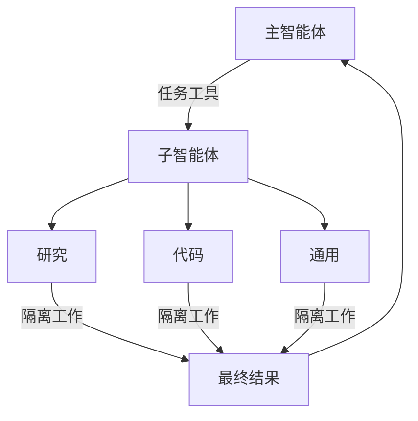

import SubagentBasicPy from '/snippets/subagent-basic-py.mdx';
import SubagentBasicJs from '/snippets/subagent-basic-js.mdx';

深度智能体可以创建子智能体来委派工作。您可以在 `subagents` 参数中指定自定义子智能体。子智能体对于[上下文隔离](https://www.dbreunig.com/2025/06/26/how-to-fix-your-context.html#context-quarantine)（保持主智能体上下文清洁）以及提供专业化指令非常有用。

本页介绍**同步**子智能体，即主控智能体会阻塞直到子智能体完成。对于长时间运行的任务、并行工作流，或者需要中途调整和取消的情况，请参阅[异步子智能体](/oss/deepagents/async-subagents)。



## 为什么要使用子智能体？

子智能体解决了**上下文膨胀问题**。当智能体使用输出量大的工具（网络搜索、文件读取、数据库查询）时，上下文窗口会很快被中间结果填满。子智能体将这些详细工作隔离开来——主智能体只接收最终结果，而不是产生该结果的数十次工具调用。

**何时使用子智能体：**
- ✅ 会弄乱主智能体上下文的多步骤任务
- ✅ 需要自定义指令或工具的专业领域
- ✅ 需要不同模型能力的任务
- ✅ 当您希望主智能体专注于高层协调时

**何时不使用子智能体：**
- ❌ 简单的单步任务
- ❌ 需要维护中间上下文时
- ❌ 当开销超过收益时

## 配置

`subagents` 应该是一个字典或 @[`CompiledSubAgent`] 对象的列表。有两种类型：

### SubAgent (基于字典)

对于大多数用例，将子智能体定义为与 @[`SubAgent`] 规范匹配的字典，包含以下字段：

:::python

| 字段 | 类型 | 描述 |
|-------|------|-------------|
| `name` | `str` | 必需。子智能体的唯一标识符。主智能体在调用 `task()` 工具时使用此名称。子智能体名称会作为 `AIMessage` 和流式传输的元数据，有助于区分不同的智能体。 |
| `description` | `str` | 必需。描述此子智能体的功能。要具体且面向操作。主智能体用它来决定何时委派任务。 |
| `system_prompt` | `str` | 必需。子智能体的指令。自定义子智能体必须定义自己的指令。包括工具使用指导和输出格式要求。<br></br>不继承自主智能体。 |
| `tools` | `list[Callable]` | 必需。子智能体可以使用的工具。自定义子智能体需自行指定。保持最小化，只包含所需工具。<br></br>不继承自主智能体。 |
| `model` | `str` \| `BaseChatModel` | 可选。覆盖主智能体的模型。省略则使用主智能体的模型。<br></br>默认继承自主智能体。您可以传递模型标识符字符串，如 `'openai:gpt-5'`（使用 `'provider:model'` 格式），或 LangChain 聊天模型对象（`init_chat_model("gpt-5")` 或 `ChatOpenAI(model="gpt-5")`）。 |
| `middleware` | `list[Middleware]` | 可选。用于自定义行为、日志记录或速率限制的额外中间件。<br></br>不继承自主智能体。 |
| `interrupt_on` | `dict[str, bool]` | 可选。为特定工具配置[人机协同](/oss/deepagents/human-in-the-loop)。子智能体值会覆盖主智能体设置。需要检查点器。<br></br>默认继承自主智能体。子智能体值会覆盖默认值。 |
| `skills` | `list[str]` | 可选。[技能](/oss/deepagents/skills)源路径。指定后，子智能体将从这些目录加载技能（例如，`["/skills/research/", "/skills/web-search/"]`）。这允许子智能体拥有与主智能体不同的技能集。<br></br>不继承自主智能体。只有通用子智能体继承主智能体的技能。当子智能体拥有技能时，它会运行自己独立的 @[`SkillsMiddleware`] 实例。技能状态是完全隔离的——子智能体加载的技能对父智能体不可见，反之亦然。 |

:::

:::js

| 字段 | 类型 | 描述 |
|-------|------|-------------|
| `name` | `str` | 必需。子智能体的唯一标识符。主智能体在调用 `task()` 工具时使用此名称。子智能体名称会作为 `AIMessage` 和流式传输的元数据，有助于区分不同的智能体。 |
| `description` | `str` | 必需。描述此子智能体的功能。要具体且面向操作。主智能体用它来决定何时委派任务。 |
| `system_prompt` | `str` | 必需。子智能体的指令。自定义子智能体必须定义自己的指令。包括工具使用指导和输出格式要求。<br></br>不继承自主智能体。 |
| `tools` | `list[Callable]` | 必需。子智能体可以使用的工具。自定义子智能体需自行指定。保持最小化，只包含所需工具。<br></br>不继承自主智能体。 |
| `model` | `str` \| `BaseChatModel` | 可选。覆盖主智能体的模型。省略则使用主智能体的模型。<br></br>默认继承自主智能体。您可以传递模型标识符字符串，如 `'openai:gpt-5'`（使用 `'provider:model'` 格式），或 LangChain 聊天模型对象（`await initChatModel("gpt-5")` 或 `new ChatOpenAI({ model: "gpt-5" })`）。 |
| `middleware` | `list[Middleware]` | 可选。用于自定义行为、日志记录或速率限制的额外中间件。<br></br>不继承自主智能体。 |
| `interrupt_on` | `dict[str, bool]` | 可选。为特定工具配置[人机协同](/oss/deepagents/human-in-the-loop)。子智能体值会覆盖主智能体设置。需要检查点器。<br></br>默认继承自主智能体。子智能体值会覆盖默认值。 |
| `skills` | `list[str]` | 可选。[技能](/oss/deepagents/skills)源路径。指定后，子智能体将从这些目录加载技能（例如，`["/skills/research/", "/skills/web-search/"]`）。这允许子智能体拥有与主智能体不同的技能集。<br></br>不继承自主智能体。只有通用子智能体继承主智能体的技能。当子智能体拥有技能时，它会运行自己独立的 @[`SkillsMiddleware`] 实例。技能状态是完全隔离的——子智能体加载的技能对父智能体不可见，反之亦然。 |

:::


<Tip>
    **CLI 用户：** 您也可以将子智能体定义为磁盘上的 `AGENTS.md` 文件，而不是代码中。`name`、`description` 和 `model` 字段映射到 YAML frontmatter，markdown 正文成为 `system_prompt`。有关文件格式，请参见[自定义子智能体](/oss/deepagents/cli/overview#custom-subagents)。
</Tip>

### CompiledSubAgent

对于复杂工作流，使用预构建的 LangGraph 图作为 @[`CompiledSubAgent`]：

| 字段 | 类型 | 描述 |
|-------|------|-------------|
| `name` | `str` | 必需。子智能体的唯一标识符。子智能体名称会作为 `AIMessage` 和流式传输的元数据，有助于区分不同的智能体。 |
| `description` | `str` | 必需。此子智能体的功能描述。 |
| `runnable` | `Runnable` | 必需。一个已编译的 LangGraph 图（必须先调用 `.compile()`）。 |

## 使用 SubAgent

:::python
<SubagentBasicPy />
:::

:::js
<SubagentBasicJs />
:::

## 使用 CompiledSubAgent

对于更复杂的用例，您可以提供自定义子智能体。
您可以使用 LangChain 的 @[`create_agent`] 或使用[图 API](/oss/langgraph/graph-api) 制作自定义 LangGraph 图来创建自定义子智能体。

如果您正在创建自定义 LangGraph 图，请确保该图具有名为 `"messages"` 的[状态键](/oss/langgraph/quickstart#2-define-state)：

:::python
```python
from deepagents import create_deep_agent, CompiledSubAgent
from langchain.agents import create_agent

# 创建一个自定义智能体图
custom_graph = create_agent(
    model=your_model,
    tools=specialized_tools,
    prompt="You are a specialized agent for data analysis..."
)

# 将其用作自定义子智能体
custom_subagent = CompiledSubAgent(
    name="data-analyzer",
    description="Specialized agent for complex data analysis tasks",
    runnable=custom_graph
)

subagents = [custom_subagent]

agent = create_deep_agent(
    model="claude-sonnet-4-6",
    tools=[internet_search],
    system_prompt=research_instructions,
    subagents=subagents
)
```
:::

:::js
```typescript
import { createDeepAgent, CompiledSubAgent } from "deepagents";
import { createAgent } from "langchain";

// 创建一个自定义智能体图
const customGraph = createAgent({
  model: yourModel,
  tools: specializedTools,
  prompt: "You are a specialized agent for data analysis...",
});

// 将其用作自定义子智能体
const customSubagent: CompiledSubAgent = {
  name: "data-analyzer",
  description: "Specialized agent for complex data analysis tasks",
  runnable: customGraph,
};

const subagents = [customSubagent];

const agent = createDeepAgent({
  model: "claude-sonnet-4-6",
  tools: [internetSearch],
  systemPrompt: researchInstructions,
  subagents: subagents,
});
```
:::

## 流式传输

在流式传输追踪信息时，智能体的名称可作为元数据中的 `lc_agent_name` 使用。
在查看追踪信息时，您可以使用此元数据来区分数据来自哪个智能体。

以下示例创建了一个名为 `main-agent` 的深度智能体和一个名为 `research-agent` 的子智能体：

```python
import os
from typing import Literal
from tavily import TavilyClient
from deepagents import create_deep_agent

tavily_client = TavilyClient(api_key=os.environ["TAVILY_API_KEY"])

def internet_search(
    query: str,
    max_results: int = 5,
    topic: Literal["general", "news", "finance"] = "general",
    include_raw_content: bool = False,
):
    """Run a web search"""
    return tavily_client.search(
        query,
        max_results=max_results,
        include_raw_content=include_raw_content,
        topic=topic,
    )

research_subagent = {
    "name": "research-agent",
    "description": "Used to research more in depth questions",
    "system_prompt": "You are a great researcher",
    "tools": [internet_search],
    "model": "claude-sonnet-4-6",  # 可选覆盖，默认为主智能体模型
}
subagents = [research_subagent]

agent = create_deep_agent(
    model="claude-sonnet-4-6",
    subagents=subagents,
    name="main-agent"
)
```

当您提示深度智能体时，由子智能体或深度智能体执行的所有智能体运行都会在其元数据中包含智能体名称。
在这种情况下，名为 `"research-agent"` 的子智能体，在其关联的智能体运行元数据中将包含 `{'lc_agent_name': 'research-agent'}`：


## 结构化输出

所有子智能体都支持[结构化输出](/oss/langchain/structured-output)，您可以使用它来验证子智能体的输出。

:::python
您可以通过将所需的结构化输出模式作为 `response_format` 参数传递给 `create_agent()` 来设置它。
当模型生成结构化数据时，它会被捕获和验证。
结构化对象本身不会返回给父智能体。
在子智能体中使用结构化输出时，请将结构化数据包含在 `ToolMessage` 中。
:::
:::js
您可以通过将所需的结构化输出模式作为 `responseFormat` 参数传递给 `createAgent()` 来设置它。
当模型生成结构化数据时，它会被捕获和验证。结构化对象本身不会返回给父智能体。
在子智能体中使用结构化输出时，请将结构化数据包含在 `ToolMessage` 中。
:::

有关更多信息，请参阅[响应格式](/oss/langchain/structured-output#response-format)。

## 通用子智能体

除了任何用户定义的子智能体外，深度智能体始终可以访问一个 `general-purpose` 子智能体。该子智能体：

- 具有与主智能体相同的系统提示
- 可以访问所有相同的工具
- 使用相同的模型（除非被覆盖）
- 继承主智能体的技能（当配置了技能时）

### 覆盖通用子智能体

:::python
在您的 `subagents` 列表中包含一个 `name="general-purpose"` 的子智能体以替换默认设置。使用此方法为通用子智能体配置不同的模型、工具或系统提示：

```python
from deepagents import create_deep_agent

# 主智能体使用 Claude；通用子智能体使用 GPT
agent = create_deep_agent(
    model="claude-sonnet-4-6",
    tools=[internet_search],
    subagents=[
        {
            "name": "general-purpose",
            "description": "General-purpose agent for research and multi-step tasks",
            "system_prompt": "You are a general-purpose assistant.",
            "tools": [internet_search],
            "model": "openai:gpt-4o",  # 为委派的任务使用不同的模型
        },
    ],
)
```
:::

:::js
在您的 `subagents` 列表中包含一个 `name: "general-purpose"` 的子智能体以替换默认设置。使用此方法为通用子智能体配置不同的模型、工具或系统提示：

```typescript
import { createDeepAgent } from "deepagents";

// 主智能体使用 Claude；通用子智能体使用 GPT
const agent = await createDeepAgent({
  model: "claude-sonnet-4-6",
  tools: [internetSearch],
  subagents: [
    {
      name: "general-purpose",
      description: "General-purpose agent for research and multi-step tasks",
      systemPrompt: "You are a general-purpose assistant.",
      tools: [internetSearch],
      model: "openai:gpt-4o",  // 为委派的任务使用不同的模型
    },
  ],
});
```
:::

当您提供名为 general-purpose 的子智能体时，默认的通用子智能体将不会被添加。您的规范将完全替换它。

### 何时使用它

通用子智能体非常适合不需要特殊行为的上下文隔离。主智能体可以将复杂的多步骤任务委派给此子智能体，并获得简洁的结果返回，而不会因中间工具调用而导致上下文膨胀。

<Card title="示例">
    主智能体不进行 10 次网络搜索并用结果填满其上下文，而是委派给通用子智能体：`task(name="general-purpose", task="Research quantum computing trends")`。子智能体在内部执行所有搜索，并仅返回一个摘要。
</Card>

### 技能继承

当使用 `create_deep_agent` 配置[技能](/oss/deepagents/skills)时：

- **通用子智能体**：自动继承主智能体的技能
- **自定义子智能体**：默认不继承技能——使用 `skills` 参数赋予它们自己的技能

<Note>
    只有配置了技能的子智能体才会获得 `SkillsMiddleware` 实例——没有 `skills` 参数的自定义子智能体则不会。当存在技能时，技能状态在两个方向都是完全隔离的：父智能体的技能对子智能体不可见，子智能体的技能也不会传播回父智能体。
</Note>

:::python
```python
from deepagents import create_deep_agent

# 拥有自己技能的研究子智能体
research_subagent = {
    "name": "researcher",
    "description": "Research assistant with specialized skills",
    "system_prompt": "You are a researcher.",
    "tools": [web_search],
    "skills": ["/skills/research/", "/skills/web-search/"],  # 子智能体特定技能
}

agent = create_deep_agent(
    model="claude-sonnet-4-6",
    skills=["/skills/main/"],  # 主智能体和 GP 子智能体获得这些
    subagents=[research_subagent],  # 仅获得 /skills/research/ 和 /skills/web-search/
)
```
:::

:::js
```typescript
import { createDeepAgent, SubAgent } from "deepagents";

// 拥有自己技能的研究子智能体
const researchSubagent: SubAgent = {
  name: "researcher",
  description: "Research assistant with specialized skills",
  systemPrompt: "You are a researcher.",
  tools: [webSearch],
  skills: ["/skills/research/", "/skills/web-search/"],  // 子智能体特定技能
};

const agent = createDeepAgent({
  model: "claude-sonnet-4-6",
  skills: ["/skills/main/"],  // 主智能体和 GP 子智能体获得这些
  subagents: [researchSubagent],  // 仅获得 /skills/research/ 和 /skills/web-search/
});
```
:::

## 最佳实践

### 编写清晰的描述

主智能体使用描述来决定调用哪个子智能体。要具体：

✅ **好：** `"Analyzes financial data and generates investment insights with confidence scores"`

❌ **差：** `"Does finance stuff"`

### 保持系统提示详细

包含关于如何使用工具和格式化输出的具体指导：

:::python
```python
research_subagent = {
    "name": "research-agent",
    "description": "Conducts in-depth research using web search and synthesizes findings",
    "system_prompt": """You are a thorough researcher. Your job is to:

    1. Break down the research question into searchable queries
    2. Use internet_search to find relevant information
    3. Synthesize findings into a comprehensive but concise summary
    4. Cite sources when making claims

    Output format:
    - Summary (2-3 paragraphs)
    - Key findings (bullet points)
    - Sources (with URLs)

    Keep your response under 500 words to maintain clean context.""",
    "tools": [internet_search],
}
```
:::

:::js
```typescript
const researchSubagent = {
  name: "research-agent",
  description: "Conducts in-depth research using web search and synthesizes findings",
  systemPrompt: `You are a thorough researcher. Your job is to:

  1. Break down the research question into searchable queries
  2. Use internet_search to find relevant information
  3. Synthesize findings into a comprehensive but concise summary
  4. Cite sources when making claims

  Output format:
  - Summary (2-3 paragraphs)
  - Key findings (bullet points)
  - Sources (with URLs)

  Keep your response under 500 words to maintain clean context.`,
  tools: [internetSearch],
};
```
:::

### 最小化工具集

只给子智能体他们需要的工具。这可以提高专注度和安全性：

:::python
```python
# ✅ 好：聚焦的工具集
email_agent = {
    "name": "email-sender",
    "tools": [send_email, validate_email],  # 仅限电子邮件相关
}

# ❌ 差：工具太多
email_agent = {
    "name": "email-sender",
    "tools": [send_email, web_search, database_query, file_upload],  # 不聚焦
}
```
:::

:::js
```typescript
// ✅ 好：聚焦的工具集
const emailAgent = {
  name: "email-sender",
  tools: [sendEmail, validateEmail],  // 仅限电子邮件相关
};

// ❌ 差：工具太多
const emailAgentBad = {
  name: "email-sender",
  tools: [sendEmail, webSearch, databaseQuery, fileUpload],  // 不聚焦
};
```
:::

### 根据任务选择模型

不同的模型擅长不同的任务：

:::python
```python
subagents = [
    {
        "name": "contract-reviewer",
        "description": "Reviews legal documents and contracts",
        "system_prompt": "You are an expert legal reviewer...",
        "tools": [read_document, analyze_contract],
        "model": "claude-sonnet-4-6",  # 长文档需要大上下文
    },
    {
        "name": "financial-analyst",
        "description": "Analyzes financial data and market trends",
        "system_prompt": "You are an expert financial analyst...",
        "tools": [get_stock_price, analyze_fundamentals],
        "model": "openai:gpt-5",  # 更适合数值分析
    },
]
```
:::

:::js
```typescript
const subagents = [
  {
    name: "contract-reviewer",
    description: "Reviews legal documents and contracts",
    systemPrompt: "You are an expert legal reviewer...",
    tools: [readDocument, analyzeContract],
    model: "claude-sonnet-4-6",  // 长文档需要大上下文
  },
  {
    name: "financial-analyst",
    description: "Analyzes financial data and market trends",
    systemPrompt: "You are an expert financial analyst...",
    tools: [getStockPrice, analyzeFundamentals],
    model: "gpt-5",  // 更适合数值分析
  },
];
```
:::

### 返回简洁的结果

指示子智能体返回摘要，而不是原始数据：

:::python
```python
data_analyst = {
    "system_prompt": """Analyze the data and return:
    1. Key insights (3-5 bullet points)
    2. Overall confidence score
    3. Recommended next actions

    Do NOT include:
    - Raw data
    - Intermediate calculations
    - Detailed tool outputs

    Keep response under 300 words."""
}
```
:::

:::js
```typescript
const dataAnalyst = {
  systemPrompt: `Analyze the data and return:
  1. Key insights (3-5 bullet points)
  2. Overall confidence score
  3. Recommended next actions

  Do NOT include:
  - Raw data
  - Intermediate calculations
  - Detailed tool outputs

  Keep response under 300 words.`,
};
```
:::

## 常见模式

### 多个专业化子智能体

为不同领域创建专业化子智能体：

:::python
```python
from deepagents import create_deep_agent

subagents = [
    {
        "name": "data-collector",
        "description": "Gathers raw data from various sources",
        "system_prompt": "Collect comprehensive data on the topic",
        "tools": [web_search, api_call, database_query],
    },
    {
        "name": "data-analyzer",
        "description": "Analyzes collected data for insights",
        "system_prompt": "Analyze data and extract key insights",
        "tools": [statistical_analysis],
    },
    {
        "name": "report-writer",
        "description": "Writes polished reports from analysis",
        "system_prompt": "Create professional reports from insights",
        "tools": [format_document],
    },
]

agent = create_deep_agent(
    model="claude-sonnet-4-6",
    system_prompt="You coordinate data analysis and reporting. Use subagents for specialized tasks.",
    subagents=subagents
)
```
:::

:::js
```typescript
import { createDeepAgent } from "deepagents";

const subagents = [
  {
    name: "data-collector",
    description: "Gathers raw data from various sources",
    systemPrompt: "Collect comprehensive data on the topic",
    tools: [webSearch, apiCall, databaseQuery],
  },
  {
    name: "data-analyzer",
    description: "Analyzes collected data for insights",
    systemPrompt: "Analyze data and extract key insights",
    tools: [statisticalAnalysis],
  },
  {
    name: "report-writer",
    description: "Writes polished reports from analysis",
    systemPrompt: "Create professional reports from insights",
    tools: [formatDocument],
  },
];

const agent = createDeepAgent({
  model: "claude-sonnet-4-6",
  systemPrompt: "You coordinate data analysis and reporting. Use subagents for specialized tasks.",
  subagents: subagents,
});
```
:::

**工作流：**
1. 主智能体创建高层计划
2. 将数据收集委派给 data-collector
3. 将结果传递给 data-analyzer
4. 将洞察发送给 report-writer
5. 编译最终输出

每个子智能体都使用仅专注于其任务的干净上下文工作。

## 上下文管理

当您使用[运行时上下文](/oss/langchain/runtime)调用父智能体时，该上下文会自动传播到所有子智能体。每个子智能体运行都会收到您在父级 `invoke` / `ainvoke` 调用中传递的相同运行时上下文。

这意味着在任何子智能体内运行的工具都可以访问您提供给父智能体的相同上下文值：

:::python
```python
from dataclasses import dataclass

from deepagents import create_deep_agent
from langchain.messages import HumanMessage
from langchain.tools import tool, ToolRuntime

@dataclass
class Context:
    user_id: str
    session_id: str

@tool
def get_user_data(query: str, runtime: ToolRuntime[Context]) -> str:
    """Fetch data for the current user."""
    user_id = runtime.context.user_id
    return f"Data for user {user_id}: {query}"

research_subagent = {
    "name": "researcher",
    "description": "Conducts research for the current user",
    "system_prompt": "You are a research assistant.",
    "tools": [get_user_data],
}

agent = create_deep_agent(
    model="claude-sonnet-4-6",
    subagents=[research_subagent],
    context_schema=Context,
)

# 上下文自动流向 researcher 子智能体及其工具
result = await agent.invoke(
    {"messages": [HumanMessage("Look up my recent activity")]},
    context=Context(user_id="user-123", session_id="abc"),
)
```
:::

:::js
```typescript
import { createDeepAgent } from "deepagents";
import { tool } from "langchain";
import type { ToolRuntime } from "@langchain/core/tools";
import { z } from "zod";

const contextSchema = z.object({
  userId: z.string(),
  sessionId: z.string(),
});

const getUserData = tool(
  async (input, runtime: ToolRuntime<unknown, typeof contextSchema>) => {
    const userId = runtime.context?.userId;
    return `Data for user ${userId}: ${input.query}`;
  },
  {
    name: "get_user_data",
    description: "Fetch data for the current user",
    schema: z.object({ query: z.string() }),
  }
);

const researchSubagent = {
  name: "researcher",
  description: "Conducts research for the current user",
  systemPrompt: "You are a research assistant.",
  tools: [getUserData],
};

const agent = createDeepAgent({
  model: "claude-sonnet-4-6",
  subagents: [researchSubagent],
  contextSchema,
});

// 上下文自动流向 researcher 子智能体及其工具
const result = await agent.invoke(
  { messages: [new HumanMessage("Look up my recent activity")] },
  { context: { userId: "user-123", sessionId: "abc" } },
);
```
:::

### 每个子智能体的上下文

所有子智能体都接收相同的父上下文。要传递特定于某个子智能体的配置，可以在扁平的 `context` 映射中使用**带命名空间的键**（例如，用子智能体名称作为键前缀，如 `researcher:max_depth`），**或者**将这些设置建模为上下文类型上的单独字段：

:::python
```python
from dataclasses import dataclass

from langchain.messages import HumanMessage
from langchain.tools import tool, ToolRuntime

@dataclass
class Context:
    user_id: str
    researcher_max_depth: int | None = None
    fact_checker_strict_mode: bool | None = None

result = await agent.invoke(
    {"messages": [HumanMessage("Research this and verify the claims")]},
    context=Context(
        user_id="user-123",
        researcher_max_depth=3,
        fact_checker_strict_mode=True,
    ),
)

@tool
def verify_claim(claim: str, runtime: ToolRuntime[Context]) -> str:
    """Verify a factual claim."""
    strict_mode = runtime.context.fact_checker_strict_mode or False
    if strict_mode:
        return strict_verification(claim)
    return basic_verification(claim)
```
:::

:::js
```typescript
import { tool } from "langchain";
import type { ToolRuntime } from "@langchain/core/tools";
import { z } from "zod";

const contextSchema = z.object({
  userId: z.string(),
  researcherMaxDepth: z.number().optional(),
  factCheckerStrictMode: z.boolean().optional(),
});

const result = await agent.invoke(
  { messages: [new HumanMessage("Research this and verify the claims")] },
  {
    context: {
      userId: "user-123",                        // 所有智能体共享
      "researcher:maxDepth": 3,                  // 仅用于 researcher
      "fact-checker:strictMode": true,           // 仅用于 fact-checker
    },
  },
);

const verifyClaim = tool(
  async (input, runtime: ToolRuntime<unknown, typeof contextSchema>) => {
    const strictMode = runtime.context?.factCheckerStrictMode ?? false;
    if (strictMode) {
      return strictVerification(input.claim);
    }
    return basicVerification(input.claim);
  },
  {
    name: "verify_claim",
    description: "Verify a factual claim",
    schema: z.object({ claim: z.string() }),
  }
);
```
:::

### 识别哪个子智能体调用了工具

当同一个工具在父智能体和多个子智能体之间共享时，您可以使用 `lc_agent_name` 元数据（与[流式传输](#streaming)中使用的值相同）来确定是哪个智能体发起了调用：

:::python
```python
from langchain.tools import tool, ToolRuntime

@tool
def shared_lookup(query: str, runtime: ToolRuntime) -> str:
    """Look up information."""
    agent_name = runtime.config.get("metadata", {}).get("lc_agent_name")
    if agent_name == "fact-checker":
        return strict_lookup(query)
    return general_lookup(query)
```
:::

:::js
```typescript
import { tool } from "langchain";
import type { ToolRuntime } from "@langchain/core/tools";

const sharedLookup = tool(
  async (input, runtime: ToolRuntime) => {
    const agentName = runtime.config?.metadata?.lc_agent_name;
    if (agentName === "fact-checker") {
      return strictLookup(input.query);
    }
    return generalLookup(input.query);
  },
  {
    name: "shared_lookup",
    description: "Look up information from various sources",
    schema: z.object({ query: z.string() }),
  }
);
```
:::

您可以结合使用这两种模式——当需要分支工具行为时，从 `runtime.context` 读取特定于智能体的设置，并从 `runtime.config` 元数据中读取 `lc_agent_name`。

:::python
```python
from langchain.tools import tool, ToolRuntime

@tool
def flexible_search(query: str, runtime: ToolRuntime[Context]) -> str:
    """Search with agent-specific settings."""
    agent_name = runtime.config.get("metadata", {}).get("lc_agent_name", "unknown")
    ctx = runtime.context
    if agent_name == "researcher":
        max_results = ctx.researcher_max_depth or 5
    else:
        max_results = 5
    include_raw = False

    return perform_search(query, max_results=max_results, include_raw=include_raw)
```
:::

:::js
```typescript
const flexibleSearch = tool(
  async (input, runtime: ToolRuntime<unknown, typeof contextSchema>) => {
    const agentName = runtime.config?.metadata?.lc_agent_name ?? "unknown";
    const ctx = runtime.context;
    const maxResults =
      agentName === "researcher" ? ctx?.researcherMaxDepth ?? 5 : 5;
    const includeRaw = false;

    return performSearch(input.query, { maxResults, includeRaw });
  },
  {
    name: "flexible_search",
    description: "Search with agent-specific settings",
    schema: z.object({ query: z.string() }),
  }
);
```
:::

## 故障排除

### 子智能体未被调用

**问题**：主智能体试图自己完成工作，而不是委派。

**解决方案**：

1. **使描述更具体：**

   :::python
   ```python
   # ✅ 好
   {"name": "research-specialist", "description": "Conducts in-depth research on specific topics using web search. Use when you need detailed information that requires multiple searches."}

   # ❌ 差
   {"name": "helper", "description": "helps with stuff"}
   ```
   :::

   :::js
   ```typescript
   // ✅ 好
   { name: "research-specialist", description: "Conducts in-depth research on specific topics using web search. Use when you need detailed information that requires multiple searches." }

   // ❌ 差
   { name: "helper", description: "helps with stuff" }
   ```
   :::

2. **指示主智能体进行委派：**

   :::python
   ```python
   agent = create_deep_agent(
       system_prompt="""...your instructions...

       IMPORTANT: For complex tasks, delegate to your subagents using the task() tool.
       This keeps your context clean and improves results.""",
       subagents=[...]
   )
   ```
   :::

   :::js
   ```typescript
   const agent = createDeepAgent({
     systemPrompt: `...your instructions...

     IMPORTANT: For complex tasks, delegate to your subagents using the task() tool.
     This keeps your context clean and improves results.`,
     subagents: [...]
   });
   ```
   :::

### 上下文仍然膨胀

**问题**：尽管使用了子智能体，上下文仍然被填满。

**解决方案**：

1. **指示子智能体返回简洁结果：**

   :::python
   ```python
   system_prompt="""...

   IMPORTANT: Return only the essential summary.
   Do NOT include raw data, intermediate search results, or detailed tool outputs.
   Your response should be under 500 words."""
   ```
   :::

   :::js
   ```typescript
   systemPrompt: `...

   IMPORTANT: Return only the essential summary.
   Do NOT include raw data, intermediate search results, or detailed tool outputs.
   Your response should be under 500 words.`
   ```
   :::

2. **对大量数据使用文件系统：**

   :::python
   ```python
   system_prompt="""When you gather large amounts of data:
   1. Save raw data to /data/raw_results.txt
   2. Process and analyze the data
   3. Return only the analysis summary

   This keeps context clean."""
   ```
   :::

   :::js
   ```typescript
   systemPrompt: `When you gather large amounts of data:
   1. Save raw data to /data/raw_results.txt
   2. Process and analyze the data
   3. Returnonly the analysis summary

   This keeps context clean.`
   ```
   :::###选择了错误的子代理

**问题**：主代理为任务调用了不合适的子代理。

**解决方案**：在描述中清晰区分不同的子代理：

:::python
```python
subagents = [
    {
        "name": "quick-researcher",
        "description": "用于简单、快速的研究问题，只需 1-2 次搜索。当你需要基本事实或定义时使用。",
    },
    {
        "name": "deep-researcher",
        "description": "用于复杂、深入的研究任务，需要多次搜索、综合与分析。适用于全面报告类任务。",
    }
]
```
:::

:::js
```typescript
const subagents = [
  {
    name: "quick-researcher",
    description: "用于简单、快速的研究问题，只需 1-2 次搜索。当你需要基本事实或定义时使用。",
  },
  {
    name: "deep-researcher",
    description: "用于复杂、深入的研究任务，需要多次搜索、综合与分析。适用于全面报告类任务。",
  }
];
```
:::