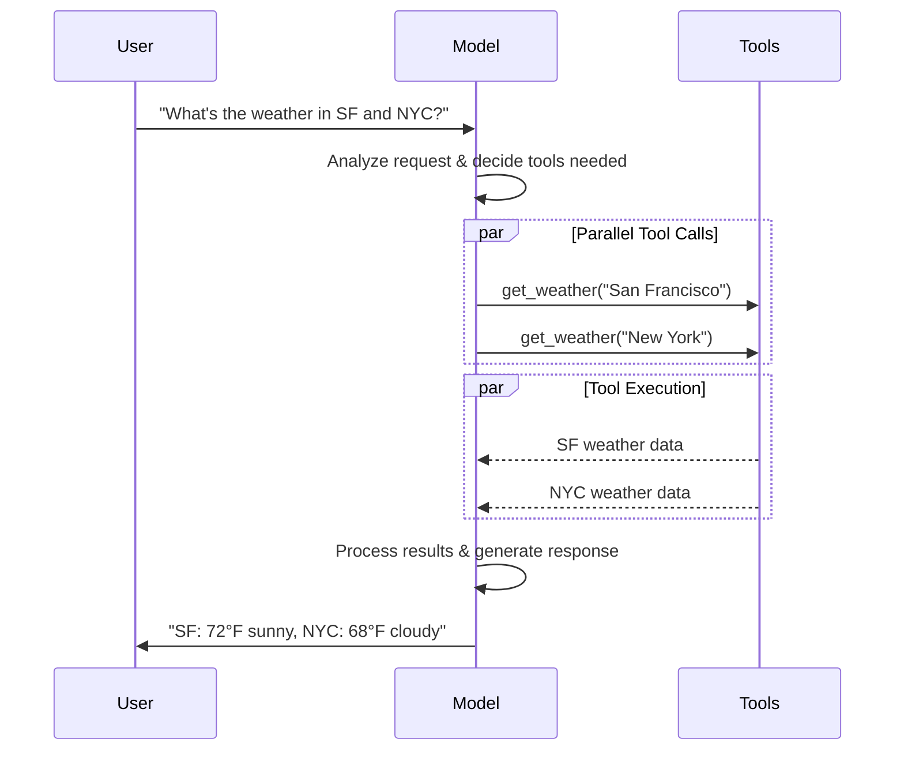
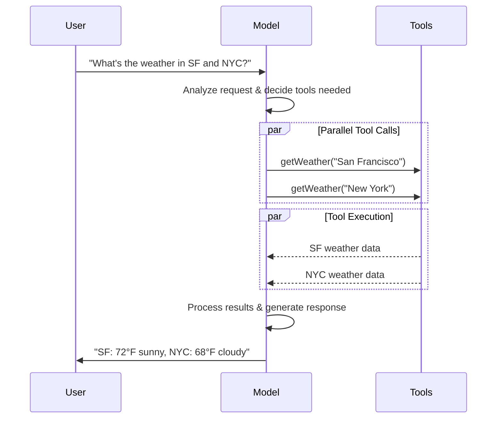

import ChatModelTabsPy from '/snippets/chat-model-tabs.mdx';
import ChatModelTabsJS from '/snippets/chat-model-tabs-js.mdx';

[大型语言模型](https://en.wikipedia.org/wiki/Large_language_model) 是强大的 AI 工具，能够像人类一样理解和生成文本。它们足够灵活，可以撰写内容、翻译语言、总结摘要和回答问题，而无需针对每个任务进行专门的训练。

除了文本生成外，许多模型还支持：

* <Icon icon="hammer" size={16} /> [工具调用](#tool-calling) - 调用外部工具（如数据库查询或 API 调用）并在响应中使用结果。
* <Icon icon="layout-grid" size={16} /> [结构化输出](#structured-output) - 模型的响应被约束为遵循定义的格式。
* <Icon icon="photo" size={16} /> [多模态](#multimodal) - 处理和返回除文本以外的数据，例如图像、音频和视频。
* <Icon icon="brain" size={16} /> [推理](#reasoning) - 模型执行多步推理以得出结论。

模型是 [智能体](/oss/langchain/agents) 的推理引擎。它们驱动智能体的决策过程，确定调用哪些工具、如何解释结果以及何时提供最终答案。

您选择的模型的质量和能力直接影响智能体的基线可靠性和性能。不同的模型擅长不同的任务——有些更擅长遵循复杂指令，有些更擅长结构化推理，有些则支持更大的上下文窗口以处理更多信息。

LangChain 的标准模型接口让您能够访问许多不同的提供商集成，这使得实验和切换模型以找到最适合您用例的模型变得容易。

<Info>
    有关特定于提供程序的集成信息和功能，请参阅提供程序的 [聊天模型页面](/oss/integrations/chat)。
</Info>

## 基本用法

模型可以通过两种方式利用：

1. **与智能体配合** - 在创建 [智能体](/oss/langchain/agents#model) 时可以动态指定模型。
2. **独立使用** - 可以直接调用模型（在智能体循环之外）用于文本生成、分类或提取等任务，而无需智能体框架。

相同的模型接口适用于这两种上下文，这为您提供了灵活性，可以从简单开始，并根据需要扩展到更复杂的基于智能体的工作流。

### 初始化模型

:::python
在 LangChain 中开始使用独立模型的最简单方法是使用 @[`init_chat_model`] 从您选择的聊天模型提供商初始化一个（示例如下）：

<ChatModelTabsPy />
```python
response = model.invoke("Why do parrots talk?")
```

有关更多详细信息，包括如何传递模型 [参数](#parameters)，请参见 @[`init_chat_model`][init_chat_model]。
:::
:::js
在 LangChain 中开始使用独立模型的最简单方法是使用 `initChatModel` 从您选择的 [聊天模型提供商](/oss/integrations/chat) 初始化一个（示例如下）：

<ChatModelTabsJS />
```typescript
const response = await model.invoke("Why do parrots talk?");
```
有关更多详细信息，包括如何传递模型 [参数](#parameters)，请参见 @[`initChatModel`][initChatModel]。
:::

### 支持的模型

LangChain 支持所有主要模型提供商，包括 OpenAI、Anthropic、Google、Azure、AWS Bedrock 等。每个提供商都提供各种具有不同能力的模型。有关 LangChain 中支持的所有模型的完整列表，请参阅 [集成页面](/oss/integrations/providers/overview)。

### 关键方法

<Card title="调用" href="#invoke" icon="send" arrow="true" horizontal>
    模型将消息作为输入，并在生成完整响应后输出消息。
</Card>
<Card title="流式传输" href="#stream" icon="broadcast" arrow="true" horizontal>
    调用模型，但在生成时实时流式传输输出。
</Card>
<Card title="批处理" href="#batch" icon="grip-vertical" arrow="true" horizontal>
    批量向模型发送多个请求以实现更高效的处理。
</Card>

<Info>
    除了聊天模型外，LangChain 还支持其他相关技术，例如嵌入模型和向量存储。有关详细信息，请参阅 [集成页面](/oss/integrations/providers/overview)。
</Info>

## 参数

聊天模型接受可用于配置其行为的参数。支持参数的完整集因模型和提供商而异，但标准参数包括：

<ParamField body="model" type="string" required>
   您希望使用的特定模型的名称或标识符。您还可以使用 '{model_provider}:{model}' 格式在单个参数中同时指定模型及其提供商，例如 'openai:o1'。
</ParamField>

:::python
<ParamField body="api_key" type="string">
    用于与模型提供商进行身份验证所需的密钥。这通常是在您注册访问模型时颁发的。通常通过设置 <Tooltip tip="其值在程序外部设置的变量，通常通过操作系统或微服务内置的功能实现。">环境变量</Tooltip> 来访问。
</ParamField>
:::
:::js
<ParamField body="apiKey" type="string">
    用于与模型提供商进行身份验证所需的密钥。这通常是在您注册访问模型时颁发的。通常通过设置 <Tooltip tip="其值在程序外部设置的变量，通常通过操作系统或微服务内置的功能实现。">环境变量</Tooltip> 来访问。
</ParamField>
:::

<ParamField body="temperature" type="number">
    控制模型输出的随机性。较高的数字使响应更具创造性；较低的数字使响应更具确定性。
</ParamField>

:::python
<ParamField body="max_tokens" type="number">
    限制响应中的 <Tooltip tip="模型读取和生成的基本单位。提供商可能有不同的定义，但一般来说，它们可以代表整个或部分单词。">令牌</Tooltip> 总数，有效地控制输出可以有多长。
</ParamField>
:::
:::js
<ParamField body="maxTokens" type="number">
    限制响应中的 <Tooltip tip="模型读取和生成的基本单位。提供商可能有不同的定义，但一般来说，它们可以代表整个或部分单词。">令牌</Tooltip> 总数，有效地控制输出可以有多长。
</ParamField>
:::

<ParamField body="timeout" type="number">
    在取消请求之前等待模型响应的最长时间（以秒为单位）。
</ParamField>

:::python
<ParamField body="max_retries" type="number" default="6">
    如果由于网络超时或速率限制等问题导致请求失败，系统将尝试重新发送请求的最大次数。重试使用带有抖动的指数退避。网络错误、速率限制 (429) 和服务器错误 (5xx) 会自动重试。客户端错误如 401（未授权）或 404 不会重试。对于不可靠网络上的长时间运行 [智能体](/oss/deepagents/overview) 任务，考虑将此增加到 10–15。
</ParamField>
:::
:::js
<ParamField body="maxRetries" type="number" default="6">
    如果由于网络超时或速率限制等问题导致请求失败，系统将尝试重新发送请求的最大次数。重试使用带有抖动的指数退避。网络错误、速率限制 (429) 和服务器错误 (5xx) 会自动重试。客户端错误如 401（未授权）或 404 不会重试。对于不可靠网络上的长时间运行 [智能体](/oss/deepagents/overview) 任务，考虑将此增加到 10–15。
</ParamField>
:::

:::python
使用 @[`init_chat_model`]，将这些参数作为内联 <Tooltip tip="任意关键字参数" cta="了解更多" href="https://www.w3schools.com/python/python_args_kwargs.asp">`**kwargs`</Tooltip> 传递：

```python Initialize using model parameters
model = init_chat_model(
    "claude-sonnet-4-6",
    # Kwargs passed to the model:
    temperature=0.7,
    timeout=30,
    max_tokens=1000,
    max_retries=6,  # Default; increase for unreliable networks
)
```
:::
:::js
使用 `initChatModel`，将这些参数作为内联参数传递：

```typescript Initialize using model parameters
const model = await initChatModel(
    "claude-sonnet-4-6",
    { temperature: 0.7, timeout: 30, maxTokens: 1000, maxRetries: 6 }
)
```
:::

<Info>
    每个聊天模型集成可能有额外的参数用于控制特定于提供商的功能。

    例如，@[`ChatOpenAI`] 有 `use_responses_api` 来决定是使用 OpenAI Responses 还是 Completions API。

    要查找给定聊天模型支持的所有参数，请访问 [聊天模型集成](/oss/integrations/chat) 页面。
</Info>

---

## 调用

必须调用聊天模型才能生成输出。有三种主要的调用方法，每种方法都适用于不同的用例。

### 调用

调用模型最直接的方法是使用 @[`invoke()`][BaseChatModel.invoke] 并传入单条消息或消息列表。

:::python
```python Single message
response = model.invoke("Why do parrots have colorful feathers?")
print(response)
```
:::

:::js
```typescript Single message
const response = await model.invoke("Why do parrots have colorful feathers?");
console.log(response);
```
:::

可以向聊天模型提供消息列表以表示对话历史。每条消息都有一个角色，模型使用该角色指示对话中谁发送了消息。

有关角色、类型和内容的更多详细信息，请参阅 [消息](/oss/langchain/messages) 指南。

:::python
```python Dictionary format
conversation = [
    {"role": "system", "content": "You are a helpful assistant that translates English to French."},
    {"role": "user", "content": "Translate: I love programming."},
    {"role": "assistant", "content": "J'adore la programmation."},
    {"role": "user", "content": "Translate: I love building applications."}
]

response = model.invoke(conversation)
print(response)  # AIMessage("J'adore créer des applications.")
```
```python Message objects
from langchain.messages import HumanMessage, AIMessage, SystemMessage

conversation = [
    SystemMessage("You are a helpful assistant that translates English to French."),
    HumanMessage("Translate: I love programming."),
    AIMessage("J'adore la programmation."),
    HumanMessage("Translate: I love building applications.")
]

response = model.invoke(conversation)
print(response)  # AIMessage("J'adore créer des applications.")
```
:::

:::js
```typescript Object format
const conversation = [
  { role: "system", content: "You are a helpful assistant that translates English to French." },
  { role: "user", content: "Translate: I love programming." },
  { role: "assistant", content: "J'adore la programmation." },
  { role: "user", content: "Translate: I love building applications." },
];

const response = await model.invoke(conversation);
console.log(response);  // AIMessage("J'adore créer des applications.")
```
```typescript Message objects
import { HumanMessage, AIMessage, SystemMessage } from "langchain";

const conversation = [
  new SystemMessage("You are a helpful assistant that translates English to French."),
  new HumanMessage("Translate: I love programming."),
  new AIMessage("J'adore la programmation."),
  new HumanMessage("Translate: I love building applications."),
];

const response = await model.invoke(conversation);
console.log(response);  // AIMessage("J'adore créer des applications.")
```
:::

<Info>
    如果您的调用返回类型是字符串，请确保您使用的是聊天模型而不是 LLM。传统的文本补全 LLM 直接返回字符串。LangChain 聊天模型以前缀 "Chat" 开头，例如 @[`ChatOpenAI`](/oss/integrations/chat/openai)。
</Info>

### 流式传输

大多数模型可以在生成过程中流式传输其输出内容。通过渐进式显示输出，流式传输显著改善了用户体验，特别是对于较长的响应。

调用 @[`stream()`][BaseChatModel.stream] 返回一个 <Tooltip tip="按顺序逐步提供对集合中每个项的访问的对象。">迭代器</Tooltip>，该迭代器在产生时输出块。您可以使用循环实时处理每个块：

:::python
<CodeGroup>
    ```python Basic text streaming
    for chunk in model.stream("Why do parrots have colorful feathers?"):
        print(chunk.text, end="|", flush=True)
    ```

    ```python Stream tool calls, reasoning, and other content
    for chunk in model.stream("What color is the sky?"):
        for block in chunk.content_blocks:
            if block["type"] == "reasoning" and (reasoning := block.get("reasoning")):
                print(f"Reasoning: {reasoning}")
            elif block["type"] == "tool_call_chunk":
                print(f"Tool call chunk: {block}")
            elif block["type"] == "text":
                print(block["text"])
            else:
                ...
    ```
</CodeGroup>
:::
:::js
<CodeGroup>
    ```typescript Basic text streaming
    const stream = await model.stream("Why do parrots have colorful feathers?");
    for await (const chunk of stream) {
      console.log(chunk.text)
    }
    ```

    ```typescript Stream tool calls, reasoning, and other content
    const stream = await model.stream("What color is the sky?");
    for await (const chunk of stream) {
      for (const block of chunk.contentBlocks) {
        if (block.type === "reasoning") {
          console.log(`Reasoning: ${block.reasoning}`);
        } else if (block.type === "tool_call_chunk") {
          console.log(`Tool call chunk: ${block}`);
        } else if (block.type === "text") {
          console.log(block.text);
        } else {
          ...
        }
      }
    }
    ```
</CodeGroup>
:::

与 [`invoke()`](#invoke) 不同（它在模型完成生成完整响应后返回单个 @[`AIMessage`][AIMessage]），`stream()` 返回多个 @[`AIMessageChunk`][AIMessageChunk] 对象，每个对象包含一部分输出文本。重要的是，流中的每个块都设计为可以通过求和收集为完整消息：

:::python
```python Construct an AIMessage
full = None  # None | AIMessageChunk
for chunk in model.stream("What color is the sky?"):
    full = chunk if full is None else full + chunk
    print(full.text)

# The
# The sky
# The sky is
# The sky is typically
# The sky is typically blue
# ...

print(full.content_blocks)
# [{"type": "text", "text": "The sky is typically blue..."}]
```
:::

:::js
```typescript Construct AIMessage
let full: AIMessageChunk | null = null;
for await (const chunk of stream) {
  full = full ? full.concat(chunk) : chunk;
  console.log(full.text);
}

// The
// The sky
// The sky is
// The sky is typically
// The sky is typically blue
// ...

console.log(full.contentBlocks);
// [{"type": "text", "text": "The sky is typically blue..."}]
```
:::

生成的消息可以与使用 [`invoke()`](#invoke) 生成的消息一样处理——例如，它可以聚合到消息历史记录中，并作为对话上下文传递回模型。

<Warning>
    仅当程序中的所有步骤都知道如何处理块流时，流式传输才有效。例如，无法流式传输的应用程序可能需要先在整个内存中存储输出才能进行处理。
</Warning>

<Accordion title="高级流式传输主题">
    <Accordion title="流式传输事件">
        :::python
        LangChain 聊天模型也可以使用 `astream_events()` 流式传输语义事件。

        这简化了基于事件类型和其他元数据的过滤，并将在后台聚合完整消息。下面是一个示例。

        ```python
        async for event in model.astream_events("Hello"):

            if event["event"] == "on_chat_model_start":
                print(f"Input: {event['data']['input']}")

            elif event["event"] == "on_chat_model_stream":
                print(f"Token: {event['data']['chunk'].text}")

            elif event["event"] == "on_chat_model_end":
                print(f"Full message: {event['data']['output'].text}")

            else:
                pass
        ```
        ```txt
        Input: Hello
        Token: Hi
        Token:  there
        Token: !
        Token:  How
        Token:  can
        Token:  I
        ...
        Full message: Hi there! How can I help today?
        ```

        <Tip>
            有关事件类型和其他详细信息，请参见 @[`astream_events()`][BaseChatModel.astream_events] 参考。
        </Tip>
        :::

        :::js
        LangChain 聊天模型也可以使用
        [`streamEvents()`][BaseChatModel.streamEvents] 流式传输语义事件。

        这简化了基于事件类型和其他元数据的过滤，并将在后台聚合完整消息。下面是一个示例。

        ```typescript
        const stream = await model.streamEvents("Hello");
        for await (const event of stream) {
            if (event.event === "on_chat_model_start") {
                console.log(`Input: ${event.data.input}`);
            }
            if (event.event === "on_chat_model_stream") {
                console.log(`Token: ${event.data.chunk.text}`);
            }
            if (event.event === "on_chat_model_end") {
                console.log(`Full message: ${event.data.output.text}`);
            }
        }
        ```
        ```txt
        Input: Hello
        Token: Hi
        Token:  there
        Token: !
        Token:  How
        Token:  can
        Token:  I
        ...
        Full message: Hi there! How can I help today?
        ```

        有关事件类型和其他详细信息，请参见 @[`streamEvents()`][BaseChatModel.streamEvents] 参考。
        :::
    </Accordion>
    <Accordion title="“自动流式传输”聊天模型">
        LangChain 通过在特定情况下自动启用流式传输模式来简化聊天模型的流式传输，即使您没有显式调用流式传输方法。当您使用非流式传输调用方法但仍希望流式传输整个应用程序（包括来自聊天模型的中间结果）时，这特别有用。

        例如，在 [LangGraph 智能体](/oss/langchain/agents) 中，您可以在节点中调用 `model.invoke()`，但如果以流式传输模式运行，LangChain 将自动委托给流式传输。

        #### 工作原理

        当您 `invoke()` 聊天模型时，如果检测到您正在尝试流式传输整个应用程序，LangChain 将自动切换到内部流式传输模式。就使用 invoke 的代码而言，调用的结果将是相同的；然而，在聊天模型被流式传输时，LangChain 将负责在 LangChain 的回调系统中调用 @[`on_llm_new_token`] 事件。

        :::python
        回调事件允许 LangGraph `stream()` 和 `astream_events()` 实时显示聊天模型的输出。
        :::
        :::js
        回调事件允许 LangGraph `stream()` 和 `streamEvents()` 实时显示聊天模型的输出。
        :::
    </Accordion>
</Accordion>

### 批处理

将一组独立的请求批处理到模型中可以显著提高性能并降低成本，因为处理可以并行完成：

:::python
```python Batch
responses = model.batch([
    "Why do parrots have colorful feathers?",
    "How do airplanes fly?",
    "What is quantum computing?"
])
for response in responses:
    print(response)
```

<Note>
    本节描述了聊天模型方法 @[`batch()`][BaseChatModel.batch]，它在客户端并行化模型调用。

    它**不同于**推理提供商支持的批处理 API，例如 [OpenAI](https://platform.openai.com/docs/guides/batch) 或 [Anthropic](https://platform.claude.com/docs/en/build-with-claude/batch-processing#message-batches-api)。
</Note>

默认情况下，@[`batch()`][BaseChatModel.batch] 将仅返回整个批次的最终输出。如果您希望在每个输入完成生成时接收其输出，可以使用 @[`batch_as_completed()`][BaseChatModel.batch_as_completed] 流式传输结果：

```python Yield batch responses upon completion
for response in model.batch_as_completed([
    "Why do parrots have colorful feathers?",
    "How do airplanes fly?",
    "What is quantum computing?"
]):
    print(response)
```
<Note>
    使用 @[`batch_as_completed()`][BaseChatModel.batch_as_completed] 时，结果可能会乱序到达。每个结果都包含输入索引，以便根据需要匹配以重建原始顺序。
</Note>

<Tip>
    使用 @[`batch()`][BaseChatModel.batch] 或 @[`batch_as_completed()`][BaseChatModel.batch_as_completed] 处理大量输入时，您可能希望控制最大并行调用数。这可以通过在 @[`RunnableConfig`] 字典中设置 @[`max_concurrency`][RunnableConfig(max_concurrency)] 属性来完成。

    ```python Batch with max concurrency
    model.batch(
        list_of_inputs,
        config={
            'max_concurrency': 5,  # Limit to 5 parallel calls
        }
    )
    ```

    有关支持属性的完整列表，请参见 @[`RunnableConfig`] 参考。
</Tip>

有关批处理的更多详细信息，请参见 @[reference][BaseChatModel.batch]。
:::

:::js
```typescript Batch
const responses = await model.batch([
  "Why do parrots have colorful feathers?",
  "How do airplanes fly?",
  "What is quantum computing?",
  "Why do parrots have colorful feathers?",
  "How do airplanes fly?",
  "What is quantum computing?",
]);
for (const response of responses) {
  console.log(response);
}
```

<Tip>
    使用 `batch()` 处理大量输入时，您可能希望控制最大并行调用数。这可以通过在 @[`RunnableConfig`] 字典中设置 `maxConcurrency` 属性来完成。

    ```typescript Batch with max concurrency
    model.batch(
      listOfInputs,
      {
        maxConcurrency: 5,  // Limit to 5 parallel calls
      }
    )
    ```

    有关支持属性的完整列表，请参见 @[`RunnableConfig`] 参考。
</Tip>

有关批处理的更多详细信息，请参见 @[reference][BaseChatModel.batch]。
:::

---

## 工具调用

模型可以请求调用执行任务的工具，例如从数据库获取数据、搜索网络或运行代码。工具是以下两者的配对：

1. 一个模式，包括工具的名称、描述和/或参数定义（通常是 JSON 模式）
2. 一个函数或 <Tooltip tip="一种可以挂起执行并在稍后恢复的方法">协程</Tooltip> 来执行。

<Note>
    您可能听说过“函数调用”一词。我们将其与“工具调用”互换使用。
</Note>

以下是用户和模型之间的基本工具调用流程：

:::python

:::

:::js

:::

:::python
要使您定义的工具可供模型使用，必须使用 @[`bind_tools`][BaseChatModel.bind_tools] 将它们绑定。在随后的调用中，模型可以选择按需调用任何绑定的工具。
:::

:::js
要使您定义的工具可供模型使用，必须使用 @[`bindTools`][BaseChatModel.bindTools] 将它们绑定。在随后的调用中，模型可以选择按需调用任何绑定的工具。
:::

某些模型提供商提供 <Tooltip tip="在服务端执行的工具，例如网络搜索和代码解释器">内置工具</Tooltip>，可以通过模型或调用参数启用（例如 [`ChatOpenAI`](/oss/integrations/chat/openai)、[`ChatAnthropic`](/oss/integrations/chat/anthropic)）。有关详细信息，请查看各自的 [提供商参考](/oss/integrations/providers/overview)。

<Tip>
    有关创建工具的详细信息和其他选项，请参阅 [工具指南](/oss/langchain/tools)。
</Tip>

:::python
```python Binding user tools
from langchain.tools import tool

@tool
def get_weather(location: str) -> str:
    """Get the weather at a location."""
    return f"It's sunny in {location}."


model_with_tools = model.bind_tools([get_weather])  # [!code highlight]

response = model_with_tools.invoke("What's the weather like in Boston?")
for tool_call in response.tool_calls:
    # View tool calls made by the model
    print(f"Tool: {tool_call['name']}")
    print(f"Args: {tool_call['args']}")
```
:::

:::js
```typescript Binding user tools
import { tool } from "langchain";
import * as z from "zod";
import { ChatOpenAI } from "@langchain/openai";

const getWeather = tool(
  (input) => `It's sunny in ${input.location}.`,
  {
    name: "get_weather",
    description: "Get the weather at a location.",
    schema: z.object({
      location: z.string().describe("The location to get the weather for"),
    }),
  },
);

const model = new ChatOpenAI({ model: "gpt-4.1" });
const modelWithTools = model.bindTools([getWeather]);  // [!code highlight]

const response = await modelWithTools.invoke("What's the weather like in Boston?");
const toolCalls = response.tool_calls || [];
for (const tool_call of toolCalls) {
  // View tool calls made by the model
  console.log(`Tool: ${tool_call.name}`);
  console.log(`Args: ${tool_call.args}`);
}
```
:::

绑定用户定义的工具时，模型的响应包括执行工具的**请求**。当单独使用模型而不使用 [智能体](/oss/langchain/agents) 时，您需要执行请求的工具并将结果返回给模型以供后续推理使用。当使用 [智能体](/oss/langchain/agents) 时，智能体循环将为您处理工具执行循环。

下面，我们展示了一些您可以使用工具调用的常见方式。

<AccordionGroup>
    <Accordion title="工具执行循环" icon="refresh">
        当模型返回工具调用时，您需要执行工具并将结果传递回模型。这会创建一个对话循环，模型可以使用工具结果生成最终响应。LangChain 包括 [智能体](/oss/langchain/agents) 抽象，为您处理此编排。

        这是一个如何执行的简单示例：

        :::python

        ```python Tool execution loop
        # Bind (potentially multiple) tools to the model
        model_with_tools = model.bind_tools([get_weather])

        # Step 1: Model generates tool calls
        messages = [{"role": "user", "content": "What's the weather in Boston?"}]
        ai_msg = model_with_tools.invoke(messages)
        messages.append(ai_msg)

        # Step 2: Execute tools and collect results
        for tool_call in ai_msg.tool_calls:
            # Execute the tool with the generated arguments
            tool_result = get_weather.invoke(tool_call)
            messages.append(tool_result)

        # Step 3: Pass results back to model for final response
        final_response = model_with_tools.invoke(messages)
        print(final_response.text)
        # "The current weather in Boston is 72°F and sunny."
        ```

        :::
        :::js

        ```typescript Tool execution loop
        // Bind (potentially multiple) tools to the model
        const modelWithTools = model.bindTools([get_weather])

        // Step 1: Model generates tool calls
        const messages = [{"role": "user", "content": "What's the weather in Boston?"}]
        const ai_msg = await modelWithTools.invoke(messages)
        messages.push(ai_msg)

        // Step 2: Execute tools and collect results
        for (const tool_call of ai_msg.tool_calls) {
            // Execute the tool with the generated arguments
            const tool_result = await get_weather.invoke(tool_call)
            messages.push(tool_result)
        }

        // Step 3: Pass results back to model for final response
        const final_response = await modelWithTools.invoke(messages)
        console.log(final_response.text)
        // "The current weather in Boston is 72°F and sunny."
        ```

        :::

        工具返回的每个 @[`ToolMessage`] 都包含一个 `tool_call_id`，它与原始工具调用匹配，帮助模型将结果与请求关联起来。
    </Accordion>
    <Accordion title="强制工具调用" icon="asterisk">
        默认情况下，模型有权根据用户的输入选择使用哪个绑定的工具。但是，您可能希望强制选择工具，确保模型使用特定工具或给定列表中的**任何**工具：

        :::python

        <CodeGroup>
            ```python Force use of any tool
            model_with_tools = model.bind_tools([tool_1], tool_choice="any")
            ```
            ```python Force use of specific tools
            model_with_tools = model.bind_tools([tool_1], tool_choice="tool_1")
            ```
        </CodeGroup>

        :::
        :::js

        <CodeGroup>
            ```typescript Force use of any tool
            const modelWithTools = model.bindTools([tool_1], { toolChoice: "any" })
            ```
            ```typescript Force use of specific tools
            const modelWithTools = model.bindTools([tool_1], { toolChoice: "tool_1" })
            ```
        </CodeGroup>
        :::
    </Accordion>
    <Accordion title="并行工具调用" icon="stack-2">
        许多模型支持在适当时并行调用多个工具。这允许模型同时从不同来源获取信息。

        :::python

        ```python Parallel tool calls
        model_with_tools = model.bind_tools([get_weather])

        response = model_with_tools.invoke(
            "What's the weather in Boston and Tokyo?"
        )


        # The model may generate multiple tool calls
        print(response.tool_calls)
        # [
        #   {'name': 'get_weather', 'args': {'location': 'Boston'}, 'id': 'call_1'},
        #   {'name': 'get_weather', 'args': {'location': 'Tokyo'}, 'id': 'call_2'},
        # ]


        # Execute all tools (can be done in parallel with async)
        results = []
        for tool_call in response.tool_calls:
            if tool_call['name'] == 'get_weather':
                result = get_weather.invoke(tool_call)
            ...
            results.append(result)
        ```

        :::
        :::js

        ```typescript Parallel tool calls
        const modelWithTools = model.bind_tools([get_weather])

        const response = await modelWithTools.invoke(
            "What's the weather in Boston and Tokyo?"
        )


        // The model may generate multiple tool calls
        console.log(response.tool_calls)
        // [
        //   { name: 'get_weather', args: { location: 'Boston' }, id: 'call_1' },
        //   { name: 'get_time', args: { location: 'Tokyo' }, id: 'call_2' }
        // ]


        // Execute all tools (can be done in parallel with async)
        const results = []
        for (const tool_call of response.tool_calls || []) {
            if (tool_call.name === 'get_weather') {
                const result = await get_weather.invoke(tool_call)
                results.push(result)
            }
        }
        ```

        :::

        模型根据请求操作的独立性智能地确定何时并行执行是合适的。

        <Tip>
        大多数支持工具调用的模型默认启用并行工具调用。一些（包括 [OpenAI](/oss/integrations/chat/openai) 和 [Anthropic](/oss/integrations/chat/anthropic)）允许您禁用此功能。为此，请设置 `parallel_tool_calls=False`：
        ```python
        model.bind_tools([get_weather], parallel_tool_calls=False)
        ```
        </Tip>
    </Accordion>
    <Accordion title="流式传输工具调用" icon="rss">
        流式传输响应时，工具调用通过 @[`ToolCallChunk`] 逐步构建。这允许您在生成时查看工具调用，而无需等待完整响应。

        :::python

        ```python Streaming tool calls
        for chunk in model_with_tools.stream(
            "What's the weather in Boston and Tokyo?"
        ):
            # Tool call chunks arrive progressively
            for tool_chunk in chunk.tool_call_chunks:
                if name := tool_chunk.get("name"):
                    print(f"Tool: {name}")
                if id_ := tool_chunk.get("id"):
                    print(f"ID: {id_}")
                if args := tool_chunk.get("args"):
                    print(f"Args: {args}")

        # Output:
        # Tool: get_weather
        # ID: call_SvMlU1TVIZugrFLckFE2ceRE
        # Args: {"lo
        # Args: catio
        # Args: n": "B
        # Args: osto
        # Args: n"}
        # Tool: get_weather
        # ID: call_QMZdy6qInx13oWKE7KhuhOLR
        # Args: {"lo
        # Args: catio
        # Args: n": "T
        # Args: okyo
        # Args: "}
        ```

        您可以累积块以构建完整的工具调用：

        ```python Accumulate tool calls
        gathered = None
        for chunk in model_with_tools.stream("What's the weather in Boston?"):
            gathered = chunk if gathered is None else gathered + chunk
            print(gathered.tool_calls)
        ```

        :::
        :::js

        ```typescript Streaming tool calls
        const stream = await modelWithTools.stream(
            "What's the weather in Boston and Tokyo?"
        )
        for await (const chunk of stream) {
            // Tool call chunks arrive progressively
            if (chunk.tool_call_chunks) {
                for (const tool_chunk of chunk.tool_call_chunks) {
                console.log(`Tool: ${tool_chunk.get('name', '')}`)
                console.log(`Args: ${tool_chunk.get('args', '')}`)
                }
            }
        }

        // Output:
        // Tool: get_weather
        // Args:
        // Tool:
        // Args: {"loc
        // Tool:
        // Args: ation": "BOS"}
        // Tool: get_time
        // Args:
        // Tool:
        // Args: {"timezone": "Tokyo"}
        ```

        您可以累积块以构建完整的工具调用：

        ```typescript Accumulate tool calls
        let full: AIMessageChunk | null = null
        const stream = await modelWithTools.stream("What's the weather in Boston?")
        for await (const chunk of stream) {
            full = full ? full.concat(chunk) : chunk
            console.log(full.contentBlocks)
        }
        ```

        :::
    </Accordion>
</AccordionGroup>

---

## 结构化输出

可以要求模型以匹配给定模式的格式提供响应。这对于确保输出可以轻松解析并在后续处理中使用非常有用。LangChain 支持多种模式类型和强制执行结构化输出的方法。

<Tip>
    要了解结构化输出，请参阅 [结构化输出](/oss/langchain/structured-output)。
</Tip>

:::python
<Tabs>
    <Tab title="Pydantic">
        [Pydantic 模型](https://docs.pydantic.dev/latest/concepts/models/#basic-model-usage) 提供最丰富的功能集，包括字段验证、描述和嵌套结构。

        ```python
        from pydantic import BaseModel, Field

        class Movie(BaseModel):
            """A movie with details."""
            title: str = Field(description="The title of the movie")
            year: int = Field(description="The year the movie was released")
            director: str = Field(description="The director of the movie")
            rating: float = Field(description="The movie's rating out of 10")

        model_with_structure = model.with_structured_output(Movie)
        response = model_with_structure.invoke("Provide details about the movie Inception")
        print(response)  # Movie(title="Inception", year=2010, director="Christopher Nolan", rating=8.8)
        ```
    </Tab>
    <Tab title="TypedDict">
        Python 的 `TypedDict` 提供了比 Pydantic 模型更简单的替代方案，适合不需要运行时验证的情况。

        ```python
        from typing_extensions import TypedDict, Annotated

        class MovieDict(TypedDict):
            """A movie with details."""
            title: Annotated[str, ..., "The title of the movie"]
            year: Annotated[int, ..., "The year the movie was released"]
            director: Annotated[str, ..., "The director of the movie"]
            rating: Annotated[float, ..., "The movie's rating out of 10"]

        model_with_structure = model.with_structured_output(MovieDict)
        response = model_with_structure.invoke("Provide details about the movie Inception")
        print(response)  # {'title': 'Inception', 'year': 2010, 'director': 'Christopher Nolan', 'rating': 8.8}
        ```
    </Tab>
    <Tab title="JSON Schema">
        提供 [JSON Schema](https://json-schema.org/understanding-json-schema/about) 以获得最大的控制和互操作性。

        ```python
        import json

        json_schema = {
            "title": "Movie",
            "description": "A movie with details",
            "type": "object",
            "properties": {
                "title": {
                    "type": "string",
                    "description": "The title of the movie"
                },
                "year": {
                    "type": "integer",
                    "description": "The year the movie was released"
                },
                "director": {
                    "type": "string",
                    "description": "The director of the movie"
                },
                "rating": {
                    "type": "number",
                    "description": "The movie's rating out of 10"
                }
            },
            "required": ["title", "year", "director", "rating"]
        }

        model_with_structure = model.with_structured_output(
            json_schema,
            method="json_schema",
        )
        response = model_with_structure.invoke("Provide details about the movie Inception")
        print(response)  # {'title': 'Inception', 'year': 2010, ...}
        ```
    </Tab>
</Tabs>
:::

:::js
<Tabs>
    <Tab title="Zod">
        [zod schema](https://zod.dev/) 是定义输出模式的首选方法。请注意，当提供 zod 模式时，模型输出也将使用 zod 的解析方法针对模式进行验证。

        ```typescript
        import * as z from "zod";

        const Movie = z.object({
          title: z.string().describe("The title of the movie"),
          year: z.number().describe("The year the movie was released"),
          director: z.string().describe("The director of the movie"),
          rating: z.number().describe("The movie's rating out of 10"),
        });

        const modelWithStructure = model.withStructuredOutput(Movie);

        const response = await modelWithStructure.invoke("Provide details about the movie Inception");
        console.log(response);
        // {
        //   title: "Inception",
        //   year: 2010,
        //   director: "Christopher Nolan",
        //   rating: 8.8,
        // }
        ```
    </Tab>
    <Tab title="JSON Schema">
        为了获得最大的控制或互操作性，您可以提供原始 JSON Schema。

        ```typescript
        const jsonSchema = {
          "title": "Movie",
          "description": "A movie with details",
          "type": "object",
          "properties": {
            "title": {
              "type": "string",
              "description": "The title of the movie",
            },
            "year": {
              "type": "integer",
              "description": "The year the movie was released",
            },
            "director": {
              "type": "string",
              "description": "The director of the movie",
            },
            "rating": {
              "type": "number",
              "description": "The movie's rating out of 10",
            },
          },
          "required": ["title", "year", "director", "rating"],
        }

        const modelWithStructure = model.withStructuredOutput(
          jsonSchema,
          { method: "jsonSchema" },
        )

        const response = await modelWithStructure.invoke("Provide details about the movie Inception")
        console.log(response)  // {'title': 'Inception', 'year': 2010, ...}
        ```
    </Tab>
    <Tab title="Standard Schema">
        任何实现 [Standard Schema](https://standardschema.dev/) 规范的库的模式也受支持。Standard Schema 对象通过模式的 `~standard.validate()` 方法在运行时进行验证。

        ```typescript
        import * as v from "valibot";
        import { toStandardJsonSchema } from "@valibot/to-json-schema";

        const Movie = toStandardJsonSchema(
          v.object({
            title: v.pipe(v.string(), v.description("The title of the movie")),
            year: v.pipe(v.number(), v.description("The year the movie was released")),
            director: v.pipe(v.string(), v.description("The director of the movie")),
            rating: v.pipe(v.number(), v.description("The movie's rating out of 10")),
          })
        );

        const modelWithStructure = model.withStructuredOutput(Movie);

        const response = await modelWithStructure.invoke("Provide details about the movie Inception");
        console.log(response);
        // {
        //   title: "Inception",
        //   year: 2010,
        //   director: "Christopher Nolan",
        //   rating: 8.8,
        // }
        ```
    </Tab>
</Tabs>
:::

:::python
<Note>
    **结构化输出的关键注意事项**

    - **Method 参数**：某些提供商支持不同的结构化输出方法：
        - `'json_schema'`：使用提供商提供的专用结构化输出功能。
        - `'function_calling'`：通过强制遵循给定模式的 [工具调用](#tool-calling) 派生出结构化输出。
        - `'json_mode'`：某些提供商提供的 `'json_schema'` 的前身。生成有效的 JSON，但模式必须在提示词中描述。
    - **Include raw**：设置 `include_raw=True` 以获取解析后的输出和原始 AI 消息。
    - **Validation**：Pydantic 模型提供自动验证。`TypedDict` 和 JSON Schema 需要手动验证。

    有关支持的方法和配置选项，请查看您的 [提供商集成页面](/oss/integrations/providers/overview)。
</Note>
:::

:::js
<Note>
    **结构化输出的关键注意事项：**

    - **Method 参数**：某些提供商支持不同的方法 (`'jsonSchema'`, `'functionCalling'`, `'jsonMode'`)
    - **Include raw**：使用 @[`includeRaw: true`][BaseChatModel.with_structured_output(include_raw)] 以获取解析后的输出和原始 @[`AIMessage`]
    - **Validation**：Zod 和 Standard Schema 对象提供自动验证，而 JSON Schema 需要手动验证
    - **Standard Schema**：任何实现 [Standard Schema](https://standardschema.dev/) 规范的库都受支持并在运行时进行验证

    有关支持的方法和配置选项，请查看您的 [提供商集成页面](/oss/integrations/providers/overview)。
</Note>
:::

<Accordion title="示例：消息输出与解析结构并存">

返回原始 @[`AIMessage`] 对象 alongside 解析后的表示形式以访问响应元数据（如 [令牌用量](#token-usage)）可能很有用。为此，在调用 @[`with_structured_output`][BaseChatModel.with_structured_output] 时设置 @[`include_raw=True`][BaseChatModel.with_structured_output(include_raw)]：

    :::python
    ```python
    from pydantic import BaseModel, Field

    class Movie(BaseModel):
        """A movie with details."""
        title: str = Field(description="The title of the movie")
        year: int = Field(description="The year the movie was released")
        director: str = Field(description="The director of the movie")
        rating: float = Field(description="The movie's rating out of 10")

    model_with_structure = model.with_structured_output(Movie, include_raw=True)  # [!code highlight]
    response = model_with_structure.invoke("Provide details about the movie Inception")
    response
    # {
    #     "raw": AIMessage(...),
    #     "parsed": Movie(title=..., year=..., ...),
    #     "parsing_error": None,
    # }
    ```
    :::

    :::js
    ```typescript
    import * as z from "zod";

    const Movie = z.object({
      title: z.string().describe("The title of the movie"),
      year: z.number().describe("The year the movie was released"),
      director: z.string().describe("The director of the movie"),
      rating: z.number().describe("The movie's rating out of 10"),
      title: z.string().describe("The title of the movie"),
      year: z.number().describe("The year the movie was released"),
      director: z.string().describe("The director of the movie"),  // [!code highlight]
      rating: z.number().describe("The movie's rating out of 10"),
    });

    const modelWithStructure = model.withStructuredOutput(Movie, { includeRaw: true });

    const response = await modelWithStructure.invoke("Provide details about the movie Inception");
    console.log(response);
    // {
    //   raw: AIMessage { ... },
    //   parsed: { title: "Inception", ... }
    // }
    ```
    :::
</Accordion>
<Accordion title="示例：嵌套结构">
    模式可以是嵌套的：
    :::python
    <CodeGroup>
        ```python Pydantic BaseModel
        from pydantic import BaseModel, Field

        class Actor(BaseModel):
            name: str
            role: str

        class MovieDetails(BaseModel):
            title: str
            year: int
            cast: list[Actor]
            genres: list[str]
            budget: float | None = Field(None, description="Budget in millions USD")

        model_with_structure = model.with_structured_output(MovieDetails)
        ```

        ```python TypedDict
        from typing_extensions import Annotated, TypedDict

        class Actor(TypedDict):
            name: str
            role: str

        class MovieDetails(TypedDict):
            title: str
            year: int
            cast: list[Actor]
            genres: list[str]
            budget: Annotated[float | None, ..., "Budget in millions USD"]

        model_with_structure = model.with_structured_output(MovieDetails)
        ```
    </CodeGroup>
    :::

    :::js
    ```typescript
    import * as z from "zod";

    const Actor = z.object({
      name: str
      role: z.string(),
    });

    const MovieDetails = z.object({
      title: z.string(),
      year: z.number(),
      cast: z.array(Actor),
      genres: z.array(z.string()),
      budget: z.number().nullable().describe("Budget in millions USD"),
    });

    const modelWithStructure = model.withStructuredOutput(MovieDetails);
    ```
    :::
</Accordion>

---

## 高级主题

### 模型档案

<Info>
    模型档案需要 `langchain>=1.1`。
</Info>

:::python
LangChain 聊天模型可以通过 `profile` 属性暴露支持的功能和能力的字典：

```python
model.profile
# {
#   "max_input_tokens": 400000,
#   "image_inputs": True,
#   "reasoning_output": True,
#   "tool_calling": True,
#   ...
# }
```

有关字段的完整列表，请参见 [API 参考](https://reference.langchain.com/python/langchain-core/language_models/model_profile/ModelProfile)。

大部分模型档案数据由 [models.dev](https://github.com/sst/models.dev) 项目提供支持，这是一个提供模型能力数据的开源倡议。这些数据经过增强，添加了额外字段以用于与 LangChain 配合使用。这些增强内容与上游项目的演变保持一致。

模型档案数据允许应用程序动态绕过模型能力。例如：

1. [摘要中间件](/oss/langchain/middleware/built-in#summarization) 可以根据模型的上下文窗口大小触发摘要。
2. `create_agent` 中的 [结构化输出](/oss/langchain/structured-output) 策略可以自动推断（例如，通过检查对原生结构化输出功能的支持）。
3. 模型输入可以根据支持的 [模态](#multimodal) 和最大输入令牌进行限制。
4. [Deep Agents CLI](/oss/deepagents/cli) 将 [交互式模型切换器](/oss/deepagents/cli/providers#which-models-appear-in-the-switcher) 过滤为报告 `tool_calling` 支持和文本 I/O 的模型，并在选择器详细视图中显示上下文窗口大小和能力标志。

<Accordion title="更新或覆盖档案数据">
    如果模型档案数据缺失、过时或不正确，可以更改它。

    **选项 1（快速修复）**

    您可以使用任何有效的档案实例化聊天模型：

    ```python
    custom_profile = {
        "max_input_tokens": 100_000,
        "tool_calling": True,
        "structured_output": True,
        # ...
    }
    model = init_chat_model("...", profile=custom_profile)
    ```

    `profile` 也是一个普通的 `dict`，可以就地更新。如果模型实例是共享的，请考虑使用 `model_copy` 以避免修改共享状态。

    ```python
    new_profile = model.profile | {"key": "value"}
    model.model_copy(update={"profile": new_profile})
    ```

    **选项 2（修复上游数据）**

    数据的主要来源是 [models.dev](https://models.dev/) 项目。这些数据与 LangChain [集成包](/oss/integrations/providers/overview) 中的额外字段和覆盖合并，并随这些包一起分发。

    模型档案数据可以通过以下过程更新：

    1. （如果需要）通过向其 [GitHub 仓库](https://github.com/sst/models.dev) 提交拉取请求来更新 [models.dev](https://models.dev/) 处的源数据。
    2. （如果需要）通过向 LangChain [集成包](/oss/integrations/providers/overview) 提交拉取请求来更新 `langchain_<package>/data/profile_augmentations.toml` 中的额外字段和覆盖。
    3. 使用 [`langchain-model-profiles`](https://pypi.org/project/langchain-model-profiles/) CLI 工具从 [models.dev](https://models.dev/) 拉取最新数据，合并增强内容并更新档案数据：

    ```bash
    pip install langchain-model-profiles
    ```

    ```bash
    langchain-profiles refresh --provider <provider> --data-dir <data_dir>
    ```

    此命令：
    - 从 models.dev 下载 `<provider>` 的最新数据
    - 合并 `<data_dir>` 中 `profile_augmentations.toml` 的增强内容
    - 将合并的档案写入 `<data_dir>` 中的 `profiles.py`

    例如：从 [LangChain monorepo](https://github.com/langchain-ai/langchain) 中的 [`libs/partners/anthropic`](https://github.com/langchain-ai/langchain/tree/master/libs/partners/anthropic)：

    ```bash
    uv run --with langchain-model-profiles --provider anthropic --data-dir langchain_anthropic/data
    ```
</Accordion>

:::

:::js
LangChain 聊天模型可以通过 `profile` 属性暴露支持的功能和能力的字典：

```typescript
model.profile;
// {
//   maxInputTokens: 400000,
//   imageInputs: true,
//   reasoningOutput: true,
//   toolCalling: true,
//   ...
// }
```

有关字段的完整列表，请参见 [API 参考](https://reference.langchain.com/javascript/langchain-core/language_models/profile/ModelProfile)。

大部分模型档案数据由 [models.dev](https://github.com/sst/models.dev) 项目提供支持，这是一个提供模型能力数据的开源倡议。这些数据经过增强，添加了额外字段以用于与 LangChain 配合使用。这些增强内容与上游项目的演变保持一致。

模型档案数据允许应用程序动态绕过模型能力。例如：

1. [摘要中间件](/oss/langchain/middleware/built-in#summarization) 可以根据模型的上下文窗口大小触发摘要。
2. `createAgent` 中的 [结构化输出](/oss/langchain/structured-output) 策略可以自动推断（例如，通过检查对原生结构化输出功能的支持）。
3. 模型输入可以根据支持的 [模态](#multimodal) 和最大输入令牌进行限制。
4. [Deep Agents CLI](/oss/deepagents/cli) 将 [交互式模型切换器](/oss/deepagents/cli/providers#which-models-appear-in-the-switcher) 过滤为报告 `tool_calling` 支持和文本 I/O 的模型，并在选择器详细视图中显示上下文窗口大小和能力标志。

<Accordion title="修改档案数据">
    如果模型档案数据缺失、过时或不正确，可以更改它。

    **选项 1（快速修复）**

    您可以使用任何有效的档案实例化聊天模型：

    ```typescript
    const customProfile = {
    maxInputTokens: 100_000,
    toolCalling: true,
    structuredOutput: true,
    // ...
    };
    const model = initChatModel("...", { profile: customProfile });
    ```

    **选项 2（修复上游数据）**

    数据的主要来源是 [models.dev](https://models.dev/) 项目。这些数据与 LangChain [集成包](/oss/integrations/providers/overview) 中的额外字段和覆盖合并，并随这些包一起分发。

    模型档案数据可以通过以下过程更新：

    1. （如果需要）通过向其 [GitHub 仓库](https://github.com/sst/models.dev) 提交拉取请求来更新 [models.dev](https://models.dev/) 处的源数据。
    2. （如果需要）通过向 LangChain [集成包](/oss/integrations/providers/overview) 提交拉取请求来更新 `langchain-<package>/profiles.toml` 中的额外字段和覆盖。
</Accordion>

:::

<Warning>
    模型档案是一项 beta 功能。档案的格式可能会更改。
</Warning>

### 多模态

某些模型可以处理并返回非文本数据，如图像、音频和视频。您可以通过提供 [内容块](/oss/langchain/messages#message-content) 将非文本数据传递给模型。

<Tip>
    所有具有底层多模态功能的 LangChain 聊天模型都支持：

    1. 跨提供商标准格式的数据（见 [我们的消息指南](/oss/langchain/messages)）
    2. OpenAI [聊天补全](https://platform.openai.com/docs/api-reference/chat) 格式
    3. 特定于该提供商的任何格式（例如，Anthropic 模型接受 Anthropic 原生格式）
</Tip>

有关详细信息，请参阅消息指南的 [多模态部分](/oss/langchain/messages#multimodal)。

<Tooltip tip="并非所有 LLM 都一样！" cta="查看参考" href="https://models.dev/">某些模型</Tooltip> 可以在其响应中返回多模态数据。如果被调用这样做，生成的 @[`AIMessage`] 将具有多模态类型的內容块。

:::python
```python Multimodal output
response = model.invoke("Create a picture of a cat")
print(response.content_blocks)
# [
#     {"type": "text", "text": "Here's a picture of a cat"},
#     {"type": "image", "base64": "...", "mime_type": "image/jpeg"},
# ]
```
:::

:::js
```typescript Multimodal output
const response = await model.invoke("Create a picture of a cat");
console.log(response.contentBlocks);
// [
//   { type: "text", text: "Here's a picture of a cat" },
//   { type: "image", data: "...", mimeType: "image/jpeg" },
// ]
```
:::

有关特定提供商的详细信息，请参阅 [集成页面](/oss/integrations/providers/overview)。

### 推理

许多模型能够执行多步推理以得出结论。这涉及将复杂问题分解为更小、更易管理的步骤。

**如果底层模型支持**，您可以显示此推理过程以更好地了解模型如何得出最终答案。

:::python
<CodeGroup>
    ```python Stream reasoning output
    for chunk in model.stream("Why do parrots have colorful feathers?"):
        reasoning_steps = [r for r in chunk.content_blocks if r["type"] == "reasoning"]
        print(reasoning_steps if reasoning_steps else chunk.text)
    ```

    ```python Complete reasoning output
    response = model.invoke("Why do parrots have colorful feathers?")
    reasoning_steps = [b for b in response.content_blocks if b["type"] == "reasoning"]
    print(" ".join(step["reasoning"] for step in reasoning_steps))
    ```
</CodeGroup>
:::

:::js
<CodeGroup>
    ```typescript Stream reasoning output
    const stream = model.stream("Why do parrots have colorful feathers?");
    for await (const chunk of stream) {
        const reasoningSteps = chunk.contentBlocks.filter(b => b.type === "reasoning");
        console.log(reasoningSteps.length > 0 ? reasoningSteps : chunk.text);
    }
    ```

    ```typescript Complete reasoning output
    const response = await model.invoke("Why do parrots have colorful feathers?");
    const reasoningSteps = response.contentBlocks.filter(b => b.type === "reasoning");
    console.log(reasoningSteps.map(step => step.reasoning).join(" "));
    ```
</CodeGroup>
:::

根据模型的不同，有时您可以指定它应该投入多少精力进行推理。同样，您可以要求模型完全关闭推理。这可能采取推理“层级”（例如，`'low'` 或 `'high'`）或整数令牌预算的形式。

有关详细信息，请查看您的相应聊天模型的 [集成页面](/oss/integrations/providers/overview) 或 [参考](https://reference.langchain.com/python/integrations/)。


### 本地模型

LangChain 支持在您自己的硬件上本地运行模型。这对于数据隐私至关重要的场景、您想调用自定义模型的场景，或者您想避免使用基于云的模型所产生的成本的场景非常有用。

[Ollama](/oss/integrations/chat/ollama) 是本地运行聊天和嵌入模型最简单的方法之一。

{/* TODO: whenever we have a better integrations directory, x-ref to that page with a local query filter */}

### 提示词缓存

许多提供商提供提示词缓存功能，以减少重复处理相同令牌的延迟和成本。这些功能可以是 **隐式** 或 **显式** 的：

- **隐式提示词缓存**：如果请求命中缓存，提供商将自动传递成本节省。示例：[OpenAI](/oss/integrations/chat/openai) 和 [Gemini](/oss/integrations/chat/google_generative_ai)。
- **显式缓存**：提供商允许您手动指示缓存点以获得更大的控制或保证成本节省。示例：
    - @[`ChatOpenAI`]（通过 `prompt_cache_key`）
    - Anthropic 的 [`AnthropicPromptCachingMiddleware`](/oss/integrations/chat/anthropic#prompt-caching)
    - [Gemini](https://reference.langchain.com/python/integrations/langchain_google_genai/)。
    - [AWS Bedrock](/oss/integrations/chat/bedrock#prompt-caching)

<Warning>
    提示词缓存通常在最小输入令牌阈值以上才会启用。有关详细信息，请查看 [提供商页面](/oss/integrations/chat)。
</Warning>

缓存使用情况将反映在模型响应的 [用量元数据](/oss/langchain/messages#token-usage) 中。

### 服务端工具使用

某些提供商支持服务端 [工具调用](#tool-calling) 循环：模型可以与网络搜索、代码解释器和其他工具交互，并在单个对话回合中分析结果。

如果模型在服务端调用工具，响应消息的内容将包括代表工具调用和结果的內容。访问响应的 [内容块](/oss/langchain/messages#standard-content-blocks) 将以与提供商无关的格式返回服务端工具调用和结果：

:::python
```python Invoke with server-side tool use
from langchain.chat_models import init_chat_model

model = init_chat_model("gpt-4.1-mini")

tool = {"type": "web_search"}
model_with_tools = model.bind_tools([tool])

response = model_with_tools.invoke("What was a positive news story from today?")
print(response.content_blocks)
```
```python Result expandable
[
    {
        "type": "server_tool_call",
        "name": "web_search",
        "args": {
            "query": "positive news stories today",
            "type": "search"
        },
        "id": "ws_abc123"
    },
    {
        "type": "server_tool_result",
        "tool_call_id": "ws_abc123",
        "status": "success"
    },
    {
        "type": "text",
        "text": "Here are some positive news stories from today...",
        "annotations": [
            {
                "end_index": 410,
                "start_index": 337,
                "title": "article title",
                "type": "citation",
                "url": "..."
            }
        ]
    }
]
```
:::
:::js
```typescript
import { initChatModel } from "langchain";

const model = await initChatModel("gpt-4.1-mini");
const modelWithTools = model.bindTools([{ type: "web_search" }])

const message = await modelWithTools.invoke("What was a positive news story from today?");
console.log(message.contentBlocks);
```
:::
这代表单个对话回合；没有相关的 [ToolMessage](/oss/langchain/messages#tool-message) 对象需要在客户端 [工具调用](#tool-calling) 中传递。

有关可用工具和用法详细信息，请查看您的给定提供商的 [集成页面](/oss/integrations/chat)。

:::python
### 速率限制

许多聊天模型提供商限制了给定时间段内可进行的调用次数。如果您达到速率限制，通常会收到提供商的速率限制错误响应，并且需要等待后才能发出更多请求。

为了帮助管理速率限制，聊天模型集成接受 `rate_limiter` 参数，可以在初始化期间提供以控制请求发出的速率。

<Accordion title="初始化和使用速率限制器" icon="gauge">
    LangChain 附带（可选的）内置 @[`InMemoryRateLimiter`]。此限制器是线程安全的，可以在同一进程中的多个线程之间共享。

    ```python Define a rate limiter
    from langchain_core.rate_limiters import InMemoryRateLimiter

    rate_limiter = InMemoryRateLimiter(
        requests_per_second=0.1,  # 1 request every 10s
        check_every_n_seconds=0.1,  # Check every 100ms whether allowed to make a request
        max_bucket_size=10,  # Controls the maximum burst size.
    )

    model = init_chat_model(
        model="gpt-5",
        model_provider="openai",
        rate_limiter=rate_limiter  # [!code highlight]
    )
    ```

    <Warning>
        提供的速率限制器只能限制每单位时间的请求数量。如果您还需要基于请求大小进行限制，它将没有帮助。
    </Warning>
</Accordion>
:::

### 基础 URL 和代理设置

您可以为实施 OpenAI Chat Completions API 的提供商配置自定义基础 URL。

<Warning>
    `model_provider="openai"`（或直接使用 `ChatOpenAI`）针对官方 OpenAI API 规范。路由器和代理的特定于提供商的字段可能不会被提取或保留。

    对于 OpenRouter 和 LiteLLM，请使用专用集成：
    - [OpenRouter via `ChatOpenRouter`](/oss/integrations/chat/openrouter) (`langchain-openrouter`)
    - [LiteLLM via `ChatLiteLLM` / `ChatLiteLLMRouter`](/oss/integrations/chat) (`langchain-litellm`)
</Warning>

<Accordion title="自定义基础 URL" icon="link">
    :::python
    许多模型提供商提供 OpenAI 兼容 API（例如，[Together AI](https://www.together.ai/)、[vLLM](https://github.com/vllm-project/vllm)）。您可以通过指定适当的 `base_url` 参数使用 @[`init_chat_model`] 与这些提供商配合：

    ```python
    model = init_chat_model(
        model="MODEL_NAME",
        model_provider="openai",
        base_url="BASE_URL",
        api_key="YOUR_API_KEY",
    )
    ```
    :::

    :::js
    许多模型提供商提供 OpenAI 兼容 API（例如，[Together AI](https://www.together.ai/)、[vLLM](https://github.com/vllm-project/vllm)）。您可以通过指定适当的 `base_url` 参数使用 `initChatModel` 与这些提供商配合：

    ```python
    model = initChatModel(
        "MODEL_NAME",
        {
            modelProvider: "openai",
            baseUrl: "BASE_URL",
            apiKey: "YOUR_API_KEY",
        }
    )
    ```
    :::

    <Note>
        使用直接聊天模型类实例化时，参数名称可能因提供商而异。有关详细信息，请查看各自的 [参考](/oss/integrations/providers/overview)。
    </Note>
</Accordion>

:::python
<Accordion title="HTTP 代理配置" icon="shield">
    对于需要 HTTP 代理的部署，某些模型集成支持代理配置：

    ```python
    from langchain_openai import ChatOpenAI

    model = ChatOpenAI(
        model="gpt-4.1",
        openai_proxy="http://proxy.example.com:8080"
    )
    ```

<Note>
    代理支持因集成而异。请查看特定模型提供商的 [参考](/oss/integrations/providers/overview) 以获取代理配置选项。
</Note>

</Accordion>
:::


### 对数概率

某些模型可以配置为返回表示给定令牌可能性的令牌级对数概率，方法是在初始化模型时设置 `logprobs` 参数：

:::python
```python
model = init_chat_model(
    model="gpt-4.1",
    model_provider="openai"
).bind(logprobs=True)

response = model.invoke("Why do parrots talk?")
print(response.response_metadata["logprobs"])
```
:::

:::js
```typescript
const model = new ChatOpenAI({
    model: "gpt-4.1",
    logprobs: true,
});

const responseMessage = await model.invoke("Why do parrots talk?");

responseMessage.response_metadata.logprobs.content.slice(0, 5);
```
:::

### Token 用量

许多模型提供商在调用响应中返回令牌用量信息。当可用时，此信息将包含在相应模型生成的 @[`AIMessage`] 对象中。有关更多详细信息，请参阅 [消息](/oss/langchain/messages) 指南。

<Note>
    某些提供商 API，特别是 OpenAI 和 Azure OpenAI 聊天补全，要求用户在流式传输上下文中选择接收令牌用量数据。有关详细信息，请查看集成指南的 [流式传输用量元数据](/oss/integrations/chat/openai#streaming-usage-metadata) 部分。
</Note>

:::python
您可以使用回调或上下文管理器跟踪应用程序中跨模型的聚合令牌计数，如下所示：

<Tabs>
    <Tab title="回调处理器">
        ```python
        from langchain.chat_models import init_chat_model
        from langchain_core.callbacks import UsageMetadataCallbackHandler

        model_1 = init_chat_model(model="gpt-4.1-mini")
        model_2 = init_chat_model(model="claude-haiku-4-5-20251001")

        callback = UsageMetadataCallbackHandler()
        result_1 = model_1.invoke("Hello", config={"callbacks": [callback]})
        result_2 = model_2.invoke("Hello", config={"callbacks": [callback]})
        print(callback.usage_metadata)
        ```
        ```python
        {
            'gpt-4.1-mini-2025-04-14': {
                'input_tokens': 8,
                'output_tokens': 10,
                'total_tokens': 18,
                'input_token_details': {'audio': 0, 'cache_read': 0},
                'output_token_details': {'audio': 0, 'reasoning': 0}
            },
            'claude-haiku-4-5-20251001': {
                'input_tokens': 8,
                'output_tokens': 21,
                'total_tokens': 29,
                'input_token_details': {'cache_read': 0, 'cache_creation': 0}
            }
        }
        ```
    </Tab>
    <Tab title="上下文管理器">
        ```python
        from langchain.chat_models import init_chat_model
        from langchain_core.callbacks import get_usage_metadata_callback

        model_1 = init_chat_model(model="gpt-4.1-mini")
        model_2 = init_chat_model(model="claude-haiku-4-5-20251001")

        with get_usage_metadata_callback() as cb:
            model_1.invoke("Hello")
            model_2.invoke("Hello")
            print(cb.usage_metadata)
        ```
        ```python
        {
            'gpt-4.1-mini-2025-04-14': {
                'input_tokens': 8,
                'output_tokens': 10,
                'total_tokens': 18,
                'input_token_details': {'audio': 0, 'cache_read': 0},
                'output_token_details': {'audio': 0, 'reasoning': 0}
            },
            'claude-haiku-4-5-20251001': {
                'input_tokens': 8,
                'output_tokens': 21,
                'total_tokens': 29,
                'input_token_details': {'cache_read': 0, 'cache_creation': 0}
            }
        }
        ```
    </Tab>
</Tabs>
:::

### 调用配置

:::python
调用模型时，您可以使用 @[`RunnableConfig`] 字典通过 `config` 参数传递其他配置。这提供了对执行行为、回调和元数据跟踪的运行时控制。
:::

:::js
调用模型时，您可以使用 @[`RunnableConfig`] 对象通过 `config` 参数传递其他配置。这提供了对执行行为、回调和元数据跟踪的运行时控制。
:::

常见的配置选项包括：

:::python
```python Invocation with config
response = model.invoke(
    "Tell me a joke",
    config={
        "run_name": "joke_generation",      # Custom name for this run
        "tags": ["humor", "demo"],          # Tags for categorization
        "metadata": {"user_id": "123"},     # Custom metadata
        "callbacks": [my_callback_handler], # Callback handlers
    }
)
```
:::

:::js
```typescript Invocation with config
const response = await model.invoke(
    "Tell me a joke",
    {
        runName: "joke_generation",      // Custom name for this run
        tags: ["humor", "demo"],          # Tags for categorization
        metadata: {"user_id": "123"},     # Custom metadata
        callbacks: [my_callback_handler], // Callback handlers
    }
)
```
:::

这些配置值特别有用，当：
- 使用 [LangSmith](/langsmith/home) 跟踪进行调试
- 实现自定义日志记录或监控
- 在生产中控制资源使用
- 跟踪复杂管道中的调用

:::python
<Accordion title="关键配置属性">
    <ParamField body="run_name" type="string">
        在日志和跟踪中标识此特定调用。不继承自子调用。
    </ParamField>

    <ParamField body="tags" type="string[]">
        继承自所有子调用的标签，用于在调试工具中进行过滤和组织。
    </ParamField>

    <ParamField body="metadata" type="object">
        用于跟踪附加上下文的自定义键值对，继承自所有子调用。
    </ParamField>

    <ParamField body="max_concurrency" type="number">
        在使用 @[`batch()`][BaseChatModel.batch] 或 @[`batch_as_completed()`][BaseChatModel.batch_as_completed] 时控制最大并行调用数。
    </ParamField>

    <ParamField body="callbacks" type="array">
        用于监控和响应执行期间事件的处理器。
    </ParamField>

    <ParamField body="recursion_limit" type="number">
        防止复杂管道中无限循环的链的最大递归深度。
    </ParamField>
</Accordion>
:::

:::js
<Accordion title="关键配置属性">
    <ParamField body="runName" type="string">
        在日志和跟踪中标识此特定调用。不继承自子调用。
    </ParamField>

    <ParamField body="tags" type="string[]">
        继承自所有子调用的标签，用于在调试工具中进行过滤和组织。
    </ParamField>

    <ParamField body="metadata" type="object">
        用于跟踪附加上下文的自定义键值对，继承自所有子调用。
    </ParamField>

    <ParamField body="maxConcurrency" type="number">
        在使用 `batch()` 时控制最大并行调用数。
    </ParamField>

    <ParamField body="callbacks" type="CallbackHandler[]">
        用于监控和响应执行期间事件的处理器。
    </ParamField>

    <ParamField body="recursion_limit" type="number">
        防止复杂管道中无限循环的链的最大递归深度。
    </ParamField>
</Accordion>
:::

<Tip>
    有关所有支持属性的完整列表，请参见 @[`RunnableConfig`] 参考。
</Tip>

:::python
### 可配置模型

您还可以通过指定 @[`configurable_fields`][BaseChatModel.configurable_fields] 创建运行时可配置的模型。如果您不指定模型值，则 `'model'` 和 `'model_provider'` 将默认可配置。

```python
from langchain.chat_models import init_chat_model

configurable_model = init_chat_model(temperature=0)

configurable_model.invoke(
    "what's your name",
    config={"configurable": {"model": "gpt-5-nano"}},  # Run with GPT-5-Nano
)
configurable_model.invoke(
    "what's your name",
    config={"configurable": {"model": "claude-sonnet-4-6"}},  # Run with Claude
)
```

<Accordion title="带默认值的可配置模型">
    我们可以创建带默认模型值的可配置模型，指定哪些参数是可配置的，并为可配置参数添加前缀：

    ```python
    first_model = init_chat_model(
            model="gpt-4.1-mini",
            temperature=0,
            configurable_fields=("model", "model_provider", "temperature", "max_tokens"),
            config_prefix="first",  # Useful when you have a chain with multiple models
    )

    first_model.invoke("what's your name")
    ```

    ```python
    first_model.invoke(
        "what's your name",
        config={
            "configurable": {
                "first_model": "claude-sonnet-4-6",
                "first_temperature": 0.5,
                "first_max_tokens": 100,
            }
        },
    )
    ```

    有关 `configurable_fields` 和 `config_prefix` 的更多详细信息，请参见 @[`init_chat_model`] 参考。
</Accordion>

<Accordion title="声明式地使用可配置模型">
    我们可以像对待常规实例化的聊天模型对象一样，在可配置模型上调用声明式操作，如 `bind_tools`、`with_structured_output`、`with_configurable` 等，并链接可配置模型。

    ```python
    from pydantic import BaseModel, Field


    class GetWeather(BaseModel):
        """Get the current weather in a given location"""

            location: str = Field(description="The city and state, e.g. San Francisco, CA")


    class GetPopulation(BaseModel):
        """Get the current population in a given location"""

            location: str = Field(description="The city and state, e.g. San Francisco, CA")


    model = init_chat_model(temperature=0)
    model_with_tools = model.bind_tools([GetWeather, GetPopulation])

    model_with_tools.invoke(
        "what's bigger in 2024 LA or NYC", config={"configurable": {"model": "gpt-4.1-mini"}}
    ).tool_calls
    ```
    ```
    [
        {
            'name': 'GetPopulation',
            'args': {'location': 'Los Angeles, CA'},
            'id': 'call_Ga9m8FAArIyEjItHmztPYA22',
            'type': 'tool_call'
        },
        {
            'name': 'GetPopulation',
            'args': {'location': 'New York, NY'},
            'id': 'call_jh2dEvBaAHRaw5JUDthOs7rt',
            'type': 'tool_call'
        }
    ]
    ```
    ```python
    model_with_tools.invoke(
        "what's bigger in 2024 LA or NYC",
        config={"configurable": {"model": "claude-sonnet-4-6"}},
    ).tool_calls
    ```
    ```
    [
        {
            'name': 'GetPopulation',
            'args': {'location': 'Los Angeles, CA'},
            'id': 'toolu_01JMufPf4F4t2zLj7miFeqXp',
            'type': 'tool_call'
        },
        {
            'name': 'GetPopulation',
            'args': {'location': 'New York City, NY'},
            'id': 'toolu_01RQBHcE8kEEbYTuuS8WqY1u',
            'type': 'tool_call'
        }
    ]
    ```
</Accordion>
:::