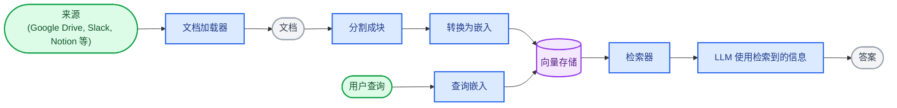
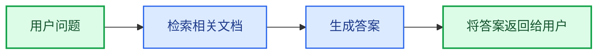
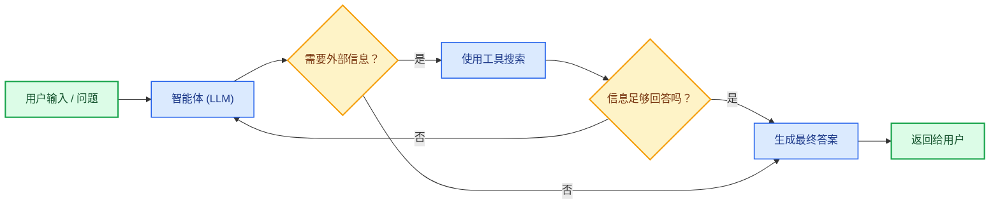
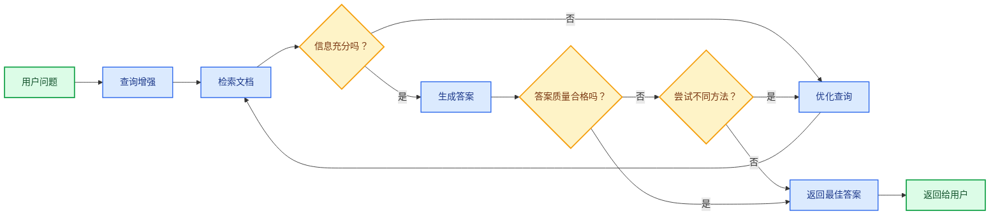

大语言模型（LLM）功能强大，但它们有两个关键限制：

* **有限的上下文**——它们无法一次性处理整个语料库。
* **静态知识**——它们的训练数据在某个时间点被冻结。

检索通过查询时获取相关的外部知识来解决这些问题。这是**检索增强生成（RAG）** 的基础：用特定上下文信息增强 LLM 的答案。

## 构建知识库

**知识库**是在检索过程中使用的文档或结构化数据的存储库。

如果你需要一个自定义知识库，可以使用 LangChain 的文档加载器和向量存储从你自己的数据中构建一个。

<Note>
    如果你已经有一个知识库（例如，SQL 数据库、CRM 或内部文档系统），你**不需要**重建它。你可以：
    - 将其作为**工具**连接到智能体式 RAG 中的智能体。
    - 查询它，并将检索到的内容作为上下文提供给 LLM [（两步式 RAG）](#2-step-rag)。
</Note>

请参阅以下教程，构建一个可搜索的知识库和最小化的 RAG 工作流：

<Card
    title="教程：语义搜索"
    icon="database"
    href="/oss/langchain/knowledge-base"
    arrow cta="了解更多"
>
    学习如何使用 LangChain 的文档加载器、嵌入和向量存储，从你自己的数据中创建一个可搜索的知识库。
    在本教程中，你将构建一个基于 PDF 的搜索引擎，实现对与查询相关的段落进行检索。你还将在此引擎之上实现一个最小化的 RAG 工作流，以了解外部知识如何集成到 LLM 的推理中。
</Card>

### 从检索到 RAG

检索使 LLM 能够在运行时访问相关上下文。但大多数实际应用更进一步：它们**将检索与生成相结合**，以产生有依据、具有上下文感知的答案。

这就是**检索增强生成（RAG）** 背后的核心理念。检索管道成为一个更广泛系统的基础，该系统将搜索与生成相结合。

### 检索管道

典型的检索工作流如下所示：



每个组件都是模块化的：你可以更换加载器、分割器、嵌入或向量存储，而无需重写应用程序的逻辑。

### 构建模块

<Columns cols={2}>
    <Card
        title="文档加载器"
        icon="file-import"
        href="/oss/integrations/document_loaders"
        arrow cta="了解更多"
    >
        从外部来源（Google Drive, Slack, Notion 等）摄取数据，返回标准化的 @[`Document`] 对象。
    </Card>

    :::python
    <Card
        title="文本分割器"
        icon="scissors"
        href="/oss/integrations/splitters"
        arrow
        cta="了解更多"
    >
        将大文档分解成更小的块，这些块可以单独检索，并能放入模型的上下文窗口。
    </Card>
    :::
    <Card
        title="嵌入模型"
        icon="sitemap"
        href="/oss/integrations/embeddings"
        arrow
        cta="了解更多"
    >
        嵌入模型将文本转换为数字向量，使得含义相似的文本在该向量空间中彼此靠近。
    </Card>

    <Card
        title="向量存储"
        icon="database"
        href="/oss/integrations/vectorstores/"
        arrow
        cta="了解更多"
    >
        用于存储和搜索嵌入的专用数据库。
    </Card>

    <Card
        title="检索器"
        icon="binoculars"
        href="/oss/integrations/retrievers/"
        arrow
        cta="了解更多"
    >
        检索器是一个接口，给定一个非结构化查询，它返回文档。
    </Card>
</Columns>

## RAG 架构

RAG 可以通过多种方式实现，具体取决于系统的需求。我们在以下部分概述了每种类型。

| 架构             | 描述                                                                 | 控制力     | 灵活性       | 延迟           | 示例用例                                       |
|------------------|----------------------------------------------------------------------|------------|--------------|----------------|------------------------------------------------|
| **两步式 RAG**   | 检索总是在生成之前发生。简单且可预测                                   | ✅ 高       | ❌ 低         | ⚡ 快速         | 常见问题解答、文档机器人                         |
| **智能体式 RAG** | 一个由 LLM 驱动的智能体在推理过程中决定*何时*以及*如何*进行检索         | ❌ 低       | ✅ 高         | ⏳ 可变         | 可以访问多个工具的研究助手                       |
| **混合式 RAG**   | 结合了两种方法的特点，并包含验证步骤                                   | ⚖️ 中等     | ⚖️ 中等       | ⏳ 可变         | 带有质量验证的特定领域问答                       |

<Info>
**延迟**：**两步式 RAG** 的延迟通常更**可预测**，因为 LLM 调用的最大次数是已知且有上限的。这种可预测性假设 LLM 推理时间是主要因素。然而，实际延迟也可能受到检索步骤性能的影响——例如 API 响应时间、网络延迟或数据库查询——这些性能会根据所使用的工具和基础设施而有所不同。
</Info>

### 两步式 RAG

在**两步式 RAG** 中，检索步骤总是在生成步骤之前执行。这种架构简单且可预测，适用于许多应用场景，其中检索相关文档是生成答案的明确前提。



<Card
    title="教程：检索增强生成 (RAG)"
    icon="robot"
    href="/oss/langchain/rag#rag-chains"
    arrow cta="了解更多"
>
    了解如何构建一个能够基于你的数据回答问题的问答聊天机器人，使用检索增强生成。
    本教程将介绍两种方法：
    * 一个**RAG 智能体**，使用灵活的工具进行搜索——非常适合通用用途。
    * 一个**两步式 RAG** 链，每个查询只需一次 LLM 调用——对于较简单的任务来说快速高效。
</Card>

### 智能体式 RAG

**智能体式检索增强生成（RAG）** 结合了检索增强生成和基于智能体的推理的优势。智能体（由 LLM 驱动）不是先检索文档再回答，而是逐步推理，并在交互过程中决定**何时**以及**如何**检索信息。

<Tip>
智能体要启用 RAG 行为，唯一需要的就是能够访问一个或多个可以获取外部知识的**工具**——例如文档加载器、Web API 或数据库查询。
</Tip>



:::python
```python
import requests
from langchain.tools import tool
from langchain.chat_models import init_chat_model
from langchain.agents import create_agent


@tool
def fetch_url(url: str) -> str:
    """从 URL 获取文本内容"""
    response = requests.get(url, timeout=10.0)
    response.raise_for_status()
    return response.text

system_prompt = """\
当你需要从网页获取信息时，使用 fetch_url；引用相关的片段。
"""

agent = create_agent(
    model="claude-sonnet-4-6",
    tools=[fetch_url], # 一个用于检索的工具 [!code highlight]
    system_prompt=system_prompt,
)
```
:::

:::js
```typescript
import { tool, createAgent } from "langchain";

const fetchUrl = tool(
    (url: string) => {
        return `Fetched content from ${url}`;
    },
    { name: "fetch_url", description: "Fetch text content from a URL" }
);

const agent = createAgent({
    model: "claude-sonnet-4-0",
    tools: [fetchUrl],
    systemPrompt,
});
```
:::

<Expandable title="扩展示例：用于 LangGraph 的 llms.txt 的智能体式 RAG">

此示例实现了一个**智能体式 RAG 系统**，以帮助用户查询 LangGraph 文档。智能体首先加载 [llms.txt](https://llmstxt.org/)，其中列出了可用的文档 URL，然后可以根据用户的问题动态使用 `fetch_documentation` 工具来检索和处理相关内容。

:::python
```python
import requests
from langchain.agents import create_agent
from langchain.messages import HumanMessage
from langchain.tools import tool
from markdownify import markdownify


ALLOWED_DOMAINS = ["https://langchain-ai.github.io/"]
LLMS_TXT = 'https://langchain-ai.github.io/langgraph/llms.txt'


@tool
def fetch_documentation(url: str) -> str:  # [!code highlight]
    """从 URL 获取并转换文档"""
    if not any(url.startswith(domain) for domain in ALLOWED_DOMAINS):
        return (
            "Error: URL not allowed. "
            f"Must start with one of: {', '.join(ALLOWED_DOMAINS)}"
        )
    response = requests.get(url, timeout=10.0)
    response.raise_for_status()
    return markdownify(response.text)


# 我们将获取 llms.txt 的内容，因此这可以
# 提前完成，无需 LLM 请求。
llms_txt_content = requests.get(LLMS_TXT).text

# 智能体的系统提示
system_prompt = f"""
你是一位专业的 Python 开发者和技术助手。
你的主要职责是帮助用户解决关于 LangGraph 及相关工具的问题。

说明：

1. 如果用户提出的问题你不确定——或者很可能涉及 API 使用、
   行为或配置——你**必须**使用 `fetch_documentation` 工具来查阅相关文档。
2. 引用文档时，请清晰总结并包含内容中的相关上下文。
3. 不要使用允许域之外的任何 URL。
4. 如果文档获取失败，请告知用户，并基于你最好的专家理解继续回答。

你可以从以下批准的来源访问官方文档：

{llms_txt_content}

在回答用户关于 LangGraph 的问题之前，你**必须**查阅文档以获取最新的文档。

你的答案应该清晰、简洁且技术准确。
"""

tools = [fetch_documentation]

model = init_chat_model("claude-sonnet-4-0", max_tokens=32_000)

agent = create_agent(
    model=model,
    tools=tools,  # [!code highlight]
    system_prompt=system_prompt,  # [!code highlight]
    name="Agentic RAG",
)

response = agent.invoke({
    'messages': [
        HumanMessage(content=(
            "写一个使用预构建的 create react agent 的 langgraph 智能体的简短示例。"
            "该智能体应该能够查找股票价格信息。"
        ))
    ]
})

print(response['messages'][-1].content)
```
:::
:::js
```typescript
import { tool, createAgent, HumanMessage } from "langchain";
import * as z from "zod";

const ALLOWED_DOMAINS = ["https://langchain-ai.github.io/"];
const LLMS_TXT = "https://langchain-ai.github.io/langgraph/llms.txt";

const fetchDocumentation = tool(
  async (input) => {  // [!code highlight]
    if (!ALLOWED_DOMAINS.some((domain) => input.url.startsWith(domain))) {
      return `Error: URL not allowed. Must start with one of: ${ALLOWED_DOMAINS.join(", ")}`;
    }
    const response = await fetch(input.url);
    if (!response.ok) {
      throw new Error(`HTTP error! status: ${response.status}`);
    }
    return response.text();
  },
  {
    name: "fetch_documentation",
    description: "Fetch and convert documentation from a URL",
    schema: z.object({
      url: z.string().describe("The URL of the documentation to fetch"),
    }),
  }
);

const llmsTxtResponse = await fetch(LLMS_TXT);
const llmsTxtContent = await llmsTxtResponse.text();

const systemPrompt = `
你是一位专业的 TypeScript 开发者和技术助手。
你的主要职责是帮助用户解决关于 LangGraph 及相关工具的问题。

说明：

1. 如果用户提出的问题你不确定——或者很可能涉及 API 使用、
   行为或配置——你**必须**使用 \`fetch_documentation\` 工具来查阅相关文档。
2. 引用文档时，请清晰总结并包含内容中的相关上下文。
3. 不要使用允许域之外的任何 URL。
4. 如果文档获取失败，请告知用户，并基于你最好的专家理解继续回答。

你可以从以下批准的来源访问官方文档：

${llmsTxtContent}

在回答用户关于 LangGraph 的问题之前，你**必须**查阅文档以获取最新的文档。

你的答案应该清晰、简洁且技术准确。
`;

const tools = [fetchDocumentation];

const agent = createAgent({
  model: "claude-sonnet-4-0"
  tools,  // [!code highlight]
  systemPrompt,  // [!code highlight]
  name: "Agentic RAG",
});

const response = await agent.invoke({
  messages: [
    new HumanMessage(
      "写一个使用预构建的 create react agent 的 langgraph 智能体的简短示例。"
      "该智能体应该能够查找股票价格信息。"
    ),
  ],
});

console.log(response.messages.at(-1)?.content);
```
:::
</Expandable>

<Card
    title="教程：检索增强生成 (RAG)"
    icon="robot"
    href="/oss/langchain/rag"
    arrow cta="了解更多"
>
    了解如何构建一个能够基于你的数据回答问题的问答聊天机器人，使用检索增强生成。
    本教程将介绍两种方法：
    * 一个**RAG 智能体**，使用灵活的工具进行搜索——非常适合通用用途。
    * 一个**两步式 RAG** 链，每个查询只需一次 LLM 调用——对于较简单的任务来说快速高效。
</Card>

### 混合式 RAG

混合式 RAG 结合了两步式和智能体式 RAG 的特点。它引入了中间步骤，例如查询预处理、检索验证和后生成检查。这些系统比固定管道提供了更多的灵活性，同时保持了对执行的一定控制。

典型组件包括：

* **查询增强**：修改输入问题以提高检索质量。这可能涉及重写不明确的查询、生成多个变体或用额外上下文扩展查询。
* **检索验证**：评估检索到的文档是否相关且充分。如果不满足条件，系统可能会优化查询并重新检索。
* **答案验证**：检查生成的答案的准确性、完整性以及与源内容的一致性。如果需要，系统可以重新生成或修改答案。

该架构通常支持这些步骤之间的多次迭代：



这种架构适用于：

* 具有模糊或未明确指定查询的应用程序
* 需要验证或质量控制步骤的系统
* 涉及多个来源或迭代优化的流程

<Card
    title="教程：具有自我修正功能的智能体式 RAG"
    icon="robot"
    href="/oss/langgraph/agentic-rag"
    arrow cta="了解更多"
>
    一个**混合式 RAG** 的示例，它结合了智能体推理、检索和自我修正。
</Card>