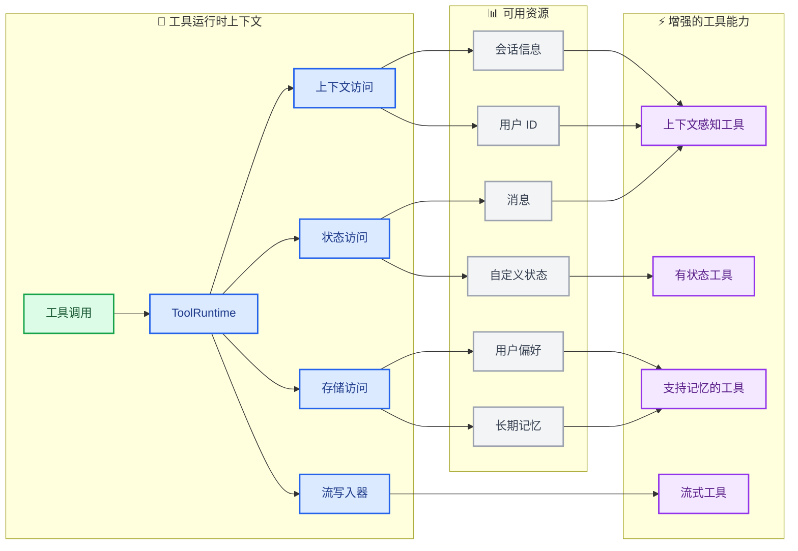

import ToolReturnValuesPy from '/snippets/code-samples/tool-return-values-py.mdx';
import ToolReturnValuesJs from '/snippets/code-samples/tool-return-values-js.mdx';
import ToolReturnObjectPy from '/snippets/code-samples/tool-return-object-py.mdx';
import ToolReturnObjectJs from '/snippets/code-samples/tool-return-object-js.mdx';
import ToolReturnCommandPy from '/snippets/code-samples/tool-return-command-py.mdx';
import ToolReturnCommandJs from '/snippets/code-samples/tool-return-command-js.mdx';

工具扩展了[智能体](/oss/langchain/agents)的能力——让它们能够获取实时数据、执行代码、查询外部数据库以及在现实世界中采取行动。

在底层，工具是具有明确定义输入和输出的可调用函数，它们会被传递给[聊天模型](/oss/langchain/models)。模型根据对话上下文决定何时调用工具，以及提供哪些输入参数。

<Tip>
    关于模型如何处理工具调用的详细信息，请参阅[工具调用](/oss/langchain/models#tool-calling)。
</Tip>

## 创建工具

### 基础工具定义

:::python
创建工具最简单的方法是使用 @[`@tool`] 装饰器。默认情况下，函数的文档字符串会成为工具的描述，帮助模型理解何时使用它：

```python
from langchain.tools import tool

@tool
def search_database(query: str, limit: int = 10) -> str:
    """在客户数据库中搜索与查询匹配的记录。

    Args:
        query: 要查找的搜索词
        limit: 要返回的最大结果数
    """
    return f"为 '{query}' 找到了 {limit} 条结果"
```

类型提示是**必需的**，因为它们定义了工具的输入模式。文档字符串应具有信息性且简洁，以帮助模型理解工具的用途。
:::

:::js
创建工具最简单的方法是从 `langchain` 包中导入 `tool` 函数。你可以使用 [zod](https://zod.dev/) 来定义工具的输入模式：

```ts
import * as z from "zod"
import { tool } from "langchain"

const searchDatabase = tool(
  ({ query, limit }) => `为 '${query}' 找到了 ${limit} 条结果`,
  {
    name: "search_database",
    description: "在客户数据库中搜索与查询匹配的记录。",
    schema: z.object({
      query: z.string().describe("要查找的搜索词"),
      limit: z.number().describe("要返回的最大结果数"),
    }),
  }
);
```

:::

<Note>
    **服务端工具使用：** 一些聊天模型内置了在模型提供商服务端执行的工具（如网络搜索、代码解释器）。详情请参阅[服务端工具使用](#server-side-tool-use)。
</Note>

<Warning>
    工具名称建议使用 `snake_case`（例如，使用 `web_search` 而不是 `Web Search`）。一些模型提供商对包含空格或特殊字符的名称存在问题或会报错拒绝。坚持使用字母数字字符、下划线和连字符有助于提高跨提供商的兼容性。
</Warning>

:::python

### 自定义工具属性

#### 自定义工具名称

默认情况下，工具名称来自函数名。当你需要更具描述性的名称时，可以覆盖它：

```python
@tool("web_search")  # 自定义名称
def search(query: str) -> str:
    """在网络上搜索信息。"""
    return f"结果：{query}"

print(search.name)  # web_search
```

#### 自定义工具描述

覆盖自动生成的工具描述，为模型提供更清晰的指导：

```python
@tool("calculator", description="执行算术计算。用于任何数学问题。")
def calc(expression: str) -> str:
    """评估数学表达式。"""
    return str(eval(expression))
```

### 高级模式定义

使用 Pydantic 模型或 JSON 模式定义复杂输入：

<CodeGroup>
    ```python Pydantic 模型
    from pydantic import BaseModel, Field
    from typing import Literal

    class WeatherInput(BaseModel):
        """天气查询的输入。"""
        location: str = Field(description="城市名称或坐标")
        units: Literal["celsius", "fahrenheit"] = Field(
            default="celsius",
            description="温度单位偏好"
        )
        include_forecast: bool = Field(
            default=False,
            description="包含5天预报"
        )

    @tool(args_schema=WeatherInput)
    def get_weather(location: str, units: str = "celsius", include_forecast: bool = False) -> str:
        """获取当前天气和可选预报。"""
        temp = 22 if units == "celsius" else 72
        result = f"{location} 的当前天气：{temp} 度 {units[0].upper()}"
        if include_forecast:
            result += "\n未来5天：晴朗"
        return result
    ```

    ```python JSON 模式
    weather_schema = {
        "type": "object",
        "properties": {
            "location": {"type": "string"},
            "units": {"type": "string"},
            "include_forecast": {"type": "boolean"}
        },
        "required": ["location", "units", "include_forecast"]
    }

    @tool(args_schema=weather_schema)
    def get_weather(location: str, units: str = "celsius", include_forecast: bool = False) -> str:
        """获取当前天气和可选预报。"""
        temp = 22 if units == "celsius" else 72
        result = f"{location} 的当前天气：{temp} 度 {units[0].upper()}"
        if include_forecast:
            result += "\n未来5天：晴朗"
        return result
    ```
</CodeGroup>

### 保留参数名

以下参数名是保留的，不能用作工具参数。使用这些名称将导致运行时错误。

| 参数名 | 用途 |
|----------------|---------|
| `config` | 保留用于在内部向工具传递 `RunnableConfig` |
| `runtime` | 保留用于 `ToolRuntime` 参数（访问状态、上下文、存储） |

要访问运行时信息，请使用 @[`ToolRuntime`] 参数，而不是将自己的参数命名为 `config` 或 `runtime`。
:::

## 访问上下文

当工具能够访问运行时信息（如对话历史、用户数据和持久化内存）时，它们的功能最为强大。本节介绍如何从工具内部访问和更新这些信息。

:::python
工具可以通过 @[`ToolRuntime`] 参数访问运行时信息，该参数提供：

| 组件 | 描述 | 用例 |
|-----------|-------------|----------|
| **状态** | 短期记忆 - 存在于当前对话期间的可变数据（消息、计数器、自定义字段） | 访问对话历史，跟踪工具调用次数 |
| **上下文** | 在调用时传递的不可变配置（用户ID、会话信息） | 根据用户身份个性化响应 |
| **存储** | 长期记忆 - 跨对话持久存在的数据 | 保存用户偏好，维护知识库 |
| **流写入器** | 在工具执行期间发出实时更新 | 为长时间运行的操作显示进度 |
| **配置** | 执行的 @[`RunnableConfig`] | 访问回调、标签和元数据 |
| **工具调用 ID** | 当前工具调用的唯一标识符 | 关联日志和模型调用的工具调用 |



### 短期记忆（状态）

状态代表在对话期间存在的短期记忆。它包括消息历史记录以及你在[图状态](/oss/langgraph/graph-api#state)中定义的任何自定义字段。

<Info>
    在你的工具签名中添加 `runtime: ToolRuntime` 以访问状态。此参数会自动注入并对 LLM 隐藏 - 它不会出现在工具的模式中。
</Info>

#### 访问状态

工具可以使用 `runtime.state` 访问当前对话状态：

```python
from langchain.tools import tool, ToolRuntime
from langchain.messages import HumanMessage

@tool
def get_last_user_message(runtime: ToolRuntime) -> str:
    """获取用户最近的消息。"""
    messages = runtime.state["messages"]

    # 查找最后一条人类消息
    for message in reversed(messages):
        if isinstance(message, HumanMessage):
            return message.content

    return "未找到用户消息"

# 访问自定义状态字段
@tool
def get_user_preference(
    pref_name: str,
    runtime: ToolRuntime
) -> str:
    """获取用户偏好值。"""
    preferences = runtime.state.get("user_preferences", {})
    return preferences.get(pref_name, "未设置")
```

<Warning>
    `runtime` 参数对模型是隐藏的。对于上面的示例，模型在工具模式中只看到 `pref_name`。
</Warning>

#### 更新状态

使用 @[`Command`] 来更新智能体的状态。这对于需要更新自定义状态字段的工具很有用：

```python
from langgraph.types import Command
from langchain.tools import tool

@tool
def set_user_name(new_name: str) -> Command:
    """在对话状态中设置用户名称。"""
    return Command(update={"user_name": new_name})
```

<Tip>
    当工具更新状态变量时，请考虑为这些字段定义一个[归约器](/oss/langgraph/graph-api#reducers)。由于 LLM 可以并行调用多个工具，归约器决定了当同一状态字段被并发工具调用更新时如何解决冲突。
</Tip>
:::

### 上下文

上下文提供了在调用时传递的不可变配置数据。用于用户ID、会话详情或不应在对话期间更改的应用程序特定设置。

:::python
通过 `runtime.context` 访问上下文：

```python
from dataclasses import dataclass
from langchain_openai import ChatOpenAI
from langchain.agents import create_agent
from langchain.tools import tool, ToolRuntime


USER_DATABASE = {
    "user123": {
        "name": "Alice Johnson",
        "account_type": "Premium",
        "balance": 5000,
        "email": "alice@example.com"
    },
    "user456": {
        "name": "Bob Smith",
        "account_type": "Standard",
        "balance": 1200,
        "email": "bob@example.com"
    }
}

@dataclass
class UserContext:
    user_id: str

@tool
def get_account_info(runtime: ToolRuntime[UserContext]) -> str:
    """获取当前用户的账户信息。"""
    user_id = runtime.context.user_id

    if user_id in USER_DATABASE:
        user = USER_DATABASE[user_id]
        return f"账户持有人：{user['name']}\n类型：{user['account_type']}\n余额：${user['balance']}"
    return "用户未找到"

model = ChatOpenAI(model="gpt-4.1")
agent = create_agent(
    model,
    tools=[get_account_info],
    context_schema=UserContext,
    system_prompt="你是一个财务助手。"
)

result = agent.invoke(
    {"messages": [{"role": "user", "content": "我当前的余额是多少？"}]},
    context=UserContext(user_id="user123")
)
```

:::

:::js
工具可以通过 `config` 参数访问智能体的运行时上下文：

```ts
import * as z from "zod"
import { ChatOpenAI } from "@langchain/openai"
import { createAgent } from "langchain"

const getUserName = tool(
  (_, config) => {
    return config.context.user_name
  },
  {
    name: "get_user_name",
    description: "获取用户的名称。",
    schema: z.object({}),
  }
);

const contextSchema = z.object({
  user_name: z.string(),
});

const agent = createAgent({
  model: new ChatOpenAI({ model: "gpt-4.1" }),
  tools: [getUserName],
  contextSchema,
});

const result = await agent.invoke(
  {
    messages: [{ role: "user", content: "我的名字是什么？" }]
  },
  {
    context: { user_name: "John Smith" }
  }
);
```

:::

### 长期记忆（存储）

@[`BaseStore`] 提供了跨对话持久存在的存储。与状态（短期记忆）不同，保存到存储的数据在未来的会话中仍然可用。

:::python
通过 `runtime.store` 访问存储。存储使用命名空间/键模式来组织数据：

<Tip>
    对于生产部署，请使用持久化存储实现，如 @[`PostgresStore`]，而不是 `InMemoryStore`。设置详情请参阅[内存文档](/oss/langgraph/memory)。
</Tip>

```python expandable
from typing import Any
from langgraph.store.memory import InMemoryStore
from langchain.agents import create_agent
from langchain.tools import tool, ToolRuntime
from langchain_openai import ChatOpenAI

# 访问内存
@tool
def get_user_info(user_id: str, runtime: ToolRuntime) -> str:
    """查找用户信息。"""
    store = runtime.store
    user_info = store.get(("users",), user_id)
    return str(user_info.value) if user_info else "未知用户"

# 更新内存
@tool
def save_user_info(user_id: str, user_info: dict[str, Any], runtime: ToolRuntime) -> str:
    """保存用户信息。"""
    store = runtime.store
    store.put(("users",), user_id, user_info)
    return "成功保存用户信息。"

model = ChatOpenAI(model="gpt-4.1")

store = InMemoryStore()
agent = create_agent(
    model,
    tools=[get_user_info, save_user_info],
    store=store
)

# 第一个会话：保存用户信息
agent.invoke({
    "messages": [{"role": "user", "content": "保存以下用户：userid: abc123, name: Foo, age: 25, email: foo@langchain.dev"}]
})

# 第二个会话：获取用户信息
agent.invoke({
    "messages": [{"role": "user", "content": "获取ID为 'abc123' 的用户信息"}]
})
# 这是ID为 "abc123" 的用户信息：
# - 名称：Foo
# - 年龄：25
# - 邮箱：foo@langchain.dev
```

:::

:::js
通过 `config.store` 访问存储。存储使用命名空间/键模式来组织数据：

```ts expandable
import * as z from "zod";
import { createAgent, tool } from "langchain";
import { InMemoryStore } from "@langchain/langgraph";
import { ChatOpenAI } from "@langchain/openai";

const store = new InMemoryStore();

// 访问内存
const getUserInfo = tool(
  async ({ user_id }) => {
    const value = await store.get(["users"], user_id);
    console.log("get_user_info", user_id, value);
    return value;
  },
  {
    name: "get_user_info",
    description: "查找用户信息。",
    schema: z.object({
      user_id: z.string(),
    }),
  }
);

// 更新内存
const saveUserInfo = tool(
  async ({ user_id, name, age, email }) => {
    console.log("save_user_info", user_id, name, age, email);
    await store.put(["users"], user_id, { name, age, email });
    return "成功保存用户信息。";
  },
  {
    name: "save_user_info",
    description: "保存用户信息。",
    schema: z.object({
      user_id: z.string(),
      name: z.string(),
      age: z.number(),
      email: z.string(),
    }),
  }
);

const agent = createAgent({
  model: new ChatOpenAI({ model: "gpt-4.1" }),
  tools: [getUserInfo, saveUserInfo],
  store,
});

// 第一个会话：保存用户信息
await agent.invoke({
  messages: [
    {
      role: "user",
      content: "保存以下用户：userid: abc123, name: Foo, age: 25, email: foo@langchain.dev",
    },
  ],
});

// 第二个会话：获取用户信息
const result = await agent.invoke({
  messages: [
    { role: "user", content: "获取ID为 'abc123' 的用户信息" },
  ],
});

console.log(result);
// 这是ID为 "abc123" 的用户信息：
// - 名称：Foo
// - 年龄：25
// - 邮箱：foo@langchain.dev
```

:::

### 流写入器

在工具执行期间流式传输实时更新。这对于在长时间运行的操作期间向用户提供进度反馈很有用。

:::python
使用 `runtime.stream_writer` 发出自定义更新：

```python
from langchain.tools import tool, ToolRuntime

@tool
def get_weather(city: str, runtime: ToolRuntime) -> str:
    """获取给定城市的天气。"""
    writer = runtime.stream_writer

    # 在工具执行时流式传输自定义更新
    writer(f"正在查找城市数据：{city}")
    writer(f"已获取城市数据：{city}")

    return f"{city} 总是阳光明媚！"
```

<Note>
如果你在工具内部使用 `runtime.stream_writer`，该工具必须在 LangGraph 执行上下文中调用。更多详情请参阅[流式传输](/oss/langchain/streaming)。
</Note>
:::

:::js
使用 `config.writer` 发出自定义更新：

```ts
import * as z from "zod";
import { tool, ToolRuntime } from "langchain";

const getWeather = tool(
  ({ city }, config: ToolRuntime) => {
    const writer = config.writer;

    // 在工具执行时流式传输自定义更新
    if (writer) {
      writer(`正在查找城市数据：${city}`);
      writer(`已获取城市数据：${city}`);
    }

    return `${city} 总是阳光明媚！`;
  },
  {
    name: "get_weather",
    description: "获取给定城市的天气。",
    schema: z.object({
      city: z.string(),
    }),
  }
);
```

:::

## ToolNode

@[`ToolNode`] 是一个预构建的节点，用于在 LangGraph 工作流中执行工具。它自动处理并行工具执行、错误处理和状态注入。

<Info>
    对于需要精细控制工具执行模式的自定义工作流，请使用 @[`ToolNode`] 而不是 @[`create_agent`]。它是驱动智能体工具执行的基础构建块。
</Info>

### 基本用法

:::python

```python
from langchain.tools import tool
from langgraph.prebuilt import ToolNode
from langgraph.graph import StateGraph, MessagesState, START, END

@tool
def search(query: str) -> str:
    """搜索信息。"""
    return f"结果：{query}"

@tool
def calculator(expression: str) -> str:
    """评估数学表达式。"""
    return str(eval(expression))

# 使用你的工具创建 ToolNode
tool_node = ToolNode([search, calculator])

# 在图中使用
builder = StateGraph(MessagesState)
builder.add_node("tools", tool_node)
# ... 添加其他节点和边
```

:::

:::js

```typescript
import { ToolNode } from "@langchain/langgraph/prebuilt";
import { tool } from "@langchain/core/tools";
import * as z from "zod";

const search = tool(
  ({ query }) => `结果：${query}`,
  {
    name: "search",
    description: "搜索信息。",
    schema: z.object({ query: z.string() }),
  }
);

const calculator = tool(
  ({ expression }) => String(eval(expression)),
  {
    name: "calculator",
    description: "评估数学表达式。",
    schema: z.object({ expression: z.string() }),
  }
);

// 使用你的工具创建 ToolNode
const toolNode = new ToolNode([search, calculator]);
```

:::

### 工具返回值

你可以为工具选择不同的返回值：

- 返回 `string` 用于人类可读的结果。
- 返回 `object` 用于模型应解析的结构化结果。
- 返回带有可选消息的 `Command`，当你需要写入状态时。

#### 返回字符串

当工具应为模型提供纯文本以供其读取并在下一个响应中使用时，返回字符串。

:::python

<ToolReturnValuesPy />

:::

:::js

<ToolReturnValuesJs />

:::

行为：

- 返回值被转换为 `ToolMessage`。
- 模型看到该文本并决定下一步做什么。
- 除非模型或其他工具稍后更改，否则不会更改智能体状态字段。

当结果本质上是人类可读文本时使用此方法。

#### 返回对象

当你的工具生成结构化数据且模型应检查时，返回对象（例如 `dict`）。

:::python

<ToolReturnObjectPy />

:::

:::js

<ToolReturnObjectJs />

:::

行为：

- 对象被序列化并作为工具输出发送回来。
- 模型可以读取特定字段并基于它们进行推理。
- 与字符串返回类似，这不会直接更新图状态。

当下游推理受益于显式字段而非自由格式文本时使用此方法。

#### 返回 Command

当工具需要更新图状态时（例如，设置用户偏好或应用程序状态），返回 @[`Command`]。
你可以返回带有或不包含 `ToolMessage` 的 `Command`。
如果模型需要看到工具执行成功（例如，确认偏好更改），请在更新中包含 `ToolMessage`，并使用 `runtime.tool_call_id` 作为 `tool_call_id` 参数。

:::python

<ToolReturnCommandPy />

:::

:::js

<ToolReturnCommandJs />

:::

行为：

- 命令使用 `update` 更新状态。
- 更新后的状态在同一运行中的后续步骤中可用。
- 对于可能被并行工具调用更新的字段，请使用归约器。

当工具不仅仅是返回数据，还要改变智能体状态时使用此方法。

### 错误处理

配置如何处理工具错误。所有选项请参阅 @[`ToolNode`] API 参考。

:::python

```python
from langgraph.prebuilt import ToolNode

# 默认：捕获调用错误，重新抛出执行错误
tool_node = ToolNode(tools)

# 捕获所有错误并向 LLM 返回错误消息
tool_node = ToolNode(tools, handle_tool_errors=True)

# 自定义错误消息
tool_node = ToolNode(tools, handle_tool_errors="出错了，请重试。")

# 自定义错误处理器
def handle_error(e: ValueError) -> str:
    return f"无效输入：{e}"

tool_node = ToolNode(tools, handle_tool_errors=handle_error)

# 仅捕获特定异常类型
tool_node = ToolNode(tools, handle_tool_errors=(ValueError, TypeError))
```

:::

:::js

```typescript
import { ToolNode } from "@langchain/langgraph/prebuilt";

// 默认行为
const toolNode = new ToolNode(tools);

// 捕获所有错误
const toolNode = new ToolNode(tools, { handleToolErrors: true });

// 自定义错误消息
const toolNode = new ToolNode(tools, {
  handleToolErrors: "出错了，请重试。"
});
```

:::

### 使用 tools_condition 路由

使用 @[`tools_condition`] 根据 LLM 是否进行了工具调用来进行条件路由：

:::python

```python
from langgraph.prebuilt import ToolNode, tools_condition
from langgraph.graph import StateGraph, MessagesState, START, END

builder = StateGraph(MessagesState)
builder.add_node("llm", call_llm)
builder.add_node("tools", ToolNode(tools))

builder.add_edge(START, "llm")
builder.add_conditional_edges("llm", tools_condition)  # 路由到 "tools" 或 END
builder.add_edge("tools", "llm")

graph = builder.compile()
```

:::

:::js

```typescript
import { ToolNode, toolsCondition } from "@langchain/langgraph/prebuilt";
import { StateGraph, MessagesAnnotation } from "@langchain/langgraph";

const builder = new StateGraph(MessagesAnnotation)
  .addNode("llm", callLlm)
  .addNode("tools", new ToolNode(tools))
  .addEdge("__start__", "llm")
  .addConditionalEdges("llm", toolsCondition)  // 路由到 "tools" 或 "__end__"
  .addEdge("tools", "llm");

const graph = builder.compile();
```

:::

### 状态注入

工具可以通过 @[`ToolRuntime`] 访问当前图状态：

:::python

```python
from langchain.tools import tool, ToolRuntime
from langgraph.prebuilt import ToolNode

@tool
def get_message_count(runtime: ToolRuntime) -> str:
    """获取对话中的消息数量。"""
    messages = runtime.state["messages"]
    return f"有 {len(messages)} 条消息。"

tool_node = ToolNode([get_message_count])
```

:::

有关从工具访问状态、上下文和长期记忆的更多详细信息，请参阅[访问上下文](#access-context)。

## 预构建工具

LangChain 提供了大量预构建的工具和工具包，用于常见任务，如网络搜索、代码解释、数据库访问等。这些即用型工具可以直接集成到你的智能体中，无需编写自定义代码。

有关按类别组织的可用工具的完整列表，请参阅[工具和工具包](/oss/integrations/tools)集成页面。

## 服务端工具使用

一些聊天模型内置了由模型提供商在服务端执行的工具。这些功能包括网络搜索和代码解释器等，无需你定义或托管工具逻辑。

有关启用和使用这些内置工具的详细信息，请参阅各个[聊天模型集成页面](/oss/integrations/providers)和[工具调用文档](/oss/langchain/models#server-side-tool-use)。