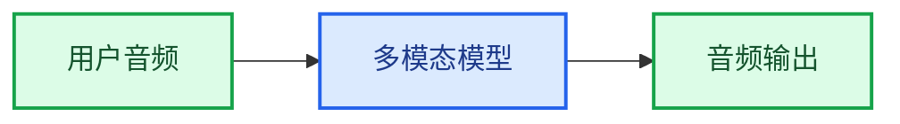

## 概述

聊天界面一直主导着我们与 AI 的交互方式，但最近多模态 AI 的突破正在开启令人兴奋的新可能性。高质量的生成模型和富有表现力的文本转语音（TTS）系统，使得构建感觉更像对话伙伴而非工具的助手成为可能。

语音助手就是其中一个例子。你无需依赖键盘和鼠标将输入内容键入助手，而是可以使用口语与它交互。这可能是一种更自然、更具吸引力的 AI 交互方式，并且在某些场景下尤其有用。

### 什么是语音助手？

语音助手是能够与用户进行自然口语对话的[智能体](/oss/langchain/agents)。这些助手结合了语音识别、自然语言处理、生成式 AI 和文本转语音技术，以创建无缝、自然的对话。

它们适用于多种用例，包括：

- 客户支持
- 个人助理
- 免提界面
- 辅导与培训

### 语音助手如何工作？

从高层次看，每个语音助手都需要处理三个任务：

1.  **聆听** - 捕获音频并转录
2.  **思考** - 解释意图、推理、规划
3.  **说话** - 生成音频并流式传输回用户

区别在于这些步骤的排序和耦合方式。在实践中，生产级助手主要遵循以下两种架构之一：

#### 1. STT > 智能体 > TTS 架构（"三明治"架构）

三明治架构由三个独立的组件组成：语音转文本（STT）、基于文本的 LangChain 智能体，以及文本转语音（TTS）。


**优点：**
- 完全控制每个组件（可根据需要更换 STT/TTS 提供商）
- 能够利用现代文本模态模型的最新能力
- 行为透明，组件间边界清晰

**缺点：**
- 需要协调多个服务
- 管理流水线增加了复杂性
- 从语音到文本的转换会丢失信息（例如，语调、情感）

#### 2. 语音到语音架构（S2S）

语音到语音架构使用多模态模型，该模型原生处理音频输入并生成音频输出。



**优点：**
- 架构更简单，组件更少
- 对于简单交互，通常延迟更低
- 直接处理音频，能捕捉语音的语调和其他细微差别

**缺点：**
- 模型选择有限，供应商锁定的风险更大
- 功能可能落后于文本模态模型
- 音频处理过程透明度较低
- 可控制性和自定义选项减少

本指南演示**三明治架构**，以平衡性能、可控性和对现代模型能力的访问。使用某些 STT 和 TTS 提供商时，三明治架构可以实现低于 700 毫秒的延迟，同时保持对模块化组件的控制。

### 演示应用概述

我们将逐步构建一个使用三明治架构的语音助手。该助手将管理一家三明治店的订单。该应用将演示三明治架构的所有三个组件，使用 [AssemblyAI](https://www.assemblyai.com/) 进行 STT，使用 [Cartesia](https://cartesia.ai/) 进行 TTS（尽管可以为大多数提供商构建适配器）。

端到端的参考应用可在 [voice-sandwich-demo](https://github.com/langchain-ai/voice-sandwich-demo) 仓库中找到。我们将在此处逐步讲解该应用。

演示使用 WebSockets 实现浏览器和服务器之间的实时双向通信。相同的架构可以适配其他传输方式，如电话系统（Twilio、Vonage）或 WebRTC 连接。

### 架构

演示实现了一个流式处理流水线，其中每个阶段异步处理数据：

**客户端（浏览器）**
- 捕获麦克风音频并将其编码为 PCM
- 建立到后端服务器的 WebSocket 连接
- 实时将音频块流式传输到服务器
- 接收并播放合成的语音音频

:::python
**服务器（Python）**
:::
:::js
**服务器（Node.js）**
:::

- 接受来自客户端的 WebSocket 连接
- 协调三步流水线：
  - [语音转文本（STT）](#1-语音转文本)：将音频转发给 STT 提供商（例如 AssemblyAI），接收转录事件
  - [智能体](#2-langchain-智能体)：使用 LangChain 智能体处理转录文本，流式传输响应令牌
  - [文本转语音（TTS）](#3-文本转语音)：将智能体响应发送给 TTS 提供商（例如 Cartesia），接收音频块

- 将合成的音频返回给客户端进行播放

:::python
流水线使用异步生成器来实现每个阶段的流式处理。这使得下游组件能够在上游阶段完成之前开始处理，从而最小化端到端延迟。
:::
:::js
流水线使用异步迭代器来实现每个阶段的流式处理。这使得下游组件能够在上游阶段完成之前开始处理，从而最小化端到端延迟。
:::

## 设置

有关详细的安装说明和设置，请参阅[仓库 README](https://github.com/langchain-ai/voice-sandwich-demo#readme)。

## 1. 语音转文本

STT 阶段将传入的音频流转换为文本转录。该实现使用生产者-消费者模式来并发处理音频流和转录接收。

### 关键概念

**生产者-消费者模式**：音频块被并发地发送到 STT 服务，同时接收转录事件。这使得转录可以在所有音频到达之前就开始。

**事件类型**：
- `stt_chunk`：STT 服务处理音频时提供的部分转录文本
- `stt_output`：触发智能体处理的最终格式化转录文本

**WebSocket 连接**：保持与 AssemblyAI 实时 STT API 的持久连接，配置为 16kHz PCM 音频并启用自动话轮格式化。

### 实现

:::python
```python
from typing import AsyncIterator
import asyncio
from assemblyai_stt import AssemblyAISTT
from events import VoiceAgentEvent

async def stt_stream(
    audio_stream: AsyncIterator[bytes],
) -> AsyncIterator[VoiceAgentEvent]:
    """
    转换流：音频（字节）→ 语音事件（VoiceAgentEvent）

    使用生产者-消费者模式，其中：
    - 生产者：读取音频块并将其发送到 AssemblyAI
    - 消费者：从 AssemblyAI 接收转录事件
    """
    stt = AssemblyAISTT(sample_rate=16000)

    async def send_audio():
        """将音频块泵送到 AssemblyAI 的后台任务。"""
        try:
            async for audio_chunk in audio_stream:
                await stt.send_audio(audio_chunk)
        finally:
            # 音频流结束时发出完成信号
            await stt.close()

    # 在后台启动音频发送
    send_task = asyncio.create_task(send_audio())

    try:
        # 接收并产出到达的转录事件
        async for event in stt.receive_events():
            yield event
    finally:
        # 清理
        with contextlib.suppress(asyncio.CancelledError):
            send_task.cancel()
            await send_task
        await stt.close()
```
:::

:::js
```typescript
import { AssemblyAISTT } from "./assemblyai";
import type { VoiceAgentEvent } from "./types";

async function* sttStream(
  audioStream: AsyncIterable<Uint8Array>
): AsyncGenerator<VoiceAgentEvent> {
  const stt = new AssemblyAISTT({ sampleRate: 16000 });
  const passthrough = writableIterator<VoiceAgentEvent>();

  // 生产者：将音频块泵送到 AssemblyAI
  const producer = (async () => {
    try {
      for await (const audioChunk of audioStream) {
        await stt.sendAudio(audioChunk);
      }
    } finally {
      await stt.close();
    }
  })();

  // 消费者：接收转录事件
  const consumer = (async () => {
    for await (const event of stt.receiveEvents()) {
      passthrough.push(event);
    }
  })();

  try {
    // 产出到达的事件
    yield* passthrough;
  } finally {
    // 等待生产者和消费者完成
    await Promise.all([producer, consumer]);
  }
}
```
:::

该应用实现了一个 AssemblyAI 客户端来管理 WebSocket 连接和消息解析。具体实现见下文；可以为其他 STT 提供商构建类似的适配器。

<Accordion title="AssemblyAI 客户端">

:::python
```python
class AssemblyAISTT:
    def __init__(self, api_key: str | None = None, sample_rate: int = 16000):
        self.api_key = api_key or os.getenv("ASSEMBLYAI_API_KEY")
        self.sample_rate = sample_rate
        self._ws: WebSocketClientProtocol | None = None

    async def send_audio(self, audio_chunk: bytes) -> None:
        """将 PCM 音频字节发送到 AssemblyAI。"""
        ws = await self._ensure_connection()
        await ws.send(audio_chunk)

    async def receive_events(self) -> AsyncIterator[STTEvent]:
        """产出从 AssemblyAI 到达的 STT 事件。"""
        async for raw_message in self._ws:
            message = json.loads(raw_message)

            if message["type"] == "Turn":
                # 最终格式化转录文本
                if message.get("turn_is_formatted"):
                    yield STTOutputEvent.create(message["transcript"])
                # 部分转录文本
                else:
                    yield STTChunkEvent.create(message["transcript"])

    async def _ensure_connection(self) -> WebSocketClientProtocol:
        """如果尚未连接，则建立 WebSocket 连接。"""
        if self._ws is None:
            url = f"wss://streaming.assemblyai.com/v3/ws?sample_rate={self.sample_rate}&format_turns=true"
            self._ws = await websockets.connect(
                url,
                additional_headers={"Authorization": self.api_key}
            )
        return self._ws
```
:::

:::js
```typescript
export class AssemblyAISTT {
  protected _bufferIterator = writableIterator<VoiceAgentEvent.STTEvent>();
  protected _connectionPromise: Promise<WebSocket> | null = null;

  async sendAudio(buffer: Uint8Array): Promise<void> {
    const conn = await this._connection;
    conn.send(buffer);
  }

  async *receiveEvents(): AsyncGenerator<VoiceAgentEvent.STTEvent> {
    yield* this._bufferIterator;
  }

  protected get _connection(): Promise<WebSocket> {
    if (this._connectionPromise) return this._connectionPromise;

    this._connectionPromise = new Promise((resolve, reject) => {
      const params = new URLSearchParams({
        sample_rate: this.sampleRate.toString(),
        format_turns: "true",
      });
      const url = `wss://streaming.assemblyai.com/v3/ws?${params}`;
      const ws = new WebSocket(url, {
        headers: { Authorization: this.apiKey },
      });

      ws.on("open", () => resolve(ws));

      ws.on("message", (data) => {
        const message = JSON.parse(data.toString());
        if (message.type === "Turn") {
          if (message.turn_is_formatted) {
            this._bufferIterator.push({
              type: "stt_output",
              transcript: message.transcript,
              ts: Date.now()
            });
          } else {
            this._bufferIterator.push({
              type: "stt_chunk",
              transcript: message.transcript,
              ts: Date.now()
            });
          }
        }
      });
    });

    return this._connectionPromise;
  }
}
```
:::

</Accordion>

## 2. LangChain 智能体

智能体阶段通过 LangChain [智能体](/oss/langchain/agents)处理文本转录，并流式传输响应令牌。在本例中，我们流式传输智能体生成的所有[文本内容块](/oss/langchain/messages#content-block-reference)。

### 关键概念

**流式响应**：智能体使用 [`stream_mode="messages"`](/oss/langchain/streaming#llm-tokens) 在生成时发出响应令牌，而不是等待完整响应。这使得 TTS 阶段能够立即开始合成。

**对话记忆**：[检查点器](/oss/langchain/short-term-memory)使用唯一的线程 ID 在话轮之间维护对话状态。这使得智能体能够引用对话中先前的交流。

### 实现

:::python
```python
from uuid import uuid4
from langchain.agents import create_agent
from langchain.messages import HumanMessage
from langgraph.checkpoint.memory import InMemorySaver

# 定义智能体工具
def add_to_order(item: str, quantity: int) -> str:
    """将商品添加到客户的三明治订单中。"""
    return f"Added {quantity} x {item} to the order."

def confirm_order(order_summary: str) -> str:
    """与客户确认最终订单。"""
    return f"Order confirmed: {order_summary}. Sending to kitchen."

# 使用工具和记忆创建智能体
agent = create_agent(
    model="anthropic:claude-haiku-4-5",  # 选择你的模型
    tools=[add_to_order, confirm_order],
    system_prompt="""你是一个乐于助人的三明治店助手。
    你的目标是接收用户的订单。请简洁友好。
    不要使用表情符号、特殊字符或 Markdown。
    你的响应将由文本转语音引擎朗读。""",
    checkpointer=InMemorySaver(),
)

async def agent_stream(
    event_stream: AsyncIterator[VoiceAgentEvent],
) -> AsyncIterator[VoiceAgentEvent]:
    """
    转换流：语音事件 → 语音事件（包含智能体响应）

    传递所有上游事件，并在处理 STT 转录文本时添加 agent_chunk 事件。
    """
    # 为对话记忆生成唯一的线程 ID
    thread_id = str(uuid4())

    async for event in event_stream:
        # 传递所有上游事件
        yield event

        # 通过智能体处理最终转录文本
        if event.type == "stt_output":
            # 使用对话上下文流式传输智能体响应
            stream = agent.astream(
                {"messages": [HumanMessage(content=event.transcript)]},
                {"configurable": {"thread_id": thread_id}},
                stream_mode="messages",
            )

            # 产出到达的智能体响应块
            async for message, _ in stream:
                if message.text:
                    yield AgentChunkEvent.create(message.text)
```
:::

:::js
```typescript
import { createAgent } from "langchain";
import { HumanMessage } from "@langchain/core/messages";
import { MemorySaver } from "@langchain/langgraph";
import { tool } from "@langchain/core/tools";
import { z } from "zod";
import { v4 as uuidv4 } from "uuid";

// 定义智能体工具
const addToOrder = tool(
  async ({ item, quantity }) => {
    return `Added ${quantity} x ${item} to the order.`;
  },
  {
    name: "add_to_order",
    description: "将商品添加到客户的三明治订单中。",
    schema: z.object({
      item: z.string(),
      quantity: z.number(),
    }),
  }
);

const confirmOrder = tool(
  async ({ orderSummary }) => {
    return `Order confirmed: ${orderSummary}. Sending to kitchen.`;
  },
  {
    name: "confirm_order",
    description: "与客户确认最终订单。",
    schema: z.object({
      orderSummary: z.string().describe("订单摘要"),
    }),
  }
);

// 使用工具和记忆创建智能体
const agent = createAgent({
  model: "claude-haiku-4-5",
  tools: [addToOrder, confirmOrder],
  checkpointer: new MemorySaver(),
  systemPrompt: `你是一个乐于助人的三明治店助手。
你的目标是接收用户的订单。请简洁友好。
不要使用表情符号、特殊字符或 Markdown。
你的响应将由文本转语音引擎朗读。`,
});

async function* agentStream(
  eventStream: AsyncIterable<VoiceAgentEvent>
): AsyncGenerator<VoiceAgentEvent> {
  // 为对话记忆生成唯一的线程 ID
  const threadId = uuidv4();

  for await (const event of eventStream) {
    // 传递所有上游事件
    yield event;

    // 通过智能体处理最终转录文本
    if (event.type === "stt_output") {
      const stream = await agent.stream(
        { messages: [new HumanMessage(event.transcript)] },
        {
          configurable: { thread_id: threadId },
          streamMode: "messages",
        }
      );

      // 产出到达的智能体响应块
      for await (const [message] of stream) {
        yield { type: "agent_chunk", text: message.text, ts: Date.now() };
      }
    }
  }
}
```
:::

## 3. 文本转语音

TTS 阶段将智能体响应文本合成为音频，并流式传输回客户端。与 STT 阶段类似，它使用生产者-消费者模式来处理并发的文本发送和音频接收。

### 关键概念

**并发处理**：该实现合并了两个异步流：
- **上游处理**：传递所有事件，并将智能体文本块发送给 TTS 提供商
- **音频接收**：从 TTS 提供商接收合成的音频块

**流式 TTS**：一些提供商（例如 [Cartesia](https://cartesia.ai/)）在收到文本后立即开始合成音频，使得音频播放可以在智能体完成生成完整响应之前就开始。

**事件透传**：所有上游事件都原封不动地流过，允许客户端或其他观察者跟踪整个流水线的状态。

### 实现

:::python
```python
from cartesia_tts import CartesiaTTS
from utils import merge_async_iters

async def tts_stream(
    event_stream: AsyncIterator[VoiceAgentEvent],
) -> AsyncIterator[VoiceAgentEvent]:
    """
    转换流：语音事件 → 语音事件（包含音频）

    合并两个并发流：
    1. process_upstream()：传递事件并将文本发送到 Cartesia
    2. tts.receive_events()：产出从 Cartesia 收到的音频块
    """
    tts = CartesiaTTS()

    async def process_upstream() -> AsyncIterator[VoiceAgentEvent]:
        """处理上游事件并将智能体文本发送到 Cartesia。"""
        async for event in event_stream:
            # 传递所有事件
            yield event
            # 将智能体文本发送到 Cartesia 进行合成
            if event.type == "agent_chunk":
                await tts.send_text(event.text)

    try:
        # 将上游事件与 TTS 音频事件合并
        # 两个流并发运行
        async for event in merge_async_iters(
            process_upstream(),
            tts.receive_events()
        ):
            yield event
    finally:
        await tts.close()
```
:::

:::js
```typescript
import { CartesiaTTS } from "./cartesia";

async function* ttsStream(
  eventStream: AsyncIterable<VoiceAgentEvent>
): AsyncGenerator<VoiceAgentEvent> {
  const tts = new CartesiaTTS();
  const passthrough = writableIterator<VoiceAgentEvent>();

  // 生产者：读取上游事件并将文本发送到 Cartesia
  const producer = (async () => {
    try {
      for await (const event of eventStream) {
        passthrough.push(event);
        if (event.type === "agent_chunk") {
          await tts.sendText(event.text);
        }
      }
    } finally {
      await tts.close();
    }
  })();

  // 消费者：从 Cartesia 接收音频
  const consumer = (async () => {
    for await (const event of tts.receiveEvents()) {
      passthrough.push(event);
    }
  })();

  try {
    // 产出来自生产者和消费者的事件
    yield* passthrough;
  } finally {
    await Promise.all([producer, consumer]);
  }
}
```
:::

该应用实现了一个 Cartesia 客户端来管理 WebSocket 连接和音频流。具体实现见下文；可以为其他 TTS 提供商构建类似的适配器。

<Accordion title="Cartesia 客户端">

:::python
```python
import base64
import json
import websockets

class CartesiaTTS:
    def __init__(
        self,
        api_key: Optional[str] = None,
        voice_id: str = "f6ff7c0c-e396-40a9-a70b-f7607edb6937",
        model_id: str = "sonic-3",
        sample_rate: int = 24000,
        encoding: str = "pcm_s16le",
    ):
        self.api_key = api_key or os.getenv("CARTESIA_API_KEY")
        self.voice_id = voice_id
        self.model_id = model_id
        self.sample_rate = sample_rate
        self.encoding = encoding
        self._ws: WebSocketClientProtocol | None = None

    def _generate_context_id(self) -> str:
        """为 Cartesia 生成有效的 context_id。"""
        timestamp = int(time.time() * 1000)
        counter = self._context_counter
        self._context_counter += 1
        return f"ctx_{timestamp}_{counter}"

    async def send_text(self, text: str | None) -> None:
        """将文本发送到 Cartesia 进行合成。"""
        if not text or not text.strip():
            return

        ws = await self._ensure_connection()
        payload = {
            "model_id": self.model_id,
            "transcript": text,
            "voice": {
                "mode": "id",
                "id": self.voice_id,
            },
            "output_format": {
                "container": "raw",
                "encoding": self.encoding,
                "sample_rate": self.sample_rate,
            },
            "language": self.language,
            "context_id": self._generate_context_id(),
        }
        await ws.send(json.dumps(payload))

    async def receive_events(self) -> AsyncIterator[TTSChunkEvent]:
        """产出从 Cartesia 到达的音频块。"""
        async for raw_message in self._ws:
            message = json.loads(raw_message)

            # 解码并产出音频块
            if "data" in message and message["data"]:
                audio_chunk = base64.b64decode(message["data"])
                if audio_chunk:
                    yield TTSChunkEvent.create(audio_chunk)

    async def _ensure_connection(self) -> WebSocketClientProtocol:
        """如果尚未连接，则建立 WebSocket 连接。"""
        if self._ws is None:
            url = (
                f"wss://api.cartesia.ai/tts/websocket"
                f"?api_key={self.api_key}&cartesia_version={self.cartesia_version}"
            )
            self._ws = await websockets.connect(url)

        return self._ws
```
:::

:::js
```typescript
export class CartesiaTTS {
  protected _bufferIterator = writableIterator<VoiceAgentEvent.TTSEvent>();
  protected _connectionPromise: Promise<WebSocket> | null = null;

  async sendText(text: string | null): Promise<void> {
    if (!text || !text.trim()) return;

    const conn = await this._connection;
    const payload = { text, try_trigger_generation: false };
    conn.send(JSON.stringify(payload));
  }

  async *receiveEvents(): AsyncGenerator<VoiceAgentEvent.TTSEvent> {
    yield* this._bufferIterator;
  }

  protected _generateContextId(): string {
    const timestamp = Date.now();
    const counter = this._contextCounter++;
    return `ctx_${timestamp}_${counter}`;
  }

  protected get _connection(): Promise<WebSocket> {
    if (this._connectionPromise) return this._connectionPromise;

    this._connectionPromise = new Promise((resolve, reject) => {
      const params = new URLSearchParams({
        api_key: this.apiKey,
        cartesia_version: this.cartesiaVersion,
      });
      const url = `wss://api.cartesia.ai/tts/websocket?${params.toString()}`;
      const ws = new WebSocket(url);

      ws.on("open", () => {
        resolve(ws);
      });

      ws.on("message", (data: WebSocket.RawData) => {
        const message: CartesiaTTSResponse = JSON.parse(data.toString());
        if (message.data) {
          this._bufferIterator.push({
            type: "tts_chunk",
            audio: message.data,
            ts: Date.now(),
          });
        } else if (message.error) {
          throw new Error(`Cartesia error: ${message.error}`);
        }
      });
    });

    return this._connectionPromise;
  }
}
```
:::
</Accordion>

### LangSmith

使用 LangChain 构建的许多应用都包含多个步骤和多次 LLM 调用。随着这些应用变得越来越复杂，能够检查链或智能体内部究竟发生了什么变得至关重要。最好的方法是使用 [LangSmith](https://smith.langchain.com)。

在以上链接注册后，请确保设置环境变量以开始记录追踪：

```shell
export LANGSMITH_TRACING="true"
export LANGSMITH_API_KEY="..."
```

:::python
或者在 Python 中设置：

```python
import getpass
import os

os.environ["LANGSMITH_TRACING"] = "true"
os.environ["LANGSMITH_API_KEY"] = getpass.getpass()
```
:::

## 整合所有部分

完整的流水线将三个阶段链接在一起：

:::python
```python
from langchain_core.runnables import RunnableGenerator

pipeline = (
    RunnableGenerator(stt_stream)      # 音频 → STT 事件
    | RunnableGenerator(agent_stream)  # STT 事件 → 智能体事件
    | RunnableGenerator(tts_stream)    # 智能体事件 → TTS 音频
)

# 在 WebSocket 端点中使用
@app.websocket("/ws")
async def websocket_endpoint(websocket: WebSocket):
    await websocket.accept()

    async def websocket_audio_stream():
        """从 WebSocket 产出音频字节。"""
        while True:
            data = await websocket.receive_bytes()
            yield data

    # 通过流水线转换音频
    output_stream = pipeline.atransform(websocket_audio_stream())

    # 将 TTS 音频发送回客户端
    async for event in output_stream:
        if event.type == "tts_chunk":
            await websocket.send_bytes(event.audio)
```

我们使用 [RunnableGenerators](https://reference.langchain.com/python/langchain_core/runnables/#langchain_core.runnables.base.RunnableGenerator) 来组合流水线的每个步骤。这是 LangChain 内部用于管理[跨组件流式处理](https://reference.langchain.com/python/langchain_core/runnables/)的抽象。
:::

:::js
```typescript
// 使用 https://hono.dev/
app.get("/ws", upgradeWebSocket(async () => {
  const inputStream = writableIterator<Uint8Array>();

  // 链接三个阶段
  const transcriptEventStream = sttStream(inputStream);
  const agentEventStream = agentStream(transcriptEventStream);
  const outputEventStream = ttsStream(agentEventStream);

  // 处理流水线并将 TTS 音频发送到客户端
  const flushPromise = (async () => {
    for await (const event of outputEventStream) {
      if (event.type === "tts_chunk") {
        currentSocket?.send(event.audio);
      }
    }
  })();

  return {
    onMessage(event) {
      // 将传入的音频推入流水线
      const data = event.data;
      if (Buffer.isBuffer(data)) {
        inputStream.push(new Uint8Array(data));
      }
    },
    async onClose() {
      inputStream.cancel();
      await flushPromise;
    },
  };
}));
```
:::

每个阶段独立且并发地处理事件：音频到达后立即开始转录，转录文本可用后智能体立即开始推理，智能体文本生成后语音合成立即开始。这种架构可以实现低于 700 毫秒的延迟，以支持自然对话。

有关使用 LangChain 构建智能体的更多信息，请参阅[智能体指南](/oss/langchain/agents)。